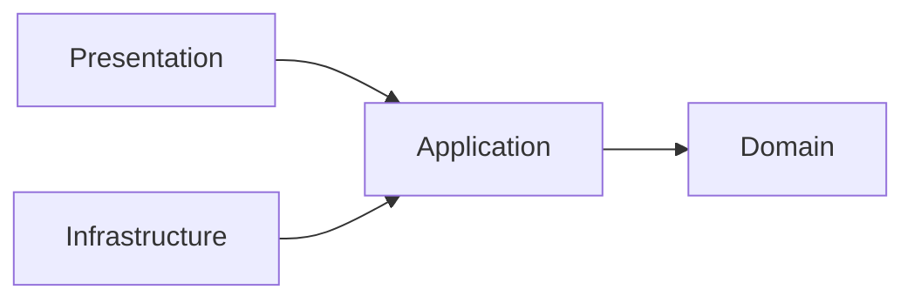

# Contributing to the Software Architecture Reference

This repository is documentation-first. A contribution is correct only when it is **architecturally accurate, source-backed, teachable from first principles, internally consistent, and maintainable**.

This file is the mandatory standard for humans and AI agents contributing to the repository.

## 1. Audience

Assume the reader can program but may know **nothing** about software architecture.

Never require the reader to infer:

- what a layer owns;
- what a folder means;
- where a function/type/class belongs;
- why one dependency direction is allowed and another is not;
- whether a rule comes from an architecture, a framework, or this documentation project;
- how files should be named.

When a new concept appears, link it to the [Glossary](./GLOSSARY.md).

## 2. Required order for every architecture guide

Every architecture landing page must teach in this order:

1. **History and origin**
   - author/origin;
   - approximate period;
   - problem the architecture was trying to solve;
   - primary source.

2. **Problem statement**
   - what coupling/complexity it addresses;
   - what it does *not* address.

3. **When it fits / when it does not**
   - strong scenarios;
   - weak or over-engineered scenarios;
   - costs/trade-offs.

4. **Mental model**
   - one responsive Mermaid diagram;
   - no ASCII/text diagrams.

5. **Layers / roles**
   - responsibility;
   - allowed dependencies;
   - forbidden dependencies;
   - examples of code that belongs there;
   - examples of code that does not.

6. **Physical structure**
   - concrete folder/file structure;
   - table explaining *why each folder exists*;
   - naming conventions;
   - a placement decision tree.

7. **One small feature end-to-end**
   - start from a requirement;
   - decide where each function/type goes;
   - show why;
   - show boundary translation;
   - show composition/wiring.

8. **Testing**
   - what to unit-test;
   - what to integration-test;
   - [architecture tests](./GLOSSARY.md#architecture-test).

9. **Advanced topics**
   - only after fundamentals;
   - optional patterns must be labelled optional.

10. **Sources**
    - primary source first;
    - official framework documentation for framework claims;
    - secondary sources only when they add interpretation.

## 3. Progressive disclosure

Teach from concrete to abstract:

- first show **where code goes**;
- then explain the rule that justifies it;
- then generalize;
- only then introduce alternatives and edge cases.

A beginner should be able to place a simple function correctly after the first core chapters.

Do not hide essential folder/layout guidance in an "advanced" chapter.

A landing page must be operationally useful on its own. Deeper chapters may expand a concept, but a beginner should not need to read an advanced chapter to learn basic responsibilities, allowed/forbidden dependencies, folder placement, naming, or the first end-to-end feature.

## 4. Distinguish rule types

Every prescriptive statement should be classifiable as one of:

| Type | Meaning |
| --- | --- |
| Architectural [invariant](./GLOSSARY.md#invariant) | Violating it changes the architecture or breaks an explicit boundary. |
| Recommended default | Strong default with legitimate alternatives. |
| Framework requirement | Required by React, Redux, Panda, TypeScript, etc. |
| Documentation convention | Chosen here for consistency; not universal. |
| Example only | Illustrative; not normative. |

Do not write a documentation-project preference as if Robert C. Martin, Palermo, React, Redux, or Panda mandated it.

## 5. Diagrams

### Required

Use Mermaid for architecture, dependency, flow, lifecycle, ownership, folder hierarchy, and decision diagrams.



### Forbidden

Do not use ASCII/Unicode box drawings or arrow diagrams inside `text`/untyped code fences.

Do not use an inline text-arrow chain such as `A -> B -> C` as a diagram. Render the relationship with Mermaid instead.

Folder hierarchies that are meant to teach structure should also use Mermaid plus a responsibility table, not a fragile ASCII tree.

Use normal code fences only for actual source code, commands, configuration, file names, or literal data.

Mermaid syntax reference: https://mermaid.js.org/syntax/flowchart.html

## 6. Folder and code-placement explanations

Never show a folder name without explaining ownership.

Bad:

```text
src/domain/
src/application/
src/infrastructure/
```

Good:

| Path | Owns | Why |
| --- | --- | --- |
| `src/domain/` | business concepts/[invariants](./GLOSSARY.md#invariant) | must survive UI/database replacement |
| `src/application/` | use-case orchestration and required [ports](./GLOSSARY.md#port) | protects application policy from details |
| `src/infrastructure/` | HTTP/database/storage [adapters](./GLOSSARY.md#adapter) | isolates volatile technology |

For each example file, explain:

- why the file exists;
- why its current folder owns it;
- which folders must **not** own it;
- which direction it may import.

Use [Code Placement](./foundations/code-placement.md) as the shared placement reference.

## 7. Naming

Use [Naming and File Placement Conventions](./conventions/naming-and-file-placement.md).

When a naming rule comes from a framework, cite that framework. When it is our convention, say so.

Examples:

- React component names start with a capital letter: framework requirement.
- React custom hooks start with `use`: framework requirement.
- `closures.selectors.ts`: documentation convention.
- descriptive TypeScript identifiers and PascalCase/camelCase choices: style convention backed by TypeScript ecosystem guidance.

## 8. Glossary

Every registered glossary term used in prose should link to `GLOSSARY.md`.

The exceptions are:

- fenced source code;
- inline code;
- URLs;
- the glossary entry itself;
- cases where adding a link would make Markdown invalid.

Headings may contain glossary links only if an explicit stable anchor is retained.

After editing docs:

```bash
node scripts/glossary-links.mjs --write
node scripts/glossary-links.mjs --check
```

If a concept is used repeatedly and lacks a glossary entry, add it with:

- definition;
- example;
- sources;
- aliases in `glossary/terms.json`.

## 9. Sources

Prefer:

1. original/primary architecture writings;
2. official framework/library documentation;
3. standards/specifications;
4. well-established secondary technical literature.

Do not cite a blog merely because it agrees with the intended conclusion.

Every historical claim, framework rule, or non-obvious prescriptive claim must be traceable to a source or explicitly labelled a documentation convention.

## 10. Examples

Examples must be small enough to understand and realistic enough to teach ownership.

Prefer one stable example domain per guide and evolve it progressively.

Do not introduce:

- [DI container](./GLOSSARY.md#di-container),
- [CQRS](./GLOSSARY.md#cqrs),
- [microservices](./GLOSSARY.md#microservice),
- [event sourcing](./GLOSSARY.md#event-sourcing),
- [global state](./GLOSSARY.md#global-state),
- [Factory patterns](./GLOSSARY.md#factory-pattern),
- [repositories](./GLOSSARY.md#repository),

unless the problem in the example actually requires them.

## 11. Review checklist — three passes

Every substantial documentation PR must be reviewed three times.

### Pass 1 — pedagogy and structure

- Can a programmer with no architecture background follow the order?
- Is history/context before implementation detail?
- Are strong/weak scenarios explicit?
- Can the reader place a simple function/type/file?
- Are folder responsibilities explicit?

### Pass 2 — architectural rigor

- Are dependency directions correct?
- Are framework conventions separated from architectural rules?
- Are [ports](./GLOSSARY.md#port)/[repositories](./GLOSSARY.md#repository)/[use cases](./GLOSSARY.md#use-case) introduced only where justified?
- Are outer technology types prevented from leaking inward?
- Are trade-offs and counterexamples acknowledged?

### Pass 3 — mechanical consistency

- No ASCII/text diagrams.
- Mermaid blocks parse conceptually and use stable labels.
- Glossary links are current.
- Relative links are valid.
- Headings/anchors used by other docs remain stable.
- Naming matches the conventions guide.
- Examples do not contradict [architecture tests](./GLOSSARY.md#architecture-test).

A contribution is not ready until all three passes are clean.


## 12. Canonical architecture-guide template

When adding a new architecture or substantially rewriting one, start from **[Architecture Guide Template](./docs/architecture-guide-template.md)** rather than inventing a new documentation order.

The template is intentionally verbose. Remove sections only when they truly do not apply; do not move foundational placement/dependency guidance behind advanced material.

For presentation patterns such as [MVC](./GLOSSARY.md#model-view-controller-mvc)/[MVVM](./GLOSSARY.md#model-view-viewmodel-mvvm), adapt "layers" to "roles", but preserve the same teaching order: history → problem → fit → mental model → responsibilities → physical placement → progressive example → testing → advanced topics.
