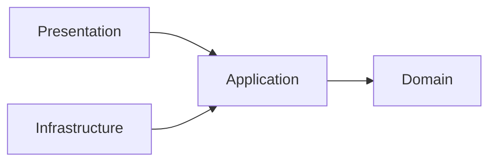

# Contributing to the Software Architecture Reference

This repository is documentation-first. A contribution is correct only when it is **architecturally accurate, source-backed, teachable from first principles, internally consistent, and maintainable**.

This file is the mandatory standard for humans and AI agents contributing to the repository.

## 1. Audience

Assume the reader can program but may know **nothing** about software architecture.

Never require the reader to infer:

- what a layer owns;
- what a folder means;
- where a function/type/class belongs;
- why one dependency direction is allowed and another is not;
- whether a rule comes from an architecture, a framework, or this documentation project;
- how files should be named.

When a new concept appears, link it to the [Glossary](./GLOSSARY.md).

## 2. Required order for every architecture guide

Every architecture landing page must teach in this order:

1. **History and origin**
   - author/origin;
   - approximate period;
   - problem the architecture was trying to solve;
   - primary source.

2. **Problem statement**
   - what coupling/complexity it addresses;
   - what it does *not* address.

3. **When it fits / when it does not**
   - strong scenarios;
   - weak or over-engineered scenarios;
   - costs/trade-offs.

4. **Mental model**
   - one responsive Mermaid diagram;
   - no ASCII/text diagrams.

5. **Layers / roles**
   - responsibility;
   - allowed dependencies;
   - forbidden dependencies;
   - examples of code that belongs there;
   - examples of code that does not.

6. **Physical structure**
   - concrete folder/file structure;
   - table explaining *why each folder exists*;
   - naming conventions;
   - a placement decision tree.

7. **One small feature end-to-end**
   - start from a requirement;
   - decide where each function/type goes;
   - show why;
   - show boundary translation;
   - show composition/wiring.

8. **Testing**
   - what to unit-test;
   - what to integration-test;
   - [architecture tests](./GLOSSARY.md#architecture-test).

9. **Advanced topics**
   - only after fundamentals;
   - optional patterns must be labelled optional.

10. **Sources**
    - primary source first;
    - official framework documentation for framework claims;
    - secondary sources only when they add interpretation.

## 3. Progressive disclosure

**Repository-wide editorial standard: first-principles teaching and technical clarity.**

A reader may be comfortable with TypeScript but unfamiliar with architectural terminology. Teach the mechanism using familiar language before asking them to remember a name for it. The chapter order in section 2 describes the layout of a full guide; **within each explanation**, move from concrete to abstract. A brief historical introduction is fine, but history or a glossary link must not be a prerequisite for understanding the first example.

### Mandatory concept-explanation protocol

Apply these steps proportionately to every central concept, new guide, important definition, diagram explanation, and substantial rewrite. A short clarification does not need six new headings, but it must preserve the reasoning:

1. **Start with an observable situation.** Name the person or component, what they are trying to do, and the information involved.
2. **Show the actual problem.** Explain what fails, becomes difficult to change, or is duplicated in a direct implementation. Never begin with "we need abstraction X" as the problem statement.
3. **Walk through the smallest working mechanism.** Prefer one realistic example that grows across the guide. Explain what is passed, returned, called, or changed before showing a folder structure or diagram full of new labels.
4. **Only then name and define the concept.** Give its precise technical name and explain any indispensable word at first use (for example, a *contract* specifies the operation, its input, and its result). Link registered terms to the [Glossary](./GLOSSARY.md), but never use a link in place of a local explanation.
5. **Explain responsibilities and relationships.** Who owns it? Who calls whom? What does the component do **and not do**? If important, separate source-code dependencies, object construction, and runtime calls instead of treating their arrows as interchangeable.
6. **Generalize and qualify.** State the rigorous, reusable definition after the example. Explain a meaningful alternative, cost, or counterexample when it helps the reader know when not to apply the idea.

**Avoid circular definitions and jargon chains.** A sentence such as "A [port](./GLOSSARY.md#port) defines a capability in the application's language" does not teach a new reader what happens.

Instead, start with the behavior: "To create a ticket, our ticket-creation operation needs an object with a `create(input)` method that returns a ticket. `TicketGateway` records this requirement; it does not make an HTTP request. In this example that requirement is an outbound [port](./GLOSSARY.md#port). `HttpTicketGateway` meets it by making the HTTP request and translating the reply; it is the [adapter](./GLOSSARY.md#adapter)."

Do not ban technical terms or replace accurate explanations with misleading analogies. Introduce the proper vocabulary **after** showing the concrete behavior, and retain important limitations and distinctions. Prefer common words over academic phrasing when both communicate the same fact.

For code-placement tutorials specifically, show **where a simple piece of code goes**, explain the responsibility that justifies its location, then extend the rule to other cases. A beginner should be able to make that placement decision after the first core chapters.

Do not hide essential folder/layout guidance in an "advanced" chapter. A landing page must be useful on its own: a reader should not have to open an advanced page to learn basic responsibilities, allowed/forbidden dependencies, naming, or the first end-to-end feature.

## 4. Distinguish rule types

Every prescriptive statement should be classifiable as one of:

| Type | Meaning |
| --- | --- |
| Architectural [invariant](./GLOSSARY.md#invariant) | Violating it changes the architecture or breaks an explicit boundary. |
| Recommended default | Strong default with legitimate alternatives. |
| Framework requirement | Required by React, Redux, Panda, TypeScript, etc. |
| Documentation convention | Chosen here for consistency; not universal. |
| Example only | Illustrative; not normative. |

Do not write a documentation-project preference as if Robert C. Martin, Palermo, React, Redux, or Panda mandated it.

## 5. Diagrams

### Required

Use Mermaid for architecture, dependency, flow, lifecycle, ownership, folder hierarchy, and decision diagrams.

An exported, accessible static illustration (SVG/PNG) may accompany the **editable Mermaid source** when a consistent visual preview is important. Keep both in the repository, provide descriptive alt text, and label conceptual arrows separately from runtime call flows. An image alone must not replace Mermaid.



### Forbidden

Do not use ASCII/Unicode box drawings or arrow diagrams inside `text`/untyped code fences.

Do not use an inline text-arrow chain such as `A -> B -> C` as a diagram. Render the relationship with Mermaid instead.

Folder hierarchies that are meant to teach structure should also use Mermaid plus a responsibility table, not a fragile ASCII tree.

Use normal code fences only for actual source code, commands, configuration, file names, or literal data.

Mermaid syntax reference: https://mermaid.js.org/syntax/flowchart.html

## 6. Folder and code-placement explanations

Never show a folder name without explaining ownership.

Bad:

```text
src/domain/
src/application/
src/infrastructure/
```

Good:

| Path | Owns | Why |
| --- | --- | --- |
| `src/domain/` | business concepts/[invariants](./GLOSSARY.md#invariant) | must survive UI/database replacement |
| `src/application/` | use-case orchestration and required [ports](./GLOSSARY.md#port) | protects application policy from details |
| `src/infrastructure/` | HTTP/database/storage [adapters](./GLOSSARY.md#adapter) | isolates volatile technology |

For each example file, explain:

- why the file exists;
- why its current folder owns it;
- which folders must **not** own it;
- which direction it may import.

Use [Code Placement](./foundations/code-placement.md) as the shared placement reference.

## 7. Naming

Use [Naming and File Placement Conventions](./conventions/naming-and-file-placement.md).

When a naming rule comes from a framework, cite that framework. When it is our convention, say so.

Examples:

- React component names start with a capital letter: framework requirement.
- React [custom hooks](./GLOSSARY.md#custom-hook) start with `use`: framework requirement.
- `closures.selectors.ts`: documentation convention.
- descriptive TypeScript identifiers and PascalCase/camelCase choices: style convention backed by TypeScript ecosystem guidance.

## 8. Glossary

Every registered glossary term used in prose should link to `GLOSSARY.md`.

The exceptions are:

- fenced source code;
- inline code;
- URLs;
- headings, including setext headings;
- existing links/images and reference definitions;
- bracketed content (including citation/reference labels);
- HTML elements/comments;
- the glossary entry itself;
- cases where adding a link would make Markdown invalid.

The autolinker preserves headings byte for byte. Manually changing a heading requires preserving meaningful historical anchors. Ambiguous homonyms are linked manually or through an unambiguous registered phrase; the word “repository” is not automatically the [Repository Pattern](./GLOSSARY.md#repository).

After editing docs:

```bash
npm ci --ignore-scripts
node scripts/glossary-links.mjs --write
node scripts/glossary-links.mjs --check
```

If a concept is used repeatedly and lacks a glossary entry, add it with:

- a first sentence understandable without other glossary entries;
- a precise definition and purpose (with nuance after the plain-language explanation);
- a specific example showing what the concept does and what it does not do;
- sources;
- aliases in `glossary/terms.json`.

The glossary is a reference, not a substitute for explaining an unfamiliar concept where the reader first encounters it. Keep glossary definitions consistent with the longer worked examples.

## 9. Sources

Prefer:

1. original/primary architecture writings;
2. official framework/library documentation;
3. standards/specifications;
4. well-established secondary technical literature.

Do not cite a blog merely because it agrees with the intended conclusion.

Every historical claim, framework rule, or non-obvious prescriptive claim must be traceable to a source or explicitly labelled a documentation convention.

## 10. Examples

Examples must be small enough to understand and realistic enough to teach ownership.

Prefer one stable example domain per guide and evolve it progressively.

Do not introduce:

- [DI container](./GLOSSARY.md#di-container),
- [CQRS](./GLOSSARY.md#cqrs),
- [microservices](./GLOSSARY.md#microservice),
- [event sourcing](./GLOSSARY.md#event-sourcing),
- [global state](./GLOSSARY.md#global-state),
- [Factory patterns](./GLOSSARY.md#factory-pattern),
- [repositories](./GLOSSARY.md#repository),

unless the problem in the example actually requires them.

## 11. Review checklist — three passes

Every substantial documentation PR must be reviewed three times.

### Pass 1 — pedagogy and structure

- Can a programmer with no architecture background follow the order **and explain the central idea in their own words**?
- Does the section begin with a recognizable situation and specific problem, rather than a technical name in search of an example?
- Are unfamiliar terms explained when first needed, without circular definitions or chains of jargon? A glossary hyperlink alone is insufficient.
- Can the reader follow what goes in, what happens, and what comes out of the simplest example before seeing the generalized model?
- Are history/context, appropriate and inappropriate usage scenarios, and relevant trade-offs explicit?
- Can the reader place a simple function/type/file and explain why it belongs there?
- Are folder responsibilities explicit, and do diagram captions explain the nodes and meaning of the arrows?
- Does the explanation retain correct technical meaning instead of relying on a misleading analogy?

### Pass 2 — architectural rigor

- Are dependency directions correct?
- Are framework conventions separated from architectural rules?
- Are [ports](./GLOSSARY.md#port)/[repositories](./GLOSSARY.md#repository)/[use cases](./GLOSSARY.md#use-case) introduced only where justified?
- Are outer technology types prevented from leaking inward?
- Is each business rule/value set owned in exactly one policy location (for example, domain-owned status values), rather than restated in an HTTP parser, presentation handler or second use case? Do outer adapters validate untrusted shapes while **reusing** the owner's runtime guards/factories for domain meaning?
- Do examples distinguish compile-time types from runtime checks? Avoid coercing unknown API values with `String(...)` or bypassing validation with a type assertion.
- Do contract tests or documented integration assumptions address frontend/backend vocabulary drift, without claiming frontend validation is authoritative on the server?
- Are trade-offs and counterexamples acknowledged?

### Pass 3 — mechanical consistency

- No ASCII/text diagrams.
- Mermaid syntax is checked with a real Mermaid parser and meanings are reviewed by a person/agent. The lightweight CI check only validates declarations and fences; see [Documentation Validation](./docs/validation.md).
- Glossary links are current.
- Relative links are valid.
- Headings/anchors used by other docs remain stable.
- Naming matches the conventions guide.
- Examples do not contradict [architecture tests](./GLOSSARY.md#architecture-test).

A contribution is not ready until all three passes are clean. For a substantial conceptual change, the PR description should identify the concrete example used to teach it, describe any newly introduced terms, and mention at least one ambiguity clarified or misconception prevented. Show a short before/after excerpt when rewriting opaque prose. Purely mechanical changes do not need a pedagogical before/after.

Automated documentation checks cover syntax and consistency; they cannot prove that the explanation is understandable. The first pass requires human/agent judgment, not just a passing script.


## 12. Canonical architecture-guide template

When adding a new architecture or substantially rewriting one, start from **[Architecture Guide Template](./docs/architecture-guide-template.md)** rather than inventing a new documentation order.

The template is intentionally verbose. Remove sections only when they truly do not apply; do not move foundational placement/dependency guidance behind advanced material.

For presentation patterns such as [MVC](./GLOSSARY.md#model-view-controller-mvc)/[MVVM](./GLOSSARY.md#model-view-viewmodel-mvvm), adapt "layers" to "roles", but preserve the same teaching order: history → problem → fit → mental model → responsibilities → physical placement → progressive example → testing → advanced topics.
