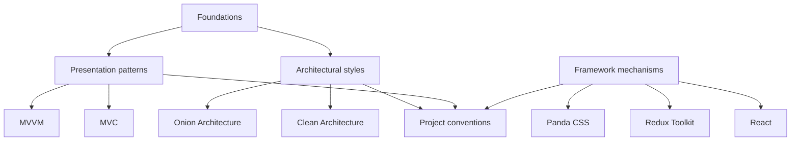

# Software Architecture

A practical, source-backed reference for learning and applying software architecture from first principles.

The repository is intentionally progressive: a programmer who has never studied architecture should be able to start here, understand **why boundaries exist**, learn **where code belongs**, and only then move into advanced patterns.

Terminology is centralized in the **[Architecture Glossary](./GLOSSARY.md)**.

## Start here if you are new

Read in this order:

1. **[Code Placement: Where Does This Code Belong?](./foundations/code-placement.md)**\
   Learn where a function, type, class, hook, [adapter](./GLOSSARY.md#adapter), component, [DTO](./GLOSSARY.md#data-transfer-object-dto), or [use case](./GLOSSARY.md#use-case) should live.

2. **[Naming and File Placement Conventions](./conventions/naming-and-file-placement.md)**\
   Learn how files and symbols are named in the examples.

3. **[Architecture Foundations](./foundations/README.md)**\
   Learn dependency direction, composition, module boundaries, [public APIs](./GLOSSARY.md#public-api), tests, and scaling.

4. Choose an architecture/presentation pattern:
   - [Clean Architecture](./clean-architecture)
   - [Onion Architecture](./onion-architecture)
   - [MVC](./model-view-controller)
   - [MVVM](./model-view-viewmodel)

5. For modern frontend organization:
   - [Frontend Architecture](./frontend/README.md)

## What this repository separates

These categories are deliberately different.

- A **[Dependency Rule](./GLOSSARY.md#dependency-rule)** is an architectural constraint.
- A **[Repository](./GLOSSARY.md#repository)** is a design pattern.
- Redux is a [state-management](./GLOSSARY.md#state-management) mechanism.
- `closures.slice.ts` is a naming convention.
- `features/closures/` is an organization strategy.

Treating all of those as the same kind of rule produces cargo-cult architecture.

## Architectural styles

### Clean Architecture

Robert C. Martin published the well-known [Clean Architecture](./GLOSSARY.md#clean-architecture) article in 2012 and later expanded the ideas in the 2017 book. It organizes software around policy vs. mechanism and the rule that source dependencies point inward.

Start: **[Clean Architecture](./clean-architecture/README.md)**.

### Onion Architecture

Jeffrey Palermo published the [Onion Architecture](./GLOSSARY.md#onion-architecture) series in 2008. It emphasizes a domain model at the center, application behavior around it, and infrastructure pushed outward.

Start: **[Onion Architecture](./onion-architecture/README.md)**.

### MVC

Trygve Reenskaug developed the original [Model-View-Controller](./GLOSSARY.md#model-view-controller-mvc) ideas at Xerox PARC in 1978–1979 to help users manipulate complex information through multiple views.

Start: **[Model-View-Controller](./model-view-controller/README.md)**.

### MVVM

John Gossman introduced [MVVM](./GLOSSARY.md#model-view-viewmodel-mvvm) terminology in 2005 in the WPF ecosystem, closely related to Martin Fowler's earlier [Presentation Model](./GLOSSARY.md#presentation-model) pattern.

Start: **[Model-View-ViewModel](./model-view-viewmodel/README.md)**.

## Frontend architecture

The frontend section explains the second architectural scale that Clean/Onion do not prescribe:

- feature ownership;
- pages/layouts;
- public hooks / [ViewModels](./GLOSSARY.md#viewmodel);
- local vs. shared vs. [server state](./GLOSSARY.md#server-state);
- Redux Toolkit;
- [design systems](./GLOSSARY.md#design-system);
- Panda CSS [recipes](./GLOSSARY.md#recipe);
- [architecture tests](./GLOSSARY.md#architecture-test).

Start: **[Frontend Architecture](./frontend/README.md)**.

## How to contribute

Every contribution must follow **[CONTRIBUTING.md](./CONTRIBUTING.md)**.

The rules include:

- beginner-first progressive teaching;
- history and source context;
- explicit best/worst-fit scenarios;
- Mermaid-only diagrams;
- folder/file ownership explanations;
- naming references;
- glossary links;
- three review passes before a substantial documentation change is considered complete.

AI agents must additionally follow **[AGENTS.md](./AGENTS.md)**.

## Primary source families

The guides cite sources locally. The repository primarily relies on:

- Robert C. Martin — *The [Clean Architecture](./GLOSSARY.md#clean-architecture)* / *[Clean Architecture](./GLOSSARY.md#clean-architecture)*;
- Jeffrey Palermo — *The [Onion Architecture](./GLOSSARY.md#onion-architecture)*;
- Alistair Cockburn — *[Hexagonal Architecture](./GLOSSARY.md#hexagonal-architecture-ports-and-adapters) / [Ports and Adapters](./GLOSSARY.md#hexagonal-architecture-ports-and-adapters)*;
- Trygve Reenskaug — original [MVC](./GLOSSARY.md#model-view-controller-mvc) reports;
- Martin Fowler — [Presentation Model](./GLOSSARY.md#presentation-model), GUI architecture, enterprise patterns;
- Mark Seemann — [Composition Root](./GLOSSARY.md#composition-root) / [Dependency Injection](./GLOSSARY.md#dependency-injection-di);
- official React, Redux Toolkit, Panda CSS, TypeScript ecosystem documentation.
