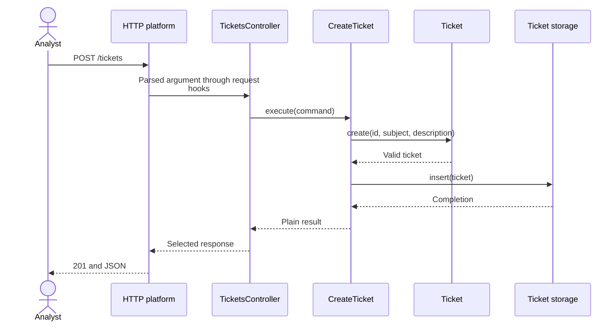

<a id="1-http-request-to-business-operation"></a>

# HTTP Request to Business Operation

[Backend route](README.md) · Next: [TypeScript-first boundaries](2-typescript-first-boundaries.md)

**Contents**

- [The analyst sends information](#the-analyst-sends-information)
- [Which function receives it?](#which-function-receives-it)
- [Follow the ticket, not just the network](#follow-the-ticket-not-just-the-network)
- [Framework lifecycle is a different view](#framework-lifecycle-is-a-different-view)
- [Trace it yourself](#trace-it-yourself)
- [Sources](#sources)

<a id="1-the-analyst-sends-information"></a>

## The analyst sends information

The browser asks the server to create a ticket. HTTP represents that request with a method, target path, headers and body:

```http
POST /tickets HTTP/1.1
Host: support.example.test
Content-Type: application/json

{"subject":"Invoice download fails","description":"The PDF button returns an error."}
```

The browser is the **client**. The server's API offers operations that clients can call. Here `POST` and `/tickets` identify ticket creation; `Content-Type` describes the body format. Decoding JSON yields JavaScript data whose shape still needs checking.

The server answers with an HTTP response: status, headers and optional body.

```http
HTTP/1.1 201 Created
Content-Type: application/json

{"ticket_id":"T-42","subject":"Invoice download fails","description":"The PDF button returns an error.","status":"open"}
```

The handler selects response fields; the platform serializes them to JSON. This API uses `201` for creation, `400` for invalid input and `503` for recognized storage unavailability. See [HTTP Semantics](https://www.rfc-editor.org/rfc/rfc9110.html).

<a id="2-which-function-receives-it"></a>

## Which function receives it?

The server must choose different code for creating and reading tickets. A **route** matches a method/path to a function; **routing** performs that selection. The publicly callable operation, including its input/output contract, is an **endpoint**.

| Artifact | Meaning |
| --- | --- |
| `POST /tickets` | Endpoint |
| Matching POST and `/tickets` to `TicketsController.create()` | Route |
| `TicketsController` | Controller grouping related HTTP handlers |
| `create()` | Route handler selected for this request |
| `CreateTicket` | [Application](../../GLOSSARY.md#application-layer) operation called by the handler |

A Controller can group several handlers, such as creation and reading. In Nest, `@Controller('tickets')` contributes `/tickets` and `@Post()` contributes POST; together they map the request to `create()`. [Chapter 3](3-nestjs-building-blocks.md#register-the-functions-we-already-understand) shows that registration.

<a id="3-follow-the-ticket-not-just-the-network"></a>

## Follow the ticket, not just the network

The request crosses a trust boundary: a client supplies data our program has not checked. The handler parses its shape, invokes creation and translates the result. `Ticket.create()` owns business validity; `CreateTicket.execute()` coordinates that decision and saving.

Solid arrows show runtime calls and returns:



Startup supplies the storage object before requests arrive. [Chapter 2](2-typescript-first-boundaries.md#save-without-naming-a-database-in-the-operation) explains that persistence contract and manual assembly.

<a id="4-framework-lifecycle-is-a-different-view"></a>

## Framework lifecycle is a different view

Nest checks access and processes arguments before invoking the handler. These framework hooks are described in [chapter 3](3-nestjs-building-blocks.md#guard-and-pipe-answer-different-questions); application and domain calls happen inside the operation, not as additional framework hooks.

<a id="5-trace-it-yourself"></a>

## Trace it yourself

A different method/path selects another handler. A blank subject reaches the same business rule regardless of caller. The handler translates the operation's result into the caller's protocol.

Continue with [plain TypeScript boundaries](2-typescript-first-boundaries.md).

## Sources

- [RFC 9110 — HTTP Semantics](https://www.rfc-editor.org/rfc/rfc9110.html)
- [Nest — Controllers](https://docs.nestjs.com/controllers)
- [Nest — Request lifecycle](https://docs.nestjs.com/faq/request-lifecycle)

[Previous: Module Boundaries and Public APIs](../foundations/module-boundaries-and-public-apis.md) · [Next: TypeScript-First Boundaries](2-typescript-first-boundaries.md)
