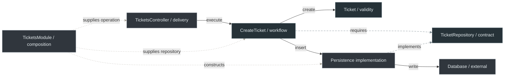

# 4. Create Ticket with NestJS

[Nest mechanisms](3-nestjs-building-blocks.md) · [Backend route](README.md) · Next: [Styles](5-architectural-styles-with-nestjs.md)

## 1. Requirement and ownership

Support owns ticket validity. The analyst provides subject/description; the server checks them, creates the ticket, saves it and returns HTTP data. Reuse the [plain modules](2-typescript-first-boundaries.md) and [Nest Pipe](3-nestjs-building-blocks.md#pipe-parse-a-handler-argument).

<a id="physical-structure"></a>

## 2. Physical structure and dependency decisions

Prefix these handbook-convention paths with `src/`. Optional access and CLI code belong to their respective examples; retrieval mapping is added only when needed.

| Responsibility | Exact file | What it owns |
| --- | --- | --- |
| [Domain entity](../../GLOSSARY.md#domain-entity) | `domain/tickets/Ticket.ts` | Subject validity and initial `open` status |
| [Use case](../../GLOSSARY.md#use-case) | `application/tickets/use-cases/CreateTicket.ts` | Creates and persists through the required contract |
| Persistence contract | `application/tickets/ports/TicketRepository.ts` | Required persistence behavior and recognized storage failure |
| Input contract | `application/tickets/contracts/CreateTicketCommand.ts` | Operation input, independent of HTTP |
| Output contract | `application/tickets/contracts/CreateTicketResult.ts` | Operation outcome, independent of status codes |
| Memory implementation | `infrastructure/persistence/tickets/adapters/InMemoryTicketRepository.ts` | Creation-only process-local storage |
| Prisma implementation | `infrastructure/persistence/tickets/adapters/PrismaTicketRepository.ts` | Database write and field mapping |
| Persistence [mapper](../../GLOSSARY.md#mapper), **only if retrieval is added** | `infrastructure/persistence/tickets/mappers/mapTicketPersistenceRecord.ts` | Restores stored identity/status through a supported [Domain](../../GLOSSARY.md#domain) restoration mechanism; do not reset resolved records through `Ticket.create` |
| Nest [Controller](../../GLOSSARY.md#controller) | `presentation/http/tickets/controllers/TicketsController.ts` | Groups [route handlers](../../GLOSSARY.md#route-handler) and translates operation outcomes |
| Access Guard, **optional example** | `presentation/http/tickets/guards/AuthenticatedGuard.ts` | Uses a previously verified principal to decide access |
| [Nest Pipe](../../GLOSSARY.md#nestjs-pipe) | `presentation/http/tickets/pipes/CreateTicketPipe.ts` | Applies the plain [Parser](../../GLOSSARY.md#parser) to an argument and maps parsing failure |
| Plain Parser | `presentation/http/tickets/parsers/parseCreateTicketRequest.ts` | Checks unknown request shape |
| Request [DTO](../../GLOSSARY.md#data-transfer-object-dto) | `presentation/http/tickets/dto/CreateTicketRequestDto.ts` | Accepted HTTP input representation |
| Response DTO | `presentation/http/tickets/dto/TicketResponseDto.ts` | Selected HTTP output fields |
| Response mapper | `presentation/http/tickets/mappers/mapCreateTicketResponse.ts` | Renames/selects successful ticket fields, shared by the plain handler and Nest |
| Plain HTTP handler | `presentation/http/tickets/handlers/TicketHttpHandler.ts` | Executes the same operation without Nest |
| CLI handler, **exercise** | `presentation/cli/tickets/handlers/createTicketCli.ts` | Arguments, terminal messages and exit codes |
| Nest assembly | `composition/modules/TicketsModule.ts` | Registers concrete dependencies |
| Runtime injection key | `composition/tokens/ticket.tokens.ts` | Names the persistence provider |
| Startup | `composition/main.ts` | Starts Nest |

Domain imports its own policy; Application imports Domain and its contracts. Infrastructure implements those contracts. Presentation invokes Application's supported API. Composition imports the concrete pieces it assembles.

## 3. Finish the HTTP boundary


`src/presentation/http/tickets/controllers/TicketsController.ts`:

```ts
import {
  Body, Controller, HttpCode, Inject, Post,
  BadRequestException, ServiceUnavailableException,
} from '@nestjs/common'
import { CreateTicket } from '@/application/tickets'
import { CreateTicketPipe } from '../pipes/CreateTicketPipe'
import type { CreateTicketRequestDto } from '../dto/CreateTicketRequestDto'
import { mapCreateTicketResponse } from '../mappers/mapCreateTicketResponse'

@Controller('tickets')
export class TicketsController {
  constructor(@Inject(CreateTicket) private readonly createTicket: CreateTicket) {}

  @Post()
  @HttpCode(201)
  async create(@Body(new CreateTicketPipe()) command: CreateTicketRequestDto) {
    const result = await this.createTicket.execute(command)
    if (!result.ok) {
      if (result.reason === 'invalid-subject') {
        throw new BadRequestException('invalid-subject')
      }
      throw new ServiceUnavailableException('unavailable')
    }
    return mapCreateTicketResponse(result.ticket)
  }
}
```

The Pipe checks the argument; the operation owns workflow; the mapper selects the response. Nest supplies serialization and its standard exception handling. This example accepts Nest's default error envelope.

## 4. Wire memory first


`src/composition/tokens/ticket.tokens.ts`:

```ts
export const TICKET_REPOSITORY = Symbol('TICKET_REPOSITORY')
```


`src/composition/modules/TicketsModule.ts`:

```ts
import { Module } from '@nestjs/common'
import { randomUUID } from 'node:crypto'
import { CreateTicket } from '@/application/tickets'
import type { TicketRepository } from '@/application/tickets/ports/TicketRepository'
import { InMemoryTicketRepository } from '@/infrastructure/persistence/tickets/adapters/InMemoryTicketRepository'
import { TicketsController } from '@/presentation/http/tickets/controllers/TicketsController'
import { TICKET_REPOSITORY } from '../tokens/ticket.tokens'

@Module({
  controllers: [TicketsController],
  providers: [
    { provide: TICKET_REPOSITORY, useClass: InMemoryTicketRepository },
    {
      provide: CreateTicket,
      inject: [TICKET_REPOSITORY],
      useFactory: (tickets: TicketRepository) => new CreateTicket(tickets, randomUUID),
    },
  ],
  exports: [CreateTicket],
})
export class TicketsModule {}
```


`src/composition/modules/index.ts`:

```ts
export { TicketsModule } from './TicketsModule'
```


`src/composition/main.ts`:

```ts
import { Module } from '@nestjs/common'
import { NestFactory } from '@nestjs/core'
import { TicketsModule } from './modules'

@Module({ imports: [TicketsModule] })
class AppModule {}

async function bootstrap() {
  const app = await NestFactory.create(AppModule)
  app.enableShutdownHooks()
  await app.listen(3000)
}
void bootstrap()
```

Application consumers import `application/tickets`; Nest startup imports `composition/modules`. TypeScript exports expose source symbols and Nest `exports` exposes providers. The [public API guide](../foundations/module-boundaries-and-public-apis.md#9-backend-apis-across-layer-first-capabilities) explains the separate capability boundary.

## 5. Replace memory when the ticket must survive restart

`PrismaTicketRepository` implements the same contract with durable storage. The architecture-relevant insert is below; generated-client setup and outage classification are omitted from this excerpt.

`src/infrastructure/persistence/tickets/adapters/PrismaTicketRepository.ts`:

```ts
import type { PrismaClient } from '@/infrastructure/persistence/generated/prisma/client'
import type { Ticket } from '@/domain/tickets/Ticket'
import type { TicketRepository } from '@/application/tickets/ports/TicketRepository'

export class PrismaTicketRepository implements TicketRepository {
  constructor(private readonly db: PrismaClient) {}

  async insert(ticket: Ticket): Promise<void> {
    const data = ticket.snapshot()
    await this.db.ticket.create({ data: {
      id: data.id, subject: data.subject,
      description: data.description, state: data.status,
    } })
  }
}
```

The implementation maps `status` to the storage field `state`. Composition replaces the memory binding with a factory supplying the configured Prisma client. `Ticket`, `CreateTicket` and the controller keep the same responsibilities.

Use the [official Prisma 7 setup](https://www.prisma.io/docs/orm/v7/prisma-client/setup-and-configuration/introduction) and [CRUD documentation](https://www.prisma.io/docs/orm/v7/prisma-client/queries/crud) for database configuration.

<a id="optional-deeper-reading-observability-and-failure-translation"></a>

Optional failure handling: a real integration classifies recognized outages, records safe technical diagnostics, then translates them to `TicketPersistenceUnavailable`. The simple insert above propagates errors; it does not implement that classification. [Prisma's error reference](https://www.prisma.io/docs/orm/v7/reference/error-reference) describes technology-specific failures.

## 6. Three relationships in one system view

Solid arrows are runtime calls, long dashes source dependencies, and short dots startup wiring.



The operation calls the supplied persistence object. The contract records its requirement; startup assembles the objects before requests arrive.

## 7. Review changes and failures before calling it maintainable

| Change | Owner |
| --- | --- |
| Subject rule or initial state | Domain |
| Storage schema/technology | Infrastructure and Composition |
| CLI caller | CLI Presentation and its startup |
| Another capability needs creation | Tickets' supported Application API |

The backend owns persisted ticket decisions. Authentication and delivery limits need their own application requirements; they are outside this creation walkthrough.

## 8. Verification at the right boundary

An application checks business rules in isolation, workflow with a supplied repository, HTTP mapping through Nest and persistence against its actual database. These are illustrative snippets, not a deployed backend.

Continue with [styles](5-architectural-styles-with-nestjs.md) and [exercises](exercises/README.md).

[References](references.md)
