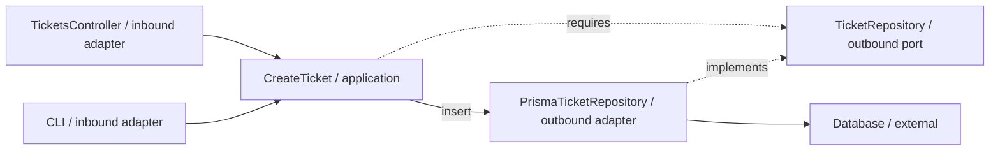

# 5. Architectural Styles with NestJS

[Ticket wiring](4-create-ticket-with-nestjs.md) · [Backend route](README.md)

## 1. Origins: several answers to related problems

The same Ticket design can satisfy several architectural constraints. Each style emphasizes a different question:

| Style | Main emphasis | Primary source |
| --- | --- | --- |
| Layered | Separate presentation, business and data responsibilities | [Fowler](https://martinfowler.com/bliki/PresentationDomainDataLayering.html) |
| Hexagonal | Application interactions and replaceable devices | [Cockburn, 2005](https://alistair.cockburn.us/hexagonal-architecture/) |
| Onion | Independent domain model at the center | [Palermo, 2008](https://jeffreypalermo.com/2008/07/the-onion-architecture-part-1/) |
| Clean | Business/application policy protected by inward dependencies | [Martin, 2012](https://blog.cleancoder.com/uncle-bob/2012/08/13/the-clean-architecture.html) |

## 2. The shared problem, and what styles leave open

When HTTP parsing, ticket rules and database queries share one method, changing storage can disturb business behavior. The previous chapters separated those decisions.

That cost is worthwhile when they change independently. A small disposable utility may need less separation.

## 3. Does NestJS impose an architecture?

Nest supplies an Angular-inspired framework organization: modules, controllers, providers and request hooks. Its [introduction](https://docs.nestjs.com/) describes this as an out-of-the-box architecture.

Those mechanisms organize execution and registrations. They leave business ownership and inward source rules to the application design. The handbook's exact folders are conventions.

## 4. Layered: separate kinds of work

HTTP, creation workflow and persistence form distinct responsibility groups. Conventional layered designs often permit business code to import data access. Our Ticket operation instead requires an inward-owned persistence contract.

Layering and dependency inversion are separate decisions.

## 5. Hexagonal: separate the application from its devices

Creation can be called through HTTP or a CLI, and storage can use memory or a database. A **port** describes an interaction; an **adapter** connects an external mechanism to it.

### Where are the Ports and Adapters in this example?

Paths are relative to `src/`:

| Artifact | Generic role | Hexagonal reading |
| --- | --- | --- |
| `presentation/http/tickets/controllers/TicketsController.ts` | HTTP Controller | Inbound adapter |
| `application/tickets/use-cases/CreateTicket.ts` — `execute(command)` | Offered operation | Inbound application API |
| `application/tickets/ports/TicketRepository.ts` | Persistence contract | Outbound port |
| `infrastructure/persistence/tickets/adapters/InMemoryTicketRepository.ts` | Memory implementation | Outbound adapter |
| `infrastructure/persistence/tickets/adapters/PrismaTicketRepository.ts` | Prisma implementation | Outbound adapter |

`CreateTicket.execute()` already provides the inbound application operation; another interface file is unnecessary merely to label it a port.

Solid arrows show calls; dashed arrows show source relationships:

## 6. Clean: protect different levels of policy

| Clean responsibility | Ticket example |
| --- | --- |
| Entities | Subject and initial-state rules |
| Use Cases | Creation workflow and required persistence |
| Interface Adapters | HTTP and storage-field translation |
| Frameworks & Drivers | Nest, Prisma and database mechanisms |

The [combined outer-module explanation](../foundations/dependency-boundaries.md#combined-outer-modules) describes why translation and framework glue can share an outer file. Inner policy remains independent.

Continue with [Clean on the backend](../styles/clean-architecture/8-clean-on-the-backend.md).

## 7. Onion: keep the domain model central

Onion starts with `Ticket` as an independent model and places infrastructure outside it. `CreateTicket` surrounds the model with workflow and required interactions.

Here Application owns `TicketRepository` because creation needs it. Palermo places repository interfaces around the domain model; the essential constraint is that concrete storage depends inward. [Onion on the backend](../styles/onion-architecture/7-onion-on-the-backend.md) develops that interpretation.

## 8. Compare without renaming everything into synonyms

Layered groups work, Hexagonal separates devices, Clean distinguishes policy levels, and Onion centers the domain model. Their constraints overlap without making the styles interchangeable.

## 9. Trade-offs, tests and the next decision

Change a subject rule, replace storage or add a caller. The [Ticket change table](4-create-ticket-with-nestjs.md#7-review-changes-and-failures-before-calling-it-maintainable) identifies the affected owner.

Use [the exercises](exercises/README.md) to explain those boundaries. Add an abstraction when it protects a real responsibility.

## Sources

[Backend references](references.md) collect the primary architecture and official framework sources used here.
