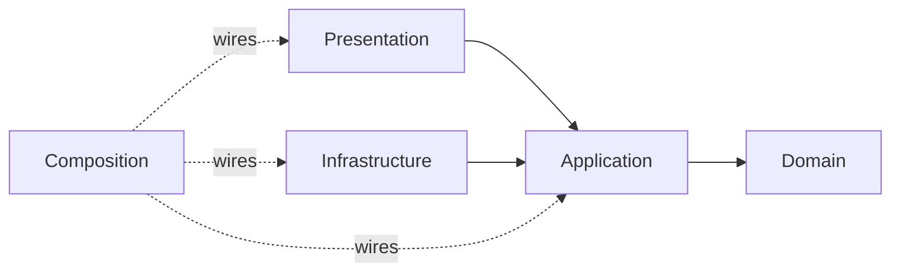

# Architecture Foundations

Start here after [Code Placement](code-placement.md).

These chapters teach the reusable rules shared by Clean, Onion, [Ports & Adapters](../../GLOSSARY.md#hexagonal-architecture-ports-and-adapters), and serious modular applications.

**Start with one ticket:** the rule “a resolved ticket cannot be assigned again” should not live inside a React button or an HTTP client. Those pieces can call an operation that enforces the rule, but changing the screen or request library should not alter it. The chapters below explain how to keep the rule, the callers, the external integrations, and the code that connects them in the right places.

## Learning order

1. **[Code Placement](code-placement.md)** — where a function/type/file belongs.
2. **[Dependency Boundaries](dependency-boundaries.md)** — why dependencies point toward policy.
3. **[Composition Root](composition-root.md)** — how concrete implementations are assembled.
4. **[Module Boundaries and Public APIs](module-boundaries-and-public-apis.md)** — how capabilities stay cohesive.
5. **[Checking Architectural Boundaries](architecture-testing.md)** — how CI protects the [dependency graph](../../GLOSSARY.md#dependency-graph).
6. **[Evolution and Scaling](evolution-and-scaling.md)** — how architecture evolves from observable forces.

## Mental model

The important distinction is ownership:

| Area | Owns | Should not own |
| --- | --- | --- |
| [Domain](../../GLOSSARY.md#domain) | business concepts and [invariants](../../GLOSSARY.md#invariant) | HTTP, UI, Redux, database details |
| [Application](../../GLOSSARY.md#application-layer) | [use cases](../../GLOSSARY.md#use-case) and required capabilities | concrete [adapters](../../GLOSSARY.md#adapter)/framework code |
| [Infrastructure](../../GLOSSARY.md#infrastructure) | HTTP/DB/storage/SDK translation | business policy |
| [Presentation](../../GLOSSARY.md#presentation-layer) | rendering, interaction and view state | authoritative business invariants |
| Composition | construction/wiring | business decisions |

## Architecture is not folder names

A project can contain `domain/`, `application/`, and `infrastructure/` while violating every intended boundary.

The folder structure is useful because it makes ownership visible and mechanically enforceable. The architecture is the responsibility/dependency model behind it.

## Use architecture proportionally

More boundaries create more:

- interfaces;
- mappings;
- files;
- tests;
- composition.

That cost is justified when it protects meaningful business policy or volatile external mechanisms.

Do not add abstractions merely because a diagram has another box.
