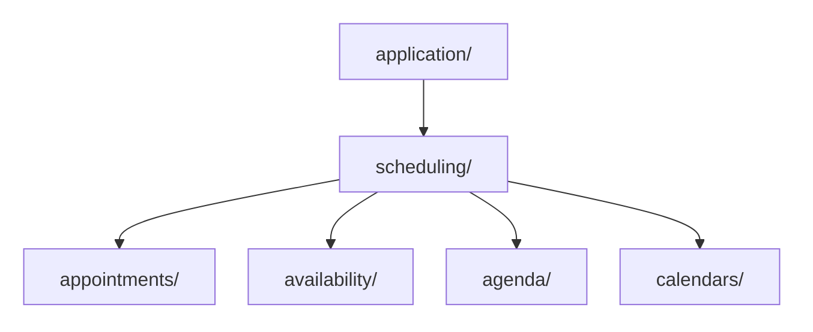

# Code Placement: Where Does This Code Belong?

**Place code where the meaning belongs**, rather than according to whether it is a function, [DTO](../../GLOSSARY.md#data-transfer-object-dto), parser or helper.

A receptionist changes the selected day; an agenda loader asks for data; another function checks scheduling policy. These decisions have different owners even when all three are functions. **[Architectural ownership](../../GLOSSARY.md#architectural-ownership)** identifies the authoritative place to change a decision.

**Contents**

- [First decision: why does the code exist?](#first-decision-why-does-the-code-exist)
- [Responsibilities](#responsibilities)
  - [Domain](#domain)
  - [Application](#application)
  - [Infrastructure](#infrastructure)
  - [Presentation](#presentation)
- [Composition](#composition)
- [Where does a type belong?](#where-does-a-type-belong)
  - [Parsing and mapping follow the boundary](#parsing-and-mapping-follow-the-boundary)
- [Where does a helper function belong?](#where-does-a-helper-function-belong)
- [A placement map for a complete feature](#a-placement-map-for-a-complete-feature)
- [Naming](#naming)
- [Grow capabilities inside each layer](#grow-capabilities-inside-each-layer)
- [Sources](#sources)

## First decision: why does the code exist?

| Meaning | Owner |
| --- | --- |
| Valid business state or decision | [Domain](../../GLOSSARY.md#domain) |
| An operation's workflow and required capabilities | [Application](../../GLOSSARY.md#application-layer) |
| Communication with another system | [Infrastructure](../../GLOSSARY.md#infrastructure) |
| Input/output for a caller or screen | [Presentation](../../GLOSSARY.md#presentation-layer) |
| Selecting and constructing concrete objects | Composition |

The [frontend/backend comparison](../frontend/README.md#core-model) shows how the same responsibilities use different mechanisms.

## Responsibilities

### Domain

A nonblank ticket subject is a **[business rule](../../GLOSSARY.md#business-rule)**: it comes from Support's requirements. `domain/tickets/Ticket.ts` owns that decision.

A condition required for valid business state is an **invariant**. If a new caller uses the operation, the same rule must still apply.

### Application

`application/tickets/use-cases/CreateTicket.ts` coordinates creation and persistence. It asks [Domain](../../GLOSSARY.md#domain) for a valid Ticket and uses the contract required to save it.

**Required contracts.**

A required contract belongs with the policy that needs it. `application/tickets/ports/TicketRepository.ts` describes insertion; its concrete implementation lives outward. [Hexagonal Architecture](../styles/hexagonal-architecture/README.md) explains offered and required interactions; the [Repository guide](../patterns/persistence/repository/README.md) explains this persistence pattern.

### Infrastructure

A Prisma insert and a frontend API client both communicate with external mechanisms. Their representations and translations stay with those integrations.

### Presentation

Incoming HTTP belongs to backend [Presentation](../../GLOSSARY.md#presentation-layer); outgoing API calls belong to frontend [Infrastructure](../../GLOSSARY.md#infrastructure). See the [Ticket file map](../backend/4-create-ticket-with-nestjs.md#physical-structure) and [Scheduling map](../frontend/presentation-architecture.md#organize-by-ownership-not-only-by-technical-type).

## Composition

Startup chooses a concrete implementation and supplies it to its consumer. Inner policy receives dependencies; it does not import startup code to find them.

## Where does a type belong?

A **[DTO](../../GLOSSARY.md#data-transfer-object-dto)** describes data crossing a specific boundary. Its owner is that boundary. An application command/result describes an operation; a business value describes domain meaning.

All example paths below are under `src/`:

| Artifact | Exact file and owner |
| --- | --- |
| Backend request DTO | `presentation/http/tickets/dto/CreateTicketRequestDto.ts` |
| Backend response DTO | `presentation/http/tickets/dto/TicketResponseDto.ts` |
| [Application](../../GLOSSARY.md#application-layer) command | `application/tickets/contracts/CreateTicketCommand.ts` |
| Application result | `application/tickets/contracts/CreateTicketResult.ts` |
| Frontend API DTO | `infrastructure/http/scheduling/dto/AgendaApiDto.ts` |
| Provider DTO | `infrastructure/integrations/payments/dto/StripePaymentDto.ts` |
| Persistence record, when needed | `infrastructure/persistence/tickets/dto/TicketPersistenceRecord.ts` |
| Business value | `domain/billing/Money.ts` |
| Component props | `presentation/scheduling/components/AppointmentCard/AppointmentCard.types.ts` |

Identical field shapes do not imply identical ownership. A generated database type may make a custom record type unnecessary.

### Parsing and mapping follow the boundary

A **[Parser](../../GLOSSARY.md#parser)** checks an unknown representation and returns accepted data or failure. A **[Mapper](../../GLOSSARY.md#mapper)** translates an already accepted representation.

| Responsibility | Exact file |
| --- | --- |
| Incoming backend request parsing | `presentation/http/tickets/parsers/parseCreateTicketRequest.ts` |
| Backend response mapping | `presentation/http/tickets/mappers/mapCreateTicketResponse.ts` |
| Frontend agenda response parsing | `infrastructure/http/scheduling/parsers/parseAgendaApiResponse.ts` |
| Frontend agenda field translation | `infrastructure/http/scheduling/mappers/mapAgendaApiDto.ts` |
| Provider event parsing after verified delivery | `infrastructure/integrations/payments/parsers/parseStripeEvent.ts` |
| Business Money parsing | `domain/billing/Money.ts` |
| Stored-record mapping, when retrieval needs it | `infrastructure/persistence/tickets/mappers/mapTicketPersistenceRecord.ts` |

A request parser checks string fields; `Ticket.create()` checks business validity. A persistence mapper restores stored state through a supported domain operation, rather than resetting it through a creation factory.

## Where does a helper function belong?

A **Formatter** produces a representation for display or a protocol. A helper follows the responsibility it serves; `utils/` is not an architectural owner.

| Meaning | Exact file |
| --- | --- |
| Scheduling availability policy | `domain/scheduling/availability/calculateAvailableSlots.ts` |
| Agenda-loading workflow | `application/scheduling/use-cases/GetAgenda.ts` |
| Appointment time display | `presentation/scheduling/formatters/formatAppointmentTime.ts` |
| Ticket status label | `presentation/tickets/formatters/formatTicketStatusLabel.ts` |
| Reused HTTP error display | `presentation/http/tickets/formatters/formatTicketErrorResponse.ts` |
| Byte-size display across unrelated screens | `presentation/shared/formatters/formatBytes.ts` |

A large availability calculation remains [Domain](../../GLOSSARY.md#domain); a short API mapper remains [Infrastructure](../../GLOSSARY.md#infrastructure). Size may justify splitting cohesive functions within the owner, not moving them to a generic bucket.

## A placement map for a complete feature

The [backend Ticket map](../backend/4-create-ticket-with-nestjs.md#physical-structure) and [frontend Scheduling map](../frontend/presentation-architecture.md#organize-by-ownership-not-only-by-technical-type) apply these decisions.

## Naming

The path reveals ownership; the filename reveals intent or mechanism. Follow [Naming](../conventions/naming-and-file-placement.md).

## Grow capabilities inside each layer

The handbook uses layers first, then cohesive capabilities such as Tickets, Scheduling and Billing. A growing capability can subdivide internally:

Arrows mean containment. Subdivisions represent responsibilities, rather than a complete layer stack for every table/entity. Other capabilities use supported APIs; [module boundaries](module-boundaries-and-public-apis.md) explain that rule.

Layer-first is a handbook convention. Ownership and dependency direction establish the boundary.

## Sources

- [Martin — Clean Architecture](https://blog.cleancoder.com/uncle-bob/2012/08/13/the-clean-architecture.html)
- [Fowler — Repository](https://martinfowler.com/eaaCatalog/repository.html)

[Previous: Architecture Foundations](README.md) · [Next: Dependency Boundaries](dependency-boundaries.md)
