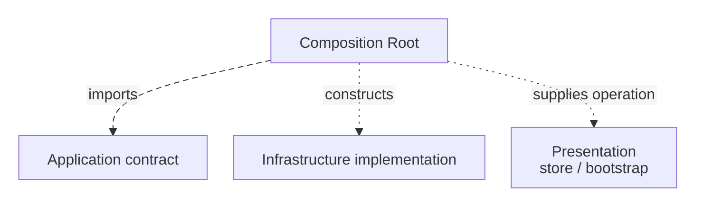

# Composition Root and Dependency Injection

A ticket operation needs storage. This guide shows how startup code gives it a chosen implementation without making storage selection a business rule.

**Contents**

- [Composition is a boundary, not business policy](#composition-is-a-boundary-not-business-policy)
- [Keep composition out of inner modules](#keep-composition-out-of-inner-modules)
- [A DI container is optional](#a-di-container-is-optional)
- [Inject capabilities, not global bags](#inject-capabilities-not-global-bags)
- [Framework bootstrap belongs at the edge](#framework-bootstrap-belongs-at-the-edge)
- [Store injection is still dependency injection](#store-injection-is-still-dependency-injection)
- [Multiple composition roots](#multiple-composition-roots)
- [Sources](#sources)

<a id="1-composition-is-a-boundary-not-business-policy"></a>

## Composition is a boundary, not business policy

Consider a ticket-creation operation that needs another object to save a ticket. The operation describes the method it needs but does not decide whether the object uses HTTP or memory. Something still has to create the HTTP implementation and give it to that operation when the application starts.

The [Composition Root](../../GLOSSARY.md#composition-root) is that assembly location: it constructs the real objects and passes each one to the code that needs it. It decides *which implementation to use*, not *whether the ticket is valid*.

Mark Seemann defines it as a preferably unique location, as close as possible to the application's entry point, where modules are composed together.

A browser application may look like:

```tsx
const closureGateway = new HttpClosureGateway(httpClient)
const executeClosure = makeExecuteClosure({ closureGateway })

const store = createAppStore({
  executeClosure,
})

createRoot(document.getElementById('root')!).render(
  <Provider store={store}>
    <App />
  </Provider>,
)
```

The Composition Root is allowed to know both sides:



Dashed arrows show source imports; dotted arrows show startup assembly. A TypeScript interface is not a runtime object to construct.

That is not an exception to the [Dependency Rule](../../GLOSSARY.md#dependency-rule). Composition is at the outer edge of the application and exists specifically to assemble details around policy.

<a id="2-keep-composition-out-of-inner-modules"></a>

## Keep composition out of inner modules

Avoid [service location](../../GLOSSARY.md#service-locator):

```ts
// Bad: the consumer goes looking for a dependency.
export function useClosures() {
  const gateway = container.resolve('closureGateway')
}
```

Prefer injection:

```ts
export function makeExecuteClosure(deps: {
  closureGateway: ClosureGateway
}) {
  return async function execute(command: ExecuteClosureCommand) {
    return deps.closureGateway.execute(command)
  }
}
```

The consumer declares what it needs. The edge decides what satisfies it.

<a id="3-a-di-container-is-optional"></a>

## A DI container is optional

[Dependency Injection](../../GLOSSARY.md#dependency-injection-di) is a design technique. A [DI container](../../GLOSSARY.md#di-container) is a tool.

Manual composition is usually the clearest default while the object graph is small:

```ts
const repository = new HttpOrderRepository(http)
const service = new OrderService(repository)
```

A container becomes useful when it meaningfully improves management of a complex graph, lifetimes/scopes, interception/decorators or framework integration.

Do not introduce one based on an arbitrary number of dependencies.

<a id="4-inject-capabilities-not-global-bags"></a>

## Inject capabilities, not global bags

Avoid:

```ts
class CreateOrder {
  constructor(private readonly services: AppServices) {}
}
```

when `AppServices` contains dozens of unrelated dependencies.

Prefer:

```ts
class CreateOrder {
  constructor(
    private readonly orders: OrderRepository,
    private readonly clock: Clock,
  ) {}
}
```

This keeps dependencies visible and improves testability.

<a id="5-framework-bootstrap-belongs-at-the-edge"></a>

## Framework bootstrap belongs at the edge

Entry points may import:

- framework bootstrap APIs;
- concrete [adapters](../../GLOSSARY.md#adapter);
- application factories;
- [store](../../GLOSSARY.md#store) creation;
- providers;
- router creation.

Inner code should never import the entry point or the container.

<a id="6-store-injection-is-still-dependency-injection"></a>

## Store injection is still dependency injection

For Redux Toolkit, injecting [application services](../../GLOSSARY.md#application-service) through [thunk](../../GLOSSARY.md#thunk) `extraArgument` can preserve the same boundary:

```ts
export function createAppStore(deps: AppDependencies) {
  return configureStore({
    reducer,
    middleware: getDefaultMiddleware =>
      getDefaultMiddleware({
        thunk: { extraArgument: deps },
      }),
  })
}
```

A thunk can then invoke an application contract without importing [Infrastructure](../../GLOSSARY.md#infrastructure):

```ts
export const saveOrder = createAsyncThunk<
  SaveOrderResult,
  SaveOrderCommand,
  { extra: AppDependencies }
>('orders/save', async (command, { extra }) => {
  return extra.saveOrder(command)
})
```

Redux Toolkit explicitly supports an injected thunk `extra` argument. The architectural point is not Redux; it is that the concrete [adapter](../../GLOSSARY.md#adapter) remains wired at the edge.

<a id="7-multiple-composition-roots"></a>

## Multiple composition roots

"Preferably unique" is a useful default, not dogma. Separate independently deployed processes, workers, CLIs or test harnesses naturally have separate roots.

Each executable owns the graph it starts.

## Sources

- Mark Seemann, "[Composition Root](../../GLOSSARY.md#composition-root)", 2011: https://blog.ploeh.dk/2011/07/28/CompositionRoot/
- Mark Seemann interview on [Dependency Injection](../../GLOSSARY.md#dependency-injection-di), InfoQ, 2011: https://www.infoq.com/articles/DI-Mark-Seemann/
- Redux Toolkit, `createAsyncThunk`: https://redux-toolkit.js.org/api/createAsyncThunk

[Previous: Dependency Boundaries](dependency-boundaries.md) · [Next: Module Boundaries and Public APIs](module-boundaries-and-public-apis.md)
