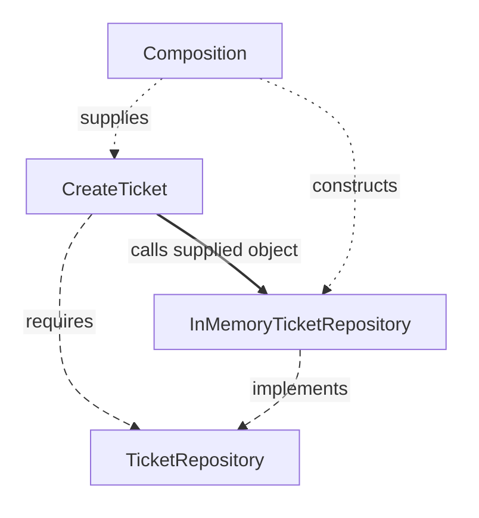

# Dependency Boundaries

Changing a storage implementation should not force you to rewrite ticket rules. Follow the imports and runtime calls separately to see how the code protects that change.

**Contents**

- [The rule](#the-rule)
- [A practical four-area mapping](#a-practical-four-area-mapping)
- [Do not confuse runtime flow with source dependency](#do-not-confuse-runtime-flow-with-source-dependency)
- [Ports model capabilities, not files](#ports-model-capabilities-not-files)
- [A port is not automatically a Repository](#a-port-is-not-automatically-a-repository)
- [External technology types stop at the boundary](#external-technology-types-stop-at-the-boundary)
- [Data crossing a boundary](#data-crossing-a-boundary)
- [Type ownership follows meaning](#type-ownership-follows-meaning)
- [Presentation owns interaction logic](#presentation-owns-interaction-logic)
- [Avoid ceremonial boundaries](#avoid-ceremonial-boundaries)
- [Combined outer modules](#combined-outer-modules)
- [Sources](#sources)

## The rule

A resolved ticket cannot be assigned again. Changing its database should leave that decision intact. Put the decision in [Domain](../../GLOSSARY.md#domain) and let database code refer to it.

A source dependency is a reference to another module, including an import of a type. Clean's **Dependency Rule** directs those references toward the protected policies.

## A practical four-area mapping

| Area | Owns | May import |
| --- | --- | --- |
| [Domain](../../GLOSSARY.md#domain) | Business concepts and rules | Domain |
| [Application](../../GLOSSARY.md#application-layer) | Workflows and their contracts | Application, Domain |
| [Infrastructure](../../GLOSSARY.md#infrastructure) | External integrations | Infrastructure, Application, Domain |
| [Presentation](../../GLOSSARY.md#presentation-layer) | UI or incoming HTTP/CLI translation | Presentation, Application |
| Composition | Construction and startup | All areas needed for assembly |

This is the handbook's recommended project policy. Architecture authors prescribe dependency direction rather than these folder names. Application may deliberately expose a domain type through its supported contract.

## Do not confuse runtime flow with source dependency

`CreateTicket` calls the repository object supplied at startup. Its source imports the application-owned contract; the concrete implementation imports that same contract.

Solid arrows are runtime calls, longer dashes source relationships, and shorter dots startup wiring. A contract describes the interaction; it does not forward calls.

## Ports model capabilities, not files

A [port](../../GLOSSARY.md#port) describes an interaction the application requires or offers. Keep it cohesive: `AgendaReader` reads agendas, while `TicketRepository` persists tickets. One interface that also authenticates users and uploads files hides unrelated reasons to change.

The [backend style comparison](../backend/5-architectural-styles-with-nestjs.md) applies these labels to the Ticket example.

## A port is not automatically a Repository

`TicketRepository` presents ticket persistence in terms the application needs. `Clock` or `PaymentGateway` describes another capability. Name the interaction for its purpose.

## External technology types stop at the boundary

A Prisma record, Nest request or browser event belongs to its technical boundary. Translate it into an inward-owned command or result before invoking protected policy.

For example, an upload contract can accept application-owned `{ name, mediaType, bytes }` data while an outer function reads a browser `File`.

## Data crossing a boundary

| Question | Owner |
| --- | --- |
| Is the incoming JSON shape usable? | Transport parser |
| Which operation should run? | [Application](../../GLOSSARY.md#application-layer) |
| Is the ticket subject valid? | [Domain](../../GLOSSARY.md#domain) |
| Which HTTP status represents the outcome? | HTTP [Presentation](../../GLOSSARY.md#presentation-layer) |

A parser checks unknown input, then Domain evaluates its meaning. A TypeScript annotation alone cannot validate received JSON. [Code Placement](code-placement.md) distinguishes DTOs, parsers and mappers.

## Type ownership follows meaning

Use-case commands/results belong to [Application](../../GLOSSARY.md#application-layer); business values belong to [Domain](../../GLOSSARY.md#domain). Reexporting a deliberately supported domain type through Application can preserve inward direction. Reexporting a database [DTO](../../GLOSSARY.md#data-transfer-object-dto) through Application introduces an outward dependency.

## Presentation owns interaction logic

Selected tabs, loading feedback and HTTP status mapping belong to delivery code. Business eligibility remains in [Domain](../../GLOSSARY.md#domain) or [Application](../../GLOSSARY.md#application-layer). See the [frontend](../frontend/presentation-architecture.md) and [backend](../backend/README.md) maps.

## Avoid ceremonial boundaries

Introduce a contract where it protects a meaningful change or required substitute. A plain function can translate fields; it does not need a mapper class solely to occupy a layer.

## Combined outer modules

`PrismaTicketRepository` can both translate ticket fields and call Prisma. Both responsibilities belong to the external integration. Split them when mapping needs independent reuse or the driver changes separately; combining them preserves the inward dependency rule.

## Sources

- [Martin: Clean Architecture](https://blog.cleancoder.com/uncle-bob/2012/08/13/the-clean-architecture.html)
- [Cockburn: Hexagonal Architecture](https://alistair.cockburn.us/hexagonal-architecture/)

[Previous: Code Placement: Where Does This Code Belong?](code-placement.md) · [Next: Composition Root and Dependency Injection](composition-root.md)
