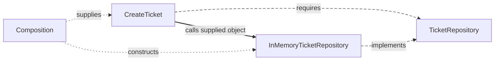

# Dependency Boundaries

## 1. The rule

A resolved ticket cannot be assigned again. Changing its database should leave that decision intact. Put the decision in Domain and let database code refer to it.

A source dependency is a reference to another module, including an import of a type. Clean's **Dependency Rule** directs those references toward the protected policies.

## 2. A practical four-area mapping

| Area | Owns | May import |
| --- | --- | --- |
| Domain | Business concepts and rules | Domain |
| Application | Workflows and their contracts | Application, Domain |
| Infrastructure | External integrations | Infrastructure, Application, Domain |
| Presentation | UI or incoming HTTP/CLI translation | Presentation, Application |
| Composition | Construction and startup | All areas needed for assembly |

This is the handbook's recommended project policy. Architecture authors prescribe dependency direction rather than these folder names. Application may deliberately expose a domain type through its supported contract.

## 3. Do not confuse runtime flow with source dependency

`CreateTicket` calls the repository object supplied at startup. Its source imports the application-owned contract; the concrete implementation imports that same contract.

Solid arrows are runtime calls, longer dashes source relationships, and shorter dots startup wiring. A contract describes the interaction; it does not forward calls.

## 4. Ports model capabilities, not files

A [port](../../GLOSSARY.md#port) describes an interaction the application requires or offers. Keep it cohesive: `AgendaReader` reads agendas, while `TicketRepository` persists tickets. One interface that also authenticates users and uploads files hides unrelated reasons to change.

The [backend style comparison](../backend/5-architectural-styles-with-nestjs.md) applies these labels to the Ticket example.

## 5. A port is not automatically a Repository

`TicketRepository` presents ticket persistence in terms the application needs. `Clock` or `PaymentGateway` describes another capability. Name the interaction for its purpose.

## 6. External technology types stop at the boundary

A Prisma record, Nest request or browser event belongs to its technical boundary. Translate it into an inward-owned command or result before invoking protected policy.

For example, an upload contract can accept application-owned `{ name, mediaType, bytes }` data while an outer function reads a browser `File`.

## 7. Data crossing a boundary

| Question | Owner |
| --- | --- |
| Is the incoming JSON shape usable? | Transport parser |
| Which operation should run? | Application |
| Is the ticket subject valid? | Domain |
| Which HTTP status represents the outcome? | HTTP Presentation |

A parser checks unknown input, then Domain evaluates its meaning. A TypeScript annotation alone cannot validate received JSON. [Code Placement](code-placement.md) distinguishes DTOs, parsers and mappers.

## 8. Type ownership follows meaning

Use-case commands/results belong to Application; business values belong to Domain. Reexporting a deliberately supported domain type through Application can preserve inward direction. Reexporting a database DTO through Application introduces an outward dependency.

## 9. Presentation owns interaction logic

Selected tabs, loading feedback and HTTP status mapping belong to delivery code. Business eligibility remains in Domain or Application. See the [frontend](../frontend/presentation-architecture.md) and [backend](../backend/README.md) maps.

## 10. Avoid ceremonial boundaries

Introduce a contract where it protects a meaningful change or required substitute. A plain function can translate fields; it does not need a mapper class solely to occupy a layer.

## 11. Combined outer modules

`PrismaTicketRepository` can both translate ticket fields and call Prisma. Both responsibilities belong to the external integration. Split them when mapping needs independent reuse or the driver changes separately; combining them preserves the inward dependency rule.

## Sources

- [Martin: Clean Architecture](https://blog.cleancoder.com/uncle-bob/2012/08/13/the-clean-architecture.html)
- [Cockburn: Hexagonal Architecture](https://alistair.cockburn.us/hexagonal-architecture/)
