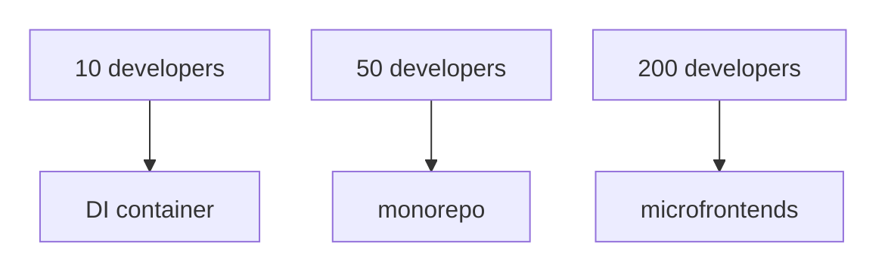
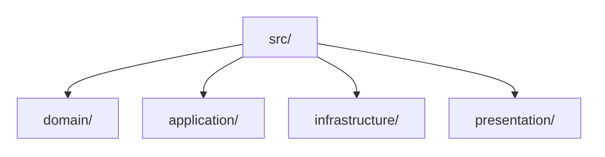
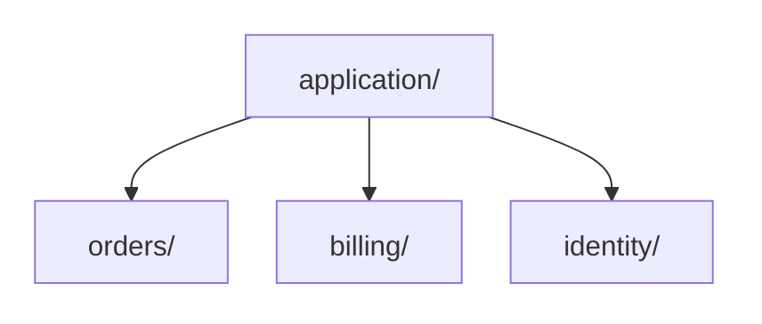
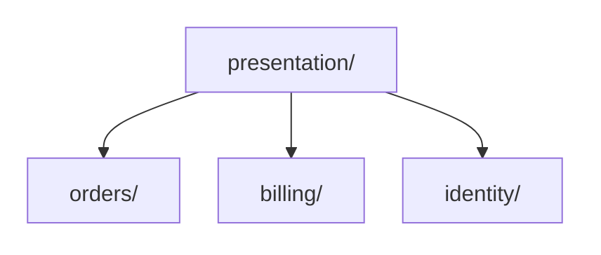
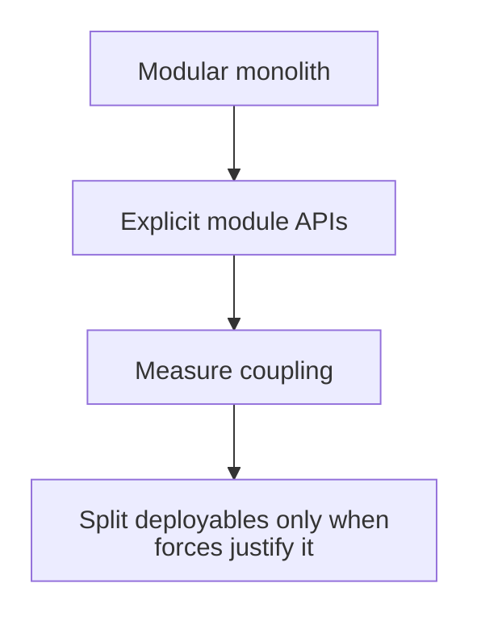

# Architecture Evolution and Scaling

Suppose our support system grows from one ticket screen into separate teams working on tickets, billing and notifications. We might eventually need stronger module ownership or independent deployment—but adding a new tool simply because the team reached a particular size does not solve a demonstrated problem.

Architecture should evolve in response to observed forces, not headcount or lines-of-code thresholds.

There is no defensible rule such as:



Those decisions solve different problems and carry different costs.

---

**Contents**

- [Prefer evidence over maturity phases](#prefer-evidence-over-maturity-phases)
- [Manual composition vs. DI container](#manual-composition-vs-di-container)
- [Group capabilities inside each layer](#group-capabilities-inside-each-layer)
- [Modular monolith before distribution by default](#modular-monolith-before-distribution-by-default)
- [Bounded contexts are semantic boundaries](#bounded-contexts-are-semantic-boundaries)
- [Team boundaries and software boundaries influence each other](#team-boundaries-and-software-boundaries-influence-each-other)
- [Microservices](#microservices)
- [Microfrontends](#microfrontends)
- [Shared code vs. platform capability](#shared-code-vs-platform-capability)
- [Architecture fitness signals](#architecture-fitness-signals)
- [Review an example under likely change pressure](#review-an-example-under-likely-change-pressure)
- [Sources](#sources)

<a id="1-prefer-evidence-over-maturity-phases"></a>

## Prefer evidence over maturity phases

Ask what is actually hurting:

| Signal | Possible response |
| --- | --- |
| manual object graph is hard to understand/test | improve composition; possibly use a [DI container](../../GLOSSARY.md#di-container) |
| one capability's files are hard to locate within a layer | group them by capability within that layer |
| teams repeatedly edit the same modules | strengthen ownership and module APIs |
| cross-module dependencies form cycles | redefine boundaries / introduce contracts |
| release coordination dominates delivery | investigate independently deployable boundaries |
| one deployable has excessive runtime scaling constraints | separate runtime workloads where evidence supports it |
| a domain area has distinct language/rules/ownership | consider a [bounded context](../../GLOSSARY.md#bounded-context) |
| frontend teams block each other on one build/deploy pipeline | evaluate modular frontend ownership; [microfrontends](../../GLOSSARY.md#microfrontend) only if independent deployment is worth the premium |

The response is not automatic. Each option has trade-offs.

---

<a id="2-manual-composition-vs-di-container"></a>

## Manual composition vs. DI container

A [DI container](../../GLOSSARY.md#di-container) solves object-graph/lifetime/composition problems. It does not make an architecture "enterprise".

Keep manual composition while it remains obvious:

```ts
const orders = new HttpOrderRepository(http)
const clock = new SystemClock()
const placeOrder = makePlaceOrder({ orders, clock })
```

Consider a container when:

- object lifetimes/scopes are complex;
- framework integration benefits from it;
- decorators/interceptors are consistently required;
- registration is clearer than hand wiring;
- the team can inspect/debug the graph.

Do not switch because the team crossed an arbitrary size.

---

<a id="3-layer-first-vs-capability-first-filesystem"></a>
<a id="layer-first-vs-capability-first-filesystem"></a>

## Group capabilities inside each layer

The handbook puts layers at the top level and groups capabilities inside each layer. This convention still applies as the codebase grows:



Within Application, separate the operations and contracts for each capability:



Use the same grouping within [Presentation](../../GLOSSARY.md#presentation-layer):



Subdivide a growing capability within its owning layers, as [Code Placement](code-placement.md#grow-capabilities-inside-each-layer) illustrates. A capability-first top level is another project choice, but growth alone does not require changing the handbook's folder convention. In either layout, ask:

> Which grouping makes code that changes together easiest to own without weakening dependency rules?

---

<a id="4-modular-monolith-before-distribution-by-default"></a>

## Modular monolith before distribution by default

A process boundary is expensive:

- network failure;
- versioned contracts;
- observability;
- deployment coordination;
- distributed data consistency;
- latency;
- operational ownership.

Martin Fowler's "Monolith First" describes the common benefit of discovering stable boundaries before paying the [microservice](../../GLOSSARY.md#microservice) premium, while also acknowledging counterarguments and exceptions.

A strong default for many business systems is therefore:



This is guidance, not a law. Teams with mature distributed-systems capability and already-known boundaries may make a different decision.

---

<a id="5-bounded-contexts-are-semantic-boundaries"></a>

## Bounded contexts are semantic boundaries

Imagine Support using `Customer` for the person who contacted the help desk, while Billing uses `Customer` for the party responsible for an invoice. Forcing one universal object on both teams may make both models confusing. Each team can define its own meaning and rules within an explicit model boundary, called a [bounded context](../../GLOSSARY.md#bounded-context).

Do not create such a boundary simply because a folder is large. In [DDD](../../GLOSSARY.md#domain-driven-design-ddd), this separation is justified by differences in model and language:

Signals include the same word having different meanings, different [invariants](../../GLOSSARY.md#invariant), different lifecycles/ownership, different sources of truth, or materially different change cadence.

A bounded context may initially live in the same process as another context.

Logical modularity and physical deployment are separate decisions.

---

<a id="6-team-boundaries-and-software-boundaries-influence-each-other"></a>

## Team boundaries and software boundaries influence each other

Team Topologies focuses on flow of change and cognitive load rather than organization size alone.

Useful questions:

- Can a stream-aligned team deliver value end-to-end?
- How many other teams must approve a normal change?
- Does a shared module create a coordination queue?
- Is a platform capability genuinely reducing cognitive load?
- Is cross-team collaboration temporary discovery or permanent coupling?

Architecture should reduce unnecessary communication paths, not mirror an org chart blindly.

---

<a id="7-microservices"></a>

## Microservices

Consider independently deployable services when there is a concrete need such as:

- independent scaling characteristics;
- separate availability/security constraints;
- stable business capability boundaries;
- different release cadence;
- ownership that benefits from autonomous deployment;
- regulatory/data isolation;
- technology/runtime constraints that justify separation.

Do not use [microservices](../../GLOSSARY.md#microservice) to repair poor module boundaries. Distribution makes unclear boundaries more expensive.

---

<a id="8-microfrontends"></a>

## Microfrontends

[Microfrontends](../../GLOSSARY.md#microfrontend) primarily address **organizational and delivery independence** in large frontend products.

They may help when:

- multiple autonomous teams own distinct product areas;
- independent build/release is valuable;
- one frontend release train is a material bottleneck;
- boundaries map to coherent user/business capabilities.

Costs include:

- duplicated runtime/framework code;
- inconsistent UX;
- cross-application communication complexity;
- routing/composition complexity;
- performance overhead;
- [design-system](../../GLOSSARY.md#design-system) governance.

A large frontend does not automatically need microfrontends.

Cam Jackson's Martin Fowler article frames microfrontends around scaling frontend development across teams and discusses both benefits and implementation costs; it does not establish a headcount threshold.

---

<a id="9-shared-code-vs-platform-capability"></a>

## Shared code vs. platform capability

As systems grow, a giant shared library often becomes a coupling hub.

Possible ownership choices include a feature-local implementation, an explicit reusable library with a stable owner/API, a platform capability consumed as a product/service, or deliberate duplication of tiny code when sharing would create more coupling than value.

"DRY" is not a reason to erase ownership boundaries.

---

<a id="10-architecture-fitness-signals"></a>

## Architecture fitness signals

Track evidence such as:

- dependency cycles;
- cross-feature deep imports;
- change coupling;
- build/test blast radius;
- deployment frequency and failure rate;
- number of teams required for a normal change;
- lead time for changes;
- incidents caused by unclear ownership;
- object-graph complexity;
- runtime scaling hotspots.

The point is not to optimize a vanity metric. The point is to know **which force is asking the architecture to evolve**.

---

<a id="11-review-an-example-under-likely-change-pressure"></a>

## Review an example under likely change pressure

A support platform can have hundreds of files without needing distribution; it can also have only a few files and already suffer from an unsafe business rule. Scale is not a synonym for code size, folder count or the number of interfaces.

Start with a concrete support workflow: an analyst escalates a ticket, which changes its status, assigns it to another queue and may send a notification. Ask three separate questions:

| Pressure | Boundary to inspect | Evidence of maintainability |
| --- | --- | --- |
| Escalation gains a new status or assignment restriction | Tickets policy and its public operation | One authoritative status/transition rule changes; the UI and transport reuse or translate it instead of maintaining competing lists. |
| Notifications moves to an external provider or the API changes fields | Notification and HTTP-facing [adapters](../../GLOSSARY.md#adapter); explicit event/command contracts | Ticket policy does not import a provider SDK or a queue message [DTO](../../GLOSSARY.md#data-transfer-object-dto). Integration failures have an owner and do not silently change business meaning. |
| Another team adds SLA reporting and an additional UI | Tickets' supported [public API](../../GLOSSARY.md#public-api); Reporting's independent read needs | Teams do not deep-import each other's private state, nor must unrelated capabilities share one global model package. |

Avoid turning the example into a full distributed architecture before there is a reason to split deployment or data ownership. The decision test is **how many unrelated code owners must change for one normal business request, and where can an [invariant](../../GLOSSARY.md#invariant) be violated?** Document observable requirements, negative cases and the dependency boundaries required to protect them. Benchmark runtime bottlenecks rather than assuming that modularity or a specific pattern automatically improves speed.

---

## Sources

- Martin Fowler, "Monolith First": https://martinfowler.com/bliki/MonolithFirst.html
- Martin Fowler, [Microservices](../../GLOSSARY.md#microservice) Guide: https://martinfowler.com/microservices/
- Cam Jackson, "Micro Frontends": https://martinfowler.com/articles/micro-frontends.html
- Team Topologies, Key Concepts: https://teamtopologies.com/key-concepts
- Mark Seemann, "[Composition Root](../../GLOSSARY.md#composition-root)": https://blog.ploeh.dk/2011/07/28/CompositionRoot/
