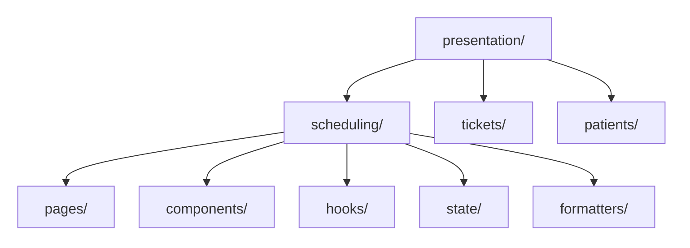

# Frontend Architecture

A receptionist changes the selected day, opens an appointment and sees loading feedback. Keep these screen decisions close together; business rules and agenda-loading operations should survive a screen change.

**Contents**

- [Core model](#core-model)
- [Recommended source layout](#recommended-source-layout)
- [Feature ownership](#feature-ownership)
- [Public screen interaction](#public-screen-interaction)
- [Read next](#read-next)

## Core model

| Responsibility | Frontend | Backend |
| --- | --- | --- |
| [Domain](../../GLOSSARY.md#domain) | Client business values/rules | Authoritative persisted business rules |
| [Application](../../GLOSSARY.md#application-layer) | Operations and required contracts | Operations and required contracts |
| [Infrastructure](../../GLOSSARY.md#infrastructure) | Backend API clients, browser storage, SDKs | Persistence, external APIs, messaging |
| [Presentation](../../GLOSSARY.md#presentation-layer) | Pages, components, hooks, UI state | Controllers, handlers, guards, pipes, parsers, DTOs, CLI |
| Composition | Dependency/bootstrap wiring | Nest/bootstrap/provider wiring |

The backend remains authoritative for persisted behavior. Sending HTTP is an Infrastructure integration; receiving it is backend Presentation.

The framework-independent [API Design & Engineering route](../api-design/README.md) explains the contract this client consumes: HTTP meaning, resource queries, pagination, errors and security. This frontend route explains where the client adapter and screen behavior belong.

## Recommended source layout

Keep `src/{domain,application,infrastructure,presentation,composition}/`. Inside frontend [Presentation](../../GLOSSARY.md#presentation-layer), group by capability:

Arrows mean containment. The [Scheduling file map](presentation-architecture.md#organize-by-ownership-not-only-by-technical-type) gives exact filenames and owners.

## Feature ownership

The capability owns its display, interaction state and formatting. [Domain](../../GLOSSARY.md#domain) owns business decisions; [Application](../../GLOSSARY.md#application-layer) owns the workflow; Composition supplies the chosen integration.

This capability-first-inside-[Presentation](../../GLOSSARY.md#presentation-layer) layout is a handbook convention. React and Redux do not prescribe it. [Feature-Sliced Design](https://feature-sliced.design/docs/get-started/overview) is a separate methodology; this handbook does not partially mix its taxonomy into the canonical structure.

## Public screen interaction

A screen-facing hook can expose `rows`, `busy` and `reload()` while hiding state-library mechanics. Use that boundary when it protects a real responsibility; [Presentation architecture](presentation-architecture.md#screen-interaction-api) explains it.

## Read next

Complete the [shared foundations](../../README.md#read-first), then follow this frontend route. Incoming backend HTTP and Nest are optional context, not prerequisites:

1. [Presentation architecture](presentation-architecture.md), then [F-E1: place agenda interaction](exercises/easy.md#f-e1--place-agenda-interaction).
2. [Frontend integration](ports-and-adapters.md), then [F-E3: receive an API response](exercises/easy.md#f-e3--receive-an-api-response).
3. [State management](state-management.md), then [F-E2: state or business responsibility](exercises/easy.md#f-e2--state-or-business-responsibility) and [intermediate exercises](exercises/intermediate.md).
4. [Advanced exercises](exercises/advanced.md), after the module-boundary and storage readings linked there.
5. [Styling and design systems](styling-and-design-system.md), when the screen needs those decisions.

After the example, compare [styles](../styles/README.md). [MVC/MVVM](../patterns/presentation/README.md) are optional screen-organization continuations. [Facade](../patterns/structural/facade/README.md) is a focused explanation of subsystem collaboration.

For optional server-side context, see the [backend HTTP chapter](../backend/1-http-request-to-business-operation.md).

The [reference case study](reference-case-study.md) applies the ownership questions to a larger reviewed frontend. Use it after the small examples.

[Foundations](../foundations/README.md) · [API Design](../api-design/README.md) · [Backend](../backend/README.md) · [Architecture](../README.md) · [Glossary](../../GLOSSARY.md)
