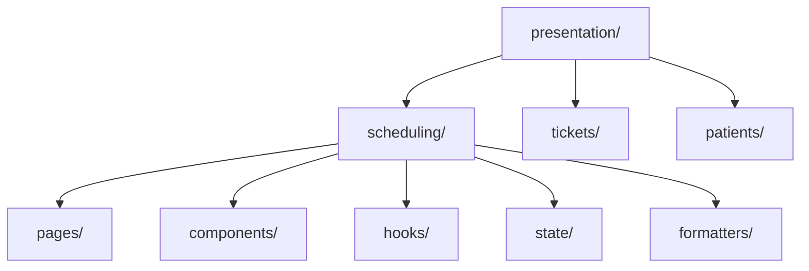

# Frontend Architecture

A receptionist changes the selected day, opens an appointment and sees loading feedback. Keep these screen decisions close together; business rules and agenda-loading operations should survive a screen change.

## Core model

| Responsibility | Frontend | Backend |
| --- | --- | --- |
| Domain | Client business values/rules | Authoritative persisted business rules |
| Application | Operations and required contracts | Operations and required contracts |
| Infrastructure | Backend API clients, browser storage, SDKs | Persistence, external APIs, messaging |
| Presentation | Pages, components, hooks, UI state | Controllers, handlers, guards, pipes, parsers, DTOs, CLI |
| Composition | Dependency/bootstrap wiring | Nest/bootstrap/provider wiring |

The backend remains authoritative for persisted behavior. Sending HTTP is an Infrastructure integration; receiving it is backend Presentation.

## Recommended source layout

Keep `src/{domain,application,infrastructure,presentation,composition}/`. Inside frontend Presentation, group by capability:

Arrows mean containment. The [Scheduling file map](presentation-architecture.md#2-organize-by-ownership-not-only-by-technical-type) gives exact filenames and owners.

## Feature ownership

The capability owns its display, interaction state and formatting. Domain owns business decisions; Application owns the workflow; Composition supplies the chosen integration.

This capability-first-inside-Presentation layout is a handbook convention. React and Redux do not prescribe it. [Feature-Sliced Design](https://feature-sliced.design/docs/get-started/overview) is a separate methodology; this handbook does not partially mix its taxonomy into the canonical structure.

## Public Presentation facade

A screen-facing hook can expose `rows`, `busy` and `reload()` while hiding state-library mechanics. Use that boundary when it protects a real responsibility; [Presentation architecture](presentation-architecture.md#5-public-hook-viewmodel-facade) explains it.

## Read next

1. [Presentation architecture](presentation-architecture.md)
2. [Ports & Adapters](ports-and-adapters.md)
3. [State management](state-management.md)
4. [Styling and design systems](styling-and-design-system.md)
5. [Reference case study](reference-case-study.md)
6. [Exercises](exercises/README.md), with separate solutions
7. [References](references.md)

[Foundations](../foundations/README.md) · [Backend](../backend/README.md) · [Architecture](../README.md) · [Glossary](../../GLOSSARY.md)
