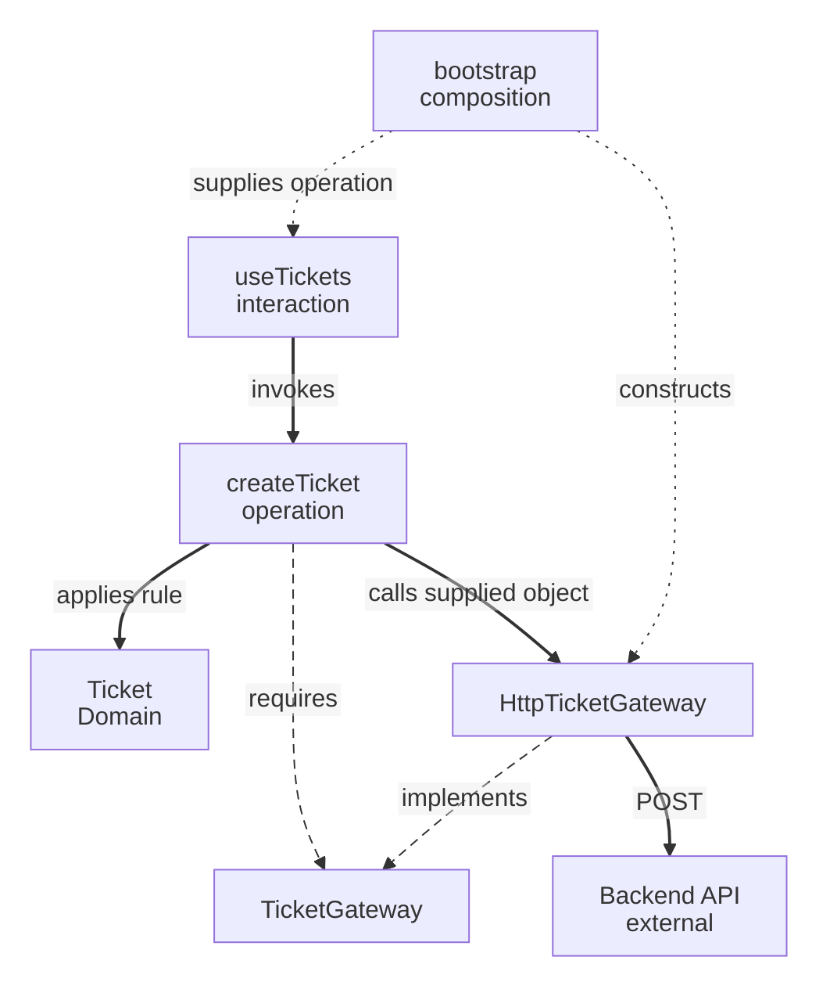

# Ports & Adapters in a Frontend: Support Tickets

← [Frontend Architecture](README.md) · [Dependency Boundaries](../foundations/dependency-boundaries.md) · [Glossary](../../GLOSSARY.md)

A React ticket screen calls a backend whose response format can change. Keep that translation separate from the screen and ticket meaning, then trace the resulting calls and imports.

**Contents**

- [The problem](#the-problem)
- [Visual model](#visual-model)
- [Physical ownership](#physical-ownership)
  - [Domain: ticket vocabulary and rules](#domain-ticket-vocabulary-and-rules)
  - [Port: what the Application needs](#port-what-the-application-needs)
  - [Use case: what the Application does](#use-case-what-the-application-does)
  - [Adapter: how the Application reaches the backend](#adapter-how-the-application-reaches-the-backend)
  - [Presentation and Composition: using the operation](#presentation-and-composition-using-the-operation)
- [Why this separation matters](#why-this-separation-matters)
- [Terminology and references](#terminology-and-references)

<a id="1-the-problem"></a>

## The problem

An analyst creates a support ticket in React. The client's subject feedback should survive an HTTP endpoint or response-format change. This is a frontend application of [Hexagonal Architecture](../styles/hexagonal-architecture/README.md); that guide explains the general model.

`TicketGateway` describes the creation interaction [Application](../../GLOSSARY.md#application-layer) requires: input and promised ticket result. This is an outbound **port**. `HttpTicketGateway` implements it using HTTP and maps `ticket_id` into `id`: an outbound **adapter**.

Composition supplies that object to the operation. The backend is external to this frontend and remains authoritative over persisted tickets.

<a id="2-visual-model"></a>

## Visual model



Solid arrows are runtime calls, long dashes source relationships and short dots startup wiring. The contract describes a required interaction; it does not forward calls.

<a id="3-physical-ownership"></a>

## Physical ownership

| File | Owns | Why it belongs there |
| --- | --- | --- |
| `domain/tickets/Ticket.ts` | Ticket shape, valid status vocabulary/check and subject rule | Business meaning has one owner, independent of server field names and React |
| `application/tickets/ports/TicketGateway.ts` | **Outbound [port](../../GLOSSARY.md#port)** and command | The [use case](../../GLOSSARY.md#use-case) defines what capability it needs |
| `application/tickets/use-cases/createTicket.ts` | Use-case orchestration | No HTTP or React imports |
| `infrastructure/http/tickets/adapters/HttpTicketGateway.ts` | **Outbound [adapter](../../GLOSSARY.md#adapter)**: HTTP execution and integration failure translation | Calls another system through `fetch` |
| `infrastructure/http/tickets/dto/TicketApiDto.ts` | Runtime wire schema and inferred [DTO](../../GLOSSARY.md#data-transfer-object-dto) type | External shape belongs to the API integration; domain vocabulary/checks are reused |
| `infrastructure/http/tickets/parsers/parseTicketApiResponse.ts` | Unknown response checking | Uses the schema before allowing mapping |
| `infrastructure/http/tickets/mappers/mapTicketApiDto.ts` | Accepted DTO to internal Ticket representation | Renames `ticket_id` and reuses subject normalization |
| `presentation/tickets/hooks/useTickets.ts` | React-facing state/operations | Loading/error feedback belongs to the UI |
| `composition/bootstrap.tsx` | Dependency construction and injection | Chooses the concrete adapter without becoming a [Service Locator](../../GLOSSARY.md#service-locator) |

These names are **repository conventions**, not universal requirements of Cockburn's architecture. `Gateway` expresses interaction with an external service. Use `Repository` when the abstraction genuinely models retrieval/persistence of domain objects as a collection, not simply because an [HTTP endpoint](../../GLOSSARY.md#http-endpoint) exists.

### Domain: ticket vocabulary and rules

`src/domain/tickets/Ticket.ts`:

```ts
export const TICKET_STATUSES = ['open', 'in_progress', 'resolved'] as const
export type TicketStatus = (typeof TICKET_STATUSES)[number]

// TypeScript types disappear at runtime; this also checks API data.
export function isTicketStatus(value: unknown): value is TicketStatus {
  return TICKET_STATUSES.some(status => status === value)
}

export function isTicketSubject(value: unknown): value is string {
  return typeof value === 'string' && value.trim().length > 0
}

export function normalizeTicketSubject(value: string): string {
  if (!isTicketSubject(value)) throw new Error('Subject is required')
  return value.trim()
}

export interface Ticket {
  readonly id: string
  readonly subject: string
  readonly status: TicketStatus
}
```

The list of valid ticket statuses is declared **once** and drives both the TypeScript union and its runtime checker. The required, non-blank ticket subject is also checked here because it is a rule about a valid ticket, not a feature of React or HTTP. These domain functions contain no transport field names or UI code.

### Port: what the Application needs

`src/application/tickets/ports/TicketGateway.ts`:

```ts
import type { Ticket } from '@/domain/tickets/Ticket'

export interface CreateTicketInput {
  subject: string
  description: string
}

export interface TicketGateway {
  create(input: CreateTicketInput): Promise<Ticket>
}
```

Notice what is *absent*: HTTP verbs, endpoint paths, `Response`, Axios, React and API-specific `ticket_id`.

### Use case: what the Application does

`src/application/tickets/use-cases/createTicket.ts`:

```ts
import { normalizeTicketSubject } from '@/domain/tickets/Ticket'
import type {
  CreateTicketInput,
  TicketGateway,
} from '../ports/TicketGateway'

export function makeCreateTicket(gateway: TicketGateway) {
  return (input: CreateTicketInput) => gateway.create({
    ...input,
    subject: normalizeTicketSubject(input.subject),
  })
}

export type CreateTicket = ReturnType<typeof makeCreateTicket>
```

The [use case](../../GLOSSARY.md#use-case) coordinates the operation and delegates the subject rule to [Domain](../../GLOSSARY.md#domain) instead of defining its own separate validation. It uses a small function factory for explicit **[dependency injection](../../GLOSSARY.md#dependency-injection-di)**; no [DI container](../../GLOSSARY.md#di-container) is required. The backend must independently enforce authorization and ticket constraints; frontend checks are not a security boundary.

### Adapter: how the Application reaches the backend

The frontend calls another system. Its HTTP implementation, response [DTO](../../GLOSSARY.md#data-transfer-object-dto), [Parser](../../GLOSSARY.md#parser) and [mapper](../../GLOSSARY.md#mapper) therefore belong to [Infrastructure](../../GLOSSARY.md#infrastructure), not to the backend's incoming HTTP [Presentation](../../GLOSSARY.md#presentation-layer). Start with exact responsibility folders inside the Tickets integration:

`src/infrastructure/http/tickets/adapters/HttpTicketGateway.ts`:

```ts
import type { Ticket } from '@/domain/tickets/Ticket'
import type { CreateTicketInput, TicketGateway } from '@/application/tickets/ports/TicketGateway'
import { parseTicketApiResponse } from '../parsers/parseTicketApiResponse'
import { mapTicketApiDto } from '../mappers/mapTicketApiDto'

export class HttpTicketGateway implements TicketGateway {
  constructor(private readonly request: typeof fetch = fetch) {}

  async create(input: CreateTicketInput): Promise<Ticket> {
    const response = await this.request('/api/tickets', {
      method: 'POST',
      headers: { 'Content-Type': 'application/json' },
      body: JSON.stringify(input),
    })
    if (!response.ok) throw new Error('Ticket creation unavailable')
    let payload: unknown
    try { payload = await response.json() }
    catch { throw new Error('Invalid ticket response') }
    return mapTicketApiDto(parseTicketApiResponse(payload))
  }
}
```

The DTO schema owns the external wire shape and derives its static type from that runtime check. Business values/checks still come from this frontend's [Domain](../../GLOSSARY.md#domain):

`src/infrastructure/http/tickets/dto/TicketApiDto.ts`:

```ts
import { z } from 'zod'
import { TICKET_STATUSES, isTicketSubject } from '@/domain/tickets/Ticket'

export const TicketApiSchema = z.object({
  ticket_id: z.string().min(1),
  subject: z.string().refine(isTicketSubject, 'Subject is required'),
  status: z.enum(TICKET_STATUSES),
})
export type TicketApiDto = z.infer<typeof TicketApiSchema>
```

The Parser converts unknown data into that checked DTO. It is ordinary TypeScript using Zod, not a [Nest Pipe](../../GLOSSARY.md#nestjs-pipe) or an access decision:

`src/infrastructure/http/tickets/parsers/parseTicketApiResponse.ts`:

```ts
import { TicketApiSchema, type TicketApiDto } from '../dto/TicketApiDto'

export function parseTicketApiResponse(value: unknown): TicketApiDto {
  const parsed = TicketApiSchema.safeParse(value)
  if (!parsed.success) throw new Error('Invalid ticket response')
  return parsed.data
}
```

The mapper translates the accepted wire fields into the internal representation. It reuses subject normalization instead of inventing another rule:

`src/infrastructure/http/tickets/mappers/mapTicketApiDto.ts`:

```ts
import { normalizeTicketSubject, type Ticket } from '@/domain/tickets/Ticket'
import type { TicketApiDto } from '../dto/TicketApiDto'

export function mapTicketApiDto(dto: TicketApiDto): Ticket {
  return { id: dto.ticket_id, subject: normalizeTicketSubject(dto.subject), status: dto.status }
}
```

Zod checks unknown response data against one schema and infers its DTO type. The schema reuses Domain's status vocabulary and subject guard; the mapper translates wire fields. Received JSON still requires runtime checks even when a TypeScript interface exists.

Another API can translate different wire values here while preserving the internal meaning. This example's generic integration errors keep technical details outside UI feedback.

### Presentation and Composition: using the operation

`src/presentation/tickets/hooks/useTickets.ts` (React-facing excerpt):

```tsx
import { useState } from 'react'
import type { CreateTicket } from '@/application/tickets/use-cases/createTicket'

export function useTickets(createTicket: CreateTicket) {
  const [busy, setBusy] = useState(false)
  const [error, setError] = useState<string | null>(null)

  async function submit(input: Parameters<CreateTicket>[0]) {
    setBusy(true)
    setError(null)
    try {
      return await createTicket(input)
    } catch {
      setError('The ticket could not be created')
      return null
    } finally {
      setBusy(false)
    }
  }

  return { submit, busy, error }
}
```

`src/composition/bootstrap.tsx` (assembly excerpt):

```tsx
import { HttpTicketGateway } from '@/infrastructure/http/tickets/adapters/HttpTicketGateway'
import { makeCreateTicket } from '@/application/tickets/use-cases/createTicket'

const ticketGateway = new HttpTicketGateway()
const createTicket = makeCreateTicket(ticketGateway)

// Pass createTicket to the root/page via props or context.
// A TicketPage can then call useTickets(createTicket).
```

Composition imports the concrete [adapter](../../GLOSSARY.md#adapter) and application factory. The [use case](../../GLOSSARY.md#use-case) and the hook **do not import the [Composition Root](../../GLOSSARY.md#composition-root)** to locate their dependencies.

<a id="4-why-this-separation-matters"></a>

## Why this separation matters

A memory implementation of `TicketGateway` lets the operation run without HTTP. A subject-rule change belongs in client [Domain](../../GLOSSARY.md#domain); renamed wire fields belong in the integration.

UI labels belong in `presentation/tickets/formatters/formatTicketStatusLabel.ts`. An exhaustive `Record<Ticket['status'], string>` requires a label for each domain-supported status without defining a second validity list.

The backend independently validates creation. Actual integration checks establish agreement between systems; these snippets do not form a runnable application here.

<a id="5-terminology-and-references"></a>

## Terminology and references

- [Cockburn: Hexagonal Architecture](https://alistair.cockburn.us/hexagonal-architecture/)
- [Zod: schema validation](https://zod.dev/basics)
- [Seemann: Composition Root](https://blog.ploeh.dk/2011/07/28/CompositionRoot/)
- [React: Custom Hooks](https://react.dev/learn/reusing-logic-with-custom-hooks)

[Previous: Frontend Presentation Architecture](presentation-architecture.md) · [Next: State Management and Side Effects](state-management.md)
