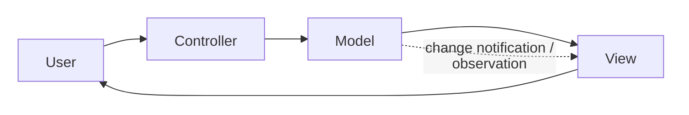
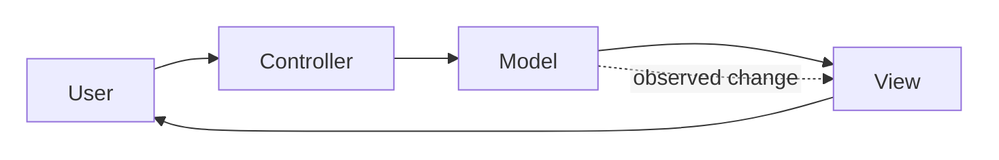
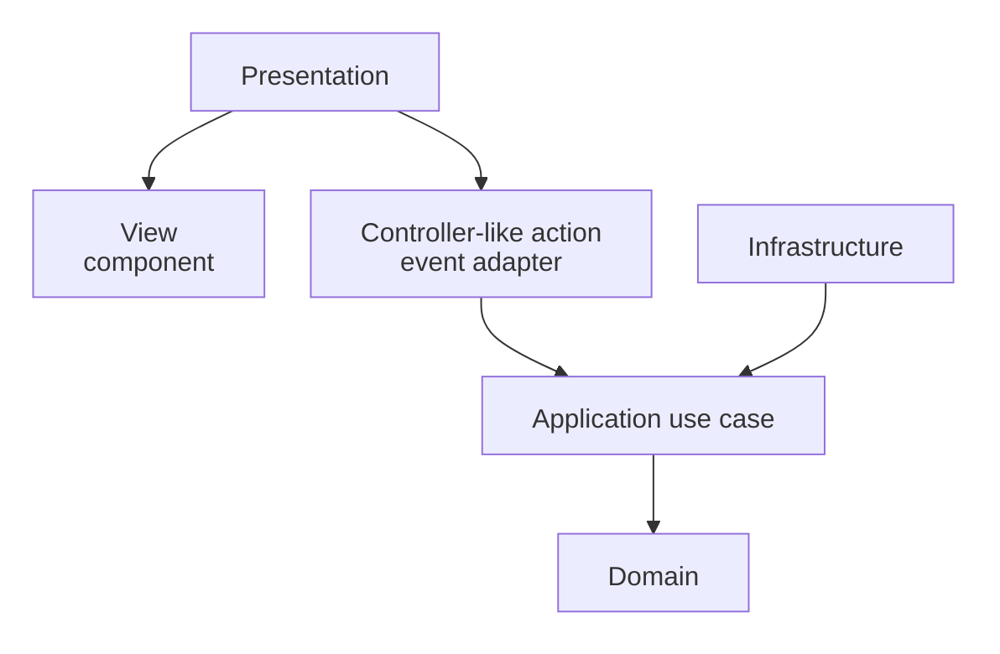
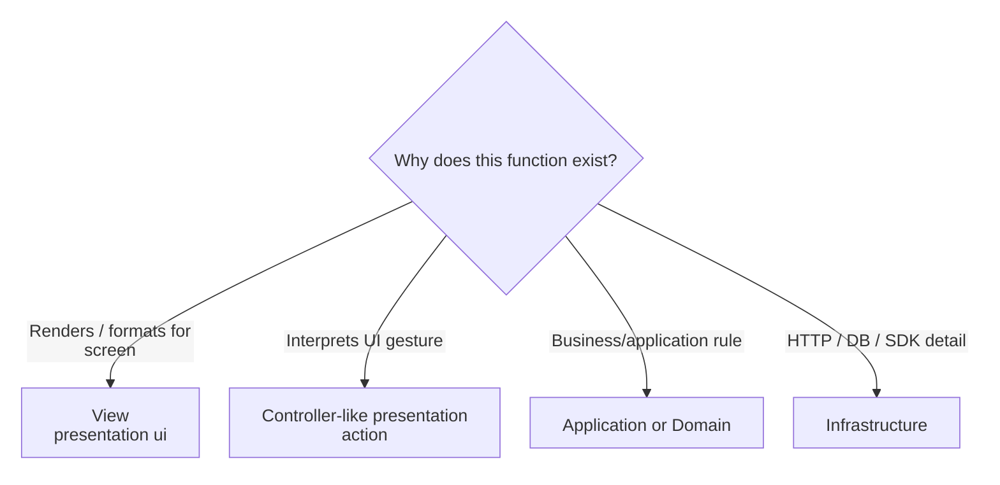

<a id="model-view-controller-for-the-frontend"></a>
<a id="read-this-first-mvc-is-a-different-kind-of-thing"></a>

# Model-View-Controller (MVC)

> A presentation pattern with a long history and many incompatible modern interpretations.

← [Repository home](../../../../README.md) · [Glossary](../../../../GLOSSARY.md) · [Code placement](../../../foundations/code-placement.md) · [Naming](../../../conventions/naming-and-file-placement.md)

A user edits an order on a screen. Separate displaying the current information, interpreting the gesture and changing the represented state; this guide explains that arrangement and where it belongs.

**Contents**

- [History and origin](#history-and-origin)
- [What problem does MVC solve?](#what-problem-does-mvc-solve)
- [Fit and cost](#fit-and-cost)
  - [When MVC is a strong fit](#when-mvc-is-a-strong-fit)
  - [When MVC is a weak fit or poor label](#when-mvc-is-a-weak-fit-or-poor-label)
- [Mental model and roles](#mental-model-and-roles)
  - [Model](#model)
  - [View](#view)
  - [Controller](#controller)
  - [Important scope rule](#important-scope-rule)
- [Practical isolation inside a layered application](#practical-isolation-inside-a-layered-application)
- [Physical structure](#physical-structure)
- [Where does a new function go?](#where-does-a-new-function-go)
- [Naming](#naming)
- [First feature end to end](#first-feature-end-to-end)
- [Testing](#testing)
- [Trade-offs and failure modes](#trade-offs-and-failure-modes)
- [Learning path](#learning-path)
- [Sources](#sources)

<a id="1-history-and-origin"></a>

## History and origin

Trygve Reenskaug developed the original [MVC](../../../../GLOSSARY.md#model-view-controller-mvc) ideas while visiting Xerox PARC in **1978–1979**. His December 1979 note *[Models](../../../../GLOSSARY.md#model)–[Views](../../../../GLOSSARY.md#view)–[Controllers](../../../../GLOSSARY.md#controller)* defined the terms Model, View and Controller for interactive user interfaces.

Original report: https://doi.org/10.5281/zenodo.3676092

The label later evolved across Smalltalk, desktop frameworks, server-side web frameworks and JavaScript libraries. "MVC" therefore has to be interpreted in context rather than treated as one universal folder layout.

<a id="2-what-problem-does-mvc-solve"></a>

## What problem does MVC solve?

Consider an order screen with a **Cancel** button. The screen must show the current status, interpret the click as a cancellation request, and update the information after the operation. If all three jobs are buried in one UI handler, it becomes difficult to change the screen or test the behavior independently.

In classic [MVC](../../../../GLOSSARY.md#model-view-controller-mvc), the **[Model](../../../../GLOSSARY.md#model)** represents the relevant information and behavior, the **[View](../../../../GLOSSARY.md#view)** displays it, and the **[Controller](../../../../GLOSSARY.md#controller)** interprets the user's action. In a classic interactive implementation, the displayed screen can observe changes to the represented information and redraw. This separation is called **[separated presentation](../../../../GLOSSARY.md#separated-presentation)**. It is about UI responsibilities, not a mandatory three-folder structure for an entire backend.

In the diagram, follow the user's action through the Controller and Model. The dotted connection indicates that the View can be notified when the represented information changes; the diagram is a conceptual interaction, not a source-import policy.



MVC does not define database architecture, application-layer [ports](../../../../GLOSSARY.md#port), deployment topology or domain boundaries. It is primarily a presentation pattern.

## Fit and cost

<a id="3-when-mvc-is-a-strong-fit"></a>

### When MVC is a strong fit

[MVC](../../../../GLOSSARY.md#model-view-controller-mvc) is useful when:

- one [Model](../../../../GLOSSARY.md#model) can drive multiple [Views](../../../../GLOSSARY.md#view);
- interpretation of user input deserves an explicit owner;
- rendering and interaction logic are becoming entangled;
- the framework being used has a genuine MVC interaction model;
- independent testing of Model/[Controller](../../../../GLOSSARY.md#controller) behavior has value.

<a id="4-when-mvc-is-a-weak-fit-or-poor-label"></a>

### When MVC is a weak fit or poor label

Avoid forcing [MVC](../../../../GLOSSARY.md#model-view-controller-mvc) onto every component framework.

It is a weak fit when:

- a framework deliberately combines input/rendering responsibilities differently;
- introducing explicit [Controllers](../../../../GLOSSARY.md#controller) adds indirection without simplifying behavior;
- "[Model](../../../../GLOSSARY.md#model)" is being used as a vague synonym for every non-UI file;
- the mapping requires redefining every MVC role merely to preserve the acronym.

Modern React/Vue/Svelte applications can apply separated-presentation ideas without literally reproducing classic Smalltalk MVC.

<a id="the-triad-in-one-picture"></a>

<a id="5-mental-model-and-roles"></a>

## Mental model and roles



### Model

Hold represented state and its behavior independently of concrete screens. An observable order model announces a change; the View can read its current values.

### View

Render the Model's values and forward gestures. The View subscribes to change notifications in the classic variant shown here. Formatting belongs to display; the order's business rule belongs to its model or the wider application's policy.

### Controller

Interpret a gesture and invoke the relevant operation. Cancelling through a Controller does not make it the owner of order validity or rendering.

<a id="a-warning-about-the-acronym"></a>

### Important scope rule

In a Clean/Onion application:

- [MVC](../../../../GLOSSARY.md#model-view-controller-mvc) [Model](../../../../GLOSSARY.md#model) does **not** automatically mean `domain/`;
- [Controller](../../../../GLOSSARY.md#controller) does **not** automatically mean an [Application](../../../../GLOSSARY.md#application-layer) [use case](../../../../GLOSSARY.md#use-case);
- [View](../../../../GLOSSARY.md#view)/Controller responsibilities usually live in [Presentation](../../../../GLOSSARY.md#presentation-layer);
- business/application policy can sit behind MVC in [Domain](../../../../GLOSSARY.md#domain)/Application.

MVC and Clean/Onion answer different questions.

<a id="6-practical-isolation-inside-a-layered-application"></a>

## Practical isolation inside a layered application

A modern layered mapping can look like this:



Why isolate the [Controller](../../../../GLOSSARY.md#controller)-like [Presentation](../../../../GLOSSARY.md#presentation-layer) action from the [use case](../../../../GLOSSARY.md#use-case)?

- user gestures change with UI design;
- application operations should survive a UI redesign;
- business [invariants](../../../../GLOSSARY.md#invariant) should survive both.

The [View](../../../../GLOSSARY.md#view) should not call an HTTP client simply because the button lives nearby if the operation contains application policy that has its own boundary.

<a id="7-physical-structure"></a>

## Physical structure

Keep the canonical `domain/`, `application/`, `infrastructure/`, `presentation/` and `composition/` layers. [MVC](../../../../GLOSSARY.md#model-view-controller-mvc) roles describe how [Presentation](../../../../GLOSSARY.md#presentation-layer) interprets gestures and renders the represented data; they do not introduce another top-level architecture.

| Exact file under `src/` | Responsibility | Keep out |
| --- | --- | --- |
| `presentation/orders/pages/OrdersPage.tsx` | Screen composition | Business rules and HTTP implementations |
| `presentation/orders/components/OrderRow/OrderRow.tsx` | [View](../../../../GLOSSARY.md#view) rendering/gesture capture | Persistence details |
| `presentation/orders/hooks/useOrderActions.ts` | [Controller](../../../../GLOSSARY.md#controller)-like action that interprets UI intent | Authoritative cancellation validity |
| `presentation/orders/state/orders.state.ts` | View/interaction state, when shared | [Domain](../../../../GLOSSARY.md#domain) [invariants](../../../../GLOSSARY.md#invariant) |
| `application/orders/use-cases/cancelOrder.ts` | Operation orchestration | React |
| `domain/orders/Order.ts` | Business rule | View controls |
| `infrastructure/http/orders/adapters/HttpOrderRepository.ts` | Outbound HTTP implementation | Rendering |
| `composition/bootstrap.ts` | Dependency assembly | Business decisions |

Presentation begins with the same capability-owned pages/components/hooks/state convention as the [canonical frontend guide](../../../frontend/README.md). These paths are handbook conventions, not a filesystem prescribed by classic MVC. The [backend guide](../../../backend/README.md) separately places incoming HTTP/CLI code.

<a id="8-where-does-a-new-function-go"></a>

## Where does a new function go?

First decide whether the function is even an [MVC](../../../../GLOSSARY.md#model-view-controller-mvc) [Presentation](../../../../GLOSSARY.md#presentation-layer) concern:



| Function | Owner | Why |
| --- | --- | --- |
| `renderOrderRow()` | [View](../../../../GLOSSARY.md#view) | display concern |
| `onCancelClick(orderId)` | [Controller](../../../../GLOSSARY.md#controller)-like Presentation action | interprets gesture |
| `cancelOrder(orderId)` | [Application](../../../../GLOSSARY.md#application-layer) | application operation |
| `Order.cancel()` | [Domain](../../../../GLOSSARY.md#domain) | business [invariant](../../../../GLOSSARY.md#invariant) |
| `requestCancelOrder()` HTTP implementation | [Infrastructure](../../../../GLOSSARY.md#infrastructure) | transport detail |

Do not create a `controllers/` folder merely because a function receives an event. The folder should exist only if Controller is a stable responsibility in the chosen UI architecture.

Types and helpers follow the same ownership rule:

| Artifact | Owner | Reason |
| --- | --- | --- |
| component props, focus helper | Presentation UI | concrete control needs |
| view state, display formatter, [facade](../../../../GLOSSARY.md#facade-pattern) hook | [Presentation model](../../../../GLOSSARY.md#presentation-model)/controller boundary | screen-oriented behavior |
| command/result and [port](../../../../GLOSSARY.md#port) | Application | operation contract |
| business value and invariant helper | Domain | authoritative business meaning |
| API [DTO](../../../../GLOSSARY.md#data-transfer-object-dto) and DTO [mapper](../../../../GLOSSARY.md#mapper) | Infrastructure | external representation |
| concrete construction | Composition | executable assembly |

Source references may point from View/Controller or [ViewModel](../../../../GLOSSARY.md#viewmodel) to their inward model/application contract. The represented [Model](../../../../GLOSSARY.md#model) must not name concrete controls. In the strict layering convention here, Presentation cannot import Infrastructure or a container; [type-only imports](../../../../GLOSSARY.md#type-only-import) count. Runtime state notifications are distinct from these source references.

<a id="9-naming"></a>

## Naming

Use **[Naming and File Placement Conventions](../../../conventions/naming-and-file-placement.md)**.

Recommended examples:

| Responsibility | Example |
| --- | --- |
| route [View](../../../../GLOSSARY.md#view) | `OrdersPage.tsx` |
| feature View | `OrderRow.tsx` |
| controller-like hook/[facade](../../../../GLOSSARY.md#facade-pattern) | `useOrderActions.ts` |
| application operation | `cancelOrder.ts` |
| [domain entity](../../../../GLOSSARY.md#domain-entity) | `Order.ts` |

Do not name an [Application](../../../../GLOSSARY.md#application-layer) [use case](../../../../GLOSSARY.md#use-case) `OrderController` merely because the UI invokes it. Names should expose the role actually owned by the file.

<a id="10-first-feature-end-to-end"></a>

## First feature end to end

A clerk clicks Cancel. The Controller interprets the gesture, the Model updates screen state around an [Application](../../../../GLOSSARY.md#application-layer) operation, and the View observes that Model. This is an observer-based MVC variant.

```ts
// presentation/orders/state/CancellationModel.ts
export class CancellationModel {
  message = ''
  private readonly listeners = new Set<() => void>()
  constructor(private readonly cancelOrder: (id: string) => Promise<void>) {}

  subscribe(listener: () => void) {
    this.listeners.add(listener)
    return () => { this.listeners.delete(listener) }
  }
  private notify() { this.listeners.forEach(listener => listener()) }

  async cancel(id: string) {
    try {
      await this.cancelOrder(id)
      this.message = 'Order cancelled'
    } catch {
      this.message = 'Cancellation failed'
    }
    this.notify()
  }
}

// presentation/orders/components/OrderView/OrderView.ts
export class OrderView {
  constructor(
    private readonly model: CancellationModel,
    private readonly renderMessage: (message: string) => void,
  ) {}
  bind() {
    const render = () => this.renderMessage(this.model.message)
    render()
    return this.model.subscribe(render)
  }
}

// presentation/orders/components/OrderView/OrderController.ts
export class OrderController {
  constructor(private readonly model: CancellationModel) {}
  onCancel(id: string) { return this.model.cancel(id) }
}
```

Assembly supplies the operation and renderer, binds the View, and connects the button gesture to `onCancel`. It calls the returned unsubscribe function when the View is removed. The Controller knows the Model; the View reads the Model and observes its changes.

The [cancellation example](../../../styles/clean-architecture/4-building-a-feature.md) owns business and persistence code. MVC adds gesture interpretation and display coordination. Class definitions are combined here to keep the interaction visible.

<a id="complete-implementation"></a>

<a id="11-testing"></a>

## Testing

| Scope | Test | Why |
| --- | --- | --- |
| [Model](../../../../GLOSSARY.md#model)/domain behavior | pure unit test | no UI required |
| [Controller](../../../../GLOSSARY.md#controller)-like [Presentation](../../../../GLOSSARY.md#presentation-layer) action | [fake](../../../../GLOSSARY.md#fake) application operation | verifies gesture → semantic operation |
| [View](../../../../GLOSSARY.md#view) | component/render test | verifies rendering and event forwarding |
| [Application](../../../../GLOSSARY.md#application-layer)/[Infrastructure](../../../../GLOSSARY.md#infrastructure) | test according to their architecture | outside [MVC](../../../../GLOSSARY.md#model-view-controller-mvc)'s own scope |
| End-to-end | critical user flow | verifies complete integration |

See **[Testing in MVC](4-testing-in-mvc.md)** for the deeper treatment.

<a id="12-trade-offs-and-failure-modes"></a>

## Trade-offs and failure modes

Common decay modes:

- **fat [Controller](../../../../GLOSSARY.md#controller)** — business rules accumulate in input handlers;
- **fat [View](../../../../GLOSSARY.md#view)** — networking/workflow policy sits inside rendering code;
- **everything is [Model](../../../../GLOSSARY.md#model)** — the term loses architectural meaning;
- **framework relabeling** — React/Vue/Svelte mechanics are renamed [MVC](../../../../GLOSSARY.md#model-view-controller-mvc) without matching responsibilities;
- **duplicate orchestration** — Controllers reimplement [Application](../../../../GLOSSARY.md#application-layer) [use cases](../../../../GLOSSARY.md#use-case).

MVC is useful only when the role separation makes ownership clearer than the framework's simpler native structure.

<a id="contents"></a>

<a id="where-to-start"></a>

<a id="13-learning-path"></a>

## Learning path

1. **[The Three Parts](1-the-three-parts.md)**
2. **[The Flow](2-the-flow.md)**
3. **[MVC on the Frontend](3-mvc-on-the-frontend.md)**
4. **[Testing](4-testing-in-mvc.md)**

For cross-layer placement, continue with **[Code Placement](../../../foundations/code-placement.md)** and one of the whole-application architecture guides.

## Sources

- Trygve Reenskaug, *[Models](../../../../GLOSSARY.md#model)–[Views](../../../../GLOSSARY.md#view)–[Controllers](../../../../GLOSSARY.md#controller)* (1979): https://doi.org/10.5281/zenodo.3676092
- Martin Fowler, *GUI Architectures*: https://martinfowler.com/eaaDev/uiArchs.html
- Martin Fowler, *[Presentation Model](../../../../GLOSSARY.md#presentation-model)*: https://martinfowler.com/eaaDev/PresentationModel.html
