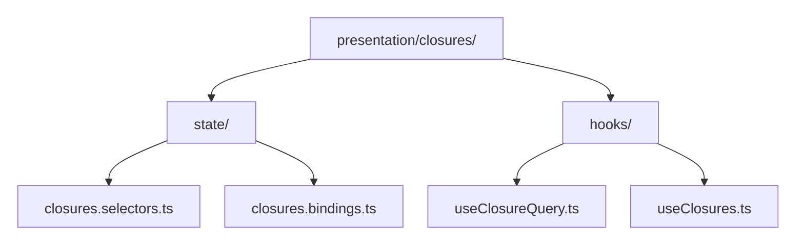
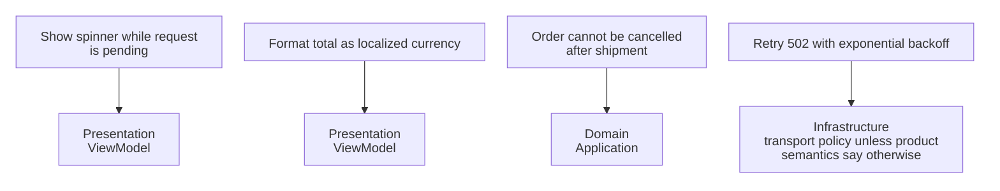
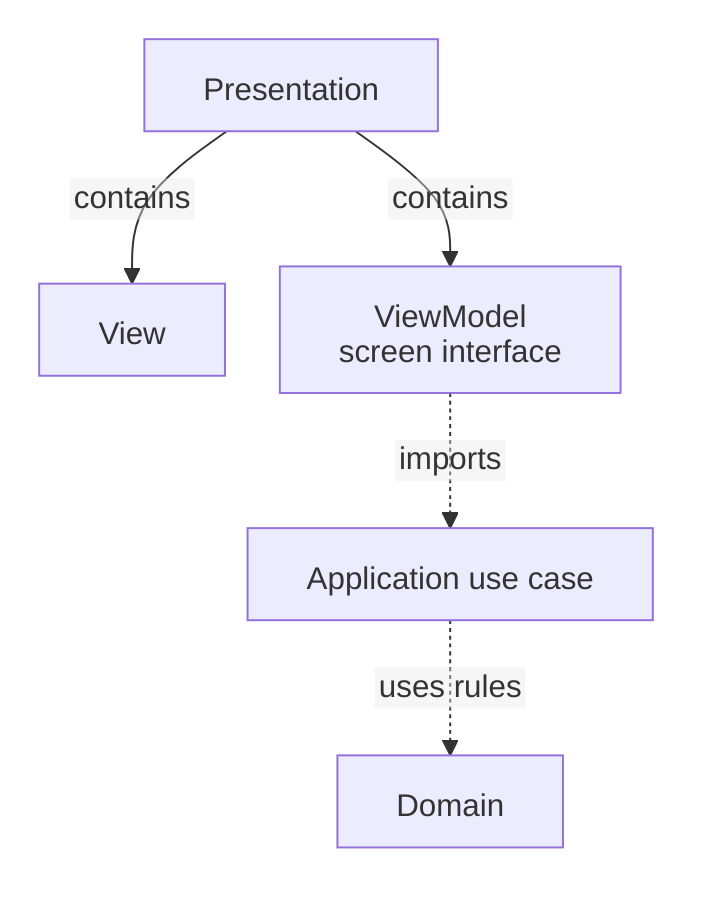

> **[Model-View-ViewModel](README.md)** › [MVVM](../../../../GLOSSARY.md#model-view-viewmodel-mvvm) on the Frontend. Full reference list: [References](references.md).

<a id="3-mvvm-on-the-frontend"></a>

# MVVM on the Frontend

In a React ticket screen, a component might display `isSaving` and call `submit()`. A deliberately designed `useTickets()` can supply those screen-specific values and operations while another part handles the ticket-creation rule. That arrangement resembles a [ViewModel](../../../../GLOSSARY.md#viewmodel) and [View](../../../../GLOSSARY.md#view) separation; a random hook that only wraps `useState` does not automatically establish it.

Modern component frameworks provide reactive rendering mechanisms that can help with such separation, but they do not select [MVVM](../../../../GLOSSARY.md#model-view-viewmodel-mvvm) for you. This chapter maps MVVM/[Presentation Model](../../../../GLOSSARY.md#presentation-model) responsibilities onto a frontend without equating every [store](../../../../GLOSSARY.md#store) or hook with a ViewModel.

---

A screen interface may also act as a Facade when it deliberately simplifies collaboration among several subsystem objects. The Hook name alone establishes neither pattern; compare the [independent Facade example](../../structural/facade/README.md).

**Contents**

- [The honest mapping](#the-honest-mapping)
- [The failure mode: the fat ViewModel](#the-failure-mode-the-fat-viewmodel)
- [How MVVM sits inside Onion and Clean](#how-mvvm-sits-inside-onion-and-clean)
- [Related implementations in the wild](#related-implementations-in-the-wild)
- [Sources](#sources)

<a id="31-the-honest-mapping"></a>

## The honest mapping

A useful mapping in a layered frontend is:

| [MVVM](../../../../GLOSSARY.md#model-view-viewmodel-mvvm) role | Possible frontend owner |
| --- | --- |
| [View](../../../../GLOSSARY.md#view) | component render/template + strictly local rendering behavior |
| [ViewModel](../../../../GLOSSARY.md#viewmodel) | feature [facade](../../../../GLOSSARY.md#facade-pattern)/[custom hook](../../../../GLOSSARY.md#custom-hook)/composable/state holder exposing view-oriented state + operations |
| [Model](../../../../GLOSSARY.md#model) | application/domain capabilities consumed behind the ViewModel; not necessarily one object |

The mapping is role-based, not class-based.

A ViewModel can be distributed across a small set of [Presentation](../../../../GLOSSARY.md#presentation-layer) modules when ownership remains clear:



Arrows mean containment. State owns derivation/bindings; hooks compose view-facing operations. The [canonical frontend structure](../../../frontend/README.md) supplies the other capability folders from the start.

The public facade is what the View depends on.

Signature/ownership excerpt: surrounding row/input types and the state/action bindings are assumed, rather than a complete implementation.

Example:

```ts
export interface ClosuresViewModel {
  readonly rows: readonly ClosureRow[]
  readonly busy: boolean
  readonly error: string | null

  query(input: QueryInput): Promise<void>
  reset(): void
}

export function useClosures(): ClosuresViewModel {
  const state = useClosuresState()
  const actions = useClosuresActions()

  return {
    rows: state.rows,
    busy: state.busy,
    error: state.error,
    query: actions.query,
    reset: actions.reset,
  }
}
```

A React hook has not become a ViewModel merely because its name starts with `use`. It fills that role when it intentionally presents state/operations for a View while hiding lower-level mechanisms.

---

<a id="32-the-failure-mode-the-fat-viewmodel"></a>

## The failure mode: the fat ViewModel

The [ViewModel](../../../../GLOSSARY.md#viewmodel) is a convenient place to put logic, which makes it a common coupling hotspot.

Warning signs:

- authoritative pricing/eligibility rules live in [selectors](../../../../GLOSSARY.md#selector);
- HTTP response codes are interpreted throughout the hook;
- storage and transport clients are imported directly;
- unrelated workflows accumulate in one huge `useFeature()`;
- state-library action mechanics leak through the [public API](../../../../GLOSSARY.md#public-api).

Ask:

> Does this behavior exist because of the screen, or because of the business/application?

Examples:



A large public [facade](../../../../GLOSSARY.md#facade-pattern) can remain useful while internal responsibilities are split into focused hooks/modules.

---

<a id="33-how-mvvm-sits-inside-onion-and-clean"></a>

## How MVVM sits inside Onion and Clean

[MVVM](../../../../GLOSSARY.md#model-view-viewmodel-mvvm) and Clean/Onion answer different questions.

MVVM:

> **MVVM question:** How is presentation state/behavior separated from rendering?

Clean/Onion:

> **Clean/Onion question:** How do application/domain policies depend on external mechanisms?

A strict layered mapping can be:



[Infrastructure](../../../../GLOSSARY.md#infrastructure) implements [ports](../../../../GLOSSARY.md#port) required inward and is wired at composition.

That does **not** mean an MVVM command must always be exactly one use-case call. A [ViewModel](../../../../GLOSSARY.md#viewmodel) can coordinate UI-only concerns around an application operation. The boundary is semantic: business/application policy stays inward; view behavior stays in [Presentation](../../../../GLOSSARY.md#presentation-layer).

Likewise, not every application needs an explicit use-case layer. This repository adds one when following Clean/Onion because those architectural styles require a place for application policy; MVVM alone does not.

See **[Frontend Architecture](../../../frontend/README.md)** for the repository's current feature/state organization guidance.

---

<a id="34-the-pattern-in-the-wild"></a>

<a id="34-related-implementations-in-the-wild"></a>

## Related implementations in the wild

The following ecosystems use concepts compatible with [MVVM](../../../../GLOSSARY.md#model-view-viewmodel-mvvm) or [Presentation Model](../../../../GLOSSARY.md#presentation-model), but they should not be used to claim all modern UI frameworks "are MVVM":

- **Microsoft/.NET UI** has explicit MVVM guidance and a long MVVM lineage.
- **Android** recommends UI state holders such as `ViewModel` and unidirectional data flow. This is compatible with MVVM-like separation but Android's architecture guidance is broader than one historical pattern name.
- **Airbnb Mavericks** uses immutable state + [ViewModel](../../../../GLOSSARY.md#viewmodel) concepts on Android.
- **Vue** historically documents MVVM inspiration while explicitly saying Vue is not strictly associated with MVVM.

The engineering takeaway is the recurring separation of rendering from testable state/behavior—not a need to relabel every framework architecture MVVM.

---

Next: **[Testing in MVVM](4-testing-in-mvvm.md)**.

## Sources

- Martin Fowler, "[Presentation Model](../../../../GLOSSARY.md#presentation-model)": https://martinfowler.com/eaaDev/PresentationModel.html
- Martin Fowler, "GUI Architectures": https://martinfowler.com/eaaDev/uiArchs.html
- Vue 2 documentation, instance/[MVVM](../../../../GLOSSARY.md#model-view-viewmodel-mvvm) note: https://v2.vuejs.org/v2/guide/instance.html
