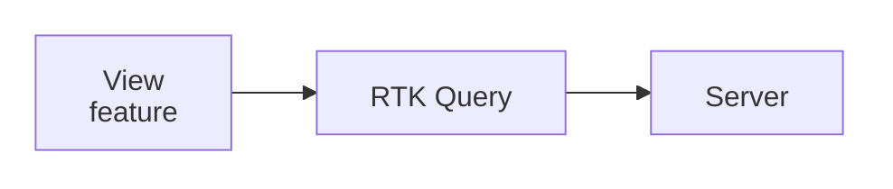
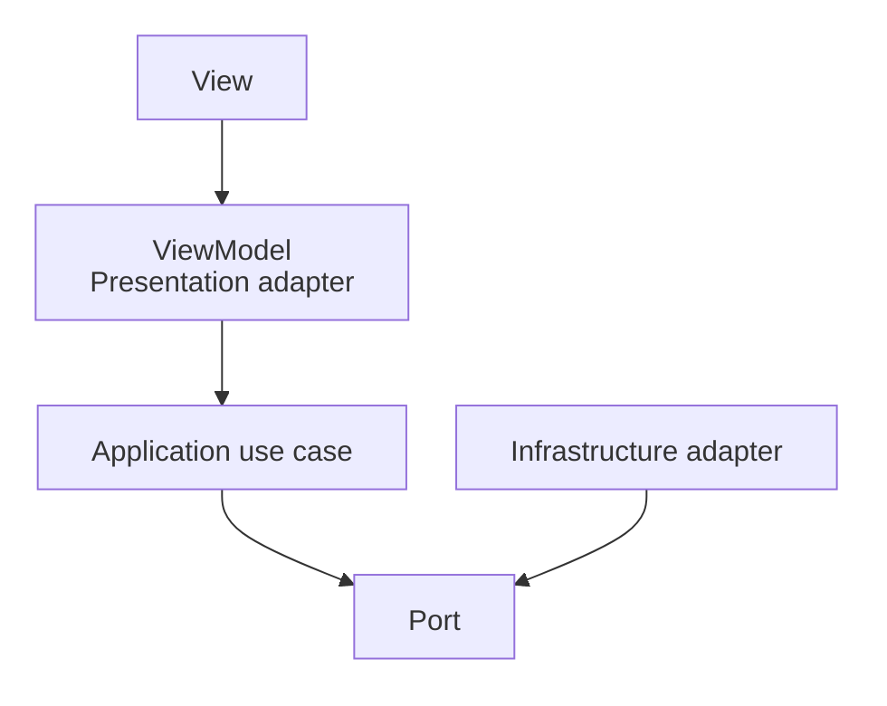
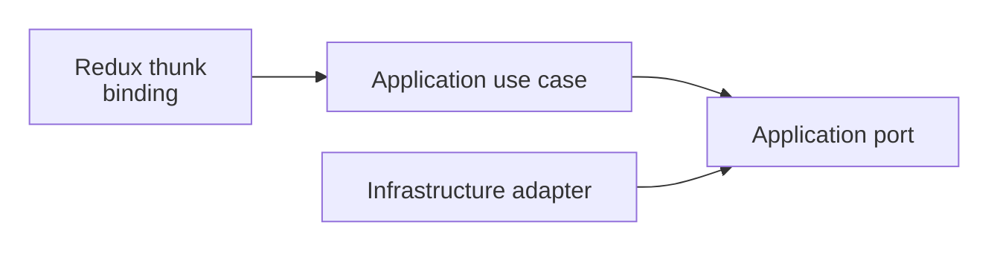

> **[Model-View-ViewModel](README.md)** › [MVVM](../../../../GLOSSARY.md#model-view-viewmodel-mvvm) in React + Redux Toolkit. Full reference list: [References](references.md).

<a id="5-mvvm-in-react--redux-toolkit"></a>

# MVVM in React + Redux Toolkit

Suppose `OrdersPage` needs only `rows`, `isSaving` and `cancelOrder()`. It should not necessarily know which Redux action was dispatched or how the asynchronous request was stored. A public `useOrders()` hook can expose those screen-level values and actions while hiding the internal Redux mechanics.

This is **one optional [ViewModel](../../../../GLOSSARY.md#viewmodel)-style [Presentation](../../../../GLOSSARY.md#presentation-layer) [facade](../../../../GLOSSARY.md#facade-pattern)**. React and Redux Toolkit do not prescribe [MVVM](../../../../GLOSSARY.md#model-view-viewmodel-mvvm), and the extra layer is useful only when that separation solves a concrete maintenance or testing problem.

For the repository's current Redux guidance, also read **[State Management and Side Effects](../../../frontend/state-management.md)**.

---

**Contents**

- [The mapping, in RTK vocabulary](#the-mapping-in-rtk-vocabulary)
- [RTK Query and the infrastructure seam](#rtk-query-and-the-infrastructure-seam)
  - [Server-state dominant query](#server-state-dominant-query)
  - [Policy-bearing operation](#policy-bearing-operation)
- [The use-case layer is added by Clean/Onion, not Redux or MVVM](#the-use-case-layer-is-added-by-cleanonion-not-redux-or-mvvm)
- [Selectors reshape Presentation state](#selectors-reshape-presentation-state)
- [Public facade example](#public-facade-example)
- [Do not force everything through Redux](#do-not-force-everything-through-redux)
- [Sources](#sources)

<a id="51-the-mapping-in-rtk-vocabulary"></a>

## The mapping, in RTK vocabulary

A possible mapping:

| [MVVM](../../../../GLOSSARY.md#model-view-viewmodel-mvvm) role | React/Redux owner |
| --- | --- |
| [View](../../../../GLOSSARY.md#view) | [React component](../../../../GLOSSARY.md#react-component) rendering + local rendering concerns |
| [ViewModel](../../../../GLOSSARY.md#viewmodel) [facade](../../../../GLOSSARY.md#facade-pattern) | feature hook such as `useClosures()` |
| shared view state | Redux slice + [selectors](../../../../GLOSSARY.md#selector) |
| binding | React Redux subscriptions/hooks, hidden or exposed according to project policy |
| [Model](../../../../GLOSSARY.md#model)/[Application](../../../../GLOSSARY.md#application-layer) | inner application/domain modules where the chosen architecture defines them |

This is not the only valid Redux architecture.

Redux's official guidance commonly allows components to use typed Redux hooks directly. Hiding Redux behind a feature facade is a **stricter project boundary** that can be valuable when framework replaceability/test seams justify it.

---

<a id="52-rtk-query-sits-at-the-infrastructure-seam"></a>


<a id="52-rtk-query-and-the-infrastructure-seam"></a>

## RTK Query and the infrastructure seam

[RTK Query](../../../../GLOSSARY.md#rtk-query) is Redux Toolkit's [server-state](../../../../GLOSSARY.md#server-state) fetching/caching solution.

Its architectural placement depends on what the operation means.

### Server-state dominant query

If a [View](../../../../GLOSSARY.md#view) mainly needs cached remote data, invalidation and re-fetching:



may be entirely appropriate.

### Policy-bearing operation

If the operation contains application policy or must remain transport-independent:



Do not label [RTK Query](../../../../GLOSSARY.md#rtk-query) universally "[Infrastructure](../../../../GLOSSARY.md#infrastructure)" merely because it performs HTTP. Its generated hooks and cache participate directly in Redux/[Presentation](../../../../GLOSSARY.md#presentation-layer), while endpoint definitions contain transport knowledge. In a strict layered system you may wrap or isolate that transport knowledge; in a simpler application you may intentionally keep the query mechanism in Presentation.

Document the chosen boundary.

---

<a id="53-the-use-case-layer-is-added-not-inherited"></a>

<a id="53-the-use-case-layer-is-added-by-cleanonion-not-redux-or-mvvm"></a>

## The use-case layer is added by Clean/Onion, not Redux or MVVM

Redux Toolkit does not require an [Application layer](../../../../GLOSSARY.md#application-layer). [MVVM](../../../../GLOSSARY.md#model-view-viewmodel-mvvm) does not require one either.

A Clean/Onion project may deliberately add:



because application policy deserves an independent boundary.

For a simple UI-only state transition, Redux can handle it directly without inventing a [use case](../../../../GLOSSARY.md#use-case).

The rule is proportionality.

---

<a id="54-selectors-are-where-reshape-lives"></a>

<a id="54-selectors-reshape-presentation-state"></a>

## Selectors reshape Presentation state

[Selectors](../../../../GLOSSARY.md#selector) are appropriate for derived state:

```ts
export const selectVisibleOrders = createSelector(
  [selectOrders, selectFilters],
  (orders, filters) => filterOrders(orders, filters),
)
```

Keep business [invariants](../../../../GLOSSARY.md#invariant) out of selectors.

Good selector logic:

- filtering for display;
- sorting for display;
- aggregate counts for a dashboard;
- UI flags derived from stored state.

Move authoritative business rules inward when they must be consistent across interfaces.

---

<a id="55-the-31-example-restated"></a>

<a id="55-public-facade-example"></a>

## Public facade example

A strict [ViewModel](../../../../GLOSSARY.md#viewmodel)-style boundary excerpt; `useOrdersState` and `useOrdersActions` are existing feature bindings with semantic result contracts:

```ts
export function useOrders() {
  const state = useOrdersState()
  const actions = useOrdersActions()

  return {
    rows: state.visibleRows,
    busy: state.busy,
    cancel: actions.cancel,
  }
}
```

`useOrdersActions()` can convert Redux-specific action outcomes into semantic results:

```ts
type Result<T, E> =
  | { ok: true; value: T }
  | { ok: false; error: E }
```

The [View](../../../../GLOSSARY.md#view) should not need `cancelOrderThunk.fulfilled.match(...)` if the [facade](../../../../GLOSSARY.md#facade-pattern)'s purpose is to hide Redux.

---

<a id="56-testing-the-rtk-dividend-and-one-react-tax"></a>

<a id="56-do-not-force-everything-through-redux"></a>

## Do not force everything through Redux

Local component state remains appropriate for:

- modal open/closed;
- hover/focus;
- temporary text input;
- state used by one component subtree.

Redux recommends keeping [global state](../../../../GLOSSARY.md#global-state) minimal and deriving values where possible.

A [ViewModel](../../../../GLOSSARY.md#viewmodel) [facade](../../../../GLOSSARY.md#facade-pattern) may compose local React state and Redux-backed feature state without pretending they are the same ownership scope.

## Sources

- Redux Style Guide: https://redux.js.org/style-guide/
- Redux Toolkit, [RTK Query](../../../../GLOSSARY.md#rtk-query): https://redux-toolkit.js.org/rtk-query/overview
- React Redux hooks: https://react-redux.js.org/api/hooks
- Martin Fowler, [Presentation Model](../../../../GLOSSARY.md#presentation-model): https://martinfowler.com/eaaDev/PresentationModel.html
