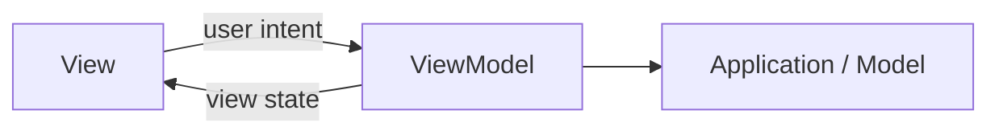
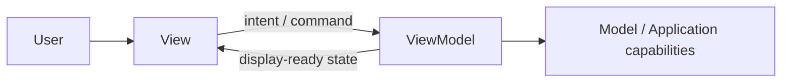
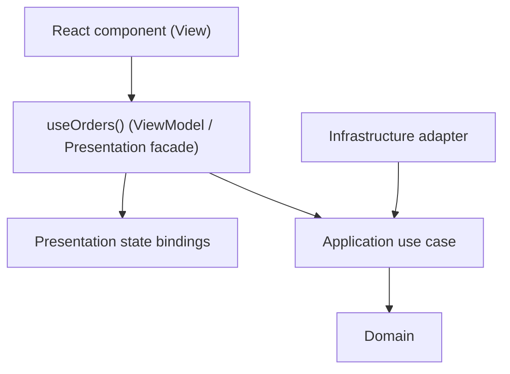
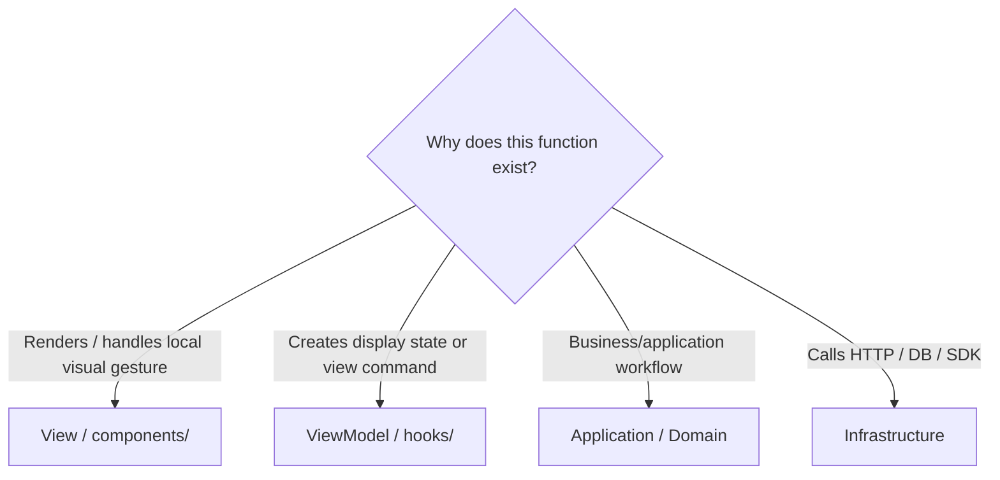

<a id="model-view-viewmodel-for-the-frontend"></a>
<a id="read-this-first-mvvm-is-mvcs-direct-descendant"></a>

# Model-View-ViewModel (MVVM)

> A presentation pattern that separates rendering from view-oriented state and behavior.

← [Repository home](../../../../README.md) · [Glossary](../../../../GLOSSARY.md) · [Code placement](../../../foundations/code-placement.md) · [Naming](../../../conventions/naming-and-file-placement.md) · [Frontend architecture](../../../frontend/README.md)

## 1. History and origin

Martin Fowler described **[Presentation Model](../../../../GLOSSARY.md#presentation-model)** in 2004: an abstraction that contains a [View](../../../../GLOSSARY.md#view)'s state and behavior while remaining independent of concrete UI controls.

In **2005**, John Gossman introduced the [MVVM](../../../../GLOSSARY.md#model-view-viewmodel-mvvm) name in the WPF ecosystem, describing a variation of [MVC](../../../../GLOSSARY.md#model-view-controller-mvc) tailored to declarative UI and binding.

Sources:

- https://martinfowler.com/eaaDev/PresentationModel.html
- https://learn.microsoft.com/en-us/archive/msdn-magazine/2009/february/patterns-wpf-apps-with-the-model-view-viewmodel-design-pattern

## 2. What problem does MVVM solve?

Imagine an Orders screen with a **Cancel** button. It must show the current status, disable the button while saving, and display a useful error if the operation fails. Putting all this [state management](../../../../GLOSSARY.md#state-management) inside the component that draws buttons and text makes the screen hard to test without rendering it.

A **[View](../../../../GLOSSARY.md#view)** is the rendering part: it shows values and forwards user actions. A **[ViewModel](../../../../GLOSSARY.md#viewmodel)** holds the information prepared for that screen—such as `isSaving`, `errorMessage`, and a `cancel()` operation—without referencing the actual button or HTML element. The **[Model](../../../../GLOSSARY.md#model)** is the underlying data and application behavior needed by that screen. Connecting these parts is the purpose of [MVVM](../../../../GLOSSARY.md#model-view-viewmodel-mvvm).

Without that separation, stateful UI code easily mixes:


- rendering;
- loading/error state;
- formatting;
- commands;
- presentation validation;
- subscriptions;
- application/business rules;
- transport calls.

MVVM separates the rendering surface from the state and behavior needed by that rendering surface.



MVVM does not define persistence architecture, domain boundaries, transport [adapters](../../../../GLOSSARY.md#adapter) or deployment.

## 3. When MVVM is a strong fit

It is useful for:

- rich stateful screens;
- UI behavior that benefits from headless tests;
- several UI elements sharing one view-oriented state holder;
- declarative/reactive frameworks where rendering can bind to a stable view contract;
- complex forms/workflows where rendering should stay comparatively simple.

## 4. When MVVM is weak or unnecessary

A dedicated [ViewModel](../../../../GLOSSARY.md#viewmodel) can be overhead when:

- the screen is tiny;
- UI state is trivial and local component state is clearer;
- the ViewModel only forwards values without adding a boundary;
- the ViewModel becomes a generic service containing unrelated features.

React, Vue and Svelte do **not** become [MVVM](../../../../GLOSSARY.md#model-view-viewmodel-mvvm) merely because they are reactive.

<a id="the-triad-in-one-picture"></a>

## 5. Mental model and roles



| Role | Owns | Put here | Do not put here |
| --- | --- | --- | --- |
| [View](../../../../GLOSSARY.md#view) | rendering and user gestures | component/template, local visual state | authoritative business rules, transport clients |
| [ViewModel](../../../../GLOSSARY.md#viewmodel) | view-oriented state and behavior | loading flags, display derivation, commands/[facade](../../../../GLOSSARY.md#facade-pattern), UI-specific orchestration | database/HTTP implementations, business [invariants](../../../../GLOSSARY.md#invariant) |
| [Model](../../../../GLOSSARY.md#model) | non-View application/domain capabilities | domain/application state and operations according to the wider architecture | concrete View controls |

"Model" is overloaded. In a Clean/Onion application it is not automatically identical to `domain/`.

<a id="a-warning-about-the-word-viewmodel"></a>

## 6. Isolation in a layered React application

This repository uses a [ViewModel](../../../../GLOSSARY.md#viewmodel)-like **public feature [facade](../../../../GLOSSARY.md#facade-pattern)** when a screen is complex enough to justify it:



Why isolate it?

- [React components](../../../../GLOSSARY.md#react-component) can change without rewriting application policy;
- Redux/Zustand/other [store](../../../../GLOSSARY.md#store) mechanics can stay behind a semantic feature API;
- UI-specific derived state can be tested without DOM rendering;
- [Application](../../../../GLOSSARY.md#application-layer)/[Domain](../../../../GLOSSARY.md#domain) never need to know React.

A hook is a ViewModel only when it intentionally exposes a view contract. The `use` prefix alone does not create the architectural role.

## 7. Physical structure

Keep the five canonical layers. A hook can expose a [ViewModel](../../../../GLOSSARY.md#viewmodel) while the state it composes stays in the same [Presentation](../../../../GLOSSARY.md#presentation-layer) capability:

| Exact file under `src/` | Responsibility | Keep out |
| --- | --- | --- |
| `presentation/orders/pages/OrdersPage.tsx` | Screen composition | Business policy |
| `presentation/orders/components/OrderList/OrderList.tsx` | [View](../../../../GLOSSARY.md#view) rendering | HTTP clients |
| `presentation/orders/hooks/useOrders.ts` | ViewModel contract and view-facing operations | Concrete [Infrastructure](../../../../GLOSSARY.md#infrastructure) |
| `presentation/orders/state/orders.selectors.ts` | Derived display state | Authoritative domain decisions |
| `presentation/orders/state/orders.bindings.ts` | State-library result translation, when needed | Concrete HTTP implementation |
| `presentation/orders/formatters/formatOrderTotal.ts` | Display formatting | Unrelated helper code |
| `presentation/orders/index.ts` | Intentional [public API](../../../../GLOSSARY.md#public-api) | Automatic export of all internals |
| `application/orders/use-cases/cancelOrder.ts` | Workflow | React/Redux |
| `domain/orders/Order.ts` | Business meaning | View state |

The [frontend guide](../../../frontend/README.md) owns the complete pages/components/hooks/state convention, used from the first capability. Files are added only when needed. [MVVM](../../../../GLOSSARY.md#model-view-viewmodel-mvvm) does not prescribe their spelling; a `use` prefix does not by itself make a hook a ViewModel.

## 8. Where does a new function go?



Examples:

| Function/type | Owner |
| --- | --- |
| `formatTotalForScreen()` | [ViewModel](../../../../GLOSSARY.md#viewmodel)/[Presentation](../../../../GLOSSARY.md#presentation-layer) helper |
| `isSaving` derived flag | ViewModel/[selector](../../../../GLOSSARY.md#selector) |
| `cancel()` command exposed to the [View](../../../../GLOSSARY.md#view) | ViewModel [facade](../../../../GLOSSARY.md#facade-pattern) |
| `cancelOrder(id)` workflow | [Application](../../../../GLOSSARY.md#application-layer) |
| `Order.cancel()` [invariant](../../../../GLOSSARY.md#invariant) | [Domain](../../../../GLOSSARY.md#domain) |
| HTTP request implementation | [Infrastructure](../../../../GLOSSARY.md#infrastructure) |

Do not move business rules into the ViewModel merely because they are easy to express as a computed/selector.

Types and helpers follow the same ownership rule:

| Artifact | Owner | Reason |
| --- | --- | --- |
| component props, focus helper | Presentation UI | concrete control needs |
| view state, display formatter, facade hook | [Presentation model](../../../../GLOSSARY.md#presentation-model)/controller boundary | screen-oriented behavior |
| command/result and [port](../../../../GLOSSARY.md#port) | Application | operation contract |
| business value and invariant helper | Domain | authoritative business meaning |
| API [DTO](../../../../GLOSSARY.md#data-transfer-object-dto) and DTO [mapper](../../../../GLOSSARY.md#mapper) | Infrastructure | external representation |
| concrete construction | Composition | executable assembly |

Source references may point from View/[Controller](../../../../GLOSSARY.md#controller) or ViewModel to their inward model/application contract. The represented [Model](../../../../GLOSSARY.md#model) must not name concrete controls. In the strict layering convention here, Presentation cannot import Infrastructure or a container; [type-only imports](../../../../GLOSSARY.md#type-only-import) count. Runtime state notifications are distinct from these source references.

## 9. Naming

Use **[Naming and File Placement Conventions](../../../conventions/naming-and-file-placement.md)**.

For React specifically, official React guidance requires:

- component names to start with a capital letter;
- [custom Hook](../../../../GLOSSARY.md#custom-hook) names to start with `use` followed by a capitalized word.

Recommended examples:

| Role | Example |
| --- | --- |
| [View](../../../../GLOSSARY.md#view) | `OrdersPage.tsx`, `OrderRow.tsx` |
| public [ViewModel](../../../../GLOSSARY.md#viewmodel) hook | `useOrders.ts` |
| [selector](../../../../GLOSSARY.md#selector) | `orders.selectors.ts` |
| state binding | `orders.bindings.ts` |
| application operation | `cancelOrder.ts` |

The suffixes such as `.selectors.ts` are documentation conventions, not React or [MVVM](../../../../GLOSSARY.md#model-view-viewmodel-mvvm) requirements.

## 10. First feature end to end

The screen displays progress and a message while Application cancels an order. A ViewModel exposes that screen state and its command; the View binds to the state.

```ts
// presentation/orders/state/CancelOrderViewModel.ts
export class CancelOrderViewModel {
  busy = false
  message = ''
  constructor(
    private readonly cancelOrder: (id: string) => Promise<void>,
    private readonly changed: () => void,
  ) {}

  async cancel(id: string) {
    this.busy = true
    this.changed()
    try {
      await this.cancelOrder(id)
      this.message = 'Order cancelled'
    } catch {
      this.message = 'Cancellation failed'
    } finally {
      this.busy = false
      this.changed()
    }
  }
}
```

Binding supplies a `changed` callback that renders the ViewModel's current state and connects the button to `cancel(id)`. The ViewModel knows no DOM controls. A React hook can expose the same state/command relationship.

The [shared cancellation example](../../../styles/clean-architecture/4-building-a-feature.md) owns the application/domain mechanism. MVVM adds state exposure and binding.

<a id="complete-implementation-with-an-explicit-viewmodel"></a>

## 11. Testing

| Scope | What to test |
| --- | --- |
| [ViewModel](../../../../GLOSSARY.md#viewmodel) | view state derivation, commands, result mapping without DOM where possible |
| [View](../../../../GLOSSARY.md#view) | rendering and gesture forwarding |
| [Application](../../../../GLOSSARY.md#application-layer)/[Domain](../../../../GLOSSARY.md#domain) | policy independently of [MVVM](../../../../GLOSSARY.md#model-view-viewmodel-mvvm) |
| [Infrastructure](../../../../GLOSSARY.md#infrastructure) | transport/persistence independently of MVVM |
| End-to-end | critical user journey |

The point of a ViewModel boundary is that presentation behavior can be tested without needing concrete UI controls.

See **[Testing in MVVM](4-testing-in-mvvm.md)**.

## 12. Trade-offs and failure modes

Costs:

- another abstraction between [View](../../../../GLOSSARY.md#view) and application/model;
- possible duplication between local component state and [ViewModel](../../../../GLOSSARY.md#viewmodel) state;
- temptation to move every operation into one [facade](../../../../GLOSSARY.md#facade-pattern).

Common failures:

- **God ViewModel** — unrelated workflows accumulate in one hook/class;
- **domain leakage** — business [invariants](../../../../GLOSSARY.md#invariant) move into [selectors](../../../../GLOSSARY.md#selector)/computed values;
- **transport leakage** — HTTP/SDK status codes become the ViewModel's public language;
- **[store](../../../../GLOSSARY.md#store) leakage** — components must understand Redux actions/[thunk](../../../../GLOSSARY.md#thunk) lifecycle even though the ViewModel is supposed to hide them;
- **pass-through ViewModel** — an abstraction exists but adds no useful ownership boundary;
- **framework relabeling** — every React hook is called a ViewModel regardless of responsibility.

<a id="contents"></a>

<a id="where-to-start"></a>

## 13. Learning path

1. **[The Three Parts](1-the-three-parts.md)**
2. **[Binding](2-the-binding.md)**
3. **[MVVM on the Frontend](3-mvvm-on-the-frontend.md)**
4. **[Testing](4-testing-in-mvvm.md)**
5. **[React + Redux Toolkit](5-mvvm-in-react-redux.md)**

For broader frontend feature/state organization, continue with **[Frontend Architecture](../../../frontend/README.md)**.

## Sources

- Martin Fowler, *[Presentation Model](../../../../GLOSSARY.md#presentation-model)*: https://martinfowler.com/eaaDev/PresentationModel.html
- Martin Fowler, *GUI Architectures*: https://martinfowler.com/eaaDev/uiArchs.html
- Microsoft, *WPF Apps With The [Model-View-ViewModel](../../../../GLOSSARY.md#model-view-viewmodel-mvvm) Design Pattern*: https://learn.microsoft.com/en-us/archive/msdn-magazine/2009/february/patterns-wpf-apps-with-the-model-view-viewmodel-design-pattern
- React, [custom Hook](../../../../GLOSSARY.md#custom-hook) naming: https://react.dev/learn/reusing-logic-with-custom-hooks
