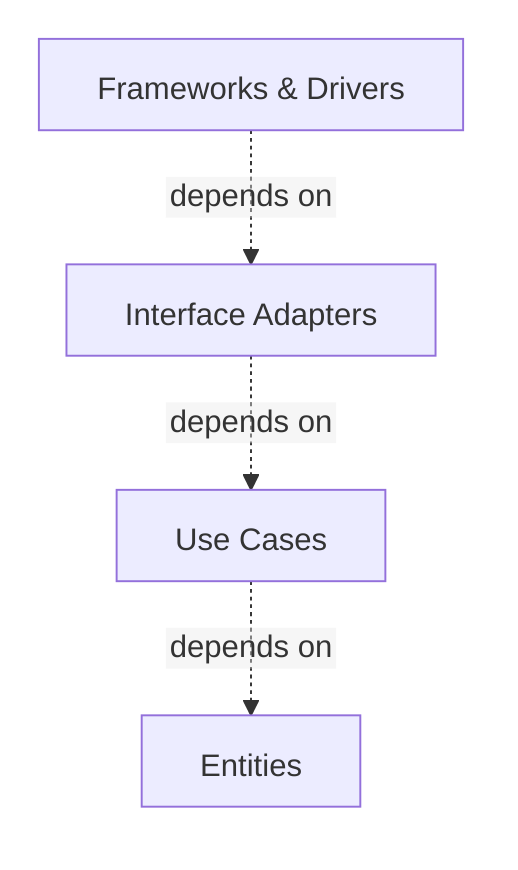
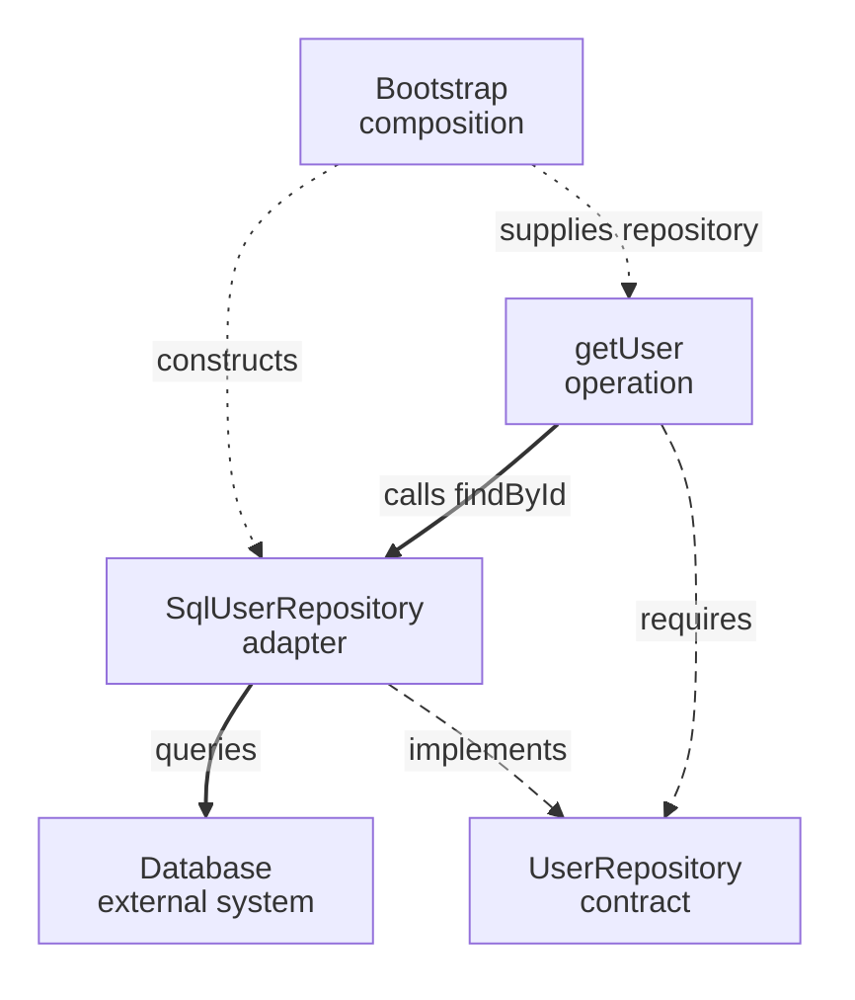
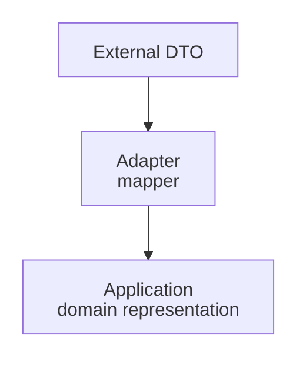
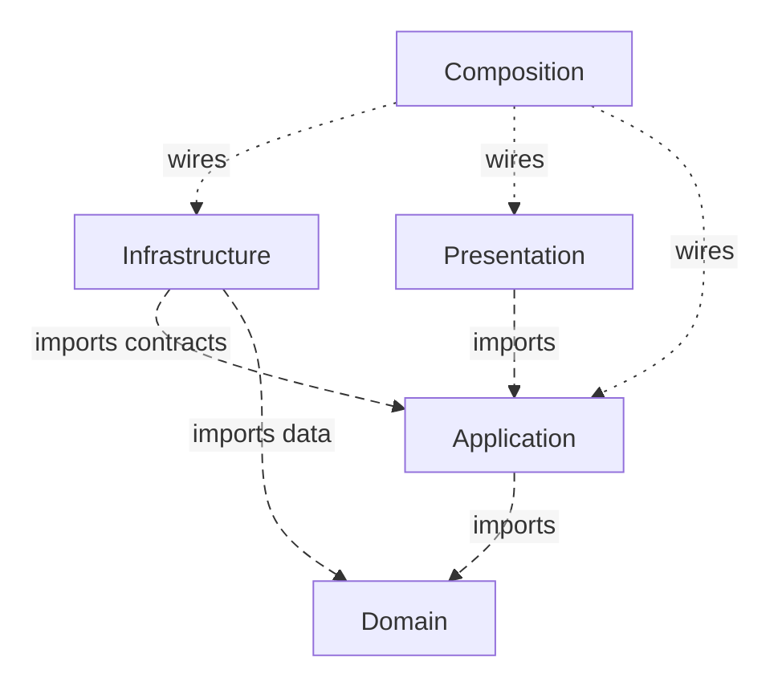

> **[Clean Architecture](README.md)** › The [Dependency Rule](../../../GLOSSARY.md#dependency-rule).


<a id="1-the-dependency-rule"></a>

# The Dependency Rule

Suppose an order cannot be cancelled after shipping. That rule should not import a [React component](../../../GLOSSARY.md#react-component), a database client, or the API's raw response shape. Otherwise a change to those tools can require editing the cancellation rule. The code that receives a click or saves an order may know about that rule; the rule does not need to know about those callers.

This is a question about **source-code dependencies**: which modules refer to or import which other modules. It is not the order in which functions call each other when a user clicks a button.

[Clean Architecture](../../../GLOSSARY.md#clean-architecture) expresses this separation with its **canonical [Dependency Rule](../../../GLOSSARY.md#dependency-rule)**. We distinguish that rule from the folder names and additional conventions chosen for this repository.

---

**Contents**

- [The canonical circles](#the-canonical-circles)
- [The rule](#the-rule)
- [Dependency direction is not runtime flow](#dependency-direction-is-not-runtime-flow)
- [Boundary data](#boundary-data)
- [What the Dependency Rule does not say](#what-the-dependency-rule-does-not-say)
- [Practical repository policy](#practical-repository-policy)
- [Dependency Inversion Principle](#dependency-inversion-principle)
- [Make the rule executable](#make-the-rule-executable)
- [Sources](#sources)

<a id="11-the-four-circles"></a>

<a id="11-the-canonical-circles"></a>

## The canonical circles

Robert C. Martin's diagram uses:



Inner circles contain higher-level policy. Outer circles contain mechanisms and details.

Martin explicitly notes that the diagram is schematic: an application may have more than four circles. The same [Dependency Rule](../../../GLOSSARY.md#dependency-rule) applies across any additional boundary.

---

<a id="12-the-rule-itself"></a>

<a id="12-the-rule"></a>

## The rule

> Source-code dependencies may only point inward, toward higher-level policies.

Consequences:

- [Entities](../../../GLOSSARY.md#clean-entities-circle) do not name [Use Cases](../../../GLOSSARY.md#use-case), UI frameworks, databases or transports.
- Use Cases do not name concrete outer [adapters](../../../GLOSSARY.md#adapter)/frameworks.
- [Interface Adapters](../../../GLOSSARY.md#interface-adapter) may depend on Use Cases/Entities.
- [Frameworks & Drivers](../../../GLOSSARY.md#frameworks-and-drivers) may depend inward.

An inner circle should not mention a class, function, schema or data representation owned by an outer circle.

This includes type-level dependencies.

---

<a id="13-crossing-the-boundary-dependency-inversion"></a>

<a id="13-dependency-direction-is-not-runtime-flow"></a>

## Dependency direction is not runtime flow

A [use case](../../../GLOSSARY.md#use-case) can invoke a database at runtime without importing the database implementation.

The following fragments illustrate signatures and wiring; omitted types and method bodies are not a runnable feature. See [the complete cancellation example](4-building-a-feature.md).

Inner contract:

```ts
export interface UserRepository {
  findById(id: UserId): Promise<User | null>
}
```

Outer [adapter](../../../GLOSSARY.md#adapter):

```ts
export class SqlUserRepository implements UserRepository {
  // database-specific implementation
}
```

Composition:

```ts
const users = new SqlUserRepository(db)
const getUser = makeGetUser({ users })
```

Trace the same objects in one view: solid arrows are runtime calls, long dashes are source dependencies, short dots are startup wiring. The contract is not a runtime forwarding object.



Dependency inversion makes those directions intentionally different.

---

<a id="14-boundary-data"></a>

## Boundary data

Martin's original article also warns that data formats owned by an outer mechanism should not cross inward unchanged.

Examples of outer representations:

- database rows;
- framework request/response objects;
- [ORM](../../../GLOSSARY.md#orm) models;
- raw API response [DTOs](../../../GLOSSARY.md#data-transfer-object-dto);
- generated SDK types.

Translate at the boundary:



This does not mean every crossing needs a class. A pure mapping function is often sufficient.

---

<a id="15-why-this-matters-on-the-frontend"></a>

<a id="15-what-the-dependency-rule-does-not-say"></a>

## What the Dependency Rule does **not** say

It does not say:

- every project needs exactly four folders;
- every external call needs a [Repository](../../../GLOSSARY.md#repository) interface;
- frontend and backend must share [Entities](../../../GLOSSARY.md#clean-entities-circle);
- every [View](../../../GLOSSARY.md#view) must be framework-free;
- a [DI container](../../../GLOSSARY.md#di-container) is required;
- Redux is an [Application layer](../../../GLOSSARY.md#application-layer);
- a component may never import another outer-circle technical module.

That last point matters.

Martin places views alongside controllers and [presenters](../../../GLOSSARY.md#presenter) in [Interface Adapters](../../../GLOSSARY.md#interface-adapter). See [the combined outer-module explanation](../../foundations/dependency-boundaries.md#combined-outer-modules) for how a practical [React component](../../../GLOSSARY.md#react-component) or HTTP repository can also contain framework glue. The stricter project policy here forbids [Presentation](../../../GLOSSARY.md#presentation-layer) from importing [Infrastructure](../../../GLOSSARY.md#infrastructure), even when both contain outer mechanisms.

Document those stricter rules as project architecture, not as quotations from [Clean Architecture](../../../GLOSSARY.md#clean-architecture).

---

<a id="16-practical-repository-policy"></a>

## Practical repository policy

For the application structures documented here, we usually enforce:



This is a practical mapping of the Clean goal, not the canonical four-circle taxonomy.

Long dashes mean imports; short dots mean startup wiring. [Domain](../../../GLOSSARY.md#domain) can import other domain code and no outer area; a self-arrow is unnecessary.

See **[Dependency Boundaries](../../foundations/dependency-boundaries.md)**.

---

<a id="17-dependency-inversion-principle"></a>

## Dependency Inversion Principle

The [Dependency Inversion Principle](../../../GLOSSARY.md#dependency-inversion-principle-dip) and [Clean Architecture](../../../GLOSSARY.md#clean-architecture)'s [Dependency Rule](../../../GLOSSARY.md#dependency-rule) reinforce each other but are not identical statements.

DIP says high-level policy should not depend on low-level detail; both depend on abstractions. Clean uses that mechanism to cross [architectural boundaries](../../../GLOSSARY.md#architectural-boundary) without reversing source dependencies.

A [port](../../../GLOSSARY.md#port) is useful when it protects policy from a detail. Do not add interfaces indiscriminately.

---

<a id="14-the-rule-as-a-check-on-imports"></a>

<a id="18-make-the-rule-executable"></a>

## Make the rule executable

If a project says [Application](../../../GLOSSARY.md#application-layer) cannot import [Infrastructure](../../../GLOSSARY.md#infrastructure), CI should detect the import.

[Architecture tests](../../../GLOSSARY.md#architecture-test) should consider:

- static imports;
- re-exports;
- dynamic imports;
- relative paths;
- path aliases;
- [type-only imports](../../../GLOSSARY.md#type-only-import).

See **[Checking Architectural Boundaries](../../foundations/architecture-testing.md)**.

## Sources

- Robert C. Martin, "The [Clean Architecture](../../../GLOSSARY.md#clean-architecture)" (2012): https://blog.cleancoder.com/uncle-bob/2012/08/13/the-clean-architecture.html
- Robert C. Martin, *Clean Architecture* (2017)
- Alistair Cockburn, "[Hexagonal Architecture](../../../GLOSSARY.md#hexagonal-architecture-ports-and-adapters)" (2005): https://alistair.cockburn.us/hexagonal-architecture/
