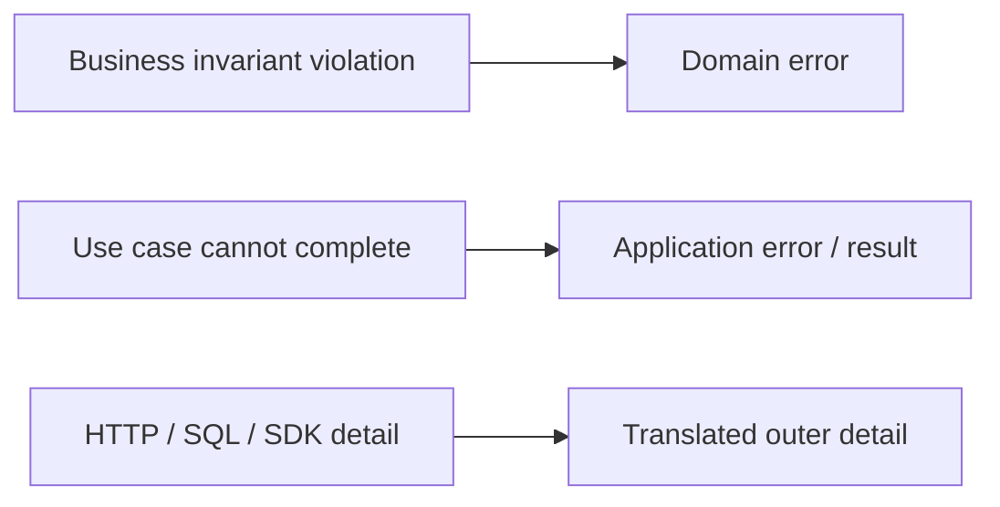
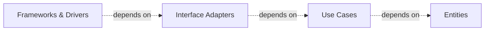

> **[Clean Architecture](README.md)** › The Four Circles.

<a id="2-the-four-layers"></a>

# 2. The Four Circles

Imagine a user cancelling an order: the rule “shipped orders cannot be cancelled” is different from the operation “cancel this order,” which is different again from translating an HTTP request or writing a database row. The four circles below give these responsibilities different places so a technology change does not rewrite the rule.

The canonical [Clean Architecture](../../../GLOSSARY.md#clean-architecture) diagram contains four concentric circles. They are conceptual boundaries, not mandatory directory names. The circles describe who may reference whose code, not four sequential runtime steps.

---

<a id="21-entities-innermost"></a>

## 2.1 Entities

### Responsibility

Martin's **[Entities circle](../../../GLOSSARY.md#clean-entities-circle)** encapsulates general business rules. It is broader than a [DDD](../../../GLOSSARY.md#domain-driven-design-ddd) entity with identity: objects, [value objects](../../../GLOSSARY.md#value-object) and functions can all implement this policy.

In modern domain-oriented systems, interpret that carefully: the relevant policy may be scoped to a product or [bounded context](../../../GLOSSARY.md#bounded-context) rather than literally one enterprise-wide class shared by every application.

Typical contents:

- entities with identity;
- value objects;
- business [invariants](../../../GLOSSARY.md#invariant);
- domain policies;
- [domain errors](../../../GLOSSARY.md#domain-error)/events where appropriate.

The following code is a responsibility excerpt; surrounding types/imports are omitted. The [focused cancellation feature](4-building-a-feature.md) applies these responsibilities.

Example:

```ts
export class Money {
  private constructor(
    readonly amount: bigint,
    readonly currency: Currency,
  ) {}

  static of(amount: bigint, currency: Currency) {
    if (amount < 0n) throw new NegativeMoney()
    return new Money(amount, currency)
  }
}
```

Entities should not know delivery, persistence or framework details.

They do **not** have to be classes. Functional/immutable domain models can satisfy the same boundary.

---

## 2.2 Use Cases

### Responsibility

[Use Cases](../../../GLOSSARY.md#use-case) contain application-specific business rules and orchestrate an operation.

Typical contents:

- [application services](../../../GLOSSARY.md#application-service)/interactors;
- commands/queries;
- required [ports](../../../GLOSSARY.md#port)/boundaries;
- application-level validation and orchestration;
- application results/errors.

The following code is a responsibility excerpt; surrounding types/imports are omitted. The [focused cancellation feature](4-building-a-feature.md) applies these responsibilities.

Example:

```ts
export interface OrderRepository {
  findById(id: OrderId): Promise<Order | null>
  save(order: Order): Promise<void>
}

export function makeCancelOrder(deps: {
  orders: OrderRepository
}) {
  return async function cancelOrder(id: OrderId) {
    const order = await deps.orders.findById(id)

    if (!order) throw new OrderNotFound(id)

    order.cancel()
    await deps.orders.save(order)
  }
}
```

The use case does not import the database, HTTP client, UI framework or concrete [repository](../../../GLOSSARY.md#repository).

### Error ownership

Do not map every external failure into a [Domain error](../../../GLOSSARY.md#domain-error).

Use meaning:



---

## 2.3 Interface Adapters

### Responsibility

Translate between representations convenient to inner policy and representations convenient to external mechanisms.

Examples:

- controllers;
- [presenters](../../../GLOSSARY.md#presenter);
- [gateways](../../../GLOSSARY.md#gateway)/[repository](../../../GLOSSARY.md#repository) [adapters](../../../GLOSSARY.md#adapter);
- [mappers](../../../GLOSSARY.md#mapper);
- framework-facing state adapters.

An adapter can implement an inner [port](../../../GLOSSARY.md#port):

```ts
export class HttpOrderRepository implements OrderRepository {
  constructor(private readonly http: HttpClient) {}

  async findById(id: OrderId): Promise<Order | null> {
    const dto = await this.http.get('/orders/' + id.value)
    return dto ? mapOrderDto(dto) : null
  }

  async save(order: Order): Promise<void> {
    await this.http.put('/orders/' + order.id.value, toOrderDto(order))
  }
}
```

Here `HttpClient` is an adapter-owned transport interface, supplied by outer framework glue; it is not an import from a concrete HTTP driver. `mapOrderDto` and `toOrderDto` are boundary mapping functions. For a practical module containing both mapping and technical calls, see [combined outer modules](../../foundations/dependency-boundaries.md#combined-outer-modules).

### Repository is not a synonym for adapter

Use `Repository` when the abstraction is actually [repository](../../../GLOSSARY.md#repository)-like. Other [ports](../../../GLOSSARY.md#port) may be better named:

Examples include `PaymentGateway`, `FileStorage`, `Clock`, `IdGenerator`, `NotificationSender`, and `ClosureExecutor`.

The name should expose purpose.

---

<a id="24-frameworks--drivers-outermost"></a>

## 2.4 Frameworks & Drivers

### Responsibility

Hold replaceable mechanisms:

- React/Vue/Svelte;
- Express/NestJS/Spring;
- SQL/[ORM](../../../GLOSSARY.md#orm) drivers;
- browser storage;
- message brokers;
- HTTP clients;
- third-party SDKs;
- UI styling systems.

"The web is a detail" does not mean web code is unimportant. It means inner policy should not depend on the web mechanism.

---

## 2.5 The circles are not a linear runtime stack

Do not read:



as "every request must call exactly one thing in each circle".

It is a source dependency model.

A UI component can call a [Presentation](../../../GLOSSARY.md#presentation-layer) [adapter](../../../GLOSSARY.md#adapter) that calls a [use case](../../../GLOSSARY.md#use-case). An [Infrastructure](../../../GLOSSARY.md#infrastructure) adapter can be invoked by that use case through a [port](../../../GLOSSARY.md#port). Runtime calls can move both directions across boundaries while source dependencies remain inward.

---

## 2.6 Mapping to common project folders

This repository often uses:

| Clean concept | Practical area |
| --- | --- |
| [Entities](../../../GLOSSARY.md#clean-entities-circle) | [Domain](../../../GLOSSARY.md#domain) |
| [Use Cases](../../../GLOSSARY.md#use-case) | [Application](../../../GLOSSARY.md#application-layer) |
| [Interface Adapters](../../../GLOSSARY.md#interface-adapter) | parts of [Presentation](../../../GLOSSARY.md#presentation-layer) + [Infrastructure](../../../GLOSSARY.md#infrastructure) |
| [Frameworks & Drivers](../../../GLOSSARY.md#frameworks-and-drivers) | concrete UI/HTTP/DB/storage/framework code |

The mapping is not one-to-one.

The [combined outer-module explanation](../../foundations/dependency-boundaries.md#combined-outer-modules) shows when a [React component](../../../GLOSSARY.md#react-component) or database [adapter](../../../GLOSSARY.md#adapter) can contain translation and framework glue, and when separating them pays for itself.

Therefore, do not insist that every project folder corresponds to exactly one canonical circle. Composition is outer executable glue and follows the same inward rule; it is no exemption.

---

## 2.7 Frontend organization is a second scale

A real frontend can contain hundreds of files inside the outer UI area.

[Clean Architecture](../../../GLOSSARY.md#clean-architecture) does not define:

- page hierarchy;
- [feature folders](../../../GLOSSARY.md#feature-folder);
- hooks;
- Redux slices;
- [selectors](../../../GLOSSARY.md#selector);
- [design tokens](../../../GLOSSARY.md#design-token);
- CSS [recipes](../../../GLOSSARY.md#recipe).

Those are documented in **[Frontend Architecture](../../frontend/README.md)**.

They should preserve the cross-layer boundary but are not themselves Clean Architecture circles.

---

## 2.8 Backend organization is similarly concrete

Controllers, transport DTOs and persistence mappings belong to outer mechanisms. Their source references point toward protected policy. See the [backend application of these circles](8-clean-on-the-backend.md).

See **[Clean Architecture on the Backend](8-clean-on-the-backend.md)**.

## Sources

- Robert C. Martin, "The [Clean Architecture](../../../GLOSSARY.md#clean-architecture)" (2012): https://blog.cleancoder.com/uncle-bob/2012/08/13/the-clean-architecture.html
- Robert C. Martin, *Clean Architecture* (2017)
- Martin Fowler, [Repository](../../../GLOSSARY.md#repository): https://martinfowler.com/eaaCatalog/repository.html
