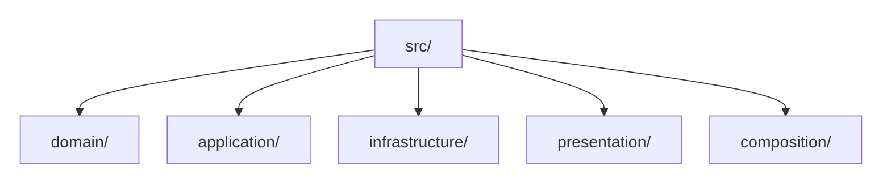
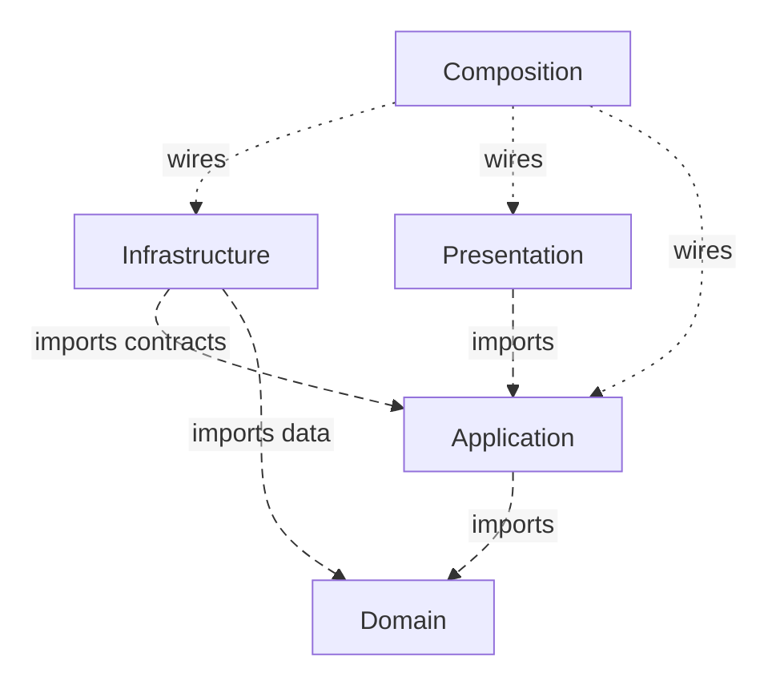
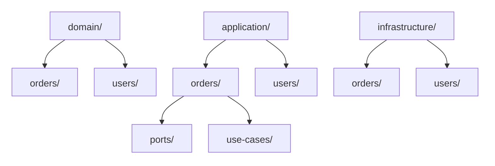
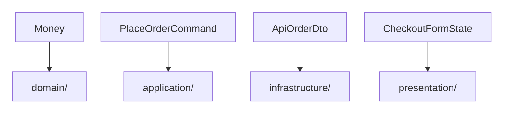
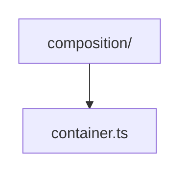

> **[Clean Architecture](README.md)** › Project Structure & Conventions.


<a id="3-project-structure--conventions"></a>

# Project Structure & Conventions

Two projects can both have a folder named `domain/`. In one, the rule “shipped orders cannot be cancelled” imports only business code. In the other, that same rule imports a database client. Matching folder names do not make those designs equivalent.

[Clean Architecture](../../../GLOSSARY.md#clean-architecture) constrains **which modules may refer to which others**; it does not prescribe one filesystem tree. A folder layout helps when it makes each responsibility visible and gives tools a stable way to detect forbidden imports. It is harmful when folder names are treated as proof that the rules are respected.

---

**Contents**

- [The folder layout](#the-folder-layout)
  - [Recommended import matrix](#recommended-import-matrix)
- [Structure by capability inside a layer](#structure-by-capability-inside-a-layer)
- [Public module APIs](#public-module-apis)
- [Structuring the physical Presentation area](#structuring-the-physical-presentation-area)
- [Styles and animation](#styles-and-animation)
- [Type ownership](#type-ownership)
- [Composition](#composition)
- [Enforce the graph](#enforce-the-graph)
- [What is architecture vs. convention?](#what-is-architecture-vs-convention)
  - [Architecture](#architecture)
  - [Recommended convention](#recommended-convention)
  - [Framework convention](#framework-convention)
- [Sources](#sources)

<a id="31-the-folder-layout"></a>

## The folder layout

The canonical handbook mapping puts layers first, with capabilities inside them:



Equivalent projects may use `entities/`, `usecases/`, `adapters/`, and `frameworks/`, or organize packages by capability.

**Do not claim these layouts produce identical code.** They can implement the same inward-dependency principle while using different boundaries, ownership and module decomposition.

The canonical rules for those dependencies live in **[Architecture Foundations](../../foundations/dependency-boundaries.md)**.

### Recommended import matrix



Whether [Presentation](../../../GLOSSARY.md#presentation-layer) may import [Domain](../../../GLOSSARY.md#domain) types directly is a project decision. A stricter application-contract boundary may forbid it to reduce coupling between UI and domain representation.

The [canonical backend](../../backend/README.md#place-your-first-feature) chooses that stricter boundary: HTTP/CLI Presentation imports the supported [Application](../../../GLOSSARY.md#application-layer) API, not Domain files directly.

Long dashes show imports; short dots show startup wiring. Domain may import other domain code and no outer area. Folder-tree arrows elsewhere on this page mean containment, not imports or calls.

---

<a id="32-structure-by-capability-inside-a-layer"></a>

## Structure by capability inside a layer

Layer-first top-level folders are compatible with feature/capability ownership below them. Grow sub-capabilities inside their layer, following [the centralized Scheduling example](../../foundations/code-placement.md#grow-capabilities-inside-each-layer); do not build a full architectural stack per entity or table.

Example:



Avoid generic dumping grounds such as `services/`, `helpers/`, `managers/`, or `common/` when files have a clear capability owner.

---


<a id="33-public-module-apis"></a>

## Public module APIs

A feature/module should expose an intentional contract and hide internals.

```ts
// application/orders/index.ts
export { placeOrder } from './use-cases/placeOrder'
export type { PlaceOrderCommand, PlaceOrderResult } from './contracts'
```

Avoid giant [barrels](../../../GLOSSARY.md#barrel-file) that re-export unrelated layers or `export *` every internal symbol.

See **[Module Boundaries and Public APIs](../../foundations/module-boundaries-and-public-apis.md)**.

---

<a id="34-structuring-the-outermost-circle-the-presentation-ui"></a>

<a id="34-structuring-the-physical-presentation-area"></a>

## Structuring the physical Presentation area

A user interface and an incoming HTTP [Controller](../../../GLOSSARY.md#controller) both translate a caller's interaction into an [Application](../../../GLOSSARY.md#application-layer) operation. That outer responsibility is mapped to `presentation/` in this handbook. Clean does not prescribe its internal React or Nest folder structure.

This generic guide stops at the `presentation/` boundary. Follow [Frontend Architecture](../../frontend/README.md) for capability-owned pages/components/hooks/state, or [the backend Ticket map](../../backend/4-create-ticket-with-nestjs.md#physical-structure) for HTTP/CLI responsibilities. Each guide gives exact first-feature paths without treating framework files as architectural rules.

---

<a id="35-styles--animation-keep-them-out-of-the-markup"></a>

<a id="35-styles-and-animation"></a>

## Styles and animation

A component's styles exist to render the interaction, so [Presentation](../../../GLOSSARY.md#presentation-layer) owns them. Keep component-specific styles with that component and shared [design-system](../../../GLOSSARY.md#design-system) [recipes](../../../GLOSSARY.md#recipe) with their established visual owner. Detailed placement belongs in [Styling and Design-System Architecture](../../frontend/styling-and-design-system.md); this generic guide does not define a second UI taxonomy.

---

<a id="36-type-ownership"></a>

## Type ownership

Types belong to the layer/capability that owns their meaning.



[Type-only imports](../../../GLOSSARY.md#type-only-import) still represent source-level coupling.

A top-level `src/types` directory is rarely a good default because it erases ownership.

---

<a id="37-composition"></a>

## Composition

Keep concrete wiring at an outer bootstrap boundary:



The [Composition Root](../../../GLOSSARY.md#composition-root) may import concrete [Infrastructure](../../../GLOSSARY.md#infrastructure) plus [Application](../../../GLOSSARY.md#application-layer) contracts and [Presentation](../../../GLOSSARY.md#presentation-layer) bootstrap/[store](../../../GLOSSARY.md#store) code as needed to assemble the executable.

It is not a business layer and it is not a [service locator](../../../GLOSSARY.md#service-locator).

See **[Composition Root](../../foundations/composition-root.md)**.

---

<a id="33-imports-as-a-lint-target"></a>

<a id="38-enforce-the-graph"></a>

## Enforce the graph

A [dependency rule](../../../GLOSSARY.md#dependency-rule) that can be automated should be automated.

Options include:

- [AST](../../../GLOSSARY.md#abstract-syntax-tree-ast)-based [architecture tests](../../../GLOSSARY.md#architecture-test);
- dependency-cruiser;
- ESLint boundary plugins;
- Nx module-boundary rules;
- language/build-system equivalents.

The check must resolve:

- path aliases;
- relative imports;
- re-exports;
- dynamic imports;
- [type-only imports](../../../GLOSSARY.md#type-only-import).

See **[Checking Architectural Boundaries](../../foundations/architecture-testing.md)**.

---

<a id="32-conventions"></a>

<a id="39-what-is-architecture-vs-convention"></a>

## What is architecture vs. convention?

### Architecture

| Rule type | Example |
| --- | --- |
| Architecture | [Domain](../../../GLOSSARY.md#domain) cannot depend on [Infrastructure](../../../GLOSSARY.md#infrastructure). |
| Architecture | [Application](../../../GLOSSARY.md#application-layer) cannot import a concrete HTTP client. |
| Architecture | A concrete outer [adapter](../../../GLOSSARY.md#adapter) implements or consumes an inner-owned contract. |

### Recommended convention

| Convention | Example |
| --- | --- |
| [Application](../../../GLOSSARY.md#application-layer) use-case location | `application/orders/use-cases/cancelOrder.ts` |
| Physical delivery boundary | `presentation/`; frontend/backend guides define the contents |
| Feature public entry point | `index.ts` |

### Framework convention

| Framework mechanism | Example |
| --- | --- |
| Redux Toolkit | `createSlice` |
| Panda CSS | `sva` |
| React | [custom Hooks](../../../GLOSSARY.md#custom-hook) |

Treating all three as equally fundamental creates cargo-cult architecture.

## Sources

- Robert C. Martin, "The [Clean Architecture](../../../GLOSSARY.md#clean-architecture)": https://blog.cleancoder.com/uncle-bob/2012/08/13/the-clean-architecture.html
- Canonical [frontend](../../frontend/README.md) and [backend](../../backend/README.md) guidance supplies the framework-specific placement conventions.
