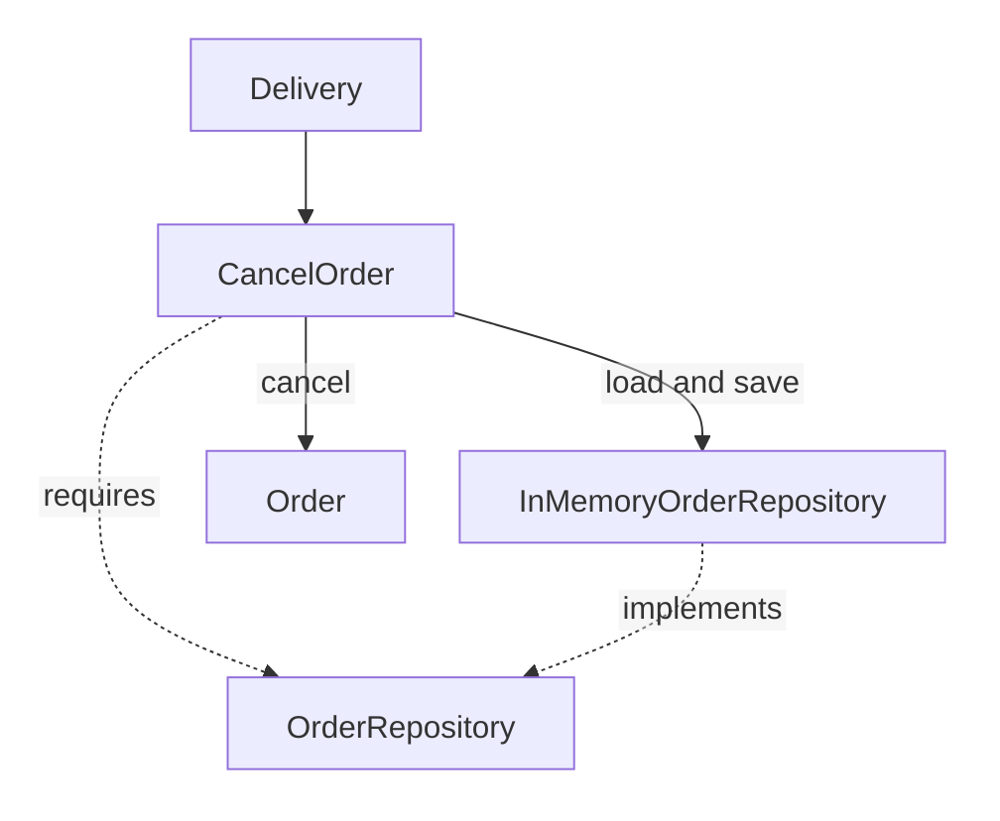

> **[Clean Architecture](README.md)** › Building a Feature

<a id="4-building-a-feature-end-to-end"></a>

# Building a Feature End-to-End

A support clerk cancels an order. The rule “shipped orders cannot be cancelled” must survive replacement of delivery or storage. This excerpt isolates that policy and workflow; it omits HTTP and UI implementation.

**Contents**

- [model the business rule](#model-the-business-rule)
- [define the Application capability](#define-the-application-capability)
- [implement the outer adapter](#implement-the-outer-adapter)
- [adapt Application to Presentation](#adapt-application-to-presentation)
- [compose at the edge](#compose-at-the-edge)
- [The runtime flow](#the-runtime-flow)
- [When the feature is simpler](#when-the-feature-is-simpler)
- [Change-pressure review](#change-pressure-review)
- [Feature checklist](#feature-checklist)
- [Sources](#sources)

<a id="41-step-1--model-the-business-rule"></a>

## model the business rule

`src/domain/orders/Order.ts`:

```ts
export type OrderStatus = 'pending' | 'shipped' | 'cancelled'
export class ShippedOrderCannotBeCancelled extends Error {}
export class Order {
  constructor(readonly id: string, private state: OrderStatus) {}
  get status() { return this.state }

  cancel(): void {
    if (this.state === 'shipped') throw new ShippedOrderCannotBeCancelled()
    this.state = 'cancelled'
  }
}
```

<a id="42-step-2--define-the-application-capability"></a>

## define the Application capability

`src/application/orders/ports/OrderRepository.ts`:

```ts
import type { Order } from '@/domain/orders/Order'
export interface OrderRepository {
  findById(id: string): Promise<Order | null>
  save(order: Order): Promise<void>
}
```

`src/application/orders/use-cases/CancelOrder.ts`:

```ts
import type { OrderRepository } from '../ports/OrderRepository'

export class CancelOrder {
  constructor(private readonly orders: OrderRepository) {}

  async execute(id: string): Promise<void> {
    const order = await this.orders.findById(id)
    if (!order) throw new Error('Order not found')
    order.cancel()
    await this.orders.save(order)
  }
}
```

The entity decides validity. [Application](../../../GLOSSARY.md#application-layer) loads the entity, asks it to act and saves the result. The contract belongs inward because the operation requires it.

<a id="43-step-3--implement-the-outer-adapter"></a>

## implement the outer adapter

`src/infrastructure/persistence/orders/adapters/InMemoryOrderRepository.ts`:

```ts
import { Order, type OrderStatus } from '@/domain/orders/Order'
import type { OrderRepository } from '@/application/orders/ports/OrderRepository'

export class InMemoryOrderRepository implements OrderRepository {
  private readonly records = new Map<string, OrderStatus>()

  async findById(id: string): Promise<Order | null> {
    const state = this.records.get(id)
    return state === undefined ? null : new Order(id, state)
  }
  async save(order: Order): Promise<void> {
    this.records.set(order.id, order.status)
  }
}
```

This memory implementation separates stored state from the returned object. Another implementation can meet the same contract with a database; it owns that database's mapping.

<a id="44-step-4--adapt-application-to-presentation"></a>

## adapt Application to Presentation

Delivery invokes `CancelOrder.execute(id)` and represents completion or failure for its caller. See [frontend Presentation](../../frontend/presentation-architecture.md) or [backend HTTP delivery](../../backend/1-http-request-to-business-operation.md).

<a id="45-step-5--compose-at-the-edge"></a>

## compose at the edge

Assembly excerpt using the modules above:

```ts
const orders = new InMemoryOrderRepository()
const cancelOrder = new CancelOrder(orders)
```

Startup chooses the implementation. The operation imports only its inward contract.

<a id="46-the-runtime-flow"></a>

## The runtime flow

Solid arrows show calls; dashed arrows show source relationships:



<a id="47-when-the-feature-is-simpler"></a>

## When the feature is simpler

A small operation may need fewer files. Keep a boundary when it protects a distinct responsibility, not to reproduce a circle diagram.

<a id="48-change-pressure-review"></a>

## Change-pressure review

| Change | First owner to inspect |
| --- | --- |
| Cancellation restriction changes | `Order` |
| Storage mechanism changes | Repository implementation and Composition |
| Another delivery mechanism calls cancellation | Its [Presentation](../../../GLOSSARY.md#presentation-layer) code |

This is a policy/workflow example. A deployed ordering system needs its own persistence and access guarantees.

<a id="49-feature-checklist"></a>

## Feature checklist

Verify the rule independently, the workflow with a supplied repository and each real integration at its boundary. Keep technical types outside the operation.

## Sources

- [Martin — Clean Architecture](https://blog.cleancoder.com/uncle-bob/2012/08/13/the-clean-architecture.html)
- [Fowler — Repository](https://martinfowler.com/eaaCatalog/repository.html)
