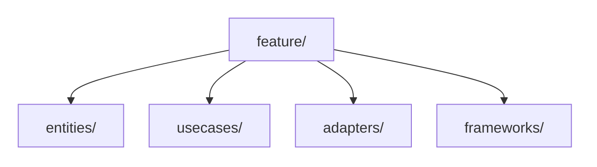

> **[Clean Architecture](README.md)** › Evolution & Scaling.

# Evolution and Scaling

[Clean Architecture](../../../GLOSSARY.md#clean-architecture) does not define startup, scale-up or enterprise phases, and it does not prescribe team-size thresholds for architectural mechanisms.

The durable rule remains inward dependency direction. How modules are grouped, composed and deployed may evolve.

The canonical guidance is now centralized in:

**[Architecture Evolution and Scaling](../../foundations/evolution-and-scaling.md)**

## Clean-specific notes

### Keep policy boundaries while changing physical structure

The same use-case boundary can live in:

Moving it across a process boundary is a deployment decision, not proof of better [Clean Architecture](../../../GLOSSARY.md#clean-architecture).

### Feature ownership does not require duplicating four circles per feature

Avoid mechanically creating:

for every small feature.

Prefer the smallest structure that preserves meaningful boundaries.

### DI containers are optional

A larger organization does not automatically imply a [DI container](../../../GLOSSARY.md#di-container). Adopt one for object-graph/lifetime/framework reasons, not a headcount milestone.

### Microservices and microfrontends are not "final phases"

They solve distribution and organizational autonomy problems and introduce substantial operational cost.

Use observable forces, not maturity-stage diagrams.

## Sources

- Robert C. Martin, "The [Clean Architecture](../../../GLOSSARY.md#clean-architecture)": https://blog.cleancoder.com/uncle-bob/2012/08/13/the-clean-architecture.html
- Martin Fowler, "Monolith First": https://martinfowler.com/bliki/MonolithFirst.html
- Cam Jackson, "Micro Frontends": https://martinfowler.com/articles/micro-frontends.html
