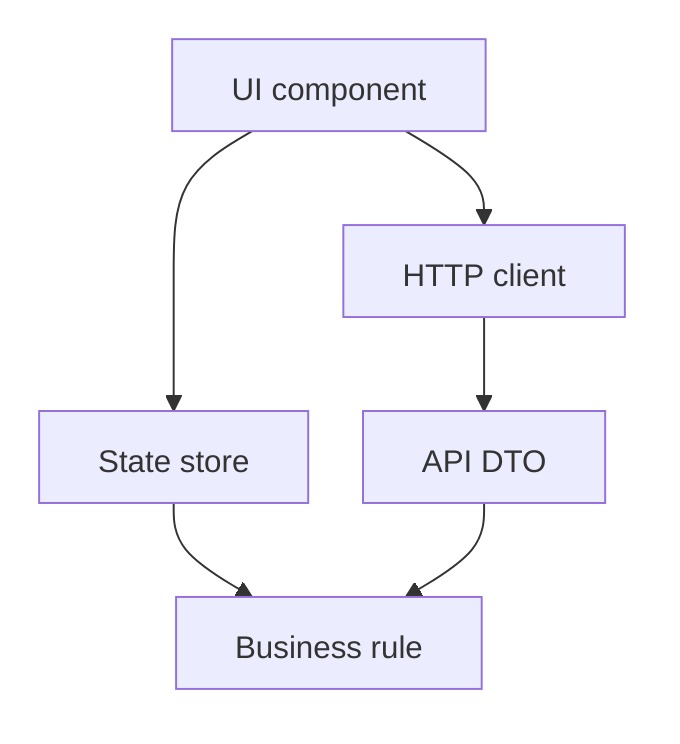
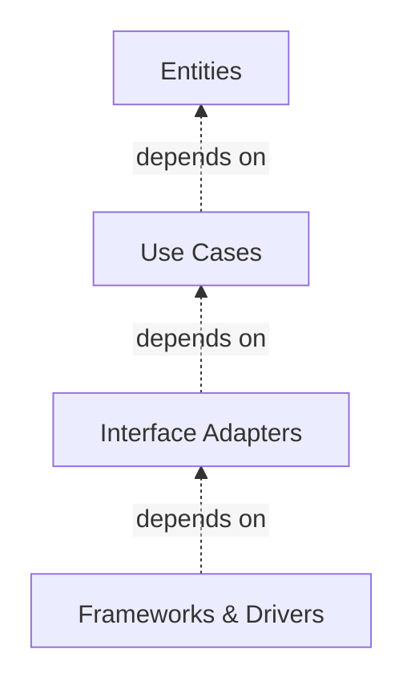
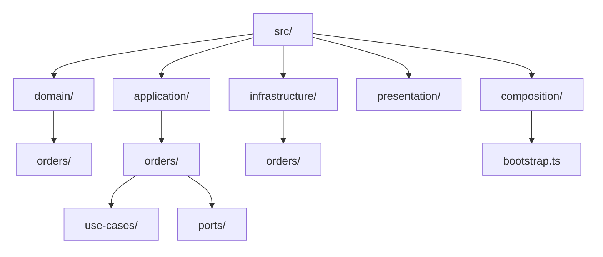
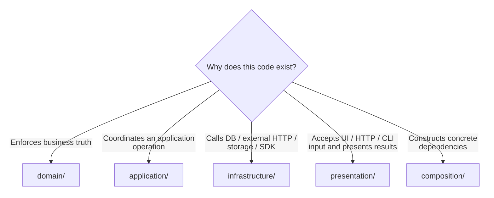
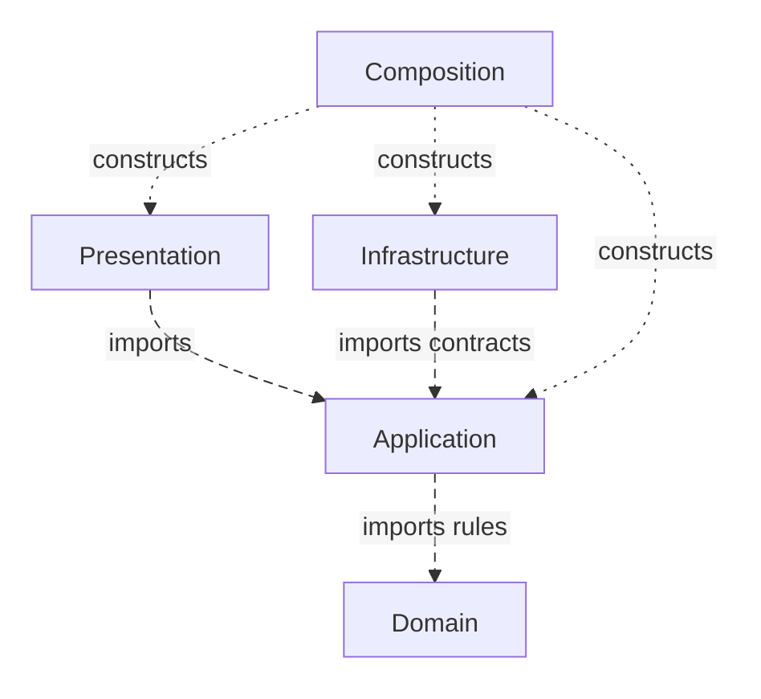

<a id="clean-architecture--frontend--backend"></a>

# Clean Architecture

> A progressive guide to Robert C. Martin's policy-centered architecture.

← [Repository home](../../../README.md) · [Glossary](../../../GLOSSARY.md) · [Code placement](../../foundations/code-placement.md) · [Naming](../../conventions/naming-and-file-placement.md)

For HTTP and NestJS mechanics from first principles, start with the [Backend Architecture learning path](../../backend/README.md). [Clean on the backend](8-clean-on-the-backend.md) maps that canonical ticket capability to Clean's policy boundaries without repeating the implementation.

**Contents**

- [History and origin](#history-and-origin)
- [What problem does it solve?](#what-problem-does-it-solve)
- [Fit and cost](#fit-and-cost)
  - [When Clean Architecture is a strong fit](#when-clean-architecture-is-a-strong-fit)
  - [When it can be too much](#when-it-can-be-too-much)
- [The fundamental model](#the-fundamental-model)
- [What each circle owns](#what-each-circle-owns)
  - [Entities](#entities)
  - [Use Cases](#use-cases)
  - [Interface Adapters](#interface-adapters)
  - [Frameworks & Drivers](#frameworks--drivers)
  - [Why isolate them?](#why-isolate-them)
- [Recommended physical structure](#recommended-physical-structure)
- [Where does a new function, type or helper go?](#where-does-a-new-function-type-or-helper-go)
  - [A simple rule for helper functions](#a-simple-rule-for-helper-functions)
- [Dependency isolation](#dependency-isolation)
- [Naming before implementation](#naming-before-implementation)
- [First feature end to end](#first-feature-end-to-end)
- [Testing the boundaries](#testing-the-boundaries)
- [Trade-offs and common failure modes](#trade-offs-and-common-failure-modes)
- [Progressive learning path](#progressive-learning-path)
- [What Clean Architecture does not require](#what-clean-architecture-does-not-require)
- [Sources](#sources)

<a id="1-history-and-origin"></a>

## History and origin

Robert C. Martin published **"The [Clean Architecture](../../../GLOSSARY.md#clean-architecture)"** in 2012 as a synthesis of related approaches including [Hexagonal Architecture](../../../GLOSSARY.md#hexagonal-architecture-ports-and-adapters), [Onion Architecture](../../../GLOSSARY.md#onion-architecture), Boundary-Control-[Entity](../../../GLOSSARY.md#domain-entity) and other boundary-oriented designs. He expanded the subject in the 2017 book *Clean Architecture*.

The recurring problem is older than the name:

> How do we keep business and application policy from becoming inseparable from databases, web frameworks, UI frameworks, devices and other replaceable mechanisms?

Primary source: https://blog.cleancoder.com/uncle-bob/2012/08/13/the-clean-architecture.html

<a id="2-what-problem-does-it-solve"></a>

## What problem does it solve?

Imagine that cancelling an order is forbidden once it has shipped. A first implementation places the rule inside a React button and reads the status directly from the API response. Later, a second screen needs the same rule or the API renames its status field. The business decision now has to be found and corrected in UI/networking code.

[Clean Architecture](../../../GLOSSARY.md#clean-architecture) separates that decision from the tools used to display or store the order: the cancellation rule is written in code that does not need to import React, `fetch`, or a database client. The outer code translates incoming data and asks the inner operation to perform the cancellation.

Without explicit boundaries, code often grows around the framework or database:



That produces predictable costs:

- business behavior is duplicated in controllers/components;
- tests need frameworks or databases unnecessarily;
- transport/database schemas become the application's internal model;
- changing technology changes unrelated policy;
- dependency cycles make ownership hard to reason about.

Clean Architecture protects policy by making outer mechanisms depend toward inner policy.

[Domain](../../../GLOSSARY.md#domain) modeling, UI composition and deployment still require their own decisions.

## Fit and cost

<a id="3-when-clean-architecture-is-a-strong-fit"></a>

### When Clean Architecture is a strong fit

Good candidates include:

- long-lived business applications;
- systems with meaningful domain/application policy;
- multiple delivery mechanisms such as HTTP, UI, CLI or jobs;
- replaceable or volatile infrastructure/integrations;
- systems where independent testing of policy matters;
- codebases that benefit from enforceable module boundaries.

<a id="4-when-it-can-be-too-much"></a>

### When it can be too much

It can be excessive when:

- the application is a tiny prototype;
- almost all behavior is straightforward data display/transport;
- there is no meaningful policy to isolate;
- added [ports](../../../GLOSSARY.md#port), mapping and indirection cost more than the change they protect against.

[Clean Architecture](../../../GLOSSARY.md#clean-architecture) is not a score for engineering maturity. Use boundaries where they protect something real.

<a id="the-four-layers-defined"></a>
<a id="the-idea-in-one-picture"></a>

<a id="5-the-fundamental-model"></a>

## The fundamental model

Think of the circles below as answers to four separate questions about the same cancellation: **what business rule must always hold; what operation the application performs; how external requests/data are translated; and which specific framework or database does the technical work**. They describe responsibilities, not four objects that every request must visit in order.

Martin's canonical diagram uses four conceptual circles:



The essential rule is not "exactly four folders". It is the [Dependency Rule](../../../GLOSSARY.md#dependency-rule):

> Source-code dependencies cross [architectural boundaries](../../../GLOSSARY.md#architectural-boundary) toward higher-level policy.

The arrow means **source dependency**, not runtime call direction.

<a id="6-what-each-circle-owns"></a>

## What each circle owns

The canonical circles are conceptual. A real codebase can split one circle across multiple modules or place several outer mechanisms in one physical area.

See [translation and framework glue in one outer module](../../foundations/dependency-boundaries.md#combined-outer-modules) for the practical mapping used here. Folder names do not replace responsibility and dependency rules.

### Entities

The cancellation rule belongs to the business model: a shipped order cannot be cancelled. Code such as Order protects that decision without importing React, HTTP or a database. Martin's Entities circle also includes business functions and value objects, not only objects with identity.

### Use Cases

CancelOrder coordinates loading, asking the order to cancel and saving. Its required repository contract describes the interaction it needs, without selecting a database. It imports inward business policy.

### Interface Adapters

Delivery and storage translation convert accepted external representations to the operation's language and convert results back. A mapper or controller owns that translation rather than the cancellation rule. The canonical circle depends inward on use cases and entities.

### Frameworks & Drivers

A router, database client or UI framework performs the technical work. Its outer glue supplies the translation and protected operations it needs. A practical outer module can combine translation and technical calls when separating them protects no independent change.

### Why isolate them?

Isolation protects **reasons to change**.

- A tax rule changes because the business changes.
- An HTTP [mapper](../../../GLOSSARY.md#mapper) changes because an API contract changes.
- A component changes because the UI changes.
- A database [adapter](../../../GLOSSARY.md#adapter) changes because persistence changes.

Putting all four reasons in one file couples unrelated changes and makes replacement/testing more expensive.

<a id="7-recommended-physical-structure"></a>

## Recommended physical structure

This repository uses layer-first folders, with capabilities inside each layer. Diagram arrows mean containment:



| Path | Owns | Why it exists | Must not contain |
| --- | --- | --- | --- |
| `domain/` | business meaning and [invariants](../../../GLOSSARY.md#invariant) | policy should survive UI/DB replacement | framework state, HTTP clients, [DTOs](../../../GLOSSARY.md#data-transfer-object-dto), [ORM](../../../GLOSSARY.md#orm) records |
| `application/` | application operations and required capabilities | orchestration stays independent from concrete mechanisms | [React components](../../../GLOSSARY.md#react-component), SQL/ORM clients, concrete HTTP [adapters](../../../GLOSSARY.md#adapter) |
| `infrastructure/` | concrete I/O adapters and external representations | volatile technology is translated at the boundary | presentation components or authoritative domain policy |
| `presentation/` | UI interaction/view state and incoming HTTP/CLI delivery | caller input/output needs its own owner | database clients and outbound integration implementations |
| `composition/` | concrete assembly/bootstrap | one outer place selects implementations | business decisions and use-case branching |

These folder names and layer-first hierarchy are a **documentation convention**, not part of Martin's canonical four-circle definition. Grow cohesive capabilities inside each layer, following [the Scheduling example](../../foundations/code-placement.md#grow-capabilities-inside-each-layer). The [frontend structure](../../frontend/README.md) and the [backend HTTP/CLI paths](../../backend/README.md#place-your-first-feature) apply the same convention to different delivery mechanisms.

For exact placement rules, use **[Code Placement](../../foundations/code-placement.md)**.

<a id="8-where-does-a-new-function-type-or-helper-go"></a>

## Where does a new function, type or helper go?

Start with meaning, not syntax:



Examples:

| Code | Owner | Why | Why not another layer |
| --- | --- | --- | --- |
| `order.cancel()` | [Domain](../../../GLOSSARY.md#domain) | enforces an order [invariant](../../../GLOSSARY.md#invariant) | a component/controller would duplicate business truth |
| `cancelOrder(id)` | [Application](../../../GLOSSARY.md#application-layer) | coordinates loading, domain behavior and persistence | Domain should not orchestrate external capabilities |
| `HttpOrderRepository.save()` | [Infrastructure](../../../GLOSSARY.md#infrastructure) | speaks HTTP | Application should not know transport |
| `useOrders()` | [Presentation](../../../GLOSSARY.md#presentation-layer) | exposes view-oriented state/actions | Application should not know React hooks |
| `ApiOrderDto` | Infrastructure | describes wire representation | Domain should not inherit API schema |
| `OrderRowViewModel` | Presentation | shapes data for rendering | Domain should not encode table/display concerns |
| `formatClosureMessage()` | `presentation/closures/formatters/formatClosureMessage.ts` when UI-specific | meaning belongs to one UI capability | generic `utils/` would erase ownership |
| object construction in `bootstrap.ts` | Composition | selects concrete implementations | consumers should not locate dependencies globally |

### A simple rule for helper functions

Do **not** ask "is this a utility?". Ask "who owns its meaning?".

If a helper maps an API [DTO](../../../GLOSSARY.md#data-transfer-object-dto), it is an [Infrastructure](../../../GLOSSARY.md#infrastructure) [mapper](../../../GLOSSARY.md#mapper). If it validates an [invariant](../../../GLOSSARY.md#invariant), it is [Domain](../../../GLOSSARY.md#domain). If it formats one feature's UI message, it stays with that feature. Only genuinely cross-feature, stable helpers earn a shared location.

<a id="9-dependency-isolation"></a>

## Dependency isolation

The recommended source [dependency graph](../../../GLOSSARY.md#dependency-graph) is:



A [use case](../../../GLOSSARY.md#use-case) may call outward at runtime through an injected [port](../../../GLOSSARY.md#port), but the source code still depends inward.

Long dashes show imports; short dots show startup wiring. Solid sequence arrows below show runtime calls. Folder-tree arrows mean containment rather than execution.

Example:

```ts
// Signature excerpt; the First feature end to end section links complete contracts.
export interface OrderRepository {
  findById(id: OrderId): Promise<Order | null>
  save(order: Order): Promise<void>
}
```

```ts
// infrastructure/http/orders/adapters/HttpOrderRepository.ts
export class HttpOrderRepository implements OrderRepository {
  // HTTP-specific implementation
}
```

[Application](../../../GLOSSARY.md#application-layer) owns the capability it needs; [Infrastructure](../../../GLOSSARY.md#infrastructure) adapts to it.

Read **[The Dependency Rule](1-the-dependency-rule.md)** for the deeper explanation.

<a id="10-naming-before-implementation"></a>

## Naming before implementation

`Order` names the model, `CancelOrder` the class-based operation and `InMemoryOrderRepository` its storage implementation. Follow [Naming and File Placement](../../conventions/naming-and-file-placement.md) for the full convention.

<a id="11-first-feature-end-to-end"></a>

## First feature end to end

A clerk cancels an order. `Order.cancel()` rejects shipped orders; `CancelOrder` loads, invokes that behavior and saves through an inward-owned `OrderRepository`.

[The focused example](4-building-a-feature.md) owns that code. Changing the rule affects [Domain](../../../GLOSSARY.md#domain); replacing storage affects its outer implementation and assembly. Delivery represents the result for its caller.

<a id="complete-client-implementation"></a>

For HTTP mechanics, use the [backend Ticket route](../../backend/README.md); for screen behavior, use [frontend Presentation](../../frontend/presentation-architecture.md).

<a id="12-testing-the-boundaries"></a>

## Testing the boundaries

| Test scope | What it proves | Typical dependency strategy |
| --- | --- | --- |
| [Domain](../../../GLOSSARY.md#domain) unit test | [invariant](../../../GLOSSARY.md#invariant)/business behavior | no UI/DB/framework |
| [Application](../../../GLOSSARY.md#application-layer) use-case test | orchestration | [fake](../../../GLOSSARY.md#fake)/[stub](../../../GLOSSARY.md#stub) required [ports](../../../GLOSSARY.md#port) |
| [Infrastructure](../../../GLOSSARY.md#infrastructure) integration test | mapping and real technical behavior | real or controlled external dependency |
| [Presentation](../../../GLOSSARY.md#presentation-layer) test | rendering/view behavior | fake application operation or configured presentation [store](../../../GLOSSARY.md#store) |
| [Architecture test](../../../GLOSSARY.md#architecture-test) | [dependency graph](../../../GLOSSARY.md#dependency-graph) remains legal | inspect imports/modules |
| End-to-end test | critical executable journey | complete graph |

Do not use percentages as architectural quotas. Put tests where the relevant risk can be observed cheaply and reliably.

See **[Testing in Clean Architecture](5-testing-in-clean.md)**.

<a id="13-trade-offs-and-common-failure-modes"></a>

## Trade-offs and common failure modes

The cost of stronger boundaries is more explicit code: contracts, mapping, modules and composition.

Common failures:

- **folder-only architecture** — files have correct folder names but imports violate dependency direction;
- **ceremonial interfaces** — one interface is created for every class/endpoint without a boundary reason;
- **god [application service](../../../GLOSSARY.md#application-service)** — unrelated [use cases](../../../GLOSSARY.md#use-case) accumulate under one generic service;
- **[service locator](../../../GLOSSARY.md#service-locator)** — consumers import the container instead of receiving dependencies;
- **[DTO](../../../GLOSSARY.md#data-transfer-object-dto) leakage** — transport/[ORM](../../../GLOSSARY.md#orm)/browser types become inner models;
- **framework leakage** — React/Redux/ORM APIs appear in [Application](../../../GLOSSARY.md#application-layer)/[Domain](../../../GLOSSARY.md#domain);
- **anemic ceremony** — layers are added to a trivial CRUD screen without policy worth protecting.

<a id="learning-path"></a>

<a id="14-progressive-learning-path"></a>

## Progressive learning path

Read in this order:

1. **[Dependency Rule](1-the-dependency-rule.md)**
2. **[Four Circles](2-the-four-layers.md)**
3. **[Project Structure](3-project-structure.md)**
4. **[Build a Feature End-to-End](4-building-a-feature.md)**
5. **[Testing](5-testing-in-clean.md)**
6. **[Composition & DI](6-composition-and-di.md)**
7. **[Evolution & Scaling](7-scaling-and-patterns.md)**
8. **[Backend](8-clean-on-the-backend.md)**

The first three chapters deepen concepts already introduced here. Advanced mechanisms come only after placement and dependencies are clear.

<a id="15-what-clean-architecture-does-not-require"></a>

## What Clean Architecture does not require

Clean permits different folder layouts, function or class operations, and manual or container assembly. Choose each mechanism for the boundary it protects.

## Sources

- Robert C. Martin, "The [Clean Architecture](../../../GLOSSARY.md#clean-architecture)" (2012): https://blog.cleancoder.com/uncle-bob/2012/08/13/the-clean-architecture.html
- Robert C. Martin, *Clean Architecture: A Craftsman's Guide to Software Structure and Design* (2017)
- Alistair Cockburn, "[Hexagonal Architecture](../../../GLOSSARY.md#hexagonal-architecture-ports-and-adapters)": https://alistair.cockburn.us/hexagonal-architecture/
- Jeffrey Palermo, "The [Onion Architecture](../../../GLOSSARY.md#onion-architecture)" series: https://jeffreypalermo.com/2008/07/
- Martin Fowler, "[Presentation Model](../../../GLOSSARY.md#presentation-model)": https://martinfowler.com/eaaDev/PresentationModel.html
- Mark Seemann, "[Composition Root](../../../GLOSSARY.md#composition-root)": https://blog.ploeh.dk/2011/07/28/CompositionRoot/
