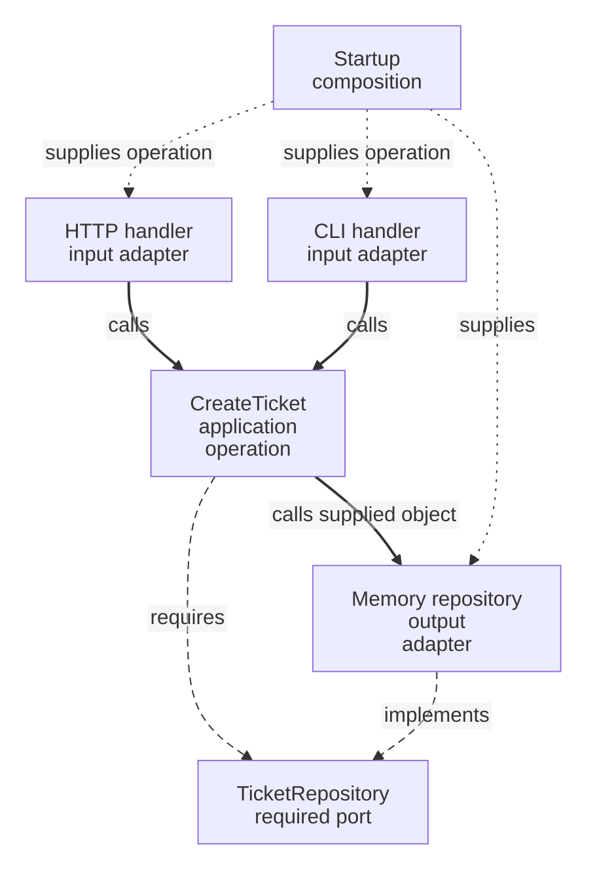

# Hexagonal Architecture / Ports & Adapters

An analyst creates a support ticket through HTTP. An operator needs the same action from a command line. Both should reach the same creation rules, and neither should choose how tickets are stored.

**Contents**

- [The problem and its origin](#the-problem-and-its-origin)
- [Offered and required interactions](#offered-and-required-interactions)
- [One application, several mechanisms](#one-application-several-mechanisms)
- [Start with an existing operation](#start-with-an-existing-operation)
- [Placement and dependency decisions](#placement-and-dependency-decisions)
- [When this boundary helps](#when-this-boundary-helps)
- [What to verify](#what-to-verify)
- [Continue reading](#continue-reading)
- [Sources](#sources)

## The problem and its origin

If creation reads an HTTP request and calls Prisma directly, another caller must imitate HTTP and the operation needs a database even for a small isolated check. Alistair Cockburn described Ports & Adapters in 2005 to keep application behavior independent of these external mechanisms.

## Offered and required interactions

A **port** describes a purposeful interaction with the application. An offered interaction lets a caller request work; a required interaction describes a capability the application needs. An **adapter** connects a particular caller or technology to that interaction.

| Interaction | Ticket example | Adapter |
| --- | --- | --- |
| Offered creation | `CreateTicket.execute(command)` | HTTP handler or CLI handler |
| Required persistence | `TicketRepository.insert(ticket)` | Memory or Prisma implementation |

An offered operation can itself be the supported interface. Add a separate inbound interface only when another boundary needs it; a port is not a mandatory extra file.

## One application, several mechanisms



Solid edges are runtime calls, long dashes are source requirements and short dots are startup wiring. The operation calls the supplied repository object; the interface is not another runtime hop.

## Start with an existing operation

Choose the [backend Ticket operation](../../backend/2-typescript-first-boundaries.md) or the [frontend TicketGateway example](../../frontend/ports-and-adapters.md). Both illustrate the same ports-and-adapters relationships; neither requires studying the other. This backend assembly excerpt changes storage without changing creation:

```ts
import { CreateTicket } from '@/application/tickets'
import { InMemoryTicketRepository } from '@/infrastructure/persistence/tickets/adapters/InMemoryTicketRepository'

const createTicket = new CreateTicket(new InMemoryTicketRepository(), () => 'T-1')
const result = await createTicket.execute({ subject: 'Broken PDF', description: '' })
```

The [CLI exercise](../../backend/exercises/intermediate.md#b-i2--create-from-a-cli) adds another caller. In frontend, an HTTP gateway instead adapts a required remote interaction.

## Placement and dependency decisions

Keep the creation operation in [Application](../../../GLOSSARY.md#application-layer), ticket validity in [Domain](../../../GLOSSARY.md#domain), incoming HTTP/CLI translation in [Presentation](../../../GLOSSARY.md#presentation-layer) and storage translation in [Infrastructure](../../../GLOSSARY.md#infrastructure). Composition chooses objects. These folders are handbook conventions, not required names or six sides prescribed by [Hexagonal Architecture](../../../GLOSSARY.md#hexagonal-architecture-ports-and-adapters).

Application owns this repository contract because creation requires it. Concrete storage imports that inward contract. A frontend `TicketGateway` describes a remote interaction; it is not automatically a Repository.

## When this boundary helps

A subject rule changes [Domain](../../../GLOSSARY.md#domain). Adding a CLI changes input translation and composition. Replacing memory with persistence changes the output adapter and assembly. Consumers in another capability use the supported creation API rather than private helpers.

Use this separation when the operation must survive changes in callers or integrations. A one-off script with no protected policy may need fewer pieces.

## What to verify

Invoke creation without HTTP; supply memory and observe valid creation and invalid-subject rejection. Check each real adapter against its contract separately. Memory checks do not establish database behavior, authorization or agreement with an external API.

## Continue reading

[Layered](../layered-architecture/README.md), [Clean](../clean-architecture/README.md) and [Onion](../onion-architecture/README.md) ask related questions with different emphasis. [Backend comparison](../../backend/5-architectural-styles-with-nestjs.md) applies them to one example.

## Sources

- [Cockburn: original Hexagonal Architecture article](https://alistair.cockburn.us/hexagonal-architecture/)
