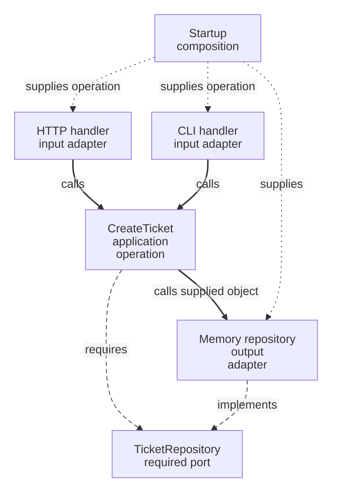

# Hexagonal Architecture / Ports & Adapters

An analyst creates a support ticket through HTTP. An operator needs the same action from a command line. Both should reach the same creation rules, and neither should choose how tickets are stored.

**Contents**

- [The problem and its origin](#the-problem-and-its-origin)
- [Offered and required interactions](#offered-and-required-interactions)
- [One application, several mechanisms](#one-application-several-mechanisms)
- [Apply the boundary in frontend and backend](#apply-the-boundary-in-frontend-and-backend)
- [Placement and dependency decisions](#placement-and-dependency-decisions)
- [When this boundary helps](#when-this-boundary-helps)
- [What to verify](#what-to-verify)
- [Continue reading](#continue-reading)
- [Sources](#sources)

## The problem and its origin

If creation reads an HTTP request and calls Prisma directly, another caller must imitate HTTP and the operation needs a database even for a small isolated check. Alistair Cockburn described Ports & Adapters in 2005 to keep application behavior independent of these external mechanisms.

## Offered and required interactions

A **port** describes a purposeful interaction with the application. An offered interaction lets a caller request work; a required interaction describes a capability the application needs. An **adapter** connects a particular caller or technology to that interaction.

| Interaction | Ticket example | Adapter |
| --- | --- | --- |
| Offered creation | `CreateTicket.execute(command)` | HTTP handler or CLI handler |
| Required persistence | `TicketRepository.insert(ticket)` | Memory or Prisma implementation |

An offered operation can itself be the supported interface. Add a separate inbound interface only when another boundary needs it; a port is not a mandatory extra file.

## One application, several mechanisms

Solid edges are runtime calls, long dashes are source requirements and short dots are startup wiring. The operation calls the supplied repository object; the interface is not another runtime hop.

## Apply the boundary in frontend and backend

An external mechanism is defined relative to the application: a database is external to the ticket backend, while the backend API is external to the browser client. Each can have its own ports and adapters.

| Application | Inbound adapter | Offered operation | Required port | Outbound adapter |
| --- | --- | --- | --- | --- |
| Backend | HTTP or CLI handler | `CreateTicket.execute(command)` | `TicketRepository.insert(ticket)` | Memory or Prisma repository |
| Frontend | `useTickets` interaction | `createTicket(input)` | `TicketGateway.create(input)` | `HttpTicketGateway` |

Both applications protect their operations from the external mechanisms they use. The [backend Ticket walkthrough](../../backend/2-typescript-first-boundaries.md) and [frontend Ticket walkthrough](../../frontend/ports-and-adapters.md) supply the detailed implementations; neither is a prerequisite for this guide. The [CLI exercise](../../backend/exercises/intermediate.md#b-i2--create-from-a-cli) demonstrates a second inbound adapter.

## Placement and dependency decisions

In the backend example, HTTP/CLI translation belongs to [Presentation](../../../GLOSSARY.md#presentation-layer), ticket rules to [Domain](../../../GLOSSARY.md#domain), creation to [Application](../../../GLOSSARY.md#application-layer) and concrete persistence to [Infrastructure](../../../GLOSSARY.md#infrastructure). In the frontend example, `useTickets` is Presentation, `createTicket` is Application and `HttpTicketGateway` is Infrastructure. Composition supplies the selected adapter in either application.

Concrete adapters depend on the contracts the application requires, not the reverse. These folders are handbook conventions, not names prescribed by [Hexagonal Architecture](../../../GLOSSARY.md#hexagonal-architecture-ports-and-adapters). A frontend `TicketGateway` describes a remote interaction; it is not automatically a Repository.

## When this boundary helps

A subject rule changes [Domain](../../../GLOSSARY.md#domain). Adding a CLI changes input translation and composition. Replacing memory with persistence changes the output adapter and assembly. Consumers in another capability use the supported creation API rather than private helpers.

Use this separation when the operation must survive changes in callers or integrations. A one-off script with no protected policy may need fewer pieces.

## What to verify

Invoke the backend operation without an HTTP handler, and the frontend operation without React, using controlled replacements for their required ports. Check each real adapter separately: memory checks do not establish database behavior, and a fake gateway does not establish agreement with the backend API.

## Continue reading

[Layered](../layered-architecture/README.md), [Clean](../clean-architecture/README.md) and [Onion](../onion-architecture/README.md) ask related questions with different emphasis. [Backend comparison](../../backend/5-architectural-styles-with-nestjs.md) applies them to one example.

## Sources

- [Cockburn: original Hexagonal Architecture article](https://alistair.cockburn.us/hexagonal-architecture/)
