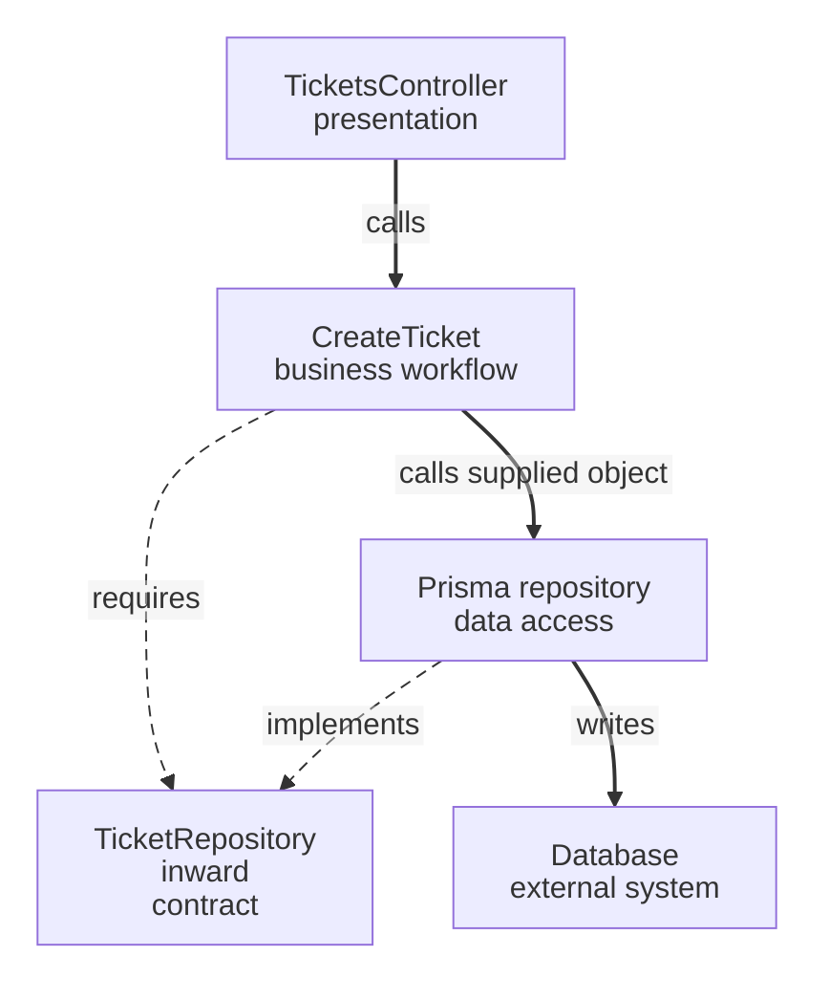

# Layered Architecture

A support endpoint receives data, decides whether a ticket is valid and stores it. If all three jobs share one method, a storage change can disturb the rule. Group the work by responsibility and specify which groups may use others.

**Contents**

- [Origins and purpose](#origins-and-purpose)
- [Responsibilities before folder names](#responsibilities-before-folder-names)
  - [Presentation](#presentation)
  - [Business behavior](#business-behavior)
  - [Data access](#data-access)
- [Specify how layers may interact](#specify-how-layers-may-interact)
- [Apply it to a feature](#apply-it-to-a-feature)
- [Fit, cost and change](#fit-cost-and-change)
- [Verification and limits](#verification-and-limits)
- [Continue reading](#continue-reading)
- [Sources](#sources)

## Origins and purpose

[Layered Architecture](../../../GLOSSARY.md#layered-architecture) separates kinds of work such as presentation, business behavior and data access. Fowler describes presentation/domain/data layering; Evans describes layers that isolate a domain model. The exact number and names of layers depend on the design.

## Responsibilities before folder names

### Presentation

Accept a caller's input and translate the result. A ticket HTTP handler understands request and response fields.

### Business behavior

Decide ticket validity and coordinate creation. A design may split this into [Domain](../../../GLOSSARY.md#domain) and [Application](../../../GLOSSARY.md#application-layer) when their responsibilities need separate protection.

### Data access

Read and write stored representations. A Prisma implementation understands the database schema.

Folders make these owners visible; permitted dependencies and calls establish the architecture.

## Specify how layers may interact

In a **closed** layered arrangement, a caller reaches a lower layer through the intervening layer. An **open** arrangement deliberately permits some bypasses. State which calls are permitted rather than assuming the drawing enforces them.

A conventional presentation/business/data arrangement may allow business code to import concrete data access. Inverting that source relationship is a separate decision:

This Ticket design combines responsibility layers with an inward-owned contract. The runtime operation still calls storage; its source does not import Prisma.

## Apply it to a feature

Use the [Ticket implementation](../../backend/2-typescript-first-boundaries.md) and [HTTP assembly](../../backend/4-create-ticket-with-nestjs.md). [Domain](../../../GLOSSARY.md#domain) owns the subject rule, [Application](../../../GLOSSARY.md#application-layer) coordinates creation, [Presentation](../../../GLOSSARY.md#presentation-layer) translates HTTP and [Infrastructure](../../../GLOSSARY.md#infrastructure) performs storage.

Keep required contracts beside the policy needing them. This is the handbook's chosen design, not proof that every layered application uses dependency inversion.

## Fit, cost and change

Layering helps when presentation, business policy and integration change independently. It costs extra contracts and translation, so a disposable utility may reasonably use less separation.

A subject rule changes its business owner; a schema change affects data access; a new caller affects delivery. Across capabilities, use supported APIs so another module does not bypass the chosen boundaries.

## Verification and limits

Check permitted source relationships and meaningful behavior separately. Three folders or names such as Controller/Service/Repository do not establish good boundaries. Logical layers also do not imply separately deployed processes.

## Continue reading

[Hexagonal](../hexagonal-architecture/README.md) emphasizes interactions with external mechanisms. [Clean](../clean-architecture/README.md) protects policy levels; [Onion](../onion-architecture/README.md) centers the domain model.

## Sources

- [Fowler: Presentation Domain Data Layering](https://martinfowler.com/bliki/PresentationDomainDataLayering.html)
- [Evans: Domain-Driven Design Reference, Layered Architecture](https://www.domainlanguage.com/wp-content/uploads/2016/05/DDD_Reference_2015-03.pdf)
