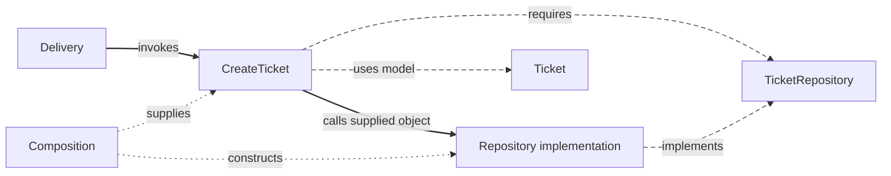

> [Onion Architecture](README.md) › The Rings.

# 1. The Rings

Support requires a valid subject and an initial `open` state for a new ticket. Those decisions remain useful when delivery or storage changes. Onion keeps this domain model independent and puts mechanisms around it.

The [canonical Ticket](../../backend/2-typescript-first-boundaries.md) owns the source examples. Here each ring explains who changes for a different reason.

<a id="31-domain-core"></a>

## 1.1 Domain

`Ticket.create()` decides valid subject contents and initial state. The vocabulary describes allowed status values; creation selects `open` explicitly. Expanding membership alone defines no state transition.

The business model knows its own rules and avoids Nest, HTTP and database types. It can be checked directly without starting those mechanisms.

<a id="32-application"></a>

## 1.2 Application

`CreateTicket` asks Domain to construct a ticket, calls the supplied persistence object and returns an outcome. It owns that workflow and the `TicketRepository` interaction it requires.

```ts
// Usage excerpt with a supplied repository and identity generator.
const createTicket = new CreateTicket(repository, makeId)
const result = await createTicket.execute({
  subject: 'Invoice download fails',
  description: '',
})
```

The storage contract belongs inward. Palermo describes repository interfaces near the domain model; [Onion on the backend](7-onion-on-the-backend.md) compares that placement with this Application-owned contract.

<a id="33-infrastructure"></a>

## 1.3 Infrastructure

`PrismaTicketRepository` maps a ticket snapshot to database fields and calls Prisma. `InMemoryTicketRepository` implements the same interaction with process-local storage.

Both refer to the inward-owned contract. Their mechanisms remain outside the policy; Application does not import the concrete implementation.

A future retrieval operation needs restoration that preserves stored status. Calling the creation factory on a loaded resolved ticket would reset its meaning.

<a id="34-presentation-outermost"></a>

## 1.4 Presentation (outermost)

`TicketHttpHandler` checks request shape, invokes creation and maps the result to HTTP. A CLI translates its own arguments and output around that same operation.

In a browser, Presentation owns screen interaction. Keep the generic map at `presentation/`; use the [frontend](../../frontend/presentation-architecture.md) and [backend](../../backend/README.md) routes for exact delivery folders.

<a id="35-composition-is-outside-the-rings-business-policy"></a>

## 1.5 Composition is outside the rings' business policy

Startup creates the implementation and supplies it to the operation. This assembly can refer to concrete outer modules.



Solid arrows show calls, long dashes source relationships and short dots startup wiring. The interface describes an interaction rather than another runtime step.

<a id="36-cross-cutting-concerns-still-need-owners"></a>

## 1.6 Cross-cutting concerns still need owners

Access policy, HTTP credentials and visual feedback have different owners even when they affect several operations. Shared use alone does not justify a global utility bucket. [Code Placement](../../foundations/code-placement.md) gives the decision rule.

Try the [backend exercises](../../backend/exercises/README.md).

## Sources

- [Palermo: Onion Architecture, part 1](https://jeffreypalermo.com/2008/07/the-onion-architecture-part-1/)
- [Palermo: Onion Architecture, part 3](https://jeffreypalermo.com/2008/08/the-onion-architecture-part-3/)
