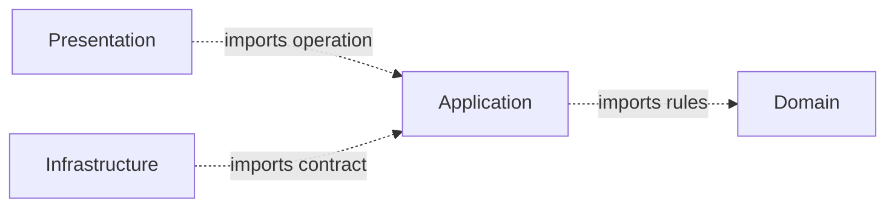
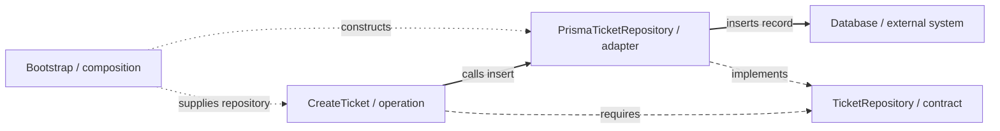
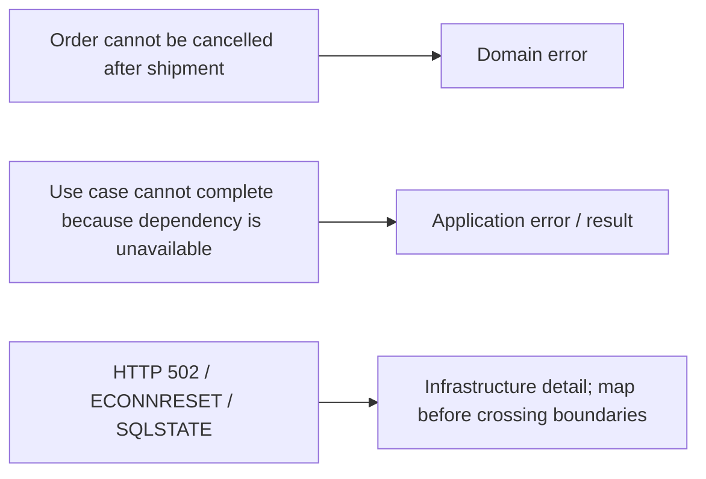
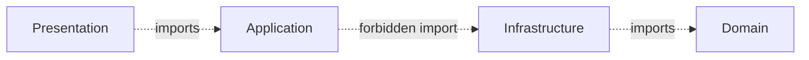

> **[Onion Architecture](README.md)** › Inward Dependencies.

# 2. Inward Dependencies

<a id="2-core-principle-the-dependency-rule"></a>
<a id="21-the-concentric-model"></a>

## 2.1 The principle

Imagine the rule that rejects a blank ticket subject. If that rule imports a database client, changing the database can force changes in code that only decides whether a ticket is valid. Instead, the database-facing code can know the operation and supply its data without the rule knowing the database.

This is what [Onion Architecture](../../../GLOSSARY.md#onion-architecture) means by protecting the center from outer technology. An arrow below means one source-code area may refer to the code in another; it does not mean every user action must execute in that order.



The important arrow is the **source-code dependency**.

Runtime flow may call an external system in the opposite direction through an injected [port](../../../GLOSSARY.md#port).

---

<a id="22-the-dependency-rule"></a>
<a id="23-dependency-inversion-the-mechanism"></a>

<a id="43-the-inversion-gap"></a>

## 2.2 Dependency inversion

[Application](../../../GLOSSARY.md#application-layer) needs to insert a valid ticket. Its canonical `TicketRepository` describes that capability. The operation names that contract; `PrismaTicketRepository` names the contract too and supplies its technical implementation. Application does not import Prisma. This reversal of the implementation's source dependency is **dependency inversion**.

The [canonical plain modules](../../backend/2-typescript-first-boundaries.md) define the policy/contract, and [the Nest chapter](../../backend/4-create-ticket-with-nestjs.md) shows the illustrative database [adapter](../../../GLOSSARY.md#adapter). This `composition/` excerpt imports those modules and assumes the database client and identity generator are already supplied:

```ts
import { CreateTicket } from '@/application/tickets'
import { PrismaTicketRepository } from '@/infrastructure/persistence/tickets/adapters/PrismaTicketRepository'

const repository = new PrismaTicketRepository(db, code => console.error({ operation: 'ticket.insert', code }))
const createTicket = new CreateTicket(repository, makeId)
```

Trace the same objects in one view. Solid lines are runtime calls; long dashes are source dependencies; short dots are startup wiring. `TicketRepository` is not an intermediary runtime object.



No contradiction exists because dependency direction and control flow are different concepts.

---

<a id="4-dependency-direction-in-practice"></a>

<a id="41-allowed-and-forbidden-imports"></a>

## 2.3 Recommended import policy

| Area | Allowed dependencies | Forbidden by the default policy |
| --- | --- | --- |
| [Domain](../../../GLOSSARY.md#domain) | Domain | [Application](../../../GLOSSARY.md#application-layer), [Infrastructure](../../../GLOSSARY.md#infrastructure), [Presentation](../../../GLOSSARY.md#presentation-layer) |
| Application | Application, Domain | Infrastructure, Presentation |
| Infrastructure | Infrastructure, Application, Domain | Presentation |
| Presentation | Presentation, Application; Domain only if the project explicitly allows it | Infrastructure |

Composition is allowed to know the concrete modules required to assemble the executable.

This table is a documentation convention for implementing Onion cleanly; Palermo's articles define the inward principle, not these exact folder names.

---


## 2.4 Type imports count

This still creates coupling:

```ts
import type { ApiUserDto } from '@/infrastructure/api'
```

inside [Application](../../../GLOSSARY.md#application-layer).

TypeScript erases it at runtime, but Application source now names an [Infrastructure](../../../GLOSSARY.md#infrastructure) concept.

Architectural rules operate on source dependencies, not only runtime bundle dependencies.

---

## 2.5 Re-exports do not change ownership

Re-exporting a type does not change who owns its meaning. First consider an invalid outward dependency:

```ts
// application/contract.ts
export type { ApiTicketDto } from '@/infrastructure'
```

[Presentation](../../../GLOSSARY.md#presentation-layer) importing it through `application/contract` still depends conceptually on an [Infrastructure](../../../GLOSSARY.md#infrastructure)-owned shape.

[Public APIs](../../../GLOSSARY.md#public-api) should expose intentionally supported concepts, not launder unrelated external types through a [barrel](../../../GLOSSARY.md#barrel-file).

Now consider a deliberately supported inward type. The Tickets application result includes the domain-owned `TicketData` snapshot. An application public entry may expose that type when consumers need to name it:

```ts
// Alternative application/tickets/index.ts excerpt, if consumers need the snapshot type.
export type { TicketData } from '@/domain/tickets/Ticket'
```

The source dependency points inward and the type still belongs to [Domain](../../../GLOSSARY.md#domain). This is valid when the public contract intentionally supports that representation; it couples consumers to that supported shape. It does not give callers entity mutation methods or permit exporting an [ORM](../../../GLOSSARY.md#orm) row. A stricter application-specific result can instead map selected fields. The [canonical ticket API](../../backend/2-typescript-first-boundaries.md#3-save-without-naming-a-database-in-the-operation) exposes the operation and command/result without adding this optional export.

---

## 2.6 External failures

Do not force every infrastructure error into a [Domain error](../../../GLOSSARY.md#domain-error).

Classify by meaning:



[Presentation](../../../GLOSSARY.md#presentation-layer) should receive an application/presentation-appropriate failure, not raw Axios/Prisma/driver exceptions.

---

<a id="24-why-this-matters-specifically-on-the-frontend"></a>

## 2.7 Presentation and Infrastructure are siblings outside Application

Avoid the misleading linear stack:



That makes [Application](../../../GLOSSARY.md#application-layer) depend on [Infrastructure](../../../GLOSSARY.md#infrastructure) or suggests Infrastructure is an inner service layer.

The intended model is the inward graph in section 2.1 and the combined call/dependency view in section 2.2. [Presentation](../../../GLOSSARY.md#presentation-layer) and Infrastructure sit outside Application; neither is an obligatory intermediate layer between Application and [Domain](../../../GLOSSARY.md#domain).

Infrastructure implements Application-owned [ports](../../../GLOSSARY.md#port).

---

<a id="42-adding-a-feature-across-the-four-layers"></a>

## 2.8 Adding a capability

Do not blindly create four files/folders.

A policy-bearing capability may evolve inside-out:

1. identify [Domain](../../../GLOSSARY.md#domain) concept/[invariant](../../../GLOSSARY.md#invariant) if one exists;
2. define [Application](../../../GLOSSARY.md#application-layer) operation;
3. define only the external [ports](../../../GLOSSARY.md#port) the operation genuinely needs;
4. implement [Infrastructure](../../../GLOSSARY.md#infrastructure) [adapters](../../../GLOSSARY.md#adapter);
5. expose the operation to [Presentation](../../../GLOSSARY.md#presentation-layer);
6. wire concrete dependencies at composition;
7. add [architecture tests](../../../GLOSSARY.md#architecture-test) for important boundaries.

A CRUD screen with no meaningful domain policy may need much less structure.

---

## 2.9 Enforce imports

Treat the import matrix as executable policy.

See **[Checking Architectural Boundaries](../../foundations/architecture-testing.md)** for [AST](../../../GLOSSARY.md#abstract-syntax-tree-ast) tests and dependency-graph tools.

## Sources

- Jeffrey Palermo, [Onion Architecture](../../../GLOSSARY.md#onion-architecture) series: https://jeffreypalermo.com/2008/07/
- Alistair Cockburn, [Hexagonal Architecture](../../../GLOSSARY.md#hexagonal-architecture-ports-and-adapters): https://alistair.cockburn.us/hexagonal-architecture/
- Robert C. Martin, The [Clean Architecture](../../../GLOSSARY.md#clean-architecture): https://blog.cleancoder.com/uncle-bob/2012/08/13/the-clean-architecture.html
