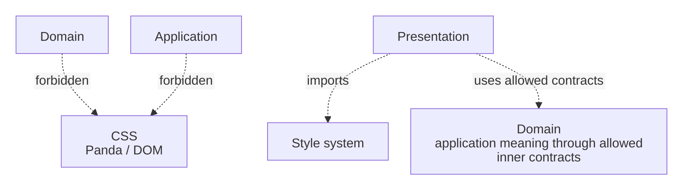
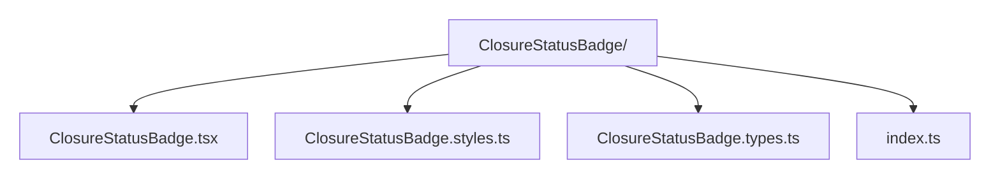

<a id="styling--animation-architecture-presentation"></a>
<a id="approach-a-a-mirrored-styles-tree"></a>

# Styling & Animation in an Onion Application

Styling and animation live in the **[Presentation](../../../GLOSSARY.md#presentation-layer) ring** because they exist to render and communicate UI state.

[Onion Architecture](../../../GLOSSARY.md#onion-architecture) does not prescribe CSS files, CSS-in-JS, Panda CSS, Tailwind, CSS Modules, GSAP or a particular folder tree.

The canonical repository guidance now lives in:

**[Frontend Styling and Design-System Architecture](../../frontend/styling-and-design-system.md)**

That guide covers:

- primitive vs. semantic [design tokens](../../../GLOSSARY.md#design-token);
- Panda `sva` local [slot recipes](../../../GLOSSARY.md#slot-recipe);
- `defineRecipe` / `defineSlotRecipe` for shared [design-system](../../../GLOSSARY.md#design-system) [recipes](../../../GLOSSARY.md#recipe);
- component [colocation](../../../GLOSSARY.md#colocation);
- avoiding duplicate recipe ownership;
- global styles and keyframes;
- responsive policy;
- runtime inline values;
- variants vs. specificity escalation.

**Contents**

- [Onion-specific rule](#onion-specific-rule)
- [Colocation](#colocation)
- [Sources](#sources)

## Onion-specific rule

[Presentation](../../../GLOSSARY.md#presentation-layer) styling may depend on UI state and [design-system](../../../GLOSSARY.md#design-system) contracts.

Inner layers must not depend on styling mechanisms:



A domain status may be mapped to a visual tone in Presentation:

```ts
function closureTone(status: ClosureStatus): BadgeTone {
  switch (status) {
    case 'completed':
      return 'success'
    case 'failed':
      return 'danger'
    default:
      return 'neutral'
  }
}
```

Do not put `color: 'green'` or `badgeVariant` into the [Domain](../../../GLOSSARY.md#domain) object.

<a id="approach-b-colocation-inside-the-feature-folder"></a>

<a id="choosing"></a>

## Colocation

Component-local visual concerns should normally travel with the component:



Shared [design-system](../../../GLOSSARY.md#design-system) primitives belong to a shared design-system owner.

That is a [Presentation](../../../GLOSSARY.md#presentation-layer) organization choice, not a new ring.

<a id="references"></a>

## Sources

- Panda CSS documentation: https://panda-css.com/
- Kent C. Dodds, "[Colocation](../../../GLOSSARY.md#colocation)": https://kentcdodds.com/blog/colocation
