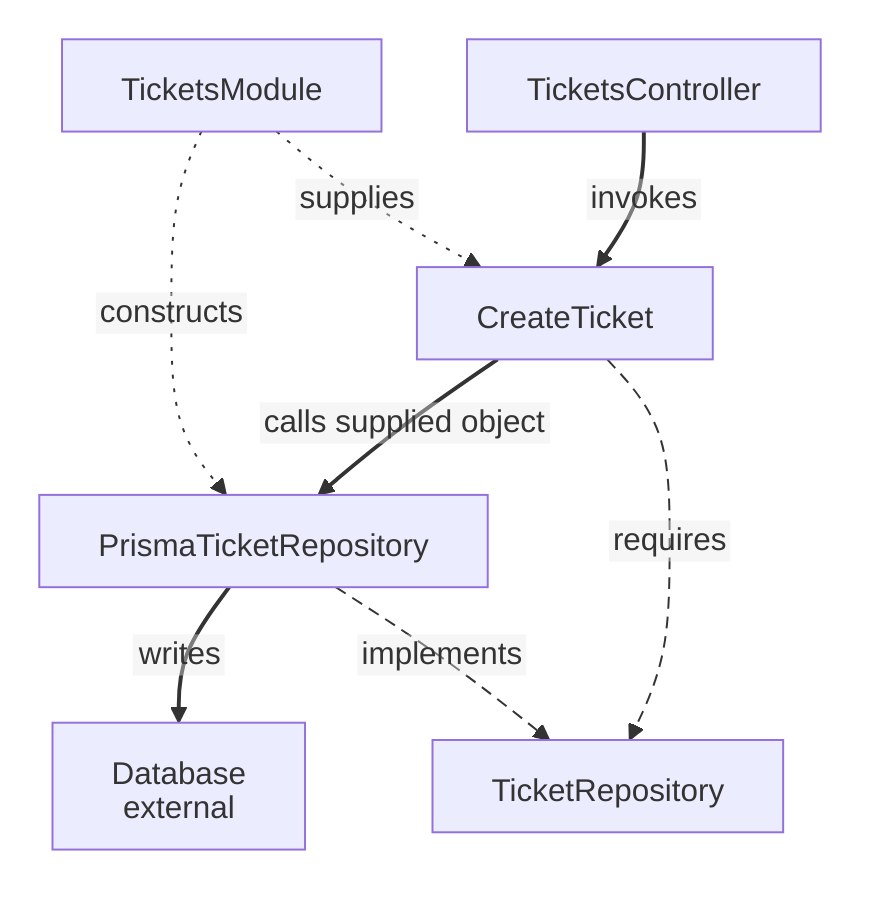

# Onion Architecture on the Backend

An analyst creates a support ticket. Its validity still matters when the caller uses a CLI or storage changes. Onion places that business model at the center and externalizes the mechanisms around it.

Follow the [backend route](../../backend/README.md) for the canonical code.

**Contents**

- [What belongs at the center?](#what-belongs-at-the-center)
- [Why does the storage contract belong inward?](#why-does-the-storage-contract-belong-inward)
- [Trace source, startup and runtime separately](#trace-source-startup-and-runtime-separately)
- [Boundaries and failures](#boundaries-and-failures)
- [Clean and Onion read the same example differently](#clean-and-onion-read-the-same-example-differently)
- [Sources](#sources)

## What belongs at the center?

`Ticket.create()` decides subject validity and initial `open` state. This business state and behavior form the **domain model** at the center. `CreateTicket` coordinates construction and saving in [Application](../../../GLOSSARY.md#application-layer).

A domain service is useful for business behavior spanning several objects. The subject rule naturally belongs to `Ticket` and needs no additional service.

## Why does the storage contract belong inward?

`CreateTicket` needs `insert(ticket): Promise<void>`. `TicketRepository` expresses that requirement; memory and Prisma implementations perform it.

Here [Application](../../../GLOSSARY.md#application-layer) owns the persistence interaction it requires. Palermo's original description places repository interfaces near the domain model. A business-owned repository can belong there in another design; both choices keep the concrete database implementation outside.

| Artifact | Responsibility |
| --- | --- |
| `Ticket` | Ticket rules and state |
| `CreateTicket` | Creation workflow |
| `TicketRepository` | Required persistence interaction |
| `TicketsController` | HTTP translation |
| `PrismaTicketRepository` | Database write and field mapping |
| `TicketsModule` | Startup construction |

## Trace source, startup and runtime separately

Solid arrows are runtime calls, long dashes source relationships and short dots startup wiring. The contract describes the interaction rather than forwarding calls.

## Boundaries and failures

HTTP parsing checks the request shape; [Domain](../../../GLOSSARY.md#domain) checks ticket meaning. The operation returns a plain result; delivery chooses HTTP fields and status. The memory implementation lasts only for that process.

The [final backend map](../../backend/4-create-ticket-with-nestjs.md) owns exact source paths and integration limits.

## Clean and Onion read the same example differently

Clean emphasizes levels of policy and boundary translation. Onion emphasizes an independent domain model surrounded by external mechanisms. Both protect inward dependency direction, without making their descriptions interchangeable.

See [the style comparison](../../backend/5-architectural-styles-with-nestjs.md) and [backend exercises](../../backend/exercises/README.md).

## Sources

- [Palermo: Onion Architecture, part 1](https://jeffreypalermo.com/2008/07/the-onion-architecture-part-1/)
- [Palermo: Onion Architecture, part 3](https://jeffreypalermo.com/2008/08/the-onion-architecture-part-3/)
- [Martin: Clean Architecture](https://blog.cleancoder.com/uncle-bob/2012/08/13/the-clean-architecture.html)
