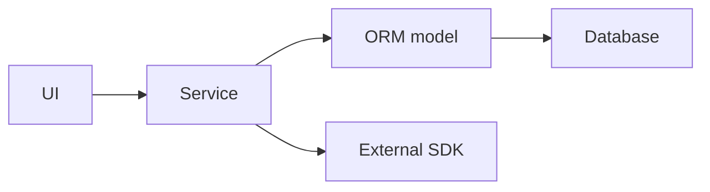
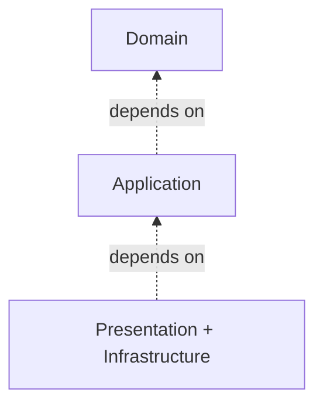
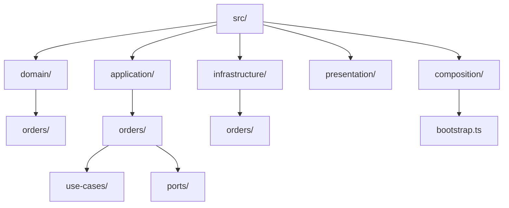
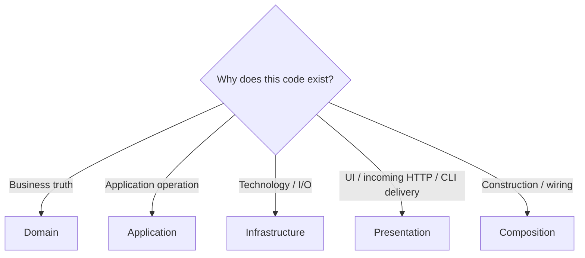
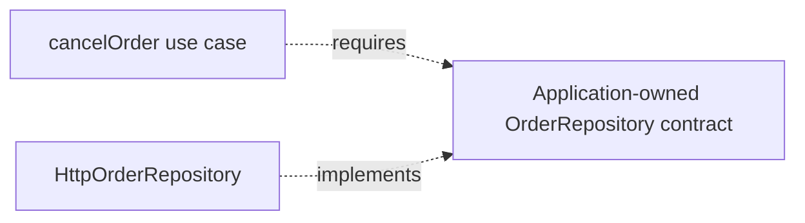
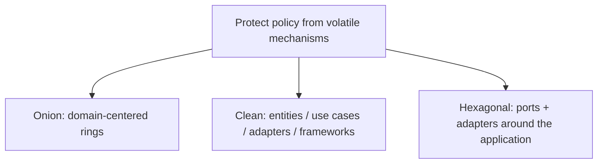

<a id="onion-architecture-for-the-frontend"></a>

# Onion Architecture

> A progressive guide to Jeffrey Palermo's domain-centered architecture.

← [Repository home](../../../README.md) · [Glossary](../../../GLOSSARY.md) · [Code placement](../../foundations/code-placement.md) · [Naming](../../conventions/naming-and-file-placement.md)

For a server-side application, first follow [Backend Architecture](../../backend/README.md), then [Onion on the backend](7-onion-on-the-backend.md). Follow the same ticket from its domain rules through its operation, required storage capability and HTTP/database [adapters](../../../GLOSSARY.md#adapter).

<a id="1-introduction--purpose"></a>

## 1. History and origin

Jeffrey Palermo published the [Onion Architecture](../../../GLOSSARY.md#onion-architecture) series in **2008**. His goal was to keep long-lived business applications from becoming organized around databases, UI frameworks and other infrastructure.

Palermo's framing places the **domain model at the center** and requires dependencies to point inward.

Primary source: https://jeffreypalermo.com/2008/07/

## 2. What problem does it solve?

Suppose our ticket platform decides that a resolved ticket cannot be assigned to an analyst again. That decision is about tickets, not about the table in which they are stored. If the rule is written against an [ORM](../../../GLOSSARY.md#orm) row (the database library's representation of the record), replacing the database tool can force changes to ticket behavior.

[Onion Architecture](../../../GLOSSARY.md#onion-architecture) puts such business rules at the center, in code that does not need to know which database, HTTP client, or UI happens to be in use. Other parts call that code and handle the technical details around it.

A common failure is infrastructure-driven design:



When ORM/API/framework models become the application's language:

- domain rules inherit infrastructure constraints;
- tests require technical systems;
- technology migrations become business rewrites;
- application policy becomes difficult to identify.

Onion reverses that ownership: external mechanisms adapt to application/domain contracts.

UI composition, deployment and discovering the business model still require their own decisions.

<a id="6-why-this-architecture"></a>

<a id="why-this-architecture"></a>

## 3. Strong-fit scenarios

Onion is a strong fit when:

- the domain has meaningful rules/behavior;
- the application is expected to live for years;
- infrastructure choices may change;
- multiple mechanisms surround the same business policy;
- independent testing of [Domain](../../../GLOSSARY.md#domain)/[Application](../../../GLOSSARY.md#application-layer) matters.

## 4. Weak-fit scenarios

It can be unnecessarily expensive for:

- tiny CRUD utilities;
- throwaway prototypes;
- applications with almost no domain behavior;
- simple content sites where abstractions protect little real volatility.

Palermo explicitly framed Onion for complex, long-lived business applications rather than every small site.

## 5. Mental model

Read the diagram from the center outward: the ticket rule lives at the center; an operation such as “assign ticket” uses that rule; the UI and database-facing code connect the outside world to that operation. The arrows below describe which source-code areas may depend on which others, **not** the order of HTTP calls at runtime.



[Presentation](../../../GLOSSARY.md#presentation-layer) and [Infrastructure](../../../GLOSSARY.md#infrastructure) are outer concerns. [Application](../../../GLOSSARY.md#application-layer) surrounds [Domain](../../../GLOSSARY.md#domain).

The central rule is simple:

> Outer code may depend inward; inner code must not know outer mechanisms.

<a id="domain"></a>

<a id="application"></a>

<a id="infrastructure"></a>

<a id="presentation"></a>

## 6. Rings and responsibilities

This repository uses four practical areas plus an executable composition boundary to implement the Onion idea. These are physical ownership conventions; Palermo also describes [Domain Services](../../../GLOSSARY.md#domain-service) and [Application Services](../../../GLOSSARY.md#application-service), rather than prescribing this exact four-folder taxonomy:

| Area | Owns | Put here | Do not put here | May depend on |
| --- | --- | --- | --- | --- |
| [Domain](../../../GLOSSARY.md#domain) | business concepts and [invariants](../../../GLOSSARY.md#invariant) | entities, [value objects](../../../GLOSSARY.md#value-object), domain policies/events | React, Redux, HTTP, [ORM](../../../GLOSSARY.md#orm), [DTOs](../../../GLOSSARY.md#data-transfer-object-dto) | Domain only |
| [Application](../../../GLOSSARY.md#application-layer) | application operations and required capabilities | [use cases](../../../GLOSSARY.md#use-case), commands/results, [ports](../../../GLOSSARY.md#port) | concrete UI/DB/HTTP implementations | Application + Domain |
| [Infrastructure](../../../GLOSSARY.md#infrastructure) | technical [adapters](../../../GLOSSARY.md#adapter) and external representations | HTTP/DB/storage/SDK implementations, DTOs, [mappers](../../../GLOSSARY.md#mapper) | [Presentation](../../../GLOSSARY.md#presentation-layer) and authoritative business policy | Infrastructure + Application + Domain |
| Presentation | Interaction and incoming delivery | UI or HTTP/CLI translation | concrete Infrastructure in the strict boundary used here | Presentation + Application |
| Composition | executable assembly | concrete construction/bootstrap | business rules | all concrete modules required for wiring |

### Why isolate the rings?

Different concerns change for different reasons.

- [Domain](../../../GLOSSARY.md#domain) changes when business rules change.
- [Application](../../../GLOSSARY.md#application-layer) changes when workflows change.
- [Infrastructure](../../../GLOSSARY.md#infrastructure) changes when technology/integrations change.
- [Presentation](../../../GLOSSARY.md#presentation-layer) changes when user interaction changes.

The purpose of the onion is to prevent outer change from forcing inner policy to change unnecessarily.

## 7. Recommended physical structure



| Path | Owns | Why | Must not contain |
| --- | --- | --- | --- |
| `domain/` | domain meaning/[invariants](../../../GLOSSARY.md#invariant) | center should survive technical replacement | HTTP/DB/UI/framework details |
| `application/` | use-case orchestration + [ports](../../../GLOSSARY.md#port) | policy declares what capabilities it needs | concrete [adapters](../../../GLOSSARY.md#adapter) |
| `infrastructure/` | concrete technologies | translates external mechanisms to inner contracts | presentation behavior |
| `presentation/` | UI interaction/view state and incoming HTTP/CLI delivery | isolates caller-specific change | database clients and outbound integration implementations |
| `composition/` | object graph/bootstrap | selects implementations without [service location](../../../GLOSSARY.md#service-locator) | domain/application branching |

The folder names and layer-first hierarchy are documentation conventions; the inward dependency direction is the architecture. Capabilities and sub-capabilities grow inside their layer, as [Scheduling illustrates](../../foundations/code-placement.md#12-grow-capabilities-inside-each-layer). The [frontend structure](../../frontend/README.md) and the [backend delivery paths](../../backend/README.md#place-your-first-feature) use that same convention; Palermo did not prescribe this filesystem layout.


<a id="7-type-placement-in-onion-architecture"></a>

<a id="type-placement-in-onion-architecture"></a>

<a id="decision-rules"></a>

<a id="quick-reference"></a>

## 8. Where does code go?



| Code | Owner | Reason |
| --- | --- | --- |
| `Order.cancel()` | [Domain](../../../GLOSSARY.md#domain) | business [invariant](../../../GLOSSARY.md#invariant) |
| `cancelOrder(id)` | [Application](../../../GLOSSARY.md#application-layer) | use-case coordination |
| `OrderRepository` [port](../../../GLOSSARY.md#port) | Application | required capability expressed inward |
| `HttpOrderRepository` | [Infrastructure](../../../GLOSSARY.md#infrastructure) | concrete transport |
| `ApiOrderDto` | Infrastructure | wire shape |
| `useOrders()` | [Presentation](../../../GLOSSARY.md#presentation-layer) | view-oriented [facade](../../../GLOSSARY.md#facade-pattern) |
| `CancelOrderButton.tsx` | Presentation | rendering/gesture |
| dependency construction | Composition | outer assembly |

For functions, types and helpers, use **[Code Placement](../../foundations/code-placement.md)**.

<a id="import-rule"></a>

## 9. Why ports belong inward

Suppose cancellation requires persistence.

[Application](../../../GLOSSARY.md#application-layer) expresses the capability it needs:

```ts
// Signature excerpt; complete contracts follow in section 11.
export interface OrderRepository {
  findById(id: OrderId): Promise<Order | null>
  save(order: Order): Promise<void>
}
```

[Infrastructure](../../../GLOSSARY.md#infrastructure) implements that capability:

```ts
// infrastructure/http/orders/adapters/HttpOrderRepository.ts
export class HttpOrderRepository implements OrderRepository {
  // HTTP-specific details
}
```

The arrows here show **source-code contract relationships only**; `OrderRepository` is not an intermediary object that forwards calls at runtime.



Application owns the language "load/save orders". Infrastructure owns HTTP and calls the external API at runtime after it has been injected into the operation. The [port](../../../GLOSSARY.md#port) itself makes no HTTP request.

This is [Dependency Inversion](../../../GLOSSARY.md#dependency-inversion-principle-dip): runtime control can reach outward while source dependencies remain inward.

<a id="8-naming--conventions-portable-defaults"></a>

<a id="naming--conventions"></a>

## 10. Naming

`Order` names the model, `CancelOrder` the operation and `OrderRepository` its required persistence interaction. Follow [Naming and File Placement](../../conventions/naming-and-file-placement.md).

## 11. First feature end to end

A clerk cancels an order. Onion puts the cancellation rule in the independent Order model. The surrounding operation coordinates loading and saving through a required contract; the concrete storage implementation stays outside.

The [shared focused example](../clean-architecture/4-building-a-feature.md) supplies the mechanism. Onion's question is whether the model remains independent when storage changes.

<a id="complete-client-implementation"></a>

Compare [Onion on the backend](7-onion-on-the-backend.md) for the same reading of Ticket. The [frontend](../../frontend/README.md) and [backend](../../backend/README.md) routes own delivery mechanics.

## 12. Testing the rings

| Scope | What to test | Typical dependency |
| --- | --- | --- |
| [Domain](../../../GLOSSARY.md#domain) | [invariants](../../../GLOSSARY.md#invariant) and domain behavior | none outside Domain |
| [Application](../../../GLOSSARY.md#application-layer) | use-case orchestration | [fake](../../../GLOSSARY.md#fake)/[stub](../../../GLOSSARY.md#stub) [ports](../../../GLOSSARY.md#port) |
| [Infrastructure](../../../GLOSSARY.md#infrastructure) | mapping, persistence and transport integration | controlled external system |
| [Presentation](../../../GLOSSARY.md#presentation-layer) | view state and rendering | fake application capability |
| Architecture | import/dependency rules | source graph |
| End-to-end | critical journey | complete executable graph |

See **[Testing the Rings](3-testing-in-onion.md)**.

<a id="avoid"></a>

## 13. Trade-offs and failure modes

Costs:

- more explicit boundaries and mapping;
- additional modules/files;
- object composition;
- learning cost for teams unfamiliar with dependency inversion.

Common failure modes:

- **[ORM](../../../GLOSSARY.md#orm)-centered domain** — database schema dictates business objects;
- **god [application service](../../../GLOSSARY.md#application-service)** — every capability enters one service;
- **god [port](../../../GLOSSARY.md#port)** — one interface contains unrelated external conversations;
- **[service locator](../../../GLOSSARY.md#service-locator)** — inner code reaches into the container;
- **outer-type leakage** — browser/SDK/ORM/transport types appear inward;
- **ceremonial onion** — directories exist but imports still point outward;
- **over-modeling** — rich [Domain](../../../GLOSSARY.md#domain) abstractions are invented for behavior that does not exist.

<a id="contents"></a>

## 14. Progressive learning path

Read in this order:

1. **[The Rings](1-the-rings.md)**
2. **[Inward Dependencies](2-inward-dependencies.md)**
3. **[Testing the Rings](3-testing-in-onion.md)**
4. **[Advanced Patterns](4-advanced-patterns.md)**
5. **[Styling & Animation](5-styling-and-animation.md)**
6. **[Evolution & Scaling](6-scaling.md)**
7. **[Onion on the Backend](7-onion-on-the-backend.md)**

The first two chapters deepen placement and dependency rules already introduced here. Advanced topics come later.

## 15. Relationship to Clean and Hexagonal



They overlap strongly but are not identical taxonomies.

## Sources

- Jeffrey Palermo, "The [Onion Architecture](../../../GLOSSARY.md#onion-architecture)" series (2008): https://jeffreypalermo.com/2008/07/
- Robert C. Martin, "The [Clean Architecture](../../../GLOSSARY.md#clean-architecture)": https://blog.cleancoder.com/uncle-bob/2012/08/13/the-clean-architecture.html
- Alistair Cockburn, "[Hexagonal Architecture](../../../GLOSSARY.md#hexagonal-architecture-ports-and-adapters)": https://alistair.cockburn.us/hexagonal-architecture/
- Mark Seemann, "[Composition Root](../../../GLOSSARY.md#composition-root)": https://blog.ploeh.dk/2011/07/28/CompositionRoot/
