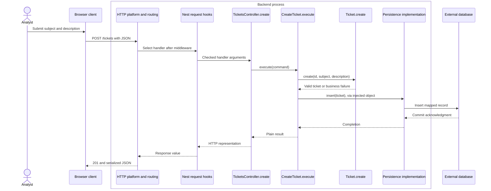
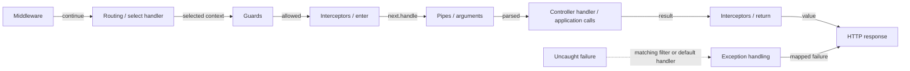

# 1. HTTP Request to Business Operation

← [Backend learning path](README.md) · Next: [TypeScript-first boundaries](2-typescript-first-boundaries.md)

## 1. The analyst sends information

The analyst fills in a subject and description. The browser sends a message to `https://support.example.test/tickets` and waits for an answer. The browser is the **client**, the program asking another program to do work. The backend's HTTP server listens for such messages; HTTP is the agreed protocol for expressing requests and responses. We use the established server platform, not a custom implementation of that protocol.

This message is an **HTTP request**. Its **method**, `POST`, expresses how the target resource is to process the supplied content. The server offers a set of operations other programs can call: its **API** (application programming interface). Our API gives this request the business meaning “create a ticket”; HTTP alone does not specify ticket rules. The **URL** identifies the target using a scheme (`https`), host (`support.example.test`) and **path** (`/tickets`). A query string, if present, is separate from that path. **Headers** carry metadata such as the content format; the **body** carries the submitted content.

```http
POST /tickets HTTP/1.1
Host: support.example.test
Content-Type: application/json

{"subject":"Invoice download fails","description":"The PDF button returns an error for invoice INV-42."}
```

The body here uses **JSON**, a text format for objects, arrays and simple values. Decoding JSON gives JavaScript data; it does not establish that the data is a valid ticket. Malformed JSON can fail at the server's body decoder before our own parsing function runs.

The answer is an **HTTP response**: a message with a **status code**, headers and optional body. `201 Created` indicates successful creation; our chosen response representation is:

```http
HTTP/1.1 201 Created
Content-Type: application/json

{"ticket_id":"T-42","subject":"Invoice download fails","description":"The PDF button returns an error for invoice INV-42.","status":"open"}
```

Turning the returned JavaScript object into JSON text is **serialization**. A Ticket class's methods or private fields are not the HTTP contract; we select the fields explicitly. `400` can represent malformed input or an invalid subject in this API; `503` can represent temporary storage unavailability; an unexpected defect should produce a safe `500`, not internal database details. Those mappings are API choices, not business rules.

HTTP definitions: [RFC 9110](https://www.rfc-editor.org/rfc/rfc9110.html), especially methods, representations and status codes.

## 2. Which function receives it?

The server exposes other operations too. It needs a rule that associates the method `POST` plus the path `/tickets` with the function that accepts ticket submissions. Such a matching rule is a **[route](../GLOSSARY.md#http-route)**; selecting the function is **[routing](../GLOSSARY.md#http-routing)**; the code that performs the selection is a **[router](../GLOSSARY.md#http-routing)**. A pattern such as `/tickets/:id` may match many concrete paths. A path alone cannot distinguish `GET /tickets` from `POST /tickets`.

The externally callable HTTP operation is an **[endpoint](../GLOSSARY.md#http-endpoint)**. In this track, `POST /tickets` names an endpoint and its route names the matching rule. Teams often use “route” and “endpoint” interchangeably, or use endpoint to mean just a URL; clarify whether they mean the public operation, its path or the routing configuration.

The selected function is the **[route handler](../GLOSSARY.md#route-handler)**. NestJS is the server framework we will use to register and run these handlers. `TicketsController.create()` will be our handler in Nest. `TicketsController` is a **[controller](../GLOSSARY.md#controller)** class grouping related handlers; it is not itself an endpoint. A later `find()` handler in the same class could serve `GET /tickets/:id`. Nest reads annotations beside the class and method, called **decorators**, to combine the controller path prefix with the handler's path and HTTP method. The name `create` does not determine the HTTP method. See [Nest controllers](https://docs.nestjs.com/controllers).

## 3. Follow the ticket, not just the network

The submitted object crosses a **transport boundary**: data from a client outside our trusted code becomes input to our program. Even a familiar browser may send incorrect or malicious values. The backend checks the shape, then applies its own rules. Frontend checks provide feedback; they cannot authorize or validate authoritative [server state](../GLOSSARY.md#server-state).

The handler calls an operation that creates and saves the ticket. We call this operation a **[use case](../GLOSSARY.md#use-case)**, meaning one task offered by the application. `CreateTicket` coordinates the task. `Ticket.create()` owns the business behavior, meaning decisions about a valid ticket independent of HTTP. This business model is **[Domain](../GLOSSARY.md#domain)**; the coordinating workflow is **[Application](../GLOSSARY.md#application-layer)**.

Saving requires an object with an `insert(ticket)` method. `TicketRepository` describes that capability in [Application](../GLOSSARY.md#application-layer)'s language; such a required contract is an outbound **[port](../GLOSSARY.md#port)**. The concrete object that implements the method using a database is a persistence **[adapter](../GLOSSARY.md#adapter)**. Its database calls and translation belong to **[Infrastructure](../GLOSSARY.md#infrastructure)**. The HTTP controller is an inbound [adapter](../GLOSSARY.md#adapter): it accepts an external request and invokes the application. Neither [adapter](../GLOSSARY.md#adapter) becomes the owner of initial ticket status.

All solid arrows in this diagram are **runtime messages/calls or returns**. The repository contract is stated in prose rather than drawn as an extra running process.



This is the successful path, not a guarantee of one insert for repeated submissions. Memory stands in for the database in chapter 2; chapter 4 introduces durable persistence. A contract is a source-code requirement, not another network hop. At startup separate code must choose the concrete repository and give it to `CreateTicket`; that assembly location is the **[composition root](../GLOSSARY.md#composition-root)**. It owns wiring, not validation.

## 4. Framework lifecycle is a different view

Before Nest calls `create`, repeated request concerns need extension points. Raw request logging can run early (**[middleware](../GLOSSARY.md#middleware)**); an access decision can stop an unauthorized call (**[guard](../GLOSSARY.md#nestjs-guard)**); code can wrap execution and measure it (**[interceptor](../GLOSSARY.md#nestjs-interceptor)**); an argument can be parsed or rejected (**[pipe](../GLOSSARY.md#nestjs-pipe)**). An **[exception filter](../GLOSSARY.md#nestjs-exception-filter)** translates an uncaught failure to an HTTP response. These names identify framework mechanisms, not business layers. Chapter 3 demonstrates each.

Solid arrows below show normal **execution order**; the dashed path is **exception handling**. Routing selection is simplified: [middleware](../GLOSSARY.md#middleware) may match paths but runs before the target handler is selected. Not every application installs every hook.



The [official Nest lifecycle](https://docs.nestjs.com/faq/request-lifecycle) orders guards and inbound interceptors from global to controller to handler. Outbound interceptors unwind in reverse. Pipes also have parameter bindings; for multiple parameters, processing starts at the last parameter. Filters are selected from handler to controller to global, and a filter that handles an exception does not forward it to another filter. Caught errors do not enter this exception path. [Middleware](../GLOSSARY.md#middleware) failures use the global exception handling scope.

The framework does not insert `Ticket.create()` or `insert()` into its lifecycle. Those calls occur **inside our handler's application invocation**. Adding a guard does not add an architectural layer; introducing a persistence [port](../GLOSSARY.md#port) does not add a Nest hook.

## 5. Trace it yourself

If a request changes to `GET /tickets`, routing selects a different handler (or no match). If the subject is blank, the same creation operation rejects it whichever client invoked it. If storage fails, the HTTP [adapter](../GLOSSARY.md#adapter) selects an error response. If a command-line tool creates tickets, [HTTP routing](../GLOSSARY.md#http-routing) and Nest HTTP hooks are bypassed while the same application operation can run.

Next: [Implement these boundaries in plain TypeScript](2-typescript-first-boundaries.md). Supporting architectural sources: [Cockburn](https://alistair.cockburn.us/hexagonal-architecture/) and [Martin](https://blog.cleancoder.com/uncle-bob/2012/08/13/the-clean-architecture.html).
