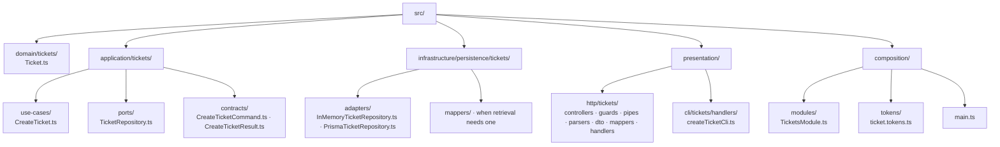

# 4. Create Ticket with NestJS

← [Nest mechanisms](3-nestjs-building-blocks.md) · [Backend path](README.md) · Next: [Compare styles](5-architectural-styles-with-nestjs.md)

## 1. Requirement and ownership

A support-platform user submits a subject and description. The backend validates the request, creates a ticket with its authoritative initial state, persists it and returns an HTTP representation. The support capability owns ticket vocabulary and validity. The client is outside the transport trust boundary; the database is another external system whose availability and schema cannot be assumed infallible.

Start with the [complete plain modules in chapter 2](2-typescript-first-boundaries.md): `Ticket`, `TicketRepository`, `CreateTicket`, the request parser and memory repository. Their code stays canonical there. We add Nest routing and assembly; we do not replace those rules with decorators.

<a id="physical-structure"></a>

## 2. Physical structure and dependency decisions

Keep `src/{domain,application,infrastructure,presentation,composition}/`, then place Tickets inside each layer. All arrows below mean **directory containment**, not imports or calls:



Prefix every file below with `src/`. This map covers responsibilities demonstrated across the backend path; it does not imply that optional access, CLI and retrieval concerns are registered in this chapter's creation-only module.

| Responsibility | Exact file | What it owns |
| --- | --- | --- |
| [Domain entity](../GLOSSARY.md#domain-entity) | `domain/tickets/Ticket.ts` | Subject validity and initial `open` status |
| [Use case](../GLOSSARY.md#use-case) | `application/tickets/use-cases/CreateTicket.ts` | Creates and persists through the required contract |
| Persistence [port](../GLOSSARY.md#port) | `application/tickets/ports/TicketRepository.ts` | Required persistence behavior and recognized storage failure |
| Input contract | `application/tickets/contracts/CreateTicketCommand.ts` | Operation input, independent of HTTP |
| Output contract | `application/tickets/contracts/CreateTicketResult.ts` | Operation outcome, independent of status codes |
| Memory implementation | `infrastructure/persistence/tickets/adapters/InMemoryTicketRepository.ts` | Creation-only process-local storage |
| Prisma implementation | `infrastructure/persistence/tickets/adapters/PrismaTicketRepository.ts` | Database write, safe diagnostics and failure translation |
| Persistence [mapper](../GLOSSARY.md#mapper), **only if retrieval is added** | `infrastructure/persistence/tickets/mappers/mapTicketPersistenceRecord.ts` | Restores stored identity/status through a supported [Domain](../GLOSSARY.md#domain) restoration mechanism; do not reset resolved records through `Ticket.create` |
| Nest [Controller](../GLOSSARY.md#controller) | `presentation/http/tickets/controllers/TicketsController.ts` | Groups [route handlers](../GLOSSARY.md#route-handler) and translates operation outcomes |
| Access Guard, **optional example** | `presentation/http/tickets/guards/AuthenticatedGuard.ts` | Uses a previously verified principal to decide access |
| [Nest Pipe](../GLOSSARY.md#nestjs-pipe) | `presentation/http/tickets/pipes/CreateTicketPipe.ts` | Applies the plain [Parser](../GLOSSARY.md#parser) to an argument and maps parsing failure |
| Plain [Parser](../GLOSSARY.md#parser) | `presentation/http/tickets/parsers/parseCreateTicketRequest.ts` | Checks unknown request shape |
| Request [DTO](../GLOSSARY.md#data-transfer-object-dto) | `presentation/http/tickets/dto/CreateTicketRequestDto.ts` | Accepted HTTP input representation |
| Response [DTO](../GLOSSARY.md#data-transfer-object-dto) | `presentation/http/tickets/dto/TicketResponseDto.ts` | Selected HTTP output fields |
| Response [mapper](../GLOSSARY.md#mapper) | `presentation/http/tickets/mappers/mapCreateTicketResponse.ts` | Renames/selects successful ticket fields, shared by the plain handler and Nest |
| Plain HTTP handler | `presentation/http/tickets/handlers/TicketHttpHandler.ts` | Executes the same operation without Nest |
| Plain access wrapper, **optional example** | `presentation/http/tickets/handlers/handleAuthenticatedCreateTicket.ts` | Checks verified identity before invoking that handler |
| CLI handler, **exercise** | `presentation/cli/tickets/handlers/createTicketCli.ts` | Arguments, terminal messages and exit codes |
| Nest assembly | `composition/modules/TicketsModule.ts` | Registers concrete dependencies |
| Runtime injection key | `composition/tokens/ticket.tokens.ts` | Names the persistence provider |
| Startup | `composition/main.ts` | Starts Nest |

No custom persistence record or separate CLI [DTO](../GLOSSARY.md#data-transfer-object-dto) is needed by the current snippets. If either gains a useful independent contract, its location is `infrastructure/persistence/tickets/dto/TicketPersistenceRecord.ts` or `presentation/cli/tickets/dto/CreateTicketCliInput.ts` respectively. Do not add placeholder files to fill the map.

[Domain](../GLOSSARY.md#domain) imports no Nest, Prisma, HTTP [DTO](../GLOSSARY.md#data-transfer-object-dto) or database record. [Application](../GLOSSARY.md#application-layer) imports [Domain](../GLOSSARY.md#domain) and its own contracts, never concrete persistence. [Infrastructure](../GLOSSARY.md#infrastructure) implements inward-owned contracts. [Presentation](../GLOSSARY.md#presentation-layer) translates and invokes the supported [Application](../GLOSSARY.md#application-layer) API, not [Domain](../GLOSSARY.md#domain) files. Composition imports the concrete pieces it assembles. The [alias convention](../conventions/naming-and-file-placement.md#9-source-imports-and-runtime-resolution) makes cross-layer imports visible as `@/` without changing these rules.

Clean's conceptual [Interface Adapters](../GLOSSARY.md#interface-adapter) circle, a TypeScript `interface` declaration and this physical [Presentation](../GLOSSARY.md#presentation-layer) area describe different things. Exact paths are handbook conventions, while Nest decorators/registration are framework mechanisms. `TicketRepository` expresses the needed persistence capability; it is not a requirement to create an interface for every class.

## 3. Finish the HTTP boundary

Use the [canonical `CreateTicketPipe`](3-nestjs-building-blocks.md#pipe-parse-a-handler-argument), placed beside the chapter 2 parser as `src/presentation/http/tickets/pipes/CreateTicketPipe.ts`. The parser rejects malformed shape; the [use case](../GLOSSARY.md#use-case) invokes the [Domain](../GLOSSARY.md#domain) factory for actual ticket validity. The optional `AuthenticatedGuard` in chapter 3 would decide access before the Pipe, but is not registered in this creation-only module.

`src/presentation/http/tickets/controllers/TicketsController.ts`:

```ts
import {
  Body, Controller, HttpCode, Inject, Post,
  BadRequestException, ServiceUnavailableException,
} from '@nestjs/common'
import { CreateTicket } from '@/application/tickets'
import { CreateTicketPipe } from '../pipes/CreateTicketPipe'
import type { CreateTicketRequestDto } from '../dto/CreateTicketRequestDto'
import { mapCreateTicketResponse } from '../mappers/mapCreateTicketResponse'

@Controller('tickets')
export class TicketsController {
  constructor(@Inject(CreateTicket) private readonly createTicket: CreateTicket) {}

  @Post()
  @HttpCode(201)
  async create(@Body(new CreateTicketPipe()) command: CreateTicketRequestDto) {
    const result = await this.createTicket.execute(command)
    if (!result.ok) {
      if (result.reason === 'invalid-subject') {
        throw new BadRequestException('invalid-subject')
      }
      throw new ServiceUnavailableException('unavailable')
    }
    return mapCreateTicketResponse(result.ticket)
  }
}
```

This [DTO](../GLOSSARY.md#data-transfer-object-dto) type is useful after the pipe; the annotation does not validate the original JSON. `ticket_id` is chosen by the HTTP contract, not by [Domain](../GLOSSARY.md#domain). The handler returns a plain response object, never a raw [ORM](../GLOSSARY.md#orm) row. Nest serializes it through standard response handling. The explicit `@HttpCode(201)` documents our API decision even though POST already defaults to `201`.

The Pipe and [Controller](../GLOSSARY.md#controller) throw Nest HTTP exceptions; Nest's built-in exception handling maps them to status responses. Its default error envelope differs from the plain handler's illustrative `{ error }` envelope in chapter 2. Here successful fields, status codes and short failure identifiers are our documented contract; standard Nest error envelopes are accepted. If clients need an exact uniform envelope, add and test a [Presentation](../GLOSSARY.md#presentation-layer)-owned filter. Unknown defects propagate to safe `500` handling and need internal logging. [Domain](../GLOSSARY.md#domain)/[Application](../GLOSSARY.md#application-layer) errors never import an HTTP status.

## 4. Wire memory first

At startup we need a real storage object, not an interface. Put the shared Symbol in a single module:

`src/composition/tokens/ticket.tokens.ts`:

```ts
export const TICKET_REPOSITORY = Symbol('TICKET_REPOSITORY')
```

`src/composition/modules/TicketsModule.ts`:

```ts
import { Module } from '@nestjs/common'
import { randomUUID } from 'node:crypto'
import { CreateTicket } from '@/application/tickets'
import type { TicketRepository } from '@/application/tickets/ports/TicketRepository'
import { InMemoryTicketRepository } from '@/infrastructure/persistence/tickets/adapters/InMemoryTicketRepository'
import { TicketsController } from '@/presentation/http/tickets/controllers/TicketsController'
import { TICKET_REPOSITORY } from '../tokens/ticket.tokens'

@Module({
  controllers: [TicketsController],
  providers: [
    { provide: TICKET_REPOSITORY, useClass: InMemoryTicketRepository },
    {
      provide: CreateTicket,
      inject: [TICKET_REPOSITORY],
      useFactory: (tickets: TicketRepository) => new CreateTicket(tickets, randomUUID),
    },
  ],
  exports: [CreateTicket],
})
export class TicketsModule {}
```

`src/composition/main.ts`:

```ts
import { Module } from '@nestjs/common'
import { NestFactory } from '@nestjs/core'
import { TicketsModule } from './modules'

@Module({ imports: [TicketsModule] })
class AppModule {}

async function bootstrap() {
  const app = await NestFactory.create(AppModule)
  app.enableShutdownHooks()
  await app.listen(3000)
}
void bootstrap()
```

Expose the framework assembly through its own entry point:

`src/composition/modules/index.ts`:

```ts
export { TicketsModule } from './TicketsModule'
```

In an actual Nest project, these modules use Nest's supported TypeScript decorator configuration and the usual platform/runtime dependencies. This repository does not install them. The two public entry points answer different questions:

| Consumer needs | Supported source import | What it guarantees |
| --- | --- | --- |
| creation operation, command and result | `application/tickets` via its `index.ts` | a plain TypeScript API; no Nest/database dependency |
| Nest registration of the capability | `composition/modules` via its `index.ts` | outer executable assembly exporting `TicketsModule` |

For example, another composition module imports `TicketsModule` from `composition/modules`; its application-facing consumer imports `CreateTicket` from `application/tickets`. Nest's `exports: [CreateTicket]` exposes the registered provider to importing [Nest modules](../GLOSSARY.md#nestjs-module). TypeScript exports expose source names; the architectural [public API](../GLOSSARY.md#public-api) is the deliberately supported subset. Neither mechanism prevents deep source imports. The fixture tests check layer boundaries; a real project's capability checks must separately enforce the public entry points. Do not re-register `CreateTicket` with another local memory store merely to make injection succeed. [Nest module visibility](https://docs.nestjs.com/modules), [public source contracts](../foundations/module-boundaries-and-public-apis.md).

## 5. Replace memory when the ticket must survive restart

Memory loses tickets on process exit and is not shared across replicas. That concrete limitation motivates the database implementation `PrismaTicketRepository`. We illustrate **Prisma [ORM](../GLOSSARY.md#orm) 7 with PostgreSQL**: a generated typed client for relational persistence, supplied with a PostgreSQL driver [adapter](../GLOSSARY.md#adapter). Here “driver [adapter](../GLOSSARY.md#adapter)” is Prisma's technology term for its connection to the database driver, not a new name for `TicketRepository`. Version-specific setup is kept explicit because current unversioned Prisma documentation describes other APIs too. This is an illustrative integration, not a mandate to use an [ORM](../GLOSSARY.md#orm).

Prisma schema excerpt for `prisma/schema.prisma` in the example application:

```prisma
generator client {
  provider = "prisma-client"
  output   = "../src/infrastructure/persistence/generated/prisma"
}

datasource db {
  provider = "postgresql"
}

model Ticket {
  id          String @id
  subject     String
  description String
  state       String
}
```

The `state` column intentionally shows a different storage field name. There is no database default owning initial state and no second enum allowlist; `PrismaTicketRepository` writes the factory's chosen status. Database constraints can defend stored data, but deriving/checking them against [Domain](../GLOSSARY.md#domain) requires migration discipline, not another manually maintained business vocabulary. A database primary key prevents overwrite on duplicate identity.

`src/infrastructure/persistence/tickets/adapters/PrismaTicketRepository.ts` (Prisma implementation of `TicketRepository`):

```ts
import { Prisma, type PrismaClient } from '@/infrastructure/persistence/generated/prisma/client'
import type { Ticket } from '@/domain/tickets/Ticket'
import {
  TicketPersistenceUnavailable, type TicketRepository,
} from '@/application/tickets/ports/TicketRepository'

function isStorageUnavailable(error: unknown): error is
  Prisma.PrismaClientInitializationError | Prisma.PrismaClientKnownRequestError {
  if (error instanceof Prisma.PrismaClientInitializationError) {
    return ['P1001', 'P1002', 'P1008', 'P1017'].includes(error.errorCode ?? '')
  }
  return error instanceof Prisma.PrismaClientKnownRequestError &&
    ['P1001', 'P1002', 'P1008', 'P1017', 'P2024'].includes(error.code)
}

export class PrismaTicketRepository implements TicketRepository {
  constructor(
    private readonly db: PrismaClient,
    private readonly recordFailure: (code: string) => void,
  ) {}

  async insert(ticket: Ticket): Promise<void> {
    const data = ticket.snapshot()
    try {
      await this.db.ticket.create({ data: {
        id: data.id, subject: data.subject,
        description: data.description, state: data.status,
      } })
    } catch (error) {
      if (isStorageUnavailable(error)) {
        // Record the recognized code before Application consumes this error.
        const code = error instanceof Prisma.PrismaClientInitializationError
          ? error.errorCode ?? 'unknown'
          : error.code
        this.recordFailure(code)
        throw new TicketPersistenceUnavailable('Ticket storage unavailable', { cause: error })
      }
      throw error
    }
  }
}
```

`PrismaTicketRepository` implements the inward `TicketRepository` contract using Prisma's database API. It maps `status` to `state`, awaits the write and discards the returned storage record. Replacing Prisma changes this outer implementation and its setup, while `CreateTicket` still requires the same insert behavior.

Recognized outages are recorded as an operation/code before translation into `TicketPersistenceUnavailable`. Unknown errors propagate; the callback receives neither ticket content nor raw error text. Both the database code and its recorder stay outside [Application](../GLOSSARY.md#application-layer). The [optional failure-policy discussion](#optional-deeper-reading-observability-and-failure-translation) explains classification and diagnostic limits.

Sources: [Prisma 7 generation](https://www.prisma.io/docs/orm/v7/prisma-client/setup-and-configuration/generating-prisma-client), [CRUD](https://www.prisma.io/docs/orm/v7/prisma-client/queries/crud), [error reference](https://www.prisma.io/docs/orm/v7/reference/error-reference).

### Keep database setup and lifetime at the outer edge

This resource owns the configured client and closes it on Nest shutdown. The application's database URL, migration configuration and generated code are technical concerns. They do not belong in `Ticket`.

`src/composition/modules/DatabaseModule.ts` (Prisma 7/PostgreSQL alternative):

```ts
import { Module } from '@nestjs/common'
import type { OnModuleDestroy } from '@nestjs/common'
import { PrismaPg } from '@prisma/adapter-pg'
import { PrismaClient } from '@/infrastructure/persistence/generated/prisma/client'

export class DatabaseResource implements OnModuleDestroy {
  constructor(readonly client: PrismaClient) {}
  async onModuleDestroy() { await this.client.$disconnect() }
}

@Module({
  providers: [{
    provide: DatabaseResource,
    useFactory: () => {
      const connectionString = process.env.DATABASE_URL
      if (!connectionString) throw new Error('DATABASE_URL is required')
      const adapter = new PrismaPg({ connectionString })
      return new DatabaseResource(new PrismaClient({ adapter }))
    },
  }],
  exports: [DatabaseResource],
})
export class DatabaseModule {}
```

To switch `composition/modules/TicketsModule.ts`, import `DatabaseModule` and `DatabaseResource` from `./DatabaseModule`, import `PrismaTicketRepository` from `@/infrastructure/persistence/tickets/adapters/PrismaTicketRepository`, add `imports: [DatabaseModule]`, and **replace** its memory binding with:

```ts
{
  provide: TICKET_REPOSITORY,
  inject: [DatabaseResource],
  useFactory: (database: DatabaseResource) => new PrismaTicketRepository(
    database.client,
    code => console.error({ operation: 'ticket.insert', code }),
  ),
}
```

Keep the use-case factory, [Controller](../GLOSSARY.md#controller) and inner modules unchanged. This binding selects the persistence implementation at startup; `CreateTicket` does not look it up in a container. In a separate example application, install matching Prisma 7 client/CLI and PostgreSQL driver [adapter](../GLOSSARY.md#adapter) dependencies, configure the migration URL in `prisma.config.ts`, generate the client and apply reviewed migrations before starting. Follow the [official Prisma 7 setup](https://www.prisma.io/docs/orm/v7/prisma-client/setup-and-configuration/introduction) rather than treating this boundary walkthrough as a deployment tutorial. [Nest lifecycle hooks](https://docs.nestjs.com/fundamentals/lifecycle-events) document shutdown handling.

### Optional deeper reading: observability and failure translation

The classifier above recognizes selected connection/time/pool failures. Unique-key violations such as `P2002`, invalid queries, schema drift and unrecognized driver errors propagate rather than becoming temporary outages. This limited **Prisma 7 error policy** needs integration tests against the selected driver and deployment before extending it. A `503` does not prove that retrying will create no duplicate ticket.

`PrismaTicketRepository` records an outage before `CreateTicket` turns it into `{ ok: false, reason: 'unavailable' }`. Logging only in the [Controller](../GLOSSARY.md#controller) would lose the original Prisma code. The translated error retains its `cause` while the error exists, but that cause does not survive the plain result; the recorded operation/code does. [Node.js error causes](https://nodejs.org/api/errors.html#errorcause) explain the ES2022 mechanism.

The callback above is an illustrative recorder and must not throw. Keep raw error messages, ticket bodies and connection strings out of it. A deployed recorder needs deliberate correlation, access and retention decisions; add those when designing observability, rather than making a domain logger or generic logging framework part of this persistence contract. The two safe fields locate a failure, but do not promise a complete diagnosis.

## 6. Three relationships in one system view

Trace solid arrows for **runtime calls**, light dashed arrows for **source dependencies/implementation**, and dotted arrows from the module for **startup wiring**. The source contract is separate from the object actually called; it is not a forwarding process. Node placement does not imply a network service.


Returns/data translations are shown in [chapter 1's sequence](1-http-request-to-business-operation.md#3-follow-the-ticket-not-just-the-network): `PrismaTicketRepository` maps ticket data to storage; `TicketsController.create()` maps the [Application](../GLOSSARY.md#application-layer) result to JSON fields. Startup does not rerun for every request. Default singleton providers are suitable because the [use case](../GLOSSARY.md#use-case) stores no per-request mutable fields; do not put the current user/body on the singleton.

## 7. Review changes and failures before calling it maintainable

| Pressure | Change owner | Stays stable | Detect accidental coupling with |
| --- | --- | --- | --- |
| New status or subject/creation rule | [Domain](../GLOSSARY.md#domain)'s vocabulary/factory; any newly required behavior and outward exhaustive display mappings | HTTP parser and persistence implementations contain no second allowlist | domain tests; compile/check outward mappings; API compatibility tests |
| Schema renames `state`, or Prisma/PostgreSQL is replaced | persistence implementation, migrations/generated types and Composition | `Ticket`, `CreateTicket`, HTTP contract | persistence integration tests; import boundary checks |
| CLI or message consumer creates tickets | [Presentation](../GLOSSARY.md#presentation-layer) parses that input, establishes permissions and calls `execute`; its process assembles the [use case](../GLOSSARY.md#use-case) | domain rules and [Application](../GLOSSARY.md#application-layer) workflow | [Application](../GLOSSARY.md#application-layer) tests with either caller; [Presentation](../GLOSSARY.md#presentation-layer) [contract tests](../GLOSSARY.md#contract-test) |
| Tickets, Billing, Users and Notifications grow | each capability owns its model and narrow operations; [Nest modules](../GLOSSARY.md#nestjs-module) expose intentional providers | unrelated feature internals remain private | import rules disallow deep imports; module integration tests |

Adding a new status changes the vocabulary once; API consumers may still require coordinated evolution. A changed creation rule may require a new command field, so legitimate outward changes are not evidence of broken architecture. Persistence replacement protects policy, not every migration/deployment file. [Nest module](../GLOSSARY.md#nestjs-module) boundaries can align with business ownership but do not enforce it by themselves; avoid a global `SharedServices` bucket and cross-feature repository access.

One insert is atomic enough for the first requirement. If creating a ticket also reserves quota, enforce that check with the write in an authoritative transaction; a read-then-write check alone races. If it must publish a notification reliably, specify a durable delivery policy (for example, an outbox) before adding messaging. If duplicate submissions must produce one ticket, introduce an application-level [idempotency](../GLOSSARY.md#idempotency) requirement and atomically persisted key/result; a fresh UUID per request does not deduplicate retries. No automatic retries are implemented here.

Authentication, tenant authorization, request-size limits, rate limiting, attachments, telemetry and notification delivery are outside these creation snippets. A deployed system must establish verified identity, access and resource limits; adding a guard alone does not implement those requirements. The first command intentionally contains no client-controlled actor/tenant identity.

## 8. Verification at the right boundary

| Check | What to observe |
| --- | --- |
| [Domain](../GLOSSARY.md#domain) unit tests | trim/length rules, initial state, rejected values, snapshot protection |
| [Application](../GLOSSARY.md#application-layer) tests with memory/failure substitutes | save-before-success, no insert on invalid input, recognized outage result, unexpected defect propagation |
| HTTP/Nest integration tests in an actual Nest app | `POST /tickets` selection, pipe rejection prevents execution, JSON field/status mapping, built-in error handling and any access guard |
| Prisma/database integration tests | migration compatibility, mapped `state`, restart durability, duplicate key and connection failures, resource shutdown |
| Source dependency checks | all layers follow the landing-page matrix; [Domain](../GLOSSARY.md#domain)/[Application](../GLOSSARY.md#application-layer) exclude framework dependencies; capability API restrictions require separate checks |

This repository runs the plain example's [compilation and behavior checks](../scripts/backend-ticket-example.test.mjs) through `npm run check`. Nest/Prisma snippets are reviewed version-specific integrations, **not runtime-tested here**; mocked library declarations would not prove their behavior. No root dependency or hosted workflow is added. A complete runnable deployment can be isolated later when framework/database exercises warrant its dependency cost.
