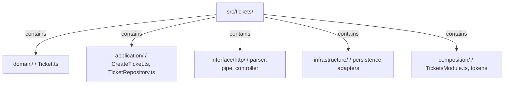
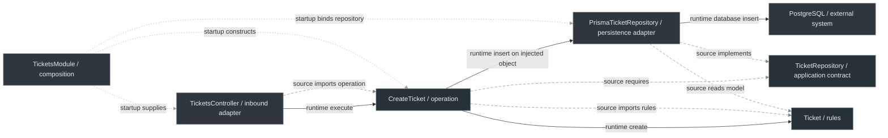

# 4. Create Ticket with NestJS

← [Nest mechanisms](3-nestjs-building-blocks.md) · [Backend path](README.md) · Next: [Compare styles](5-architectural-styles-with-nestjs.md)

## 1. Requirement and ownership

A support-platform user submits a subject and description. The backend validates the request, creates a ticket with its authoritative initial state, persists it and returns an HTTP representation. The support capability owns ticket vocabulary and validity. The client is outside the transport trust boundary; the database is another external system whose availability and schema cannot be assumed infallible.

Start with the [complete plain modules in chapter 2](2-typescript-first-boundaries.md): `Ticket`, `TicketRepository`, `CreateTicket`, the request parser and memory repository. Their code stays canonical there. We add Nest routing and assembly; we do not replace those rules with decorators.

## 2. Physical structure and dependency decisions

All arrows in this structure diagram mean **file ownership/containment**, not calls:



The [landing-page placement table](README.md#place-your-first-feature) explains each file's owner and permitted imports. `interface/http/` is our delivery convention; `presentation/http/` would also be reasonable. [Domain](../GLOSSARY.md#domain) cannot import `@nestjs/*`, Prisma, HTTP types, [DTOs](../GLOSSARY.md#data-transfer-object-dto) or database records. [Application](../GLOSSARY.md#application-layer) imports domain and its own contracts, never concrete persistence. [Infrastructure](../GLOSSARY.md#infrastructure) implements those inward-owned contracts. Delivery translates and invokes application; composition can import concrete pieces because it assembles them.

These dependency constraints define the protected inner policy in this example. Exact folder names and PascalCase filenames are [repository conventions](../conventions/naming-and-file-placement.md). Nest's decorators/registration metadata are framework requirements. Choosing a [port](../GLOSSARY.md#port) for volatile persistence is a recommended design here, not a requirement to create an interface for every class.

## 3. Finish the HTTP boundary

Use the [canonical `CreateTicketPipe`](3-nestjs-building-blocks.md#pipe-parse-a-handler-argument), placed beside the chapter 2 parser as `src/tickets/interface/http/CreateTicketPipe.ts`. The parser rejects malformed shape; the operation invokes the domain factory for actual ticket validity.

`src/tickets/interface/http/TicketsController.ts`:

```ts
import {
  Body, Controller, HttpCode, Inject, Post,
  BadRequestException, ServiceUnavailableException,
} from '@nestjs/common'
import { CreateTicket } from '../../application/CreateTicket'
import { CreateTicketPipe } from './CreateTicketPipe'
import type { CreateTicketRequest } from './createTicketRequest'

@Controller('tickets')
export class TicketsController {
  constructor(@Inject(CreateTicket) private readonly createTicket: CreateTicket) {}

  @Post()
  @HttpCode(201)
  async create(@Body(new CreateTicketPipe()) command: CreateTicketRequest) {
    const result = await this.createTicket.execute(command)
    if (!result.ok) {
      if (result.reason === 'invalid-subject') {
        throw new BadRequestException('invalid-subject')
      }
      throw new ServiceUnavailableException('unavailable')
    }
    const ticket = result.ticket
    return {
      ticket_id: ticket.id, subject: ticket.subject,
      description: ticket.description, status: ticket.status,
    }
  }
}
```

This [DTO](../GLOSSARY.md#data-transfer-object-dto) type is useful after the pipe; the annotation does not validate the original JSON. `ticket_id` is chosen by the HTTP contract, not by [Domain](../GLOSSARY.md#domain). The handler returns a plain response object, never a raw [ORM](../GLOSSARY.md#orm) row. Nest serializes it through standard response handling. The explicit `@HttpCode(201)` documents our API decision even though POST already defaults to `201`.

The pipe and controller throw Nest HTTP exceptions; Nest's built-in exception handling maps them to status responses. Its default error envelope differs from the plain handler's illustrative `{ error }` envelope in chapter 2. Here successful fields, status codes and short failure identifiers are our documented contract; standard Nest error envelopes are accepted. If clients need an exact uniform envelope, add and test a delivery-owned filter. Unknown defects propagate to safe `500` handling and need internal logging. [Domain](../GLOSSARY.md#domain)/[Application](../GLOSSARY.md#application-layer) errors never import an HTTP status.

## 4. Wire memory first

At startup we need a real storage object, not an interface. Put the shared Symbol in a single module:

`src/tickets/composition/ticket.tokens.ts`:

```ts
export const TICKET_REPOSITORY = Symbol('TICKET_REPOSITORY')
```

`src/tickets/composition/TicketsModule.ts`:

```ts
import { Module } from '@nestjs/common'
import { randomUUID } from 'node:crypto'
import { CreateTicket } from '../application/CreateTicket'
import type { TicketRepository } from '../application/TicketRepository'
import { InMemoryTicketRepository } from '../infrastructure/InMemoryTicketRepository'
import { TicketsController } from '../interface/http/TicketsController'
import { TICKET_REPOSITORY } from './ticket.tokens'

@Module({
  controllers: [TicketsController],
  providers: [
    { provide: TICKET_REPOSITORY, useClass: InMemoryTicketRepository },
    {
      provide: CreateTicket,
      inject: [TICKET_REPOSITORY],
      useFactory: (tickets: TicketRepository) => new CreateTicket(tickets, randomUUID),
    },
  ],
  exports: [CreateTicket],
})
export class TicketsModule {}
```

`src/composition/main.ts`:

```ts
import { Module } from '@nestjs/common'
import { NestFactory } from '@nestjs/core'
import { TicketsModule } from '../tickets/nest'

@Module({ imports: [TicketsModule] })
class AppModule {}

async function bootstrap() {
  const app = await NestFactory.create(AppModule)
  app.enableShutdownHooks()
  await app.listen(3000)
}
void bootstrap()
```

Expose the framework assembly through its own entry point:

`src/tickets/nest.ts`:

```ts
export { TicketsModule } from './composition/TicketsModule'
```

In an actual Nest project, these modules use Nest's supported TypeScript decorator configuration and the usual platform/runtime dependencies. This repository does not install them. The two public entry points answer different questions:

| Consumer needs | Supported source import | What it guarantees |
| --- | --- | --- |
| creation operation, command and result | `tickets/public` from chapter 2 | a plain TypeScript API; no Nest/database dependency |
| Nest registration of the capability | `tickets/nest` | outer executable assembly exporting `TicketsModule` |

For example, another [Nest module](../GLOSSARY.md#nestjs-module) imports `TicketsModule` from `tickets/nest` in its metadata and its consumer imports the `CreateTicket` class token from `tickets/public`. Nest's `exports: [CreateTicket]` makes the registered provider visible to that importing module; it does not export TypeScript names or prohibit deep imports. Source checks enforce those supported entry points separately. The consumer must not register a second `CreateTicket`/memory store merely to make injection succeed. Tickets' own controller/composition can use internal paths because they belong to the same capability. [Nest module visibility](https://docs.nestjs.com/modules), [public source contracts](../foundations/module-boundaries-and-public-apis.md).

## 5. Replace memory when the ticket must survive restart

Memory loses tickets on process exit and is not shared across replicas. That concrete limitation motivates a durable [adapter](../GLOSSARY.md#adapter). We illustrate **Prisma [ORM](../GLOSSARY.md#orm) 7 with PostgreSQL**: a generated typed client for relational persistence, supplied with a PostgreSQL driver [adapter](../GLOSSARY.md#adapter). Version-specific setup is kept explicit because current unversioned Prisma documentation describes other APIs too. This is an illustrative integration, not a mandate to use an [ORM](../GLOSSARY.md#orm).

Prisma schema excerpt for `prisma/schema.prisma` in the example application:

```prisma
generator client {
  provider = "prisma-client"
  output   = "../src/generated/prisma"
}

datasource db {
  provider = "postgresql"
}

model Ticket {
  id          String @id
  subject     String
  description String
  state       String
}
```

The `state` column intentionally shows a different storage field name. There is no database default owning initial state and no second enum allowlist; the [adapter](../GLOSSARY.md#adapter) writes the factory's chosen status. Database constraints can defend stored data, but deriving/checking them against [Domain](../GLOSSARY.md#domain) requires migration discipline, not another manually maintained business vocabulary. A database primary key prevents overwrite on duplicate identity.

`src/tickets/infrastructure/PrismaTicketRepository.ts` (version-specific [adapter](../GLOSSARY.md#adapter)):

```ts
import { Prisma, type PrismaClient } from '../../generated/prisma/client'
import type { Ticket } from '../domain/Ticket'
import {
  TicketPersistenceUnavailable, type TicketRepository,
} from '../application/TicketRepository'

function isStorageUnavailable(error: unknown): error is
  Prisma.PrismaClientInitializationError | Prisma.PrismaClientKnownRequestError {
  if (error instanceof Prisma.PrismaClientInitializationError) {
    return ['P1001', 'P1002', 'P1008', 'P1017'].includes(error.errorCode ?? '')
  }
  return error instanceof Prisma.PrismaClientKnownRequestError &&
    ['P1001', 'P1002', 'P1008', 'P1017', 'P2024'].includes(error.code)
}

export class PrismaTicketRepository implements TicketRepository {
  constructor(
    private readonly db: PrismaClient,
    private readonly recordFailure: (diagnostic: {
      operation: 'ticket.insert'
      category: 'storage-unavailable'
      code: string
    }) => void,
  ) {}

  async insert(ticket: Ticket): Promise<void> {
    const data = ticket.snapshot()
    try {
      await this.db.ticket.create({ data: {
        id: data.id, subject: data.subject,
        description: data.description, state: data.status,
      } })
    } catch (error) {
      if (isStorageUnavailable(error)) {
        // Record safe technical context before Application turns this into a result.
        const code = error instanceof Prisma.PrismaClientInitializationError
          ? error.errorCode ?? 'unknown'
          : error.code
        this.recordFailure({ operation: 'ticket.insert', category: 'storage-unavailable', code })
        throw new TicketPersistenceUnavailable('Ticket storage unavailable', { cause: error })
      }
      throw error
    }
  }
}
```

Field mapping is explicit and confined to this [adapter](../GLOSSARY.md#adapter). `create()` resolves after the database operation; its returned database record is unnecessary and never becomes a Ticket automatically. An application-owned repository is not Prisma's generated query API or TypeORM's [ORM](../GLOSSARY.md#orm)-specific repository abstraction. It expresses the capability required by our policy; the technology API implements it.

The example classifier maps recognized connection/time/pool failures to the application failure. Before translating, the [adapter](../GLOSSARY.md#adapter) records an operation/category and the recognized Prisma code; it deliberately omits ticket content, connection strings and raw error messages. The translated error retains its original `cause` while that error exists, but [Application](../GLOSSARY.md#application-layer) consumes the recognized error and returns plain data: only the recorded safe diagnostic survives that path. Logging only in the HTTP controller would be too late. This small diagnostic identifies the failed operation and technical category/code; fuller investigation needs deliberate redaction and correlation at this same boundary, before translation. The supplied sink must not throw or block translation; production needs access-controlled collection/retention. A function is sufficient for this narrow technical dependency; no domain logger hierarchy is needed. [Node.js error causes](https://nodejs.org/api/errors.html#errorcause) document the ES2022 mechanism used here.

Unique-key violations such as `P2002`, invalid queries, schema drift and unrecognized driver errors propagate for internal diagnosis, rather than pretending every defect is a temporary outage. This is an intentionally limited **Prisma 7 error policy**; integration tests must verify errors produced by the selected driver [adapter](../GLOSSARY.md#adapter) and deployment, and extend classification deliberately. A `503` is not proof that retrying creates no duplicate ticket.

Sources: [Prisma 7 generation](https://www.prisma.io/docs/orm/v7/prisma-client/setup-and-configuration/generating-prisma-client), [CRUD](https://www.prisma.io/docs/orm/v7/prisma-client/queries/crud), [error reference](https://www.prisma.io/docs/orm/v7/reference/error-reference).

### Keep database setup and lifetime at the outer edge

This resource owns the configured client and closes it on Nest shutdown. The application's database URL, migration configuration and generated code are technical concerns. They do not belong in `Ticket`.

`src/composition/DatabaseModule.ts` (Prisma 7/PostgreSQL alternative):

```ts
import { Module } from '@nestjs/common'
import type { OnModuleDestroy } from '@nestjs/common'
import { PrismaPg } from '@prisma/adapter-pg'
import { PrismaClient } from '../generated/prisma/client'

export class DatabaseResource implements OnModuleDestroy {
  constructor(readonly client: PrismaClient) {}
  async onModuleDestroy() { await this.client.$disconnect() }
}

@Module({
  providers: [{
    provide: DatabaseResource,
    useFactory: () => {
      const connectionString = process.env.DATABASE_URL
      if (!connectionString) throw new Error('DATABASE_URL is required')
      const adapter = new PrismaPg({ connectionString })
      return new DatabaseResource(new PrismaClient({ adapter }))
    },
  }],
  exports: [DatabaseResource],
})
export class DatabaseModule {}
```

To switch the earlier `TicketsModule`, import `DatabaseModule` and `DatabaseResource` from `../../composition/DatabaseModule`, import `PrismaTicketRepository` from `../infrastructure/PrismaTicketRepository`, add `imports: [DatabaseModule]`, and **replace** its memory binding with:

```ts
{
  provide: TICKET_REPOSITORY,
  inject: [DatabaseResource],
  useFactory: (database: DatabaseResource) => new PrismaTicketRepository(
    database.client,
    diagnostic => console.error(diagnostic), // safe structured fields only; illustrative sink
  ),
}
```

Keep the operation factory, controller and inner modules unchanged. This is the actual [adapter](../GLOSSARY.md#adapter) binding, not a container lookup inside `CreateTicket`. In a separate example application, install matching Prisma 7 client/CLI and PostgreSQL [adapter](../GLOSSARY.md#adapter) dependencies, configure the migration URL in `prisma.config.ts`, generate the client and apply reviewed migrations before starting. Follow the [official Prisma 7 setup](https://www.prisma.io/docs/orm/v7/prisma-client/setup-and-configuration/introduction) rather than treating this boundary walkthrough as a deployment tutorial. [Nest lifecycle hooks](https://docs.nestjs.com/fundamentals/lifecycle-events) document shutdown handling.

## 6. Three relationships in one system view

Trace solid arrows for **runtime calls**, light dashed arrows for **source dependencies/implementation**, and dotted arrows from the module for **startup wiring**. The source contract is separate from the object actually called; it is not a forwarding process. Node placement does not imply a network service.



Returns/data translations are shown in [chapter 1's sequence](1-http-request-to-business-operation.md#3-follow-the-ticket-not-just-the-network): the [adapter](../GLOSSARY.md#adapter) maps ticket data to storage; the controller maps the application result to JSON fields. Startup does not rerun for every request. Default singleton providers are suitable because the operation stores no per-request mutable fields; do not put the current user/body on the singleton.

## 7. Review changes and failures before calling it maintainable

| Pressure | Change owner | Stays stable | Detect accidental coupling with |
| --- | --- | --- | --- |
| New status or subject/creation rule | [Domain](../GLOSSARY.md#domain)'s vocabulary/factory; any newly required behavior and outward exhaustive display mappings | HTTP parser and [adapter](../GLOSSARY.md#adapter) contain no second allowlist | domain tests; compile/check outward mappings; API compatibility tests |
| Schema renames `state`, or Prisma/PostgreSQL is replaced | persistence [adapter](../GLOSSARY.md#adapter), migrations/generated types and composition | `Ticket`, `CreateTicket`, HTTP contract | [adapter](../GLOSSARY.md#adapter) integration tests; import boundary checks |
| CLI or message consumer creates tickets | a new inbound [adapter](../GLOSSARY.md#adapter) parses that input, establishes permissions and calls `execute`; its process assembles the operation | domain rules and application workflow | application tests with either caller; delivery [contract tests](../GLOSSARY.md#contract-test) |
| Tickets, Billing, Users and Notifications grow | each capability owns its model and narrow operations; [Nest modules](../GLOSSARY.md#nestjs-module) expose intentional providers | unrelated feature internals remain private | import rules disallow deep imports; module integration tests |

Adding a new status changes the vocabulary once; API consumers may still require coordinated evolution. A changed creation rule may require a new command field, so legitimate outward changes are not evidence of broken architecture. Persistence replacement protects policy, not every migration/deployment file. [Nest module](../GLOSSARY.md#nestjs-module) boundaries can align with business ownership but do not enforce it by themselves; avoid a global `SharedServices` bucket and cross-feature repository access.

One insert is atomic enough for the first requirement. If creating a ticket also reserves quota, enforce that check with the write in an authoritative transaction; a read-then-write check alone races. If it must publish a notification reliably, specify a durable delivery policy (for example, an outbox) before adding messaging. If duplicate submissions must produce one ticket, introduce an application-level [idempotency](../GLOSSARY.md#idempotency) requirement and atomically persisted key/result; a fresh UUID per request does not deduplicate retries. No automatic retries are implemented here.

Authentication, tenant authorization, request-size limits, rate limiting, attachments, telemetry and notification delivery are outside these creation snippets. A deployed system must establish verified identity, access and resource limits; adding a guard alone does not implement those requirements. The first command intentionally contains no client-controlled actor/tenant identity.

## 8. Verification at the right boundary

| Check | What to observe |
| --- | --- |
| [Domain](../GLOSSARY.md#domain) unit tests | trim/length rules, initial state, rejected values, snapshot protection |
| [Application](../GLOSSARY.md#application-layer) tests with memory/failure substitutes | save-before-success, no insert on invalid input, recognized outage result, unexpected defect propagation |
| HTTP/Nest integration tests in an actual Nest app | `POST /tickets` selection, pipe rejection prevents execution, JSON field/status mapping, built-in error handling and any access guard |
| Prisma/database integration tests | migration compatibility, mapped `state`, restart durability, duplicate key and connection failures, resource shutdown |
| Source dependency checks | [Domain](../GLOSSARY.md#domain)/[Application](../GLOSSARY.md#application-layer) cannot import Nest, Prisma, delivery or composition; other capabilities use the supported API |

This repository runs the plain example's [compilation and behavior checks](../scripts/backend-ticket-example.test.mjs) through `npm run check`. Nest/Prisma snippets are reviewed version-specific integrations, **not runtime-tested here**; mocked library declarations would not prove their behavior. No root dependency or hosted workflow is added. A complete runnable deployment can be isolated later when framework/database exercises warrant its dependency cost.
