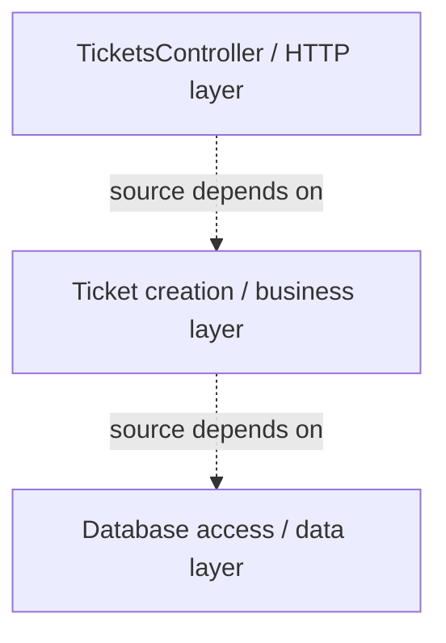
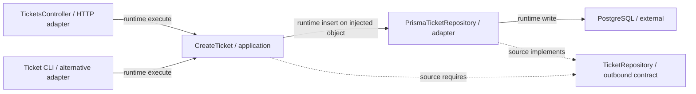
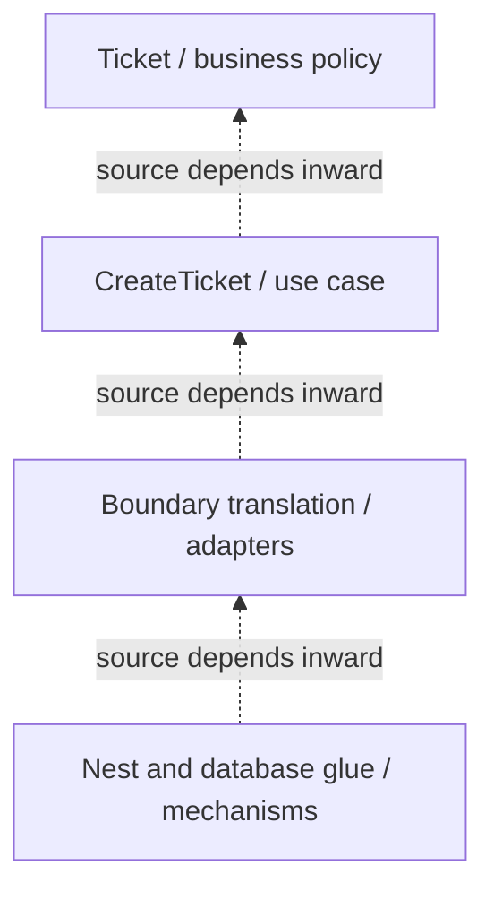
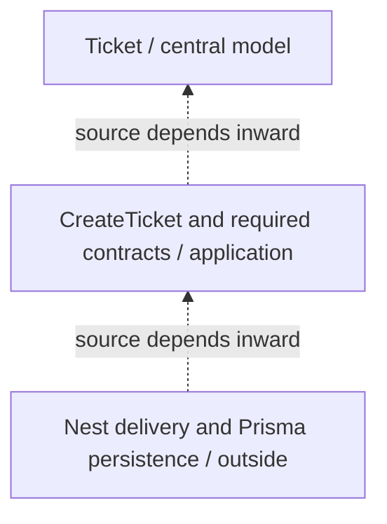

# 5. Architectural Styles with NestJS

← [Create Ticket implementation](4-create-ticket-with-nestjs.md) · [Backend path](README.md) · [References](references.md)

## 1. Origins: several answers to related problems

The analyst still creates the same support ticket. We can describe the separation from HTTP/database details using several styles, but each style asks a different design question.

Separating presentation, business/domain behavior and data access has a long history; it is a family of **[Layered Architecture](../GLOSSARY.md#layered-architecture)** designs rather than one author-mandated TypeScript layout. [Fowler's Presentation Domain Data Layering](https://martinfowler.com/bliki/PresentationDomainDataLayering.html) discusses that separation. Alistair Cockburn's [Hexagonal Architecture article](https://alistair.cockburn.us/hexagonal-architecture/) (2005) emphasizes an application usable through different external devices and test [adapters](../GLOSSARY.md#adapter). Jeffrey Palermo's [Onion Architecture](https://jeffreypalermo.com/2008/07/the-onion-architecture-part-1/) (2008) emphasizes a domain model at the center and infrastructure outside. Robert C. Martin's [Clean Architecture](https://blog.cleancoder.com/uncle-bob/2012/08/13/the-clean-architecture.html) (2012) synthesizes related approaches around policy and inward source dependencies. None prescribed Nest-specific file paths.

## 2. The shared problem, and what styles leave open

If `create()` directly reads a Prisma row, decides the initial state and formats errors, changing persistence or delivery forces us to revisit business behavior. The earlier chapters separate those reasons to change. Architectural styles describe constraints and organizing priorities that can help preserve such separation; they do not automatically choose authentication, transactions, deployment topology or a good ticket model.

They fit when protecting meaningful business rules, independently testable operations or volatile integrations repays the mapping/contract cost. A tiny disposable CRUD utility may use fewer boundaries. No style is a maturity ranking, and four folders are not evidence that a design satisfies any of them.

## 3. Does NestJS impose an architecture?

Nest's introduction describes an **“out-of-the-box application architecture”**, inspired by Angular. That is a direct framework claim about its supplied organization; denying it would misrepresent the documentation. Nest supplies modules, controller metadata, providers, [DI](../GLOSSARY.md#dependency-injection-di) and request hooks, with concrete registration/visibility rules. [Official Nest introduction](https://docs.nestjs.com/), [modules](https://docs.nestjs.com/modules), [providers](https://docs.nestjs.com/providers).

Our **architectural interpretation** is narrower: these mechanisms do not specify the owner of ticket [invariants](../GLOSSARY.md#invariant), require an application-owned persistence interface, prevent [ORM](../GLOSSARY.md#orm) types entering [Domain](../GLOSSARY.md#domain), or enforce Clean's inward source rule. The same provider can be a domain policy, application operation or database client. A module may group a feature, a technical integration or badly mixed responsibilities. Nest has framework structure, but that structure alone does not establish Clean, Onion, Hexagonal or a complete coherent Layered design.

The illustrative paths in chapter 4 are our conventions. The source imports, public contracts and ownership decisions determine which architectural principles are satisfied. Nest registration determines whether the graph can be instantiated.

## 4. Layered: separate kinds of work

Imagine first organizing code by jobs: HTTP accepts input; a business/application area decides and coordinates creation; data access performs the write. Those responsibility groups are **layers**. A common top-down design allows presentation to depend on business code and business code to depend on data access. Closed layers restrict access to the adjacent lower layer; open layers permit some skipping. State the chosen dependency policy rather than assume every layered system uses the same rules.

For Tickets, one conventional design might put orchestration and rules in an application/business layer that imports a concrete data-access class. It separates work but allows storage API changes to affect business code. The chapter 4 design instead uses an inward-owned persistence contract while retaining layered responsibilities. Dependency inversion is an additional decision, not a property guaranteed by saying “layered.”

In this diagram dashed arrows are **possible conventional source dependencies**, not a recommended substitute for the chapter 4 code:

`Controller`, `Service` and `Repository` filenames alone do not establish cohesion, prevent bypassing rules or distinguish source direction from runtime sequence. A method forwarding data through three classes without protecting any independent responsibility may just add indirection. The persistence **implementation** remains technical even when placed in a lower layer. See [Fowler's layering discussion](https://martinfowler.com/bliki/PresentationDomainDataLayering.html).

## 5. Hexagonal: separate the application from its devices

The same creation task should run when invoked from a test, HTTP, a CLI or a queue. We first describe the interactions the application offers and requires; technology-specific code adapts each external device to those conversations. Those interactions are **[ports](../GLOSSARY.md#port)**, and the connecting implementations are **[adapters](../GLOSSARY.md#adapter)**. [Hexagonal Architecture](../GLOSSARY.md#hexagonal-architecture-ports-and-adapters) distinguishes the inside application from outside devices rather than prescribing six classes or six folders.

| Ticket artifact | Hexagonal role |
| --- | --- |
| `TicketsController` and its parser/pipe | inbound/driving HTTP [adapter](../GLOSSARY.md#adapter) |
| `CreateTicket.execute(command)` | offered application operation, the inbound [port](../GLOSSARY.md#port); no extra interface is required |
| `Ticket` | business behavior inside the application |
| `TicketRepository.insert(ticket)` | outbound/driven persistence [port](../GLOSSARY.md#port) |
| `PrismaTicketRepository` | outbound persistence [adapter](../GLOSSARY.md#adapter) |
| PostgreSQL | external device/system |

Below, solid arrows are **runtime calls**, dashed arrows are **source contract relationships**. `TicketRepository` is not an intermediate runtime object:

A CLI must supply validated arguments and appropriate identity/permission policy; swapping the input device does not make untrusted data safe. Replacing PostgreSQL changes an [adapter](../GLOSSARY.md#adapter) and assembly, not ticket validity. This follows [Cockburn's original inside/outside separation](https://alistair.cockburn.us/hexagonal-architecture/); it does not require the inner code to use an entity class or Clean's specific circle vocabulary.

## 6. Clean: protect different levels of policy

The initial-state rule applies regardless of transport; creating and saving is application-specific workflow; JSON/row field mapping changes with an external representation. Clean distinguishes those levels of policy and mechanism. Its **[Dependency Rule](../GLOSSARY.md#dependency-rule)** says source references crossing boundaries point inward, toward higher-level policy. Runtime control can call an injected outer implementation because its contract is owned inward.

| Clean circle | Ticket mapping | Exclude |
| --- | --- | --- |
| [Entities](../GLOSSARY.md#clean-entities-circle) / general business policy | `Ticket` subject and initial-state rules | Nest, JSON [DTOs](../GLOSSARY.md#data-transfer-object-dto), Prisma rows |
| [Use Cases](../GLOSSARY.md#use-case) / application policy | `CreateTicket`, command/result, required persistence contract | concrete database or HTTP implementation |
| [Interface Adapters](../GLOSSARY.md#interface-adapter) / representation translation | parsing and mapping JSON fields; ticket-to-row mapping | authoritative ticket policy |
| [Frameworks & Drivers](../GLOSSARY.md#frameworks-and-drivers) / mechanisms | Nest decorators/runtime, Prisma client, PostgreSQL driver, executable assembly | inner business decisions |

“[Entities](../GLOSSARY.md#clean-entities-circle)” is Martin's business-policy circle, not a requirement that every policy be a [DDD](../GLOSSARY.md#domain-driven-design-ddd) identity-bearing object. The physical Nest controller combines HTTP/framework glue with translation; the physical Prisma repository combines database glue with mapping. Calling the whole files pure canonical [Interface Adapters](../GLOSSARY.md#interface-adapter) would conceal their outward library dependencies. They are pragmatic **combined outer modules**, preserving the inner boundary rather than a literal one-folder-per-circle implementation. For stricter separation, keep plain translation functions inward of thin Nest/Prisma glue; introduce that extra boundary when independent replacement/testing justifies it.

This diagram shows **allowed source dependencies between conceptual circles**, not an execution pipeline:

The actual files and combined-role caveat are explained above. Martin does not mandate exactly four folders or [Nest providers](../GLOSSARY.md#nestjs-provider). Continue with [the Clean-specific backend chapter](../clean-architecture/8-clean-on-the-backend.md) and [Martin's source](https://blog.cleancoder.com/uncle-bob/2012/08/13/the-clean-architecture.html).

## 7. Onion: keep the domain model central

Start with `Ticket` as the meaning of valid ticket state. [Application](../GLOSSARY.md#application-layer) surrounds that meaning with creation workflow. HTTP and database mechanisms stay at the outside and depend toward the inner model and contracts. Onion emphasizes this domain-centered structure, including domain/[application services](../GLOSSARY.md#application-service) where they have real responsibilities.

In this track `TicketRepository` belongs to [Application](../GLOSSARY.md#application-layer) because creation needs the capability; Onion variants can place repository abstractions nearer the domain model. That difference in placement language does not authorize the inner model to import a concrete [ORM](../GLOSSARY.md#orm). An anemic collection of database types at the center does not become domain-centered merely by naming its folder `domain`.

Dashed arrows below mean **inward source dependencies**:

Read [Palermo's original series](https://jeffreypalermo.com/2008/07/the-onion-architecture-part-1/) and the repository's [Onion guide](../onion-architecture/README.md). [Domain](../GLOSSARY.md#domain) centrality and inward dependencies are the principle; this source hierarchy is our illustrative mapping.

## 8. Compare without renaming everything into synonyms

| Style | Emphasis | Overlap in Tickets | Distinct vocabulary/choice |
| --- | --- | --- | --- |
| Layered | grouping work into responsibilities and regulating access between layers | HTTP, workflow/rules and persistence have separate owners | open/closed layers; downward source dependencies are common and inversion is a separate policy |
| Hexagonal | application conversations independent of external devices | HTTP/CLI entry and memory/database persistence substitutions | driving/driven [ports and adapters](../GLOSSARY.md#hexagonal-architecture-ports-and-adapters); no mandated inner circle hierarchy |
| Clean | levels of business/application policy and inward source dependencies | rules and [use case](../GLOSSARY.md#use-case) avoid framework/storage formats | [Entities](../GLOSSARY.md#clean-entities-circle), [Use Cases](../GLOSSARY.md#use-case), [Interface Adapters](../GLOSSARY.md#interface-adapter), [Frameworks & Drivers](../GLOSSARY.md#frameworks-and-drivers) |
| Onion | domain model at the center, infrastructure outside | Ticket stays central while orchestration depends inward | domain/[application services](../GLOSSARY.md#application-service) and surrounding rings; contracts may be placed differently |

The chapter 4 application can be layered by responsibility, hexagonal at external interactions, domain-centered in Onion's sense and consistent with Clean's protected inner [dependency rule](../GLOSSARY.md#dependency-rule). That is a reasoned mapping of code, not proof that the styles are identical. State the combined outer-module choice when claiming Clean conformance. A Nest `Module` organizing Tickets can support all of these descriptions; it proves none automatically.

## 9. Trade-offs, tests and the next decision

Under each description, a new subject rule belongs to its single domain owner; persistence replacement edits the [adapter](../GLOSSARY.md#adapter)/assembly; new delivery edits an inbound [adapter](../GLOSSARY.md#adapter); growth needs capability ownership and supported APIs. The [change-pressure table and tests](4-create-ticket-with-nestjs.md#7-review-changes-and-failures-before-calling-it-maintainable) make those claims inspectable. If a database-only field now appears in `CreateTicketCommand`, review whether a storage detail has crossed inward. If another team must deep-import the ticket parser, review the supported capability API before calling that reuse.

Extra contracts, mapping and source rules cost work. Add them where they protect an actual boundary, not to win a style label. None resolves distributed commit/retry ambiguity, good modeling or performance by itself. Measure runtime needs separately and test the boundary whose failure matters.

You can now read the broader [Clean](../clean-architecture/README.md) and [Onion](../onion-architecture/README.md) guides with HTTP and Nest mechanics already understood. Optional transactions, reliable messaging and independent deployment should follow their motivating product requirements, not precede the first ticket.

## Sources

Primary sources are linked beside their claims and collected in [backend references](references.md). Framework behavior is verified against Nest's official documentation; the style-to-ticket mappings are this handbook's architectural interpretations.
