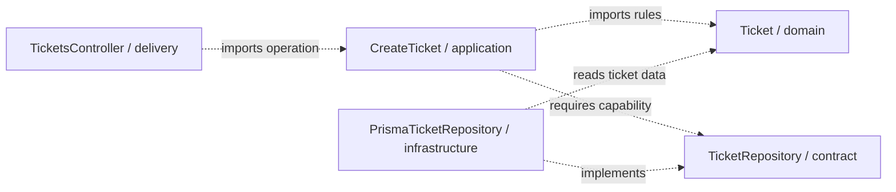

# Backend Architecture: From a Request to a Ticket

← [Repository home](../README.md) · [Shared foundations](../foundations/README.md) · [Glossary](../GLOSSARY.md)

An analyst submits a support ticket about a failed invoice download. The server must decide whether the ticket is valid, save it, and tell the analyst what happened. A form can provide immediate feedback, but the backend owns the persisted ticket and its rules: another client can bypass that form entirely.

This track follows **one operation, `POST /tickets`**, from a network message to plain TypeScript behavior, then to NestJS and architectural styles. You need basic TypeScript (functions, classes, promises, imports); you do not need prior HTTP or Nest vocabulary. This is a learning path, not a new architectural style with its own origin story. Its historical sources appear when we compare the styles.

## Read in order

| Chapter | Question it answers |
| --- | --- |
| [1. HTTP request to business operation](1-http-request-to-business-operation.md) | What arrives, how does routing select code, and what returns? |
| [2. TypeScript-first boundaries](2-typescript-first-boundaries.md) | How do we check unknown data, own rules, save tickets and assemble objects explicitly? |
| [3. NestJS building blocks](3-nestjs-building-blocks.md) | What do controllers, providers, modules and lifecycle hooks add? |
| [4. Create Ticket with NestJS](4-create-ticket-with-nestjs.md) | Where does each file go, how is it wired, and how does database persistence replace memory? |
| [5. Architectural styles with NestJS](5-architectural-styles-with-nestjs.md) | How do Layered, Hexagonal, Clean and Onion read the same capability differently? |
| [6. Boundary exercises](6-boundary-exercises.md) | What changes when a rule evolves, a CLI invokes the operation, or two callers compete for capacity? |
| [References](references.md) | Which primary sources support the mechanisms and interpretations? |

The [TypeScript-first teaching rule](../CONTRIBUTING.md#typescript-first-mechanisms) governs the progression. Chapter 2 is the canonical source for the plain ticket modules; later chapters import them rather than repeat their business policy.

For a closer reading of the same backend, continue with [Clean on the backend](../clean-architecture/8-clean-on-the-backend.md) and [Onion on the backend](../onion-architecture/7-onion-on-the-backend.md). Both reuse those canonical modules.

## Place your first feature

The code that decides a ticket's subject and initial state is **[Domain](../GLOSSARY.md#domain)**: business meaning independent of the screen or database. The code that asks for that decision and saves the ticket is **[Application](../GLOSSARY.md#application-layer)**: the operation's workflow. **Delivery** accepts an external invocation such as HTTP and translates its data. **[Infrastructure](../GLOSSARY.md#infrastructure)** implements technical storage. **Composition** creates the objects and supplies their collaborators at startup.

| Example file under `src/tickets/` | Owns | May import | Keep out |
| --- | --- | --- | --- |
| `domain/Ticket.ts` | valid ticket data and creation rules | domain code | Nest, HTTP [DTOs](../GLOSSARY.md#data-transfer-object-dto), database rows |
| `application/CreateTicket.ts` | create-and-persist workflow and plain result | application, domain | Prisma, controllers |
| `application/TicketRepository.ts` | required insert capability and persistence failure | application, domain | database API types |
| `interface/http/createTicketRequest.ts` | unknown HTTP body parsing | application input types | a second subject/status rule |
| `interface/http/TicketsController.ts` | HTTP invocation and response mapping | application, local HTTP code, Nest | SQL and creation policy |
| `infrastructure/InMemoryTicketRepository.ts` | teaching storage substitute | application, domain | HTTP response behavior |
| `infrastructure/PrismaTicketRepository.ts` | durable database insert and field mapping | application, domain, Prisma | ownership of initial status |
| `composition/TicketsModule.ts` | bindings between concrete objects | all objects it assembles, Nest | business decisions |

These paths are **documentation conventions**, not architecture laws. Choose placement by why the code exists: a ticket rule goes in domain; coordinating its save goes in application; reading HTTP goes in delivery; talking to storage goes in infrastructure; choosing the storage object goes in composition. A helper follows that same owner, rather than defaulting to `shared/`. Classes use PascalCase; parsing functions use camelCase under the [naming conventions](../conventions/naming-and-file-placement.md). A class-based operation uses `CreateTicket.ts` here.

Arrows below are permitted **source dependencies**, not network calls. Composition is the outer assembly and can import every piece it constructs.

## Scope, fit and limits

This separation is useful when ticket rules, delivery and persistence change independently, or the operation needs tests without a database. A short internal CRUD utility may need fewer files and no entity class; extra mapping has a cost. Neither folder count nor [Nest modules](../GLOSSARY.md#nestjs-module) prove maintainability.

The first implementation creates one ticket in one atomic insert. It does not implement authentication, tenant access, attachments, notification delivery or retry deduplication. A database may commit while the reply is lost; callers cannot infer that failure means nothing was saved. Chapter 4 names the production decisions and tests needed before extending that scope.

For frontend behavior, continue separately with [the frontend ticket walkthrough](../frontend/ports-and-adapters.md). The browser's ticket model and the authoritative backend model have distinct owners and release cycles.

Next: [What actually happens when `POST /tickets` arrives?](1-http-request-to-business-operation.md)
