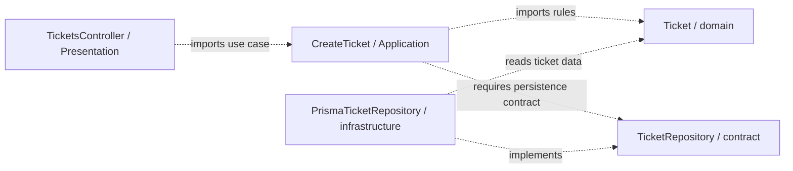

# Backend Architecture: From a Request to a Ticket

← [Repository home](../README.md) · [Shared foundations](../foundations/README.md) · [Glossary](../GLOSSARY.md)

An analyst submits a support ticket about a failed invoice download. The server must decide whether the ticket is valid, save it, and tell the analyst what happened. A form can provide immediate feedback, but the backend owns the persisted ticket and its rules: another client can bypass that form entirely.

This track follows **one operation, `POST /tickets`**, from a network message to plain TypeScript behavior, then to NestJS and architectural styles. You need basic TypeScript (functions, classes, promises, imports); you do not need prior HTTP or Nest vocabulary. This is a learning path, not a new architectural style with its own origin story. Its historical sources appear when we compare the styles.

## Read in order

| Chapter | Question it answers |
| --- | --- |
| [1. HTTP request to business operation](1-http-request-to-business-operation.md) | What arrives, how does routing select code, and what returns? |
| [2. TypeScript-first boundaries](2-typescript-first-boundaries.md) | How do we check unknown data, own rules, save tickets and assemble objects explicitly? |
| [3. NestJS building blocks](3-nestjs-building-blocks.md) | What do controllers, providers, modules and lifecycle hooks add? |
| [4. Create Ticket with NestJS](4-create-ticket-with-nestjs.md) | Where does each file go, how is it wired, and how does database persistence replace memory? |
| [5. Architectural styles with NestJS](5-architectural-styles-with-nestjs.md) | How do Layered, Hexagonal, Clean and Onion read the same capability differently? |
| [6. Boundary exercises](6-boundary-exercises.md) | What changes when a rule evolves, a CLI invokes the operation, or two callers compete for capacity? |
| [References](references.md) | Which primary sources support the mechanisms and interpretations? |

The [TypeScript-first teaching rule](../CONTRIBUTING.md#typescript-first-mechanisms) governs the progression. Chapter 2 is the canonical source for the plain ticket modules; later chapters import them rather than repeat their business policy.

For a closer reading of the same backend, continue with [Clean on the backend](../clean-architecture/8-clean-on-the-backend.md) and [Onion on the backend](../onion-architecture/7-onion-on-the-backend.md). Both reuse those canonical modules.

## Place your first feature

The code that decides a ticket's subject and initial state is **[Domain](../GLOSSARY.md#domain)**: business meaning independent of the screen or database. The code that asks for that decision and saves the ticket is **[Application](../GLOSSARY.md#application-layer)**: the operation's workflow. **[Presentation](../GLOSSARY.md#presentation-layer)** is this handbook's physical layer for HTTP/CLI delivery: it translates incoming data and outgoing results. **[Infrastructure](../GLOSSARY.md#infrastructure)** implements technical storage. **Composition** creates the objects and supplies their collaborators at startup.

To save a ticket, the operation needs an object offering `insert(ticket)`, independent of the database used. A **Repository** is an abstraction that treats stored business objects like a collection. Our deliberately small `TicketRepository` exposes only the insertion needed today. Application owns that requirement; Infrastructure supplies an implementation. Repository is a design-pattern term, not a Nest primitive, Prisma's generated API or automatically TypeORM's `Repository<T>`. [Fowler's definition](https://martinfowler.com/eaaCatalog/repository.html) describes the pattern.

| Artifact | Exact role | Layer |
| --- | --- | --- |
| `TicketRepository` | persistence contract required by `CreateTicket`: **what** [Application](../GLOSSARY.md#application-layer) requires | [Application](../GLOSSARY.md#application-layer) |
| `InMemoryTicketRepository` | memory implementation of that contract: **how** process memory stores tickets | [Infrastructure](../GLOSSARY.md#infrastructure) |
| `PrismaTicketRepository` | Prisma/database implementation of that contract: **how** database access stores tickets | [Infrastructure](../GLOSSARY.md#infrastructure) |

The contract names a requirement, not a running storage object. Both concrete classes share the `TicketRepository` suffix because they implement that same contract; `InMemory` names the storage mechanism and `Prisma` names the technology. [Chapter 2 shows the interface and `implements` relationship](2-typescript-first-boundaries.md#3-save-without-naming-a-database-in-the-operation). We keep these generic names throughout the walkthrough; [chapter 5 maps them to Hexagonal ports and adapters](5-architectural-styles-with-nestjs.md#where-are-the-ports-and-adapters-in-this-example).

| Example file under `src/` | Owns | May import | Keep out |
| --- | --- | --- | --- |
| `domain/tickets/Ticket.ts` | valid ticket data and creation rules | domain | Nest, HTTP [DTOs](../GLOSSARY.md#data-transfer-object-dto), database rows |
| `application/tickets/use-cases/CreateTicket.ts` | create-and-persist workflow and plain result | application, domain | Prisma, controllers |
| `application/tickets/ports/TicketRepository.ts` | persistence contract and recognized persistence failure | application, domain | database API types |
| `presentation/http/tickets/parsers/parseCreateTicketRequest.ts` | unknown HTTP body parsing | local presentation [DTO](../GLOSSARY.md#data-transfer-object-dto)/error | a second subject/status rule |
| `presentation/http/tickets/dto/CreateTicketRequestDto.ts` | incoming HTTP shape | presentation | use-case policy |
| `application/tickets/contracts/CreateTicketCommand.ts` | operation input | application | HTTP representation |
| `application/tickets/contracts/CreateTicketResult.ts` | operation output | application, domain | HTTP status codes |
| `presentation/http/tickets/mappers/mapCreateTicketResponse.ts` | selected HTTP response fields | application result, local response [DTO](../GLOSSARY.md#data-transfer-object-dto) | persistence records |
| `presentation/http/tickets/controllers/TicketsController.ts` | HTTP invocation and response mapping | application, presentation, Nest | SQL and creation policy |
| `presentation/cli/tickets/handlers/createTicketCli.ts` | CLI arguments, messages and exit codes | application, presentation | HTTP parsing |
| `infrastructure/persistence/tickets/adapters/InMemoryTicketRepository.ts` | teaching storage substitute | infrastructure, application, domain | HTTP response behavior |
| `infrastructure/persistence/tickets/adapters/PrismaTicketRepository.ts` | durable database insert and field mapping | infrastructure, application, domain, Prisma | ownership of initial status |
| `composition/modules/TicketsModule.ts` | bindings between concrete objects | all objects it assembles, Nest | business decisions |

The architectural rule concerns responsibility and dependency direction. The **repository convention** puts layers first, then capabilities within them; Martin, Palermo and Cockburn do not prescribe these exact paths. Choose placement by why the code exists, and let helpers follow that owner. As the product grows, group cohesive capabilities and sub-capabilities inside each layer; see [the Scheduling example](../foundations/code-placement.md#12-grow-capabilities-inside-each-layer). Other projects can use capability-first packaging without violating inward dependencies.

## How to read backend file names

The path tells us **who owns the responsibility**. The filename tells us **what role or implementation it is**. For example, `infrastructure/persistence/tickets/adapters/PrismaTicketRepository.ts` is outer technical code, concerned with storage, owned by Tickets, using Prisma to implement the inward persistence contract.

| Name | Why it is named that way |
| --- | --- |
| `Ticket.ts` | The business entity, under `domain/tickets/`. Calling it `TicketModel` because an [ORM](../GLOSSARY.md#orm) also has models would obscure its independent business meaning. |
| `CreateTicket.ts` | The [Application](../GLOSSARY.md#application-layer) [use case](../GLOSSARY.md#use-case). A verb names the task; this class uses PascalCase, while an exported function would use camelCase. `TicketsService` would hide which task it performs. |
| `TicketRepository.ts` | The [Application](../GLOSSARY.md#application-layer)-owned persistence contract for Ticket objects. Other requirements deserve names such as `PaymentGateway` (send payments), `Clock` (read time), `FileStorage` (store files) or `AgendaReader` (read an agenda), rather than naming every dependency Repository. |
| `InMemoryTicketRepository.ts` | `InMemory` identifies process-memory storage. It implements the same contract for learning/tests but loses data on exit and is not shared between replicas. The prefix identifies a mechanism, not a layer rule. |
| `PrismaTicketRepository.ts` | The Prisma implementation of `TicketRepository`. Replacing this technology changes the implementation while [Application](../GLOSSARY.md#application-layer) still requires the same persistence contract. |
| `TicketsController.ts` | Nest's controller groups related [route handlers](../GLOSSARY.md#route-handler). A method handles one selected route; the class is not an endpoint, [use case](../GLOSSARY.md#use-case) or domain object. `@Controller('tickets')` supplies a prefix; `@Post()` or `@Get(':id')` registers a method/path. See [two handlers in one controller](3-nestjs-building-blocks.md#1-register-the-functions-we-already-understand). |
| `CreateTicketPipe.ts` | A [Nest pipe](../GLOSSARY.md#nestjs-pipe) processes a handler argument: parsing, validation or transformation. Here it calls `parseCreateTicketRequest` and maps a known parsing failure to HTTP `400`; the [Parser](../GLOSSARY.md#parser) itself is plain TypeScript. `Ticket.create()` separately asks whether it is a valid business ticket. Both the pipe and controller belong to HTTP [Presentation](../GLOSSARY.md#presentation-layer). |
| `AuthenticatedGuard.ts` | A [Nest Guard](../GLOSSARY.md#nestjs-guard) decides whether the caller may invoke the selected operation. It checks a previously verified identity; it does not parse ticket fields. [Compare Guard and Pipe](3-nestjs-building-blocks.md#guard-and-pipe-answer-different-questions) before adding this optional access requirement. |
| `parseCreateTicketRequest.ts` | Plain unknown-input parsing; it returns `CreateTicketRequestDto` from the neighboring `dto/` folder. It does not route requests or own ticket validity. A type annotation alone cannot check JSON. |
| `TicketsModule.ts` | Nest registration/composition: it tells the container what to construct and expose. It is not an architectural layer, automatically a [bounded context](../GLOSSARY.md#bounded-context) or automatically a business capability. It can align with Tickets by design. |
| `ticket.tokens.ts` | Nest needs a runtime key because TypeScript interfaces disappear. The exported Symbol identifies the repository binding in its [dependency injection container](../GLOSSARY.md#di-container). This is composition glue, not ticket policy. |
| `index.ts` | An explicit source entry point. `application/tickets/index.ts` exposes supported operations/types; `composition/modules/index.ts` exposes Nest assembly. TypeScript exports select source names; [Nest module](../GLOSSARY.md#nestjs-module) `exports` selects providers visible to importing modules. The architectural [public API](../GLOSSARY.md#public-api) is the supported contract we deliberately choose and enforce. Neither export mechanism alone prevents deep imports. |

These suffixes and casing choices follow [repository naming conventions](../conventions/naming-and-file-placement.md#backend-names); the linked chapters show the mechanisms before adding framework conveniences.

Arrows below are permitted **source dependencies**, not network calls. Composition is the outer assembly and can import every piece it constructs.

## Scope, fit and limits

This separation is useful when ticket rules, delivery and persistence change independently, or the operation needs tests without a database. A short internal CRUD utility may need fewer files and no entity class; extra mapping has a cost. Neither folder count nor [Nest modules](../GLOSSARY.md#nestjs-module) prove maintainability.

The first implementation creates one ticket in one atomic insert. It does not implement authentication, tenant access, attachments, notification delivery or retry deduplication. A database may commit while the reply is lost; callers cannot infer that failure means nothing was saved. Chapter 4 names the production decisions and tests needed before extending that scope.

For frontend behavior, continue separately with [the frontend ticket walkthrough](../frontend/ports-and-adapters.md). The browser's ticket model and the authoritative backend model have distinct owners and release cycles.

Next: [What actually happens when `POST /tickets` arrives?](1-http-request-to-business-operation.md)
