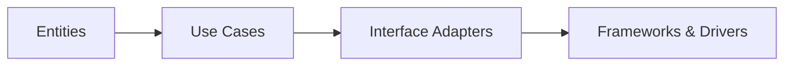
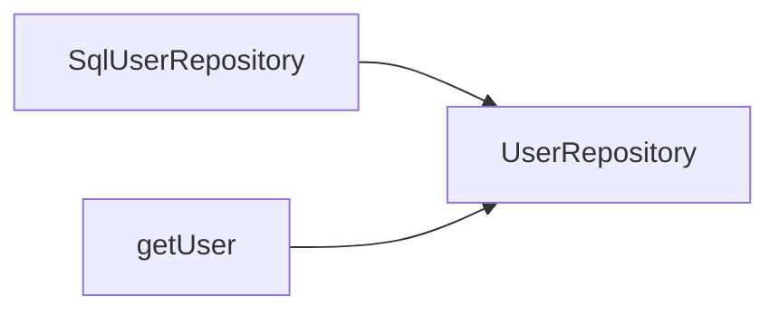
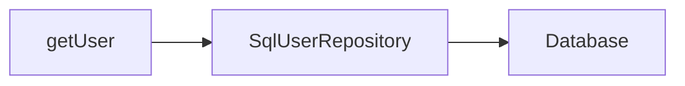
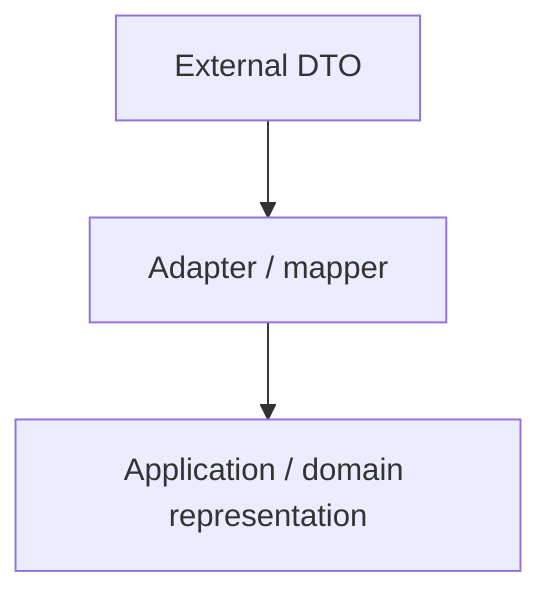
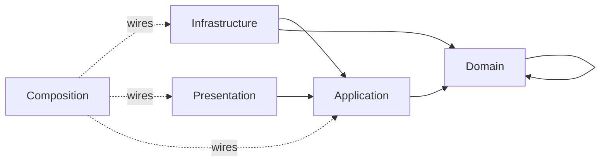

> **[Clean Architecture](README.md)** › The Dependency Rule.

# 1. The Dependency Rule

Clean Architecture is best understood by separating its **canonical rule** from project-specific conventions built on top of it.

---

## 1.1 The canonical circles

Robert C. Martin's diagram uses:



Inner circles contain higher-level policy. Outer circles contain mechanisms and details.

Martin explicitly notes that the diagram is schematic: an application may have more than four circles. The same Dependency Rule applies across any additional boundary.

---

## 1.2 The rule

> Source-code dependencies may only point inward, toward higher-level policies.

Consequences:

- Entities do not name Use Cases, UI frameworks, databases or transports.
- Use Cases do not name concrete outer adapters/frameworks.
- Interface Adapters may depend on Use Cases/Entities.
- Frameworks & Drivers may depend inward.

An inner circle should not mention a class, function, schema or data representation owned by an outer circle.

This includes type-level dependencies.

---

## 1.3 Dependency direction is not runtime flow

A use case can invoke a database at runtime without importing the database implementation.

Inner contract:

```ts
export interface UserRepository {
  findById(id: UserId): Promise<User | null>
}
```

Outer adapter:

```ts
export class SqlUserRepository implements UserRepository {
  // database-specific implementation
}
```

Composition:

```ts
const users = new SqlUserRepository(db)
const getUser = makeGetUser({ users })
```

Source dependencies:



Runtime control:



Dependency inversion makes those directions intentionally different.

---

## 1.4 Boundary data

Martin's original article also warns that data formats owned by an outer mechanism should not cross inward unchanged.

Examples of outer representations:

- database rows;
- framework request/response objects;
- ORM models;
- raw API response DTOs;
- generated SDK types.

Translate at the boundary:



This does not mean every crossing needs a class. A pure mapping function is often sufficient.

---

## 1.5 What the Dependency Rule does **not** say

It does not say:

- every project needs exactly four folders;
- every external call needs a Repository interface;
- frontend and backend must share Entities;
- every View must be framework-free;
- a DI container is required;
- Redux is an Application layer;
- a component may never import another outer-circle technical module.

That last point matters.

If a View and an HTTP client are both categorized as Frameworks & Drivers, a direct View -> HTTP-client import does not, by itself, point from an inner circle outward. It may still violate a **stricter application rule** such as "all business operations go through Application use cases".

Document those stricter rules as project architecture, not as quotations from Clean Architecture.

---

## 1.6 Practical repository policy

For the application structures documented here, we usually enforce:



This is a practical mapping of the Clean goal, not the canonical four-circle taxonomy.

See **[Dependency Boundaries](../foundations/dependency-boundaries.md)**.

---

## 1.7 Dependency Inversion Principle

The Dependency Inversion Principle and Clean Architecture's Dependency Rule reinforce each other but are not identical statements.

DIP says high-level policy should not depend on low-level detail; both depend on abstractions. Clean uses that mechanism to cross architectural boundaries without reversing source dependencies.

A port is useful when it protects policy from a detail. Do not add interfaces indiscriminately.

---

## 1.8 Make the rule executable

If a project says Application cannot import Infrastructure, CI should detect the import.

Architecture tests should consider:

- static imports;
- re-exports;
- dynamic imports;
- relative paths;
- path aliases;
- type-only imports.

See **[Executable Architecture](../foundations/architecture-testing.md)**.

## Sources

- Robert C. Martin, "The Clean Architecture" (2012): https://blog.cleancoder.com/uncle-bob/2012/08/13/the-clean-architecture.html
- Robert C. Martin, *Clean Architecture* (2017)
- Alistair Cockburn, "Hexagonal Architecture" (2005): https://alistair.cockburn.us/hexagonal-architecture/
