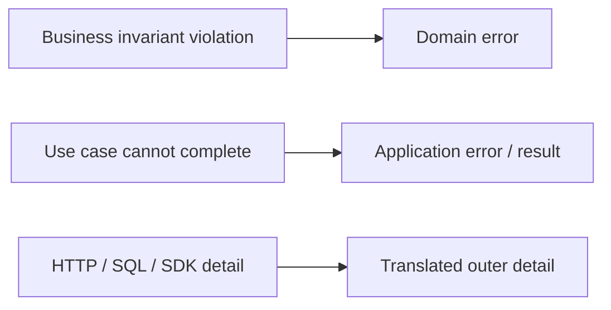
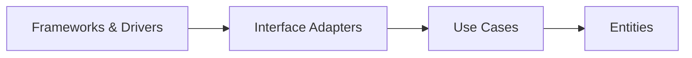

> **[Clean Architecture](README.md)** › The Four Circles.

# 2. The Four Circles

The canonical [Clean Architecture](../GLOSSARY.md#clean-architecture) diagram contains four concentric circles. They are conceptual boundaries, not mandatory directory names.

---

## 2.1 Entities

### Responsibility

Martin describes [Entities](../GLOSSARY.md#domain-entity) as encapsulating enterprise-wide critical business rules.

In modern domain-oriented systems, interpret that carefully: the relevant policy may be scoped to a product or [bounded context](../GLOSSARY.md#bounded-context) rather than literally one enterprise-wide class shared by every application.

Typical contents:

- entities with identity;
- [value objects](../GLOSSARY.md#value-object);
- business [invariants](../GLOSSARY.md#invariant);
- domain policies;
- [domain errors](../GLOSSARY.md#domain-error)/events where appropriate.

Example:

```ts
export class Money {
  private constructor(
    readonly amount: bigint,
    readonly currency: Currency,
  ) {}

  static of(amount: bigint, currency: Currency) {
    if (amount < 0n) throw new NegativeMoney()
    return new Money(amount, currency)
  }
}
```

[Entities](../GLOSSARY.md#domain-entity) should not know delivery, persistence or framework details.

They do **not** have to be classes. Functional/immutable domain models can satisfy the same boundary.

---

## 2.2 Use Cases

### Responsibility

[Use Cases](../GLOSSARY.md#use-case) contain application-specific business rules and orchestrate an operation.

Typical contents:

- [application services](../GLOSSARY.md#application-service)/interactors;
- commands/queries;
- required [ports](../GLOSSARY.md#port)/boundaries;
- application-level validation and orchestration;
- application results/errors.

Example:

```ts
export interface OrderRepository {
  findById(id: OrderId): Promise<Order | null>
  save(order: Order): Promise<void>
}

export function makeCancelOrder(deps: {
  orders: OrderRepository
}) {
  return async function cancelOrder(id: OrderId) {
    const order = await deps.orders.findById(id)

    if (!order) throw new OrderNotFound(id)

    order.cancel()
    await deps.orders.save(order)
  }
}
```

The [use case](../GLOSSARY.md#use-case) does not import the database, HTTP client, UI framework or concrete [repository](../GLOSSARY.md#repository).

### Error ownership

Do not map every external failure into a [Domain error](../GLOSSARY.md#domain-error).

Use meaning:



---

## 2.3 Interface Adapters

### Responsibility

Translate between representations convenient to inner policy and representations convenient to external mechanisms.

Examples:

- controllers;
- [presenters](../GLOSSARY.md#presenter);
- [gateways](../GLOSSARY.md#gateway)/[repository](../GLOSSARY.md#repository) [adapters](../GLOSSARY.md#adapter);
- [mappers](../GLOSSARY.md#mapper);
- framework-facing state [adapters](../GLOSSARY.md#adapter).

An [adapter](../GLOSSARY.md#adapter) can implement an inner [port](../GLOSSARY.md#port):

```ts
export class HttpOrderRepository implements OrderRepository {
  constructor(private readonly http: HttpClient) {}

  async findById(id: OrderId): Promise<Order | null> {
    const dto = await this.http.get('/orders/' + id.value)
    return dto ? mapOrderDto(dto) : null
  }
}
```

### Repository is not a synonym for adapter

Use `Repository` when the abstraction is actually [repository](../GLOSSARY.md#repository)-like. Other [ports](../GLOSSARY.md#port) may be better named:

Examples include `PaymentGateway`, `FileStorage`, `Clock`, `IdGenerator`, `NotificationSender`, and `ClosureExecutor`.

The name should expose purpose.

---

## 2.4 Frameworks & Drivers

### Responsibility

Hold replaceable mechanisms:

- React/Vue/Svelte;
- Express/NestJS/Spring;
- SQL/ORM drivers;
- browser storage;
- message brokers;
- HTTP clients;
- third-party SDKs;
- UI styling systems.

"The web is a detail" does not mean web code is unimportant. It means inner policy should not depend on the web mechanism.

---

## 2.5 The circles are not a linear runtime stack

Do not read:



as "every request must call exactly one thing in each circle".

It is a source dependency model.

A UI component can call a [Presentation](../GLOSSARY.md#presentation-layer) [adapter](../GLOSSARY.md#adapter) that calls a [use case](../GLOSSARY.md#use-case). An [Infrastructure](../GLOSSARY.md#infrastructure) [adapter](../GLOSSARY.md#adapter) can be invoked by that [use case](../GLOSSARY.md#use-case) through a [port](../GLOSSARY.md#port). Runtime calls can move both directions across boundaries while source dependencies remain inward.

---

## 2.6 Mapping to common project folders

This repository often uses:

| Clean concept | Practical area |
| --- | --- |
| [Entities](../GLOSSARY.md#domain-entity) | [Domain](../GLOSSARY.md#domain) |
| [Use Cases](../GLOSSARY.md#use-case) | [Application](../GLOSSARY.md#application-layer) |
| [Interface Adapters](../GLOSSARY.md#interface-adapter) | parts of [Presentation](../GLOSSARY.md#presentation-layer) + [Infrastructure](../GLOSSARY.md#infrastructure) |
| [Frameworks & Drivers](../GLOSSARY.md#frameworks-and-drivers) | concrete UI/HTTP/DB/storage/framework code |

The mapping is not one-to-one.

For example, "[Presentation](../GLOSSARY.md#presentation-layer)" in a project may contain both [Interface Adapter](../GLOSSARY.md#interface-adapter) behavior ([ViewModels](../GLOSSARY.md#viewmodel)/[presenters](../GLOSSARY.md#presenter)) and Framework/Driver behavior (React components).

Therefore, do not insist that every project folder corresponds to exactly one canonical circle.

---

## 2.7 Frontend organization is a second scale

A real frontend can contain hundreds of files inside the outer UI area.

[Clean Architecture](../GLOSSARY.md#clean-architecture) does not define:

- page hierarchy;
- [feature folders](../GLOSSARY.md#feature-folder);
- hooks;
- Redux slices;
- [selectors](../GLOSSARY.md#selector);
- [design tokens](../GLOSSARY.md#design-token);
- CSS [recipes](../GLOSSARY.md#recipe).

Those are documented in **[Frontend Architecture](../frontend/README.md)**.

They should preserve the cross-layer boundary but are not themselves [Clean Architecture](../GLOSSARY.md#clean-architecture) circles.

---

## 2.8 Backend organization is similarly concrete

[Controllers](../GLOSSARY.md#controller), transport [DTOs](../GLOSSARY.md#data-transfer-object-dto), ORM mappings, transactions and messaging [adapters](../GLOSSARY.md#adapter) are outer concerns.

See **[Clean Architecture on the Backend](8-clean-on-the-backend.md)**.

## Sources

- Robert C. Martin, "The [Clean Architecture](../GLOSSARY.md#clean-architecture)" (2012): https://blog.cleancoder.com/uncle-bob/2012/08/13/the-clean-architecture.html
- Robert C. Martin, *[Clean Architecture](../GLOSSARY.md#clean-architecture)* (2017)
- Martin Fowler, [Repository](../GLOSSARY.md#repository): https://martinfowler.com/eaaCatalog/repository.html
