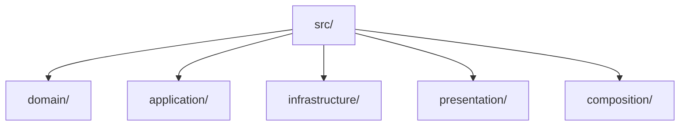
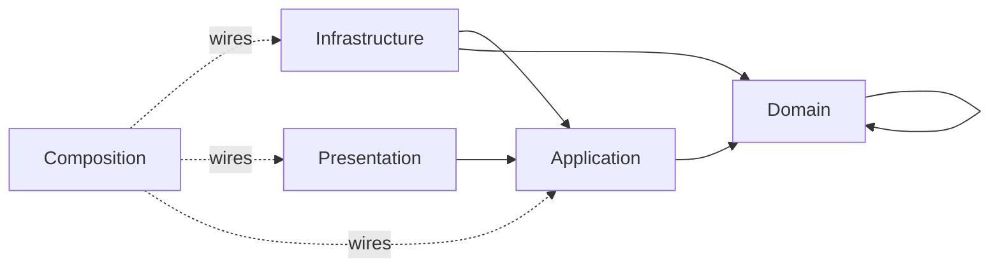
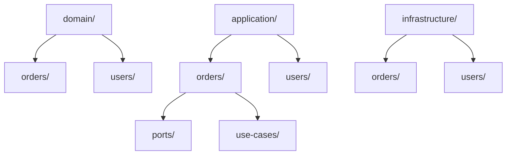
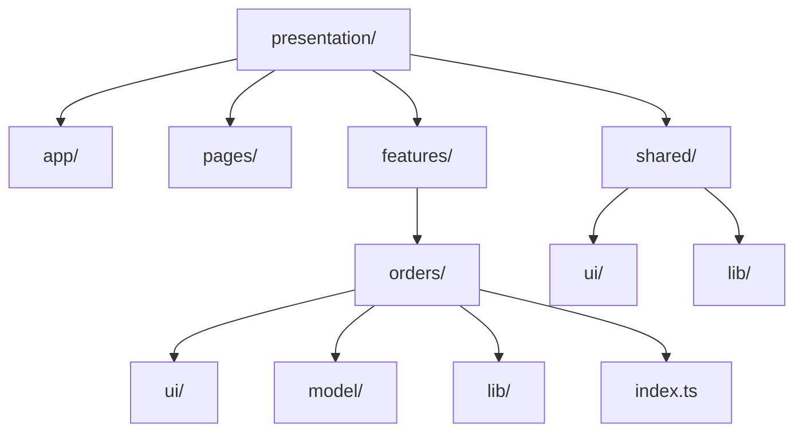
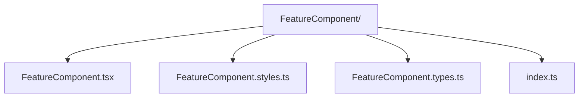
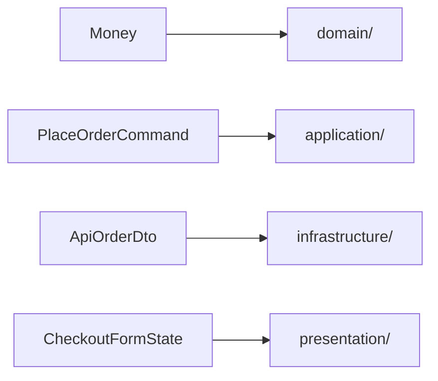
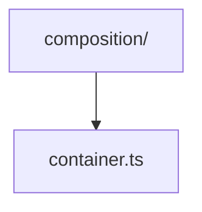

> **[Clean Architecture](README.md)** › Project Structure & Conventions.

# 3. Project Structure & Conventions

[Clean Architecture](../GLOSSARY.md#clean-architecture) constrains dependencies; it does not prescribe one filesystem tree.

A folder structure is useful when it makes architectural ownership visible and gives tooling something stable to enforce. It becomes harmful when developers mistake the folder names for the architecture itself.

---

## 3.1 The folder layout

A practical TypeScript mapping is:



Equivalent projects may use Martin's vocabulary:

Possible Martin-style names include `entities/`, `usecases/`, `adapters/`, and `frameworks/`.

or a package/module-based layout.

**Do not claim these layouts produce identical code.** They can implement the same inward-dependency principle while using different boundaries, ownership and module decomposition.

The canonical rules for those dependencies live in **[Architecture Foundations](../foundations/dependency-boundaries.md)**.

### Recommended import matrix



Whether [Presentation](../GLOSSARY.md#presentation-layer) may import [Domain](../GLOSSARY.md#domain) types directly is a project decision. A stricter application-contract boundary may forbid it to reduce coupling between UI and domain representation.

---

## 3.2 Structure by capability inside a layer

Layer-first top-level folders are compatible with feature/capability ownership below them.

Example:



Do not create global dumping grounds such as:

Avoid generic dumping grounds such as `services/`, `helpers/`, `managers/`, or `common/` when the files have a clear capability owner.

when the files have clear capability ownership.

---

## 3.3 Public module APIs

A feature/module should expose an intentional contract and hide internals.

```ts
// application/orders/index.ts
export { placeOrder } from './use-cases/placeOrder'
export type { PlaceOrderCommand, PlaceOrderResult } from './contracts'
```

Avoid giant barrels that re-export unrelated layers or `export *` every internal symbol.

See **[Module Boundaries and Public APIs](../foundations/module-boundaries-and-public-apis.md)**.

---

## 3.4 Structuring the outermost circle: the Presentation UI

[Clean Architecture](../GLOSSARY.md#clean-architecture) tells us that UI technology is an outer detail. It does **not** define how a large [Presentation](../GLOSSARY.md#presentation-layer) codebase should organize pages, components, hooks, state, [selectors](../GLOSSARY.md#selector) or [design-system](../GLOSSARY.md#design-system) code.

The canonical [repository](../GLOSSARY.md#repository) guidance is therefore centralized in:

- **[Frontend Architecture](../frontend/README.md)**
- **[Presentation Architecture](../frontend/presentation-architecture.md)**
- **[State Management](../frontend/state-management.md)**

Recommended default:



This is a [Presentation](../GLOSSARY.md#presentation-layer) organization strategy, not a fifth [Clean Architecture](../GLOSSARY.md#clean-architecture) circle.

---

## 3.5 Styles and animation

Styling stays in [Presentation](../GLOSSARY.md#presentation-layer), but the [repository](../GLOSSARY.md#repository) no longer prescribes generic CSS placement from the Clean guide.

Use the central **[Styling and Design-System Architecture](../frontend/styling-and-design-system.md)**.

The default principle is **ownership and [colocation](../GLOSSARY.md#colocation)**:



Shared [design-system](../GLOSSARY.md#design-system) [recipes](../GLOSSARY.md#recipe) have a different owner from feature-local styles. Do not duplicate a [recipe](../GLOSSARY.md#recipe) in both places.

---

## 3.6 Type ownership

Types belong to the layer/capability that owns their meaning.



Type-only imports still represent source-level coupling.

A top-level `src/types` directory is rarely a good default because it erases ownership.

---

## 3.7 Composition

Keep concrete wiring at an outer bootstrap boundary:



The [Composition Root](../GLOSSARY.md#composition-root) may import concrete [Infrastructure](../GLOSSARY.md#infrastructure) plus [Application](../GLOSSARY.md#application-layer) contracts and [Presentation](../GLOSSARY.md#presentation-layer) bootstrap/[store](../GLOSSARY.md#store) code as needed to assemble the executable.

It is not a business layer and it is not a [service locator](../GLOSSARY.md#service-locator).

See **[Composition Root](../foundations/composition-root.md)**.

---

## 3.8 Enforce the graph

A [dependency rule](../GLOSSARY.md#dependency-rule) that can be automated should be automated.

Options include:

- [AST](../GLOSSARY.md#abstract-syntax-tree-ast)-based [architecture tests](../GLOSSARY.md#architecture-test);
- dependency-cruiser;
- ESLint boundary plugins;
- Nx module-boundary rules;
- language/build-system equivalents.

The check must resolve:

- path aliases;
- relative imports;
- re-exports;
- dynamic imports;
- type-only imports.

See **[Executable Architecture](../foundations/architecture-testing.md)**.

---

## 3.9 What is architecture vs. convention?

### Architecture

| Rule type | Example |
| --- | --- |
| Architecture | [Domain](../GLOSSARY.md#domain) cannot depend on [Infrastructure](../GLOSSARY.md#infrastructure). |
| Architecture | [Application](../GLOSSARY.md#application-layer) cannot import a concrete HTTP client. |
| Architecture | A concrete outer [adapter](../GLOSSARY.md#adapter) implements or consumes an inner-owned contract. |

### Recommended convention

| Convention | Example |
| --- | --- |
| Feature model location | `features/orders/model/` |
| Colocated component style file | `Component/Component.styles.ts` |
| Feature public entry point | `index.ts` |

### Framework convention

| Framework mechanism | Example |
| --- | --- |
| Redux Toolkit | `createSlice` |
| Panda CSS | `sva` |
| React | custom Hooks |

Treating all three as equally fundamental creates cargo-cult architecture.

## Sources

- Robert C. Martin, "The [Clean Architecture](../GLOSSARY.md#clean-architecture)": https://blog.cleancoder.com/uncle-bob/2012/08/13/the-clean-architecture.html
- Redux Style Guide: https://redux.js.org/style-guide/
- Feature-Sliced Design, slices/segments: https://feature-sliced.design/docs/reference/slices-segments
