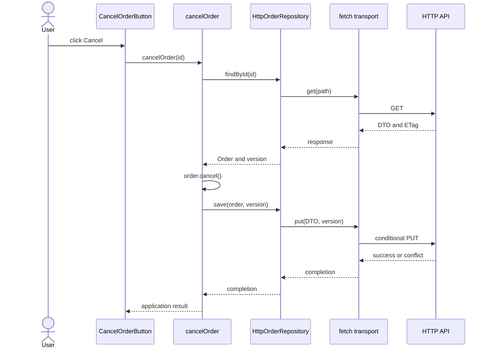
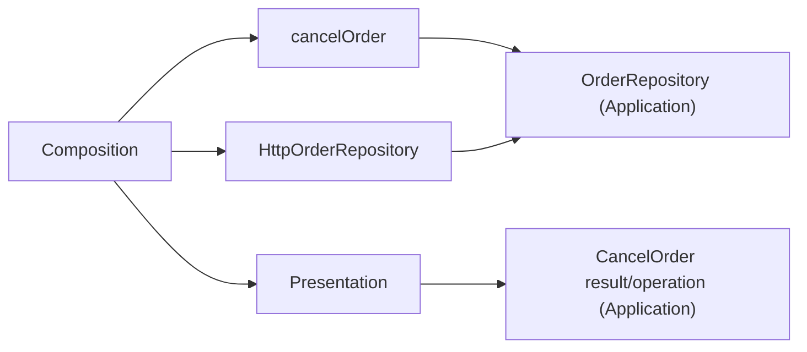

> **[Clean Architecture](README.md)** › Building a Feature End-to-End.

# 4. Building a Feature End-to-End

Requirement: cancel a pending order, reject a shipped order, persist the change, and show pending/error feedback. This small browser feature uses manual injection and no state library. Each block is a complete file; paths assume these folders under `src/` and a TypeScript bundler resolving extensionless imports.

<a id="41-step-1--the-entity-what-the-feature-is"></a>

## 4.1 Step 1 — model the business rule

```ts
// domain/orders/Order.ts
export const ORDER_STATUSES = ['pending', 'shipped', 'cancelled'] as const
export type OrderStatus = (typeof ORDER_STATUSES)[number]

export function isOrderStatus(value: unknown): value is OrderStatus {
  return ORDER_STATUSES.some(status => status === value)
}

export class ShippedOrderCannotBeCancelled extends Error {}
export class Order {
  readonly id: string
  #status: OrderStatus
  constructor(id: string, status: OrderStatus) { this.id = id; this.#status = status }
  get status(): OrderStatus { return this.#status }
  cancel(): void {
    if (this.#status === 'shipped') throw new ShippedOrderCannotBeCancelled()
    this.#status = 'cancelled'
  }
}
```

This file owns the business [invariant](../GLOSSARY.md#invariant). It knows no HTTP, UI or persistence format. Cancelling an already cancelled order leaves it cancelled; this alone does not guarantee [idempotency](../GLOSSARY.md#idempotency) of external [side effects](../GLOSSARY.md#side-effect).

<a id="42-step-2--the-port-and-the-use-case-what-the-feature-does"></a>

## 4.2 Step 2 — define the Application capability

```ts
// application/orders/use-cases/cancelOrder.ts
import { Order, ShippedOrderCannotBeCancelled } from '@/domain/orders/Order'

export interface OrderRepository {
  findById(id: string): Promise<{ order: Order; version: string } | null>
  save(order: Order, expectedVersion: string): Promise<void>
}
export type CancelResult =
  | { ok: true; status: 'cancelled' }
  | { ok: false; reason: 'not-found' | 'shipped' | 'conflict' | 'unavailable' }
export type CancelOrder = (id: string) => Promise<CancelResult>
export class PersistenceFailure extends Error {
  readonly reason: 'conflict' | 'unavailable'
  constructor(reason: 'conflict' | 'unavailable') { super(reason); this.reason = reason }
}
export function makeCancelOrder(orders: OrderRepository): CancelOrder {
  return async id => {
    try {
      const loaded = await orders.findById(id)
      if (!loaded) return { ok: false, reason: 'not-found' }
      loaded.order.cancel()
      await orders.save(loaded.order, loaded.version)
      return { ok: true, status: 'cancelled' }
    } catch (error) {
      if (error instanceof ShippedOrderCannotBeCancelled) return { ok: false, reason: 'shipped' }
      if (error instanceof PersistenceFailure) return { ok: false, reason: error.reason }
      throw error // programming defects are not normal business outcomes
    }
  }
}
```

The repository [port](../GLOSSARY.md#port) protects loading/persisting business objects. Its version precondition expresses concurrency without naming HTTP. The UI receives an application-owned string command and result, not a domain object or raw response.

<a id="43-step-3--the-adapter-how-the-feature-reaches-the-world"></a>

## 4.3 Step 3 — implement the outer adapter

```ts
// infrastructure/http/orders/adapters/HttpOrderRepository.ts
import { Order, isOrderStatus, type OrderStatus } from '@/domain/orders/Order'
import { PersistenceFailure, type OrderRepository } from '@/application/orders/use-cases/cancelOrder'

// Adapter-owned transport contract. A concrete fetch driver implements it.
export interface OrderTransport {
  get(path: string): Promise<{ data: unknown; version: string } | null>
  put(path: string, data: unknown, version: string): Promise<void>
}
type ApiOrderDto = { id: string; status: string } // external wire shape
function parseOrderDto(data: unknown): { id: string; status: OrderStatus } {
  if (typeof data !== 'object' || data === null) throw new PersistenceFailure('unavailable')
  const dto = data as Record<string, unknown>
  if (typeof dto.id !== 'string' || !isOrderStatus(dto.status)) {
    throw new PersistenceFailure('unavailable')
  }
  return { id: dto.id, status: dto.status }
}
function toOrderDto(order: Order): ApiOrderDto { return { id: order.id, status: order.status } }

export class HttpOrderRepository implements OrderRepository {
  readonly #transport: OrderTransport
  constructor(transport: OrderTransport) { this.#transport = transport }
  async findById(id: string) {
    const response = await this.#transport.get('/orders/' + encodeURIComponent(id))
    if (!response) return null
    const dto = parseOrderDto(response.data)
    if (dto.id !== id) throw new PersistenceFailure('unavailable')
    return { order: new Order(dto.id, dto.status), version: response.version }
  }
  async save(order: Order, expectedVersion: string): Promise<void> {
    await this.#transport.put('/orders/' + encodeURIComponent(order.id), toOrderDto(order), expectedVersion)
  }
}
```

The external response is treated as `unknown` until its fields are checked. The [adapter](../GLOSSARY.md#adapter) owns the transport shape (`id` and response parsing), but reuses `isOrderStatus` from [Domain](../GLOSSARY.md#domain) for valid business values. `OrderStatus` and its runtime checker are derived from the same `ORDER_STATUSES` definition; this HTTP implementation must not maintain another status list. The wire [DTO](../GLOSSARY.md#data-transfer-object-dto) intentionally allows a general `string` because another API version may send an unsupported status; only the successfully parsed result is narrowed to `OrderStatus`.

The [DTO](../GLOSSARY.md#data-transfer-object-dto), validation and [mapper](../GLOSSARY.md#mapper) stay with the [adapter](../GLOSSARY.md#adapter). The inner [port](../GLOSSARY.md#port) does not import them. This physical [Infrastructure](../GLOSSARY.md#infrastructure) file implements the canonical [Interface Adapter](../GLOSSARY.md#interface-adapter) role.

<a id="44-step-4--the-framework--the-ui-how-the-feature-is-delivered"></a>

## 4.4 Step 4 — adapt Application to Presentation

```ts
// presentation/orders/components/CancelOrderButton/CancelOrderButton.ts
import type { CancelOrder } from '@/application/orders/use-cases/cancelOrder'

export function mountCancelOrderButton(root: HTMLElement, id: string, cancelOrder: CancelOrder) {
  const button = document.createElement('button')
  button.textContent = 'Cancel order'
  const feedback = document.createElement('p')
  feedback.setAttribute('role', 'status')
  root.append(button, feedback)
  let disposed = false
  async function onCancel() {
    if (button.disabled) return
    button.disabled = true
    feedback.textContent = 'Cancelling…'
    try {
      const result = await cancelOrder(id)
      if (!disposed) feedback.textContent = result.ok ? 'Cancelled' : `Cannot cancel: ${result.reason}`
    } catch {
      if (!disposed) feedback.textContent = 'Unexpected failure'
    } finally {
      if (!disposed) button.disabled = false
    }
  }
  button.addEventListener('click', onCancel)
  return () => {
    disposed = true
    button.removeEventListener('click', onCancel)
    button.remove(); feedback.remove()
  }
}
```

The button owns feedback and gestures; [Application](../GLOSSARY.md#application-layer) coordinates cancellation and asks [Domain](../GLOSSARY.md#domain) whether it is allowed. This file uses the [combined outer-module choice](../foundations/dependency-boundaries.md#combined-outer-modules) for presentation behavior and DOM glue.

A React feature can receive `CancelOrder` via props/context; Redux bindings can receive it through `extraArgument`. Consumers must not import a container to retrieve it.

## 4.5 Step 5 — compose at the edge

```ts
// composition/bootstrap.ts
import { makeCancelOrder, PersistenceFailure } from '@/application/orders/use-cases/cancelOrder'
import { HttpOrderRepository, type OrderTransport } from '@/infrastructure/http/orders/adapters/HttpOrderRepository'
import { mountCancelOrderButton } from '@/presentation/orders/components/CancelOrderButton/CancelOrderButton'

async function request(path: string, init?: RequestInit): Promise<Response> {
  try { return await fetch(path, init) }
  catch { throw new PersistenceFailure('unavailable') }
}
const transport: OrderTransport = {
  async get(path) {
    const response = await request(path)
    if (response.status === 404) return null
    const version = response.headers.get('ETag')
    if (!response.ok || !version) throw new PersistenceFailure('unavailable')
    try { return { data: await response.json(), version } }
    catch { throw new PersistenceFailure('unavailable') }
  },
  async put(path, data, version) {
    const response = await request(path, {
      method: 'PUT',
      headers: { 'Content-Type': 'application/json', 'If-Match': version },
      body: JSON.stringify(data),
    })
    if (response.status === 409 || response.status === 412) throw new PersistenceFailure('conflict')
    if (!response.ok) throw new PersistenceFailure('unavailable')
  },
}
export function startOrders(root: HTMLElement, orderId: string) {
  const cancelOrder = makeCancelOrder(new HttpOrderRepository(transport))
  return mountCancelOrderButton(root, orderId, cancelOrder)
}
```

The entry point calls `startOrders(root, 'order-1')` with an existing element and receives cleanup. Concrete fetch glue at the outer executable boundary implements the [adapter](../GLOSSARY.md#adapter)-owned transport contract. Composition follows the inward rule.

**API assumptions and limits.** GET returns an order and a strong ETag; PUT atomically honors `If-Match`. The backend must also authorize cancellation and enforce the shipped-order rule against its own current state. A browser check followed by an unconditional write cannot guarantee that [invariant](../GLOSSARY.md#invariant) when shipping and cancellation race. Authentication, retries, telemetry and the backend implementation are outside this small client example. A dedicated atomic cancellation endpoint may be preferable.

<a id="45-the-whole-flow"></a>

## 4.6 The runtime flow



The [port](../GLOSSARY.md#port) is a source contract, not another runtime object:



## 4.7 When the feature is simpler

A read-only screen without meaningful application policy may need only a query [adapter](../GLOSSARY.md#adapter). Create a [port](../GLOSSARY.md#port) because it protects policy or an integration boundary, rather than to populate folders.

## 4.8 Change-pressure review: not merely a five-file demo

| Real product change | Expected owner and change | What should stay untouched |
| --- | --- | --- |
| Orders gain a new valid status | The Orders [Domain](../GLOSSARY.md#domain) owns `ORDER_STATUSES` and its transition rules. Update expected behavior tests and any screen-specific display text that must show the state. | Do not maintain a second status allowlist in the HTTP parser or duplicate cancellation rules in UI handlers. |
| The order endpoint changes fields, transport or error format | The concrete transport/[adapter](../GLOSSARY.md#adapter) changes its [DTO](../GLOSSARY.md#data-transfer-object-dto) mapping. Check the API contract and supported deployment versions. | [Domain](../GLOSSARY.md#domain) policy and `makeCancelOrder` remain stable if the required operation does not change. |
| Another screen, client or repository implementation uses cancellation | Compose another caller or supply a different implementation of the existing required capability **when justified**. Expose the feature through a narrow [public API](../GLOSSARY.md#public-api) rather than deep-importing internals. | Keep authoritative cancellation rules in the business model; do not clone the entire feature just to reuse one operation. |
| Shipping and cancellation race | The backend must decide atomically against current state, with `If-Match`/versioning or a dedicated cancellation command as appropriate. Test conflicts and failure recovery. | A browser-only check must never be presented as the authority for the persisted business rule. |

The small guide co-locates the cohesive order contract, result and orchestration for readability. At a larger scale, split these when their **ownership or reasons to change differ**, not simply because the folder reaches a file-count threshold. The canonical [Domain](../GLOSSARY.md#domain)/[Application](../GLOSSARY.md#application-layer)/[Infrastructure](../GLOSSARY.md#infrastructure) blocks in this chapter are the editorial source for the complete examples in the four landing pages; run `npm run sync:examples` after changing them, then `npm run check`.

## 4.9 Feature checklist

- Test shipped rejection and successful persistence through the application [port](../GLOSSARY.md#port).
- Test conflict results; never silently overwrite newer state.
- Test [DTO](../GLOSSARY.md#data-transfer-object-dto) parsing and conditional request headers at the [adapter](../GLOSSARY.md#adapter) boundary.
- Test pending/error feedback, event forwarding and cleanup in the UI.
- Enforce imports: [Domain](../GLOSSARY.md#domain) knows no outer modules; [Application](../GLOSSARY.md#application-layer) knows no concrete [adapter](../GLOSSARY.md#adapter); [Presentation](../GLOSSARY.md#presentation-layer) receives [Application](../GLOSSARY.md#application-layer) operations; the executable root selects implementations.

## Sources

- [Martin — The Clean Architecture (2012)](https://blog.cleancoder.com/uncle-bob/2012/08/13/the-clean-architecture.html)
- [Seemann — Composition Root](https://blog.ploeh.dk/2011/07/28/CompositionRoot/)
- [HTTP Semantics — If-Match](https://www.rfc-editor.org/rfc/rfc9110.html#section-13.1.1)
