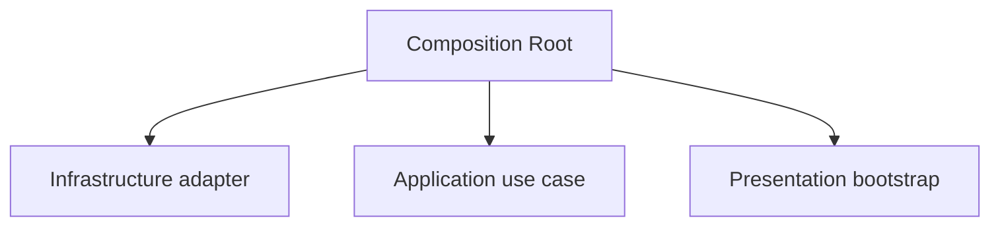
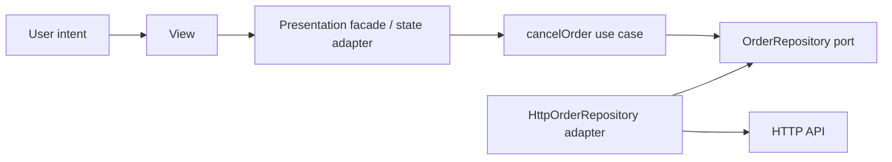
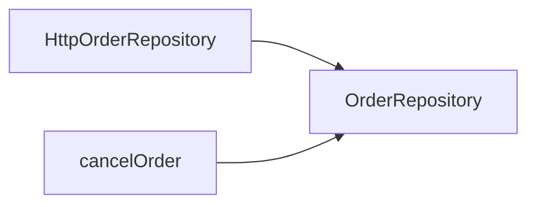

> **[Clean Architecture](README.md)** › Building a Feature End-to-End.

# 4. Building a Feature End-to-End

This chapter builds a policy-bearing feature from the inside out without turning the Composition Root into a global service locator.

Example capability: cancelling an order.

---

## 4.1 Step 1 — model the business rule

Only create Domain behavior if the problem actually has a rule worth protecting.

```ts
// domain/orders/Order.ts
export class Order {
  constructor(
    readonly id: OrderId,
    private status: OrderStatus,
  ) {}

  cancel() {
    if (this.status === 'shipped') {
      throw new ShippedOrderCannotBeCancelled(this.id)
    }

    this.status = 'cancelled'
  }
}
```

No HTTP, Redux, database or UI concepts appear here.

---

## 4.2 Step 2 — define the Application capability

The use case owns the external capability it needs:

```ts
// application/orders/ports/OrderRepository.ts
export interface OrderRepository {
  findById(id: OrderId): Promise<Order | null>
  save(order: Order): Promise<void>
}
```

Then orchestrate the operation:

```ts
// application/orders/use-cases/cancelOrder.ts
export function makeCancelOrder(deps: {
  orders: OrderRepository
}) {
  return async function cancelOrder(id: OrderId): Promise<void> {
    const order = await deps.orders.findById(id)

    if (!order) throw new OrderNotFound(id)

    order.cancel()
    await deps.orders.save(order)
  }
}
```

The use case can be tested with an in-memory/fake port immediately.

---

## 4.3 Step 3 — implement the outer adapter

```ts
// infrastructure/orders/HttpOrderRepository.ts
export class HttpOrderRepository implements OrderRepository {
  constructor(private readonly http: HttpClient) {}

  async findById(id: OrderId): Promise<Order | null> {
    const response = await this.http.get('/orders/' + id.value)

    return response.data
      ? mapOrderDto(response.data)
      : null
  }

  async save(order: Order): Promise<void> {
    await this.http.put(
      '/orders/' + order.id.value,
      toOrderDto(order),
    )
  }
}
```

External DTOs are translated at the boundary.

---

## 4.4 Step 4 — adapt Application to Presentation

Presentation should consume a semantic operation, not import Infrastructure.

A simple React hook could receive the use case through a feature dependency object/context, or a Redux store could receive it through thunk `extraArgument`.

Example feature facade shape:

```ts
export interface OrderActions {
  cancelOrder(id: string): Promise<
    | { ok: true }
    | { ok: false; message: string }
  >
}
```

The UI deals with a Presentation-appropriate result rather than HTTP status codes.

For larger frontend organization, see **[Presentation Architecture](../frontend/presentation-architecture.md)**.

---

## 4.5 Step 5 — compose at the edge

Composition creates concrete dependencies and hands them **into** the delivery mechanism:

```ts
// composition/bootstrap.ts
const orderRepository = new HttpOrderRepository(http)

const cancelOrder = makeCancelOrder({
  orders: orderRepository,
})

const store = createAppStore({
  cancelOrder,
})

startUi({ store })
```

The dependency direction is:



Presentation does **not** import the Composition Root:

```ts
// Avoid:
import { cancelOrder } from '@/composition/container'
```

If consumers reach into the container, composition stops being a root and becomes a service locator.

---

## 4.6 The runtime flow



Source dependencies still point inward around policy:



and composition connects the runtime graph.

---

## 4.7 When the feature is simpler

Do not build all of these artifacts for every read-only request.

If a screen only displays server state and has no meaningful application policy, a query/server-state adapter may be sufficient.

Architecture should protect complexity that exists, not create complexity to justify itself.

---

## 4.8 Feature checklist

Before merging a policy-bearing feature:

- [ ] Business invariants have a clear owner.
- [ ] Application policy does not import concrete Infrastructure.
- [ ] External DTOs/platform types stop at an outer boundary.
- [ ] Ports describe cohesive capabilities.
- [ ] Presentation receives semantic operations/results.
- [ ] Composition injects dependencies into consumers.
- [ ] Consumers do not resolve dependencies from a global container.
- [ ] Important import rules are enforced in CI.

## Sources

- Robert C. Martin, "The Clean Architecture": https://blog.cleancoder.com/uncle-bob/2012/08/13/the-clean-architecture.html
- Mark Seemann, "Composition Root": https://blog.ploeh.dk/2011/07/28/CompositionRoot/
- Alistair Cockburn, "Hexagonal Architecture": https://alistair.cockburn.us/hexagonal-architecture/
