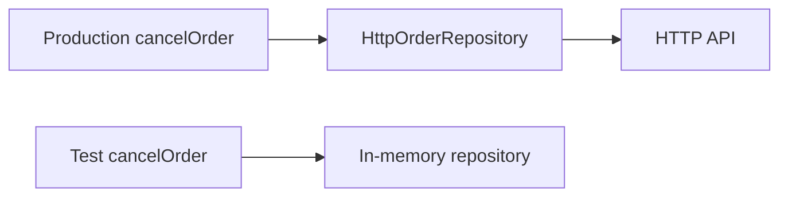

> **[Clean Architecture](README.md)** › Testing. Full reference list: [References](references.md).

## 5. Testing in Clean Architecture

Inward source dependencies help isolate policy. Injection supplies replacement points; a folder name alone does not guarantee substitutability.

### 5.1 A test is just another adapter

An in-memory implementation and an HTTP implementation can satisfy the same inner contract. They are alternative runtime collaborators, not objects behind another “[port](../GLOSSARY.md#port)” node:



Business-rule tests can call policy directly. Journey tests still need the UI and external integration to detect wiring failures.

### 5.2 The test pyramid mapped onto the circles

| Boundary | What to test | Typical setup |
| --- | --- | --- |
| [Entities](../GLOSSARY.md#clean-entities-circle) | business rules and [invariant](../GLOSSARY.md#invariant) failures | domain values/objects |
| [Use Cases](../GLOSSARY.md#use-case) | orchestration, missing data, persistence failures | supplied [port](../GLOSSARY.md#port) implementation |
| [Interface Adapters](../GLOSSARY.md#interface-adapter) | mapping, input/output and result translation | controlled transport/view contract |
| [Frameworks & Drivers](../GLOSSARY.md#frameworks-and-drivers) | framework, request and persistence integration | framework harness or external system |

The [test pyramid](../GLOSSARY.md#test-pyramid) is a cost/feedback heuristic, not a quota or a one-to-one mapping onto circles. Retain integration/journey tests for risks inner tests cannot observe.

### 5.3 Why the inner circles are cheap to test

These Vitest tests use the exact signatures from [the cancellation feature](4-building-a-feature.md), colocated with the named source files.

```ts
// domain/orders/Order.test.ts
import { expect, test } from 'vitest'
import { Order, ShippedOrderCannotBeCancelled } from './Order'
test('a shipped order cannot be cancelled', () => {
  const order = new Order('1', 'shipped')
  expect(() => order.cancel()).toThrow(ShippedOrderCannotBeCancelled)
  expect(order.status).toBe('shipped')
})
```

```ts
// application/orders/cancelOrder.test.ts
import { expect, test } from 'vitest'
import { Order } from '../../domain/orders/Order'
import { makeCancelOrder, PersistenceFailure, type OrderRepository } from './cancelOrder'
test('persists cancellation using the loaded version', async () => {
  let saved: { status: string; version: string } | undefined
  const orders: OrderRepository = {
    async findById(id) { return { order: new Order(id, 'pending'), version: 'v1' } },
    async save(order, version) { saved = { status: order.status, version } },
  }
  expect(await makeCancelOrder(orders)('1')).toEqual({ ok: true, status: 'cancelled' })
  expect(saved).toEqual({ status: 'cancelled', version: 'v1' })
})
test('reports a concurrency conflict', async () => {
  const orders: OrderRepository = {
    async findById(id) { return { order: new Order(id, 'pending'), version: 'v1' } },
    async save() { throw new PersistenceFailure('conflict') },
  }
  expect(await makeCancelOrder(orders)('1')).toEqual({ ok: false, reason: 'conflict' })
})
```

These substitutes supply answers and record outcomes. They do not prove production honors conditional writes; test the [adapter](../GLOSSARY.md#adapter)/backend contract separately. Hard tests may also expose time, randomness or poorly exposed behavior, rather than outward dependencies alone.

### 5.4 Test doubles, named

- **[Fake](../GLOSSARY.md#fake):** a simplified working implementation, such as a stateful in-memory repository.
- **[Stub](../GLOSSARY.md#stub):** supplies predetermined responses.
- **[Spy](../GLOSSARY.md#spy):** records calls for later assertions.
- **[Mock](../GLOSSARY.md#mock):** checks prearranged interaction expectations.
- **Dummy:** fills an unused parameter.

A `vi.fn().mockResolvedValue(...)` is normally a [stub](../GLOSSARY.md#stub) with [spy](../GLOSSARY.md#spy) capabilities. Assert outcomes when they describe the requirement; verify interactions when the interaction itself matters, such as passing a version precondition.

### 5.5 Where tests live

Prefer colocated `<Unit>.test.ts` / `<Component>.test.tsx` files here. A separate test tree also works if ownership stays clear. Substitute the boundaries needed for the scenario, rather than “exactly one circle outward”. Architecture tests inspect forbidden imports independently.

Next: **[Composition & Dependency Injection](6-composition-and-di.md)** — where the executable selects implementations and injects them. An [adapter](../GLOSSARY.md#adapter) also names its inner [port](../GLOSSARY.md#port); composition is not the only place that knows both.

## Sources

- [Martin — The Clean Architecture](https://blog.cleancoder.com/uncle-bob/2012/08/13/the-clean-architecture.html)
- [Fowler — Test Double](https://martinfowler.com/bliki/TestDouble.html)
- [Fowler — Mocks Aren't Stubs](https://martinfowler.com/articles/mocksArentStubs.html)
- [Fowler — The Practical Test Pyramid](https://martinfowler.com/articles/practical-test-pyramid.html)
