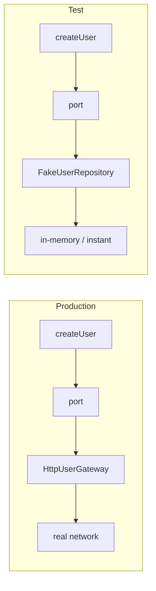

> **[Clean Architecture](README.md)** › Testing. Full reference list: [References](references.md).

## 5. Testing in Clean Architecture

Testability is not a separate discipline bolted onto [Clean Architecture](../GLOSSARY.md#clean-architecture) — it is the design's most
immediate dividend. The same rule that forbids an inner circle from naming an outer one is what guarantees
that, in a test, every outer collaborator can be replaced by a substitute under the test's control
[Cockburn 2005; Martin 2017].

### 5.1 A test is just another adapter

Martin places automated tests in the outermost circle, as another kind of *detail* that consumes the
application through the same boundaries the UI does — the **Test Boundary** [Martin 2017, ch. 28]. The
consequence is liberating: **a test is just another [adapter](../GLOSSARY.md#adapter).** Where production plugs an HTTP [gateway](../GLOSSARY.md#gateway) into
a [port](../GLOSSARY.md#port), a test plugs a [fake](../GLOSSARY.md#fake) into the same [port](../GLOSSARY.md#port). Nothing in the [Entities](../GLOSSARY.md#domain-entity) or [Use Cases](../GLOSSARY.md#use-case) changes between the
two configurations — which is the entire point of having a [port](../GLOSSARY.md#port) there.



From this follows the rule of thumb that prevents fragile tests: **tests should depend on the stable inner
circles, not on the volatile outer details.** A test that drives the UI to assert a business rule is
coupled to two things that change for unrelated reasons — the rule and the markup. A test that calls the
[use case](../GLOSSARY.md#use-case) directly is coupled only to the rule.

### 5.2 The test pyramid mapped onto the circles

The classic [test pyramid](../GLOSSARY.md#test-pyramid) [Cohn 2009; Vocke 2018] maps cleanly onto the four circles. Cost rises and
desired quantity falls as you move outward:

| Circle | What you test | [Test double](../GLOSSARY.md#test-double) needed | Cost |
|---|---|---|---|
| **[Entities](../GLOSSARY.md#domain-entity)** | [invariants](../GLOSSARY.md#invariant), derived state, rules | none | trivial — pure functions |
| **[Use Cases](../GLOSSARY.md#use-case)** | orchestration, validation, error mapping | a [fake](../GLOSSARY.md#fake) for each [port](../GLOSSARY.md#port) | cheap — one [fake](../GLOSSARY.md#fake), no network |
| **[Interface Adapters](../GLOSSARY.md#interface-adapter)** | mapping JSON ↔ entities, controller wiring | a stubbed transport | moderate |
| **[Frameworks & Drivers](../GLOSSARY.md#frameworks-and-drivers)** | that the framework is wired correctly | the real thing, or a harness | expensive — keep few |

Most of your tests should sit in the bottom two rows, because that is where most of the *meaning* lives and
where tests are cheapest to write and slowest to rot.

### 5.3 Why the inner circles are cheap to test

An [Entity](../GLOSSARY.md#domain-entity) test needs no setup at all — construct the object, assert a getter:

```js
test('a pending order can be cancelled', () => {
  const order = new Order({ id: '1', lines: [], status: 'pending' })
  expect(order.canBeCancelled()).toBe(true)
})
```

A [Use Case](../GLOSSARY.md#use-case) test supplies a [fake](../GLOSSARY.md#fake) for each [port](../GLOSSARY.md#port) and asserts the orchestration — still no network, no
framework, no DOM:

```js
test('createUser delegates to the repository', async () => {
  const fake = { create: vi.fn().mockResolvedValue(new User({ id: '1' })) }
  const createUser = makeCreateUser({ userRepository: fake })

  await createUser({ firstName: 'Ada' })

  expect(fake.create).toHaveBeenCalledOnce()
})
```

The [fake](../GLOSSARY.md#fake) is injected in **one line** because the [use case](../GLOSSARY.md#use-case) depends on a [port](../GLOSSARY.md#port). The moment a [use case](../GLOSSARY.md#use-case) instead
imports a concrete [adapter](../GLOSSARY.md#adapter), this test can no longer inject a [fake](../GLOSSARY.md#fake) cleanly — it must intercept a module path
at the bundler level, which is exactly the kind of brittle, implementation-coupled test the architecture
exists to avoid. **The test you have to write is feedback on the design you chose** — if a unit is hard to
test, it is usually depending outward.

### 5.4 Test doubles, named

Use the precise vocabulary [Meszaros 2007; Fowler 2007] rather than calling everything a "[mock](../GLOSSARY.md#mock)":

- **[Fake](../GLOSSARY.md#fake)** — a working but simplified implementation (an in-memory [repository](../GLOSSARY.md#repository)). The default for [ports](../GLOSSARY.md#port).
- **[Stub](../GLOSSARY.md#stub)** — returns canned answers to calls made during the test.
- **[Spy](../GLOSSARY.md#spy)** — a [stub](../GLOSSARY.md#stub) that also records how it was called.
- **[Mock](../GLOSSARY.md#mock)** — a double pre-programmed with expectations that it verifies.
- **Dummy** — passed to fill a parameter list but never used.

Prefer **[fakes](../GLOSSARY.md#fake) and [stubs](../GLOSSARY.md#stub) over [mocks](../GLOSSARY.md#mock)** for [port](../GLOSSARY.md#port) boundaries: assert the observable outcome, not the exact
sequence of internal calls. Over-mocking couples a test to *how* a unit works rather than *what* it does,
and that is the most common cause of tests that break on every refactor [Khorikov 2020].

### 5.5 Where tests live

Co-locate tests in `__tests__/` siblings, named `<Unit>.test.js`, mirroring the circle they cover. A test
substitutes exactly one circle outward — the boundary the unit under test depends on — and no further.

---

Next: **[Composition & Dependency Injection](6-composition-and-di.md)** — the one place allowed to name
both a [port](../GLOSSARY.md#port) and its concrete [adapter](../GLOSSARY.md#adapter).
