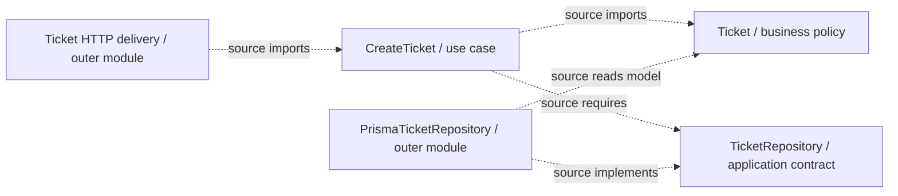

> **[Clean Architecture](README.md)** › [Clean Architecture](../GLOSSARY.md#clean-architecture) on the Backend.

# 8. Clean Architecture on the Backend

An analyst submits `POST /tickets`. The backend owns whether the ticket is valid, creates its initial state and saves it. Replacing Nest's HTTP delivery or Prisma persistence should not rewrite that decision. [Clean Architecture](../GLOSSARY.md#clean-architecture) describes the source dependency constraints that protect it.

First follow the [backend learning path](../backend/README.md) for request, routing, controller, [DI](../GLOSSARY.md#dependency-injection-di) and persistence mechanisms. The [canonical ticket implementation](../backend/2-typescript-first-boundaries.md) and [Nest wiring](../backend/4-create-ticket-with-nestjs.md) own the snippets. This chapter explains what is specific to Clean rather than keeping a second implementation or switching to an unrelated User example.

## 8.1 A backend mapping

`Ticket.create()` decides the subject and initial state; `CreateTicket.execute()` coordinates that rule and saving; the outer code translates JSON and storage fields. Only after those responsibilities are concrete do Clean's circle names become useful:

| Clean circle | Ticket responsibility | Physical mapping in this handbook |
| --- | --- | --- |
| [Entities](../GLOSSARY.md#clean-entities-circle) / general business policy | valid subject, owned status vocabulary and initial state | `domain/tickets/Ticket.ts` |
| [Use Cases](../GLOSSARY.md#use-case) / application policy | create and persist; required repository capability | `application/tickets/` |
| [Interface Adapters](../GLOSSARY.md#interface-adapter) | request/result and ticket/record translation | plain parser/mapping functions in outer delivery/persistence areas |
| [Frameworks & Drivers](../GLOSSARY.md#frameworks-and-drivers) | Nest runtime/decorators, Prisma client, driver and assembly | technical glue in those outer areas and composition |

The circle names are conceptual. The controller and persistence implementation follow the [combined outer-module choice](../foundations/dependency-boundaries.md#combined-outer-modules): translation and technical glue share a file while [Domain](../GLOSSARY.md#domain) and [Application](../GLOSSARY.md#application-layer) remain independent. That canonical explanation describes when a further split pays off; it is not a requirement to create more classes.

Dashed arrows below describe **source dependencies toward inner policy**. The repository contract is a source requirement, not a runtime intermediary:

Folder names are documentation conventions. Inward references are the architectural constraint; a correctly named folder cannot repair outward imports.

## 8.2 Domain

The support business owns the rule that a new ticket starts open and has a nonblank bounded subject. `Ticket` enforces those rules without Nest, HTTP request types, [DTOs](../GLOSSARY.md#data-transfer-object-dto) or [ORM](../GLOSSARY.md#orm) records. Martin's [Entities circle](../GLOSSARY.md#clean-entities-circle) describes general business policy, not a requirement that every policy be an identity-bearing class.

The [canonical domain code](../backend/2-typescript-first-boundaries.md#2-decide-what-a-valid-ticket-means-in-one-place) derives static status types and the runtime guard from one list. Client validation is not authority over persisted tickets. A frontend model can share terminology while having independent ownership and release timing; identical type shapes do not establish identical semantics.

## 8.3 Application

The [creation operation](../backend/2-typescript-first-boundaries.md#3-save-without-naming-a-database-in-the-operation) invokes the domain factory, awaits `insert` on its supplied repository and returns a plain result. Its contract names the capability it needs rather than Prisma's generated API.

At runtime it calls the actual injected implementation. In source it refers only to the inward-owned contract. This allows outward runtime control without reversing the [Dependency Rule](../GLOSSARY.md#dependency-rule). Manual injection and Nest factory providers are two assembly mechanisms for the same boundary.

The caller receives a simple result and chooses its representation. HTTP maps it to JSON/status codes; a CLI maps it to a message/exit code. This return-based boundary is sufficient here.

Suppose a later bulk ticket import needs to report progress before the entire operation completes. [Application](../GLOSSARY.md#application-layer) could call `progress({ completed, rejected })` on a supplied collaborator as it processes records. An application-owned **[output port](../GLOSSARY.md#output-port)** defines that plain output interaction; an outer [presenter](../GLOSSARY.md#presenter) implements it to format terminal or streamed response data. The operation imports its interface, never the [presenter](../GLOSSARY.md#presenter) class, and startup supplies the implementation. This is a possible motivating requirement, not a bulk-import feature implemented by our ticket example. Martin's [boundary-crossing example](https://blog.cleancoder.com/uncle-bob/2012/08/13/the-clean-architecture.html) also shows an output boundary for a final response. A separate [presenter](../GLOSSARY.md#presenter) can be useful in that design; one is not required around this returned promise. An [output port](../GLOSSARY.md#output-port) alone does not provide reliable event delivery, backpressure or background-job progress storage.

## 8.4 Infrastructure

The [Prisma adapter](../backend/4-create-ticket-with-nestjs.md#5-replace-memory-when-the-ticket-must-survive-restart) maps `Ticket.status` into database `state`, performs one insert and translates recognized storage outages into an application-owned failure. It imports the inner model/contract; the inner code does not import it. Unexpected defects remain diagnosable rather than being labelled business rejection.

An [ORM](../GLOSSARY.md#orm) record must not automatically become an entity. Future loading needs a domain-owned restoration operation that preserves existing state and validates domain values, not `Ticket.create()` resetting the row to open.

## 8.5 Interface adapters / delivery

The [controller](../backend/4-create-ticket-with-nestjs.md#3-finish-the-http-boundary) accepts parsed input, invokes the [use case](../GLOSSARY.md#use-case) and maps its result to HTTP fields/statuses. It does not choose ticket initial state. A CLI or message consumer would map its own input/output while calling the same operation. Those alternatives need their own verified identity, permission and delivery assumptions.

The physical HTTP area contains Nest glue as well as translation; see [the canonical combined-role explanation](../foundations/dependency-boundaries.md#combined-outer-modules). Clean's translation responsibility does not authorize outward source dependencies in inner policy.

## 8.6 Transactions

A single ticket insert is atomic enough for the first requirement. If creating a ticket must also reserve quota, [Domain](../GLOSSARY.md#domain) owns the capacity rule; [Application](../GLOSSARY.md#application-layer) requires that the current-capacity check and write complete together without competing calls exceeding it; [Infrastructure](../GLOSSARY.md#infrastructure) implements that guarantee. A separate read followed by an insert can race. The implementation may use a transaction with appropriate isolation, a purposeful [Unit of Work](../GLOSSARY.md#unit-of-work) [port](../GLOSSARY.md#port), or a cohesive atomic repository operation. No generic transaction abstraction is needed before that requirement exists. [The quota exercise](../backend/6-boundary-exercises.md#3-compete-for-a-shared-quota) makes the failure and required guarantee observable without a database.

Keep [ORM](../GLOSSARY.md#orm) transaction objects out of [Domain](../GLOSSARY.md#domain). A network failure after commit can leave an uncertain outcome; neither Clean's [Dependency Rule](../GLOSSARY.md#dependency-rule) nor a transaction alone deduplicates client retries. [The canonical limits](../backend/4-create-ticket-with-nestjs.md#7-review-changes-and-failures-before-calling-it-maintainable) explain the next decisions.

## 8.7 Validation

The HTTP parser checks an unknown body's shape. `Ticket.create()` owns business validity. [Application](../GLOSSARY.md#application-layer) coordinates the operation. Storage constraints defend persistence and must be reconciled with those owned rules. A [DTO](../GLOSSARY.md#data-transfer-object-dto)'s string check and [Domain](../GLOSSARY.md#domain)'s nonblank-subject check answer different questions; repeating the 160-unit rule in both would create two policy owners.

An outer validator can **call** the domain factory/guard or translate a domain failure for immediate feedback. It must not invent another status allowlist. See [the TypeScript-first validation explanation](../backend/2-typescript-first-boundaries.md#1-check-what-arrived-before-trusting-its-type).

## 8.8 Shared contracts with frontend

The HTTP response is a versioned wire representation, not a shared domain object. The backend maps its ticket to `ticket_id`; the [frontend adapter](../frontend/ports-and-adapters.md) can translate that into its own model. Their command/response contract must be coordinated, including field and vocabulary evolution.

A generated client/shared [DTO](../GLOSSARY.md#data-transfer-object-dto) package can help encode the wire agreement when useful. It does not require frontend and backend [Domain](../GLOSSARY.md#domain)/[Application](../GLOSSARY.md#application-layer) source files to be identical. Use API contract/integration tests to observe compatibility rather than treat shared TypeScript types as runtime validation.

## 8.9 Composition

[TicketsModule](../backend/4-create-ticket-with-nestjs.md#4-wire-memory-first) selects the concrete repository, constructs plain `CreateTicket` through a factory and lets Nest inject it into the controller. Database setup and resource lifetime stay at this outer executable edge.

Composition can import concrete implementations because its job is assembly. Inner code must not import the module/container and locate dependencies itself. Decorating an application class with `@Injectable()` is convenient but introduces a Nest source dependency; the canonical factories avoid it. This is a deliberate trade-off, not a universal ban on framework integration. See [Composition Root](../foundations/composition-root.md).

## 8.10 Frontend comparison

Both systems can protect rules from replaceable mechanisms, but their policies differ: the browser owns interaction; the backend owns authoritative persisted behavior. Sharing the dependency principle does not erase that trust boundary.

For separate **runtime calls, source dependencies and startup wiring**, use [the canonical system view](../backend/4-create-ticket-with-nestjs.md#6-three-relationships-in-one-system-view). For comparisons without equating Clean, Onion and Hexagonal, use [the backend style chapter](../backend/5-architectural-styles-with-nestjs.md). For verification, see [boundary tests](../backend/4-create-ticket-with-nestjs.md#8-verification-at-the-right-boundary).

Then compare [Onion's reading of the same backend](../onion-architecture/7-onion-on-the-backend.md) and try [the progressive boundary exercises](../backend/6-boundary-exercises.md). The order-cancellation walkthrough in this Clean guide is a browser client; this chapter's backend policy is authoritative for persisted tickets.

## Sources

- [Robert C. Martin — The Clean Architecture](https://blog.cleancoder.com/uncle-bob/2012/08/13/the-clean-architecture.html): [dependency rule](../GLOSSARY.md#dependency-rule), policy levels and boundary data.
- [Martin Fowler — Repository](https://martinfowler.com/eaaCatalog/repository.html): application/business collection-like persistence.
- [Martin Fowler — Unit of Work](https://martinfowler.com/eaaCatalog/unitOfWork.html): coordinated persistence changes.
- [Mark Seemann — Composition Root](https://blog.ploeh.dk/2011/07/28/CompositionRoot/): outer assembly.
- [Backend references](../backend/references.md): official Nest/TypeScript/Prisma sources for the canonical implementation.
