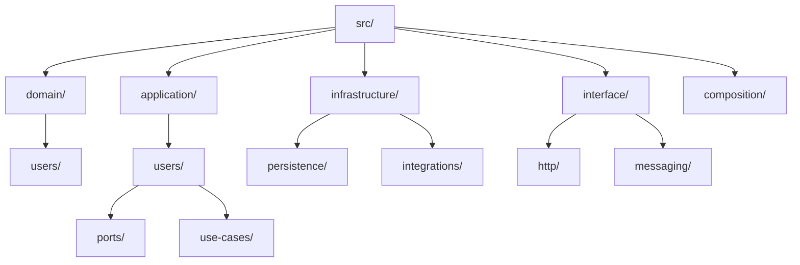
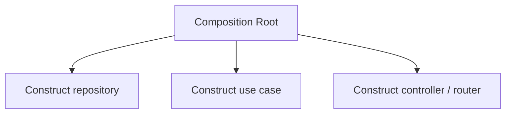
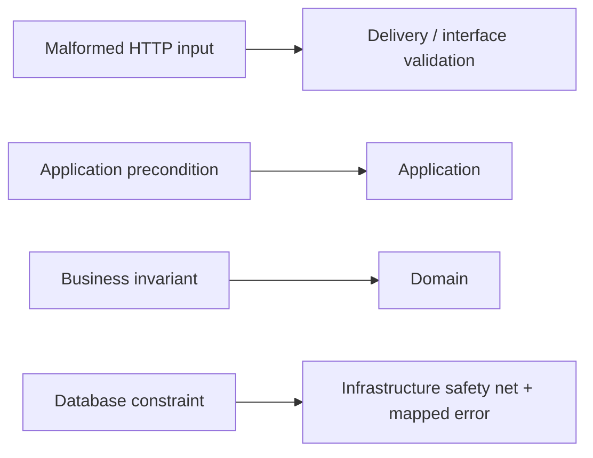
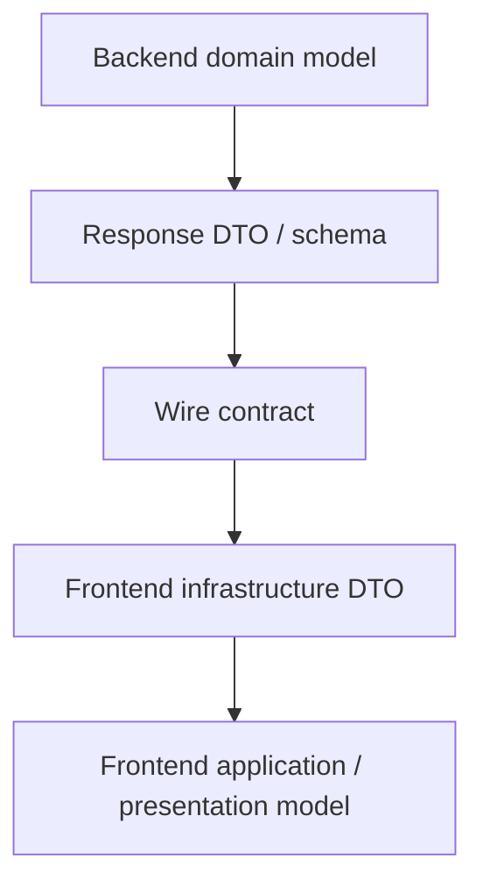
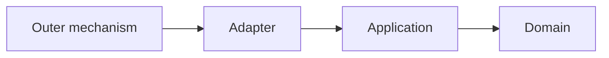

> **[Clean Architecture](README.md)** › [Clean Architecture](../GLOSSARY.md#clean-architecture) on the Backend.


# 8. Clean Architecture on the Backend

Imagine a server receiving `POST /tickets`. Its HTTP handler reads the request; an application operation checks the ticket input; database-facing code persists it. The operation should not have to import Express, Prisma or the raw HTTP request type merely to decide whether the ticket is valid.

This is the backend form of the [Dependency Rule](../GLOSSARY.md#dependency-rule): source-code references point from particular technical mechanisms toward application policy, not from the policy back to the mechanisms.

The concrete outer mechanisms here include HTTP servers, queues, schedulers, databases, ORMs, filesystem access and external SDKs.

What **does not** follow is that frontend and backend must contain identical [Domain](../GLOSSARY.md#domain) or [Application](../GLOSSARY.md#application-layer) source files.

---

<a id="81-the-four-circles-on-the-server"></a>

## 8.1 A backend mapping



Some teams call the outer HTTP/controller area `presentation`; others use `interface`, `delivery` or framework-specific modules. The name matters less than the [dependency rule](../GLOSSARY.md#dependency-rule).

---

Code below is a set of boundary excerpts: supporting `UserId`, errors, mapping functions and ORM schema are assumed. Persistence must implement the service's concurrency/transaction policy; the update below does not by itself guarantee race-free business behavior. For complete client types and wiring, see [Building a Feature](4-building-a-feature.md).

<a id="82-step-1--the-entity-unchanged"></a>

## 8.2 Domain

The backend [Domain](../GLOSSARY.md#domain) owns business concepts and [invariants](../GLOSSARY.md#invariant) that are authoritative in that service/[bounded context](../GLOSSARY.md#bounded-context).

```ts
export class User {
  constructor(
    readonly id: UserId,
    private status: UserStatus,
  ) {}

  deactivate() {
    if (this.status === 'deleted') {
      throw new UserCannotBeDeactivated()
    }

    this.status = 'inactive'
  }
}
```

A frontend may model a `User` too. That does not automatically make the two models the same object or justify a shared package.

Share code only when the semantics, ownership and release coupling are genuinely shared.

---

<a id="83-step-2--the-port-and-the-use-case-unchanged-shape"></a>

## 8.3 Application

[Application](../GLOSSARY.md#application-layer) code orchestrates use-case policy:

```ts
export interface UserRepository {
  findById(id: UserId): Promise<User | null>
  save(user: User): Promise<void>
}

export function makeDeactivateUser(deps: {
  users: UserRepository
}) {
  return async function deactivateUser(id: UserId) {
    const user = await deps.users.findById(id)

    if (!user) throw new UserNotFound(id)

    user.deactivate()
    await deps.users.save(user)
  }
}
```

The [use case](../GLOSSARY.md#use-case) does not import the ORM or web framework.

A frontend may have a different application operation such as `submitDeactivateUserConfirmation`, because client interaction and authoritative server transaction are different responsibilities.

---

## 8.4 Infrastructure

Concrete persistence implements [Application](../GLOSSARY.md#application-layer)-owned capabilities:

```ts
export class PrismaUserRepository implements UserRepository {
  constructor(private readonly db: PrismaClient) {}

  async findById(id: UserId): Promise<User | null> {
    const record = await this.db.user.findUnique({
      where: { id: id.value },
    })

    return record ? mapUserRecord(record) : null
  }

  async save(user: User): Promise<void> {
    const record = toUserRecord(user)
    await this.db.user.update({ where: { id: record.id }, data: record })
  }
}
```

The ORM record does not leak into the [use case](../GLOSSARY.md#use-case).

The same principle applies to:

- message brokers;
- object storage;
- payment SDKs;
- email providers;
- search engines;
- remote APIs.

---

<a id="84-step-3--the-interface-adapters-controller--orm-repository"></a>

## 8.5 Interface adapters / delivery

An HTTP controller translates a transport request into an application command and translates the result to a transport response. Here `HttpRequest`/`HttpResponse` are [adapter](../GLOSSARY.md#adapter)-owned shapes supplied/consumed by outer router glue. Importing framework-owned request types into a separate canonical [Interface Adapter](../GLOSSARY.md#interface-adapter) would point outward. A physical delivery module may combine both roles, but document that combination.

```ts
export function makeDeactivateUserController(deps: {
  deactivateUser: (id: UserId) => Promise<void>
}) {
  return async function controller(req: HttpRequest): Promise<HttpResponse> {
    const id = UserId.parse(req.params.id)

    await deps.deactivateUser(id)

    return { status: 204 }
  }
}
```

The controller should **receive** the [use case](../GLOSSARY.md#use-case) from composition. It should not import the [Composition Root](../GLOSSARY.md#composition-root) and locate it itself.

Bad:

```ts
import { deactivateUser } from '@/composition/container'
```

Better:



This keeps composition one-directional.

---


## 8.6 Transactions

Transaction ownership is application-specific and deserves an explicit boundary.

Options include:

- a [Unit of Work](../GLOSSARY.md#unit-of-work) [port](../GLOSSARY.md#port) owned by [Application](../GLOSSARY.md#application-layer);
- a transaction boundary applied around a [use case](../GLOSSARY.md#use-case) at composition/framework level;
- [repository](../GLOSSARY.md#repository) operations that are already atomic enough for the [use case](../GLOSSARY.md#use-case).

Do not let the ORM's transaction object spread through [Domain](../GLOSSARY.md#domain) merely because it is convenient.

---

## 8.7 Validation

Separate validation by meaning:



The same rule may be defended at more than one level for security/user experience, but each layer should express it in its own vocabulary.

---

## 8.8 Shared contracts with frontend

A generated API client or shared [DTO](../GLOSSARY.md#data-transfer-object-dto) package can be useful, but it should represent the **wire contract**, not force frontend and backend internal models to become identical.



This explicit mapping protects both sides from accidental coupling.

---

<a id="85-step-4--frameworks--drivers--the-composition-root"></a>

## 8.9 Composition

```ts
const db = new PrismaClient()
const users = new PrismaUserRepository(db)
const deactivateUser = makeDeactivateUser({ users })
const controller = makeDeactivateUserController({ deactivateUser })

router.post('/users/:id/deactivate', adapt(controller))
```

Composition names concrete implementations. Inner code does not.

See **[Composition Root](../foundations/composition-root.md)**.

---

<a id="86-the-whole-flow-in-mirror-image"></a>

## 8.10 Frontend comparison

The dependency **principle** is shared:



The concrete policies and models are not required to be the same.

A backend and frontend can share pure domain code where that is genuinely the same domain, but architecture should never assume source-code sharing as proof of correctness.

## Sources

- Robert C. Martin, "The [Clean Architecture](../GLOSSARY.md#clean-architecture)": https://blog.cleancoder.com/uncle-bob/2012/08/13/the-clean-architecture.html
- Martin Fowler, [Repository](../GLOSSARY.md#repository): https://martinfowler.com/eaaCatalog/repository.html
- Martin Fowler, [Unit of Work](../GLOSSARY.md#unit-of-work): https://martinfowler.com/eaaCatalog/unitOfWork.html
