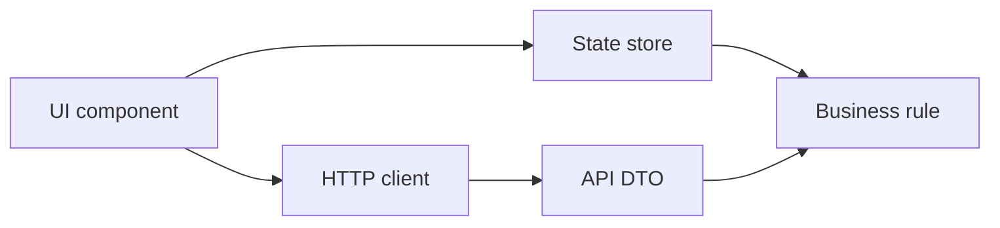
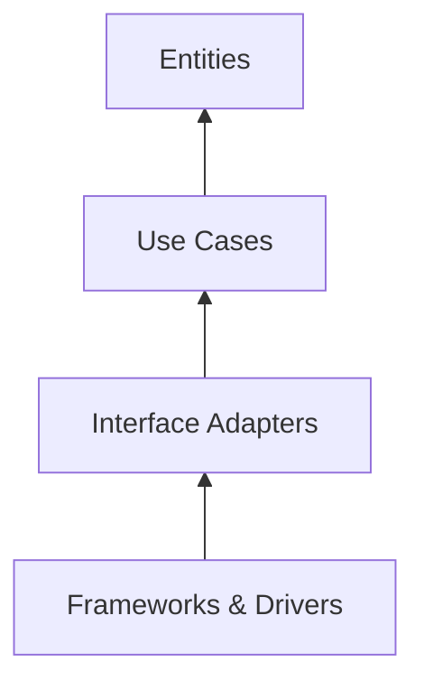
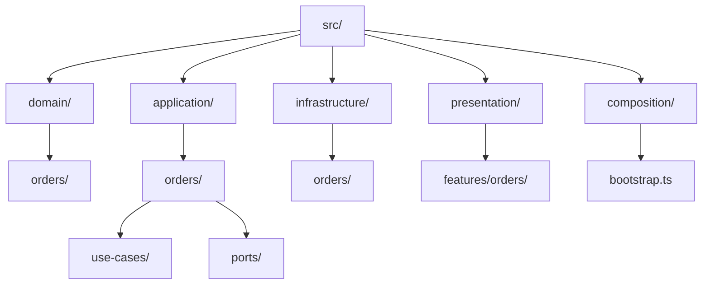
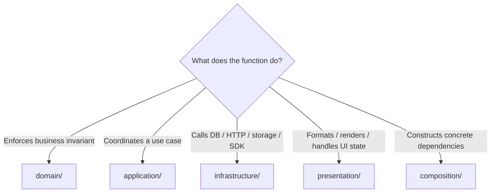
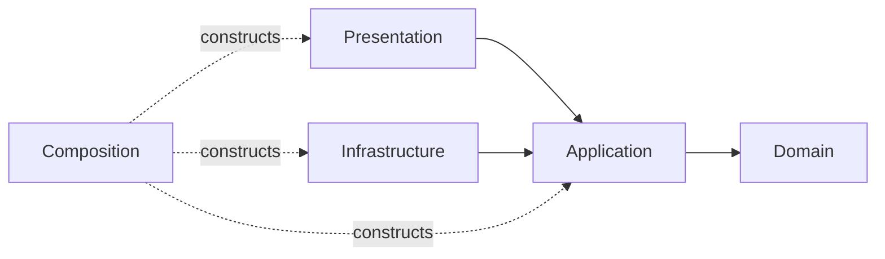

# Clean Architecture

> A progressive guide to Robert C. Martin's policy-centered architecture.

← [Repository home](../README.md) · [Glossary](../GLOSSARY.md) · [Code placement](../foundations/code-placement.md) · [Naming](../conventions/naming-and-file-placement.md)

## 1. History and origin

Robert C. Martin published **"The [Clean Architecture](../GLOSSARY.md#clean-architecture)"** in 2012 as a synthesis of related ideas from [Hexagonal Architecture](../GLOSSARY.md#hexagonal-architecture-ports-and-adapters), [Onion Architecture](../GLOSSARY.md#onion-architecture), Boundary-Control-[Entity](../GLOSSARY.md#domain-entity) and other approaches. He later expanded the subject in the 2017 book *[Clean Architecture](../GLOSSARY.md#clean-architecture)*.

The recurring problem is older than the name:

> How do we keep business/application policy from becoming inseparable from databases, web frameworks, UI frameworks, devices and other replaceable mechanisms?

Primary source: https://blog.cleancoder.com/uncle-bob/2012/08/13/the-clean-architecture.html

## 2. What problem does it solve?

Without explicit boundaries, code often evolves toward this:

The consequences are familiar:

- business behavior is duplicated in UI/controllers;
- tests need frameworks/databases unnecessarily;
- transport/database shapes become the application's internal model;
- changing a framework changes unrelated policy;
- dependencies become cyclic and difficult to reason about.

[Clean Architecture](../GLOSSARY.md#clean-architecture) protects the policy from those mechanisms.

## 3. When Clean Architecture is a strong fit

Good candidates:

- long-lived business applications;
- systems with meaningful domain/application policy;
- multiple delivery mechanisms (HTTP, UI, CLI, jobs);
- replaceable infrastructure/integrations;
- codebases where independent testing of policy matters;
- teams that need enforceable module boundaries.

## 4. When it can be too much

It may be excessive when:

- the application is a tiny prototype;
- almost all behavior is straightforward data display/transport;
- no meaningful policy exists to isolate;
- extra interfaces/[mappers](../GLOSSARY.md#mapper) create more complexity than the external technology itself.

[Clean Architecture](../GLOSSARY.md#clean-architecture) is not a score for "seriousness". Use it where boundaries protect something valuable.

## 5. The fundamental model

Martin's canonical diagram uses four conceptual circles:

The essential rule is not "exactly four folders". It is:

> Source-code dependencies cross boundaries toward higher-level policy.

## 6. What each circle means

| Clean concept | Responsibility | Typical examples | Must not depend on |
| --- | --- | --- | --- |
| [Entities](../GLOSSARY.md#domain-entity) | core business rules | `Order`, `Money`, [invariants](../GLOSSARY.md#invariant) | [use cases](../GLOSSARY.md#use-case), UI, DB/frameworks |
| [Use Cases](../GLOSSARY.md#use-case) | application-specific operations | `cancelOrder`, input/output contracts | concrete [adapters](../GLOSSARY.md#adapter)/frameworks |
| [Interface Adapters](../GLOSSARY.md#interface-adapter) | translate representations | controller, presenter, [mapper](../GLOSSARY.md#mapper), [gateway](../GLOSSARY.md#gateway) [adapter](../GLOSSARY.md#adapter) | outer framework details leaking inward |
| [Frameworks & Drivers](../GLOSSARY.md#frameworks-and-drivers) | replaceable mechanisms | React, database driver, HTTP server, SDK | — |

A real TypeScript project commonly maps those ideas into `domain/`, `application/`, `infrastructure/`, `presentation/`, plus `composition/`.

## 7. Recommended physical structure

| Path | Why it exists |
| --- | --- |
| `domain/` | protects business meaning from technology |
| `application/` | owns application operations and the capabilities they require |
| `infrastructure/` | contains concrete I/O [adapters](../GLOSSARY.md#adapter) and external representations |
| `presentation/` | owns rendering, interaction and view state |
| `composition/` | selects and connects concrete implementations |

For exact placement decisions, use **[Code Placement](../foundations/code-placement.md)**.

## 8. Where does a new function go?

Examples:

- `order.cancel()` → [Domain](../GLOSSARY.md#domain).
- `cancelOrder(id)` → [Application](../GLOSSARY.md#application-layer).
- `HttpOrderRepository.save()` → [Infrastructure](../GLOSSARY.md#infrastructure).
- `useOrders()` → [Presentation](../GLOSSARY.md#presentation-layer).
- constructing `HttpOrderRepository` → Composition.

## 9. Dependency isolation

Runtime calls may go outward through an injected [port](../GLOSSARY.md#port). Source dependencies still remain inward.

That distinction is explained in **[The Dependency Rule](./1-the-dependency-rule.md)**.

## 10. Naming before implementation

Use **[Naming and File Placement Conventions](../conventions/naming-and-file-placement.md)**.

Typical names:

| Role | Example |
| --- | --- |
| entity/[value object](../GLOSSARY.md#value-object) | `Order.ts`, `Money.ts` |
| [use case](../GLOSSARY.md#use-case) | `cancelOrder.ts` |
| [port](../GLOSSARY.md#port) | `OrderRepository.ts` |
| [adapter](../GLOSSARY.md#adapter) | `HttpOrderRepository.ts` |
| React component | `CancelOrderButton.tsx` |
| feature hook | `useOrders.ts` |

## 11. Progressive learning path

1. **[Dependency Rule](./1-the-dependency-rule.md)**
2. **[Four Circles](./2-the-four-layers.md)**
3. **[Project Structure](./3-project-structure.md)**
4. **[Build a Feature End-to-End](./4-building-a-feature.md)**
5. **[Testing](./5-testing-in-clean.md)**
6. **[Composition & DI](./6-composition-and-di.md)**
7. **[Evolution & Scaling](./7-scaling-and-patterns.md)**
8. **[Backend](./8-clean-on-the-backend.md)**

Advanced topics come after the structure and dependency rules, not before them.

## 12. What Clean Architecture does not require

It does not require:

- frontend/backend source files to be identical;
- a class for every [use case](../GLOSSARY.md#use-case);
- a [Repository](../GLOSSARY.md#repository) for every endpoint;
- a [DI container](../GLOSSARY.md#di-container);
- a specific framework;
- a fixed folder count;
- [microservices](../GLOSSARY.md#microservice).

Those are separate design decisions.

## Sources

- Robert C. Martin, "The [Clean Architecture](../GLOSSARY.md#clean-architecture)" (2012): https://blog.cleancoder.com/uncle-bob/2012/08/13/the-clean-architecture.html
- Robert C. Martin, *[Clean Architecture](../GLOSSARY.md#clean-architecture): A Craftsman's Guide to Software Structure and Design* (2017)
- Alistair Cockburn, "[Hexagonal Architecture](../GLOSSARY.md#hexagonal-architecture-ports-and-adapters)": https://alistair.cockburn.us/hexagonal-architecture/
- Jeffrey Palermo, [Onion Architecture](../GLOSSARY.md#onion-architecture) series: https://jeffreypalermo.com/2008/07/
