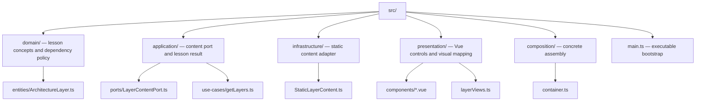

# Onion Architecture — live demo

A small Vue 3 app for exploring the [Onion Architecture guide](../onion-architecture/README.md). Select or hover a ring to read its role, analogy and illustrative code excerpt. The content is static; there is no persistence [adapter](../GLOSSARY.md#adapter) switch, data-flow tracer or user CRUD feature.

## What it shows

The teaching app retrieves lessons through an injected synchronous application [port](../GLOSSARY.md#port), maps them to plain application results, and adds visual metadata in [Presentation](../GLOSSARY.md#presentation-layer). Its strict dependency policy treats [Presentation](../GLOSSARY.md#presentation-layer) and [Infrastructure](../GLOSSARY.md#infrastructure) as peers. The four visual shell sizes indicate lesson/display order; they do not establish a dependency from [Presentation](../GLOSSARY.md#presentation-layer) to [Infrastructure](../GLOSSARY.md#infrastructure). The guide's project mapping is not Palermo's exact canonical taxonomy.

<a id="layout-the-four-rings"></a>

## Layout



`main.ts` assembles the application and injects results into `App.vue`. Components receive data through props and never import the container. [Domain](../GLOSSARY.md#domain) code knows no Vue or styling metadata. Replacing static content with a remote CMS requires an asynchronous [port](../GLOSSARY.md#port) and UI pending/error behavior; the present contract does not promise a transparent async swap.

The panel's short source samples are responsibility excerpts, not runnable order implementations. Use [the complete cancellation feature](../clean-architecture/4-building-a-feature.md) for full contracts, boundary translation and wiring.

## Run it locally

```bash
bun install --frozen-lockfile
bun dev
bun run build
```

The development server normally uses [port](../GLOSSARY.md#port) 5173. The build runs Vue/TypeScript checks and writes production assets to `dist/`.

## Deployment

The [deployment workflow](../.github/workflows/deploy.yml) publishes the demo to GitHub Pages on matching pushes to `main`. This PR is not merged or deployed by the audit. Pages configuration and its public URL are repository settings; the source of truth for local behavior is this folder.
